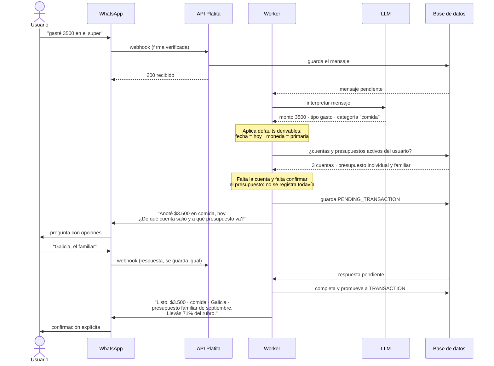

# 1. Descripción general del producto

### **1.1. Objetivo:**

Reducir la fricción de llevar un control financiero personal y familiar real, y al mismo tiempo darle a la persona un solo lugar donde entender y mejorar su situación financiera, no solo registrarla. El usuario típico (yo mismo, y el caso de uso que originó la idea) maneja varias cuentas y monedas (banco, billetera virtual, broker de inversión), comparte presupuesto con su familia, y hoy resuelve todo esto manualmente en planillas, sin ningún tipo de guía sobre si esas decisiones financieras son buenas o no. Platita elimina el paso de "sentarse a cargar todo" trasladando el registro a un canal que la persona ya usa todos los días —WhatsApp— automatizando la carga de lo que ya llega por email, y sabiendo en todo momento cuánto hay en cada cuenta sin tener que entrar a cada banco o billetera por separado. Además convierte esos datos en educación financiera aplicada: consejos concretos sobre la situación real del usuario, no contenido genérico.

### **1.2. Características y funcionalidades principales:**

Las funcionalidades están clasificadas por prioridad de entrega. El MVP comprometido son las **must-have**: son las que estarán completas, testeadas y desplegadas. Las **should-have** entran si el tiempo lo permite. Las **could-have** están diseñadas en este documento (modelo de datos y arquitectura las contemplan) pero **no se implementan en esta primera versión** — se documentan acá para dejar explícito que la decisión fue de alcance, no un olvido.

#### Must-have — el flujo end-to-end comprometido

- **Registro conversacional por WhatsApp**: cargar gastos e ingresos hablándole al asistente en tono coloquial, sin formularios.
- **Qué se asume y qué se confirma**: el asistente completa solo lo que puede resolver sin adivinar (fecha, moneda y categoría) y exige confirmación del usuario para el monto, el tipo cuando es ambiguo, la cuenta y el presupuesto al que se imputa el gasto. Todo lo asumido queda listado en el mensaje de confirmación. La regla completa, con el detalle campo por campo, está en [reglas de dominio § 1](reglas-de-dominio.md#1-registro-de-un-movimiento-qué-se-asume-y-qué-se-confirma).
- **Cuentas configurables con saldo calculado**: el usuario da de alta sus cuentas (ej. "Galicia en dólares", "Banco Nación", "Mercado Pago", un broker como Balanz) con su tipo y moneda, y el sistema calcula cuánto hay en cada una a partir del saldo inicial más los movimientos registrados — no es un dato que el usuario tenga que actualizar a mano.
- **Presupuestos individuales y familiares, con período configurable**: un presupuesto puede pertenecer a una persona o a un grupo familiar, con cadencia mensual o quincenal y una moneda primaria de referencia. El período tiene que quedar confirmado antes de que arranque (ver [3.2](03-modelo-de-datos.md#32-descripción-de-entidades-principales) y [reglas de dominio § 3](reglas-de-dominio.md#3-presupuestos-individual-o-familiar-períodos-y-confirmación-previa-al-inicio)), con ingreso estimado y topes por categoría.
- **Categorización semi-guiada**: categorías base predefinidas más categorías propias del usuario; la IA elige entre las existentes y solo sugiere una nueva (con confirmación) cuando ningún gasto encaja.
- **Dashboard web**: visualización de gráficos, tendencias, estado del presupuesto y saldo por cuenta — algo que WhatsApp no resuelve bien; WhatsApp queda como canal de carga rápida, no de visualización.
- **Login y autenticación del dashboard web**: acceso protegido mediante código de un solo uso por WhatsApp — ver decisión de diseño en [2.2](02-arquitectura.md#22-descripción-de-componentes-principales) y [2.5](02-arquitectura.md#25-seguridad), y el [ADR 0003](adr/0003-login-por-codigo-unico.md).
- **Trazabilidad de origen**: cada movimiento guarda si se cargó manual (WhatsApp) o automático (gasto recurrente, o email cuando se implemente), lo que habilita auditoría y una métrica de cuánto está resolviendo cada vía automática.
- **Configuración regional**: país, moneda primaria, fuente de inflación y cotización de referencia son configurables por usuario, para no atar el sistema al caso argentino.

#### Should-have — entran si el tiempo lo permite

- **Gastos recurrentes**: el usuario configura un gasto que se repite (alquiler, suscripciones, servicios fijos) indicando periodicidad, categoría, cuenta de la que sale y presupuesto al que se imputa. Con eso definido una sola vez, el sistema genera el movimiento completo en cada ciclo, sin volver a cargarlo ni volver a preguntar nada.
- **Consejos financieros con RAG**: una base de conocimiento financiero curada por el equipo del producto (no cargada por cada usuario) se vectoriza y queda disponible para todos los usuarios; el asistente responde preguntas y también dispara alertas proactivas (ej. "vas al 80% del presupuesto de comida a mitad de mes") cruzando ese contenido con los datos reales del usuario que pregunta. Cubre, entre otras, preguntas del tipo: *"¿cómo me conviene pagar mi tarjeta?"*, *"¿cómo puedo reducir gastos en base a mi historial?"*, sugerencia de armar un fondo de emergencia acorde a los propios ingresos/gastos, y educación financiera básica sobre inversión (ej. *"¿qué es un FCI?"*) — siempre devolviendo la respuesta cruzada con los datos reales del usuario, no un consejo genérico.
- **Soporte multimoneda**: un presupuesto recibe movimientos en distintas monedas (ej. ARS y USD) y los convierte a la moneda primaria usando una cotización de referencia. En esta etapa la cotización se configura a mano; la integración con un servicio que la actualice sola es could-have.

#### Could-have — diseñado, no implementado en esta versión

- **Registro automático desde email**: detección y carga de movimientos financieros notificados por mail (tarjetas, servicios, transferencias). Es la funcionalidad de mayor riesgo del producto: el formato de esos mails lo define cada banco, cambia sin aviso y no se controla desde acá, así que el esfuerzo real es difícil de acotar. El modelo de datos ya lo contempla (`source = 'automatic'`, `PENDING_TRANSACTION`), de modo que sumarlo después no requiere rediseño.
- **Detección de duplicados entre carga manual y automática**: el caso típico es pagar con tarjeta, avisarle a Platita por WhatsApp en el momento, y que más tarde llegue el mail de aviso del banco por el mismo gasto. Antes de crear un movimiento nuevo el sistema busca si ya existe uno reciente del mismo usuario por la vía contraria, con monto/moneda iguales y fecha cercana, y lo enlaza (`duplicate_of`) en vez de duplicar el monto. Depende de la anterior: sin carga por email no hay duplicados que detectar.
- **Presupuesto asistido por IA y ajustado por inflación**: sugerencia automática del borrador del próximo período a partir del historial, ajustada por una proyección de inflación (REM del BCRA para Argentina) en lugar del dato oficial, que llega con un mes de atraso. Sin esto, el usuario arma el período a mano — que es el flujo must-have.
- **Backup y exportación**: exportar el historial de movimientos y el estado de los presupuestos en CSV/PDF. El respaldo estándar de la base de datos gestionada cubre la parte crítica mientras tanto. Hay un caso que sí es must-have: la exportación de un grupo familiar cuando sale su último miembro ([reglas de dominio § 10](reglas-de-dominio.md#10-grupos-familiares-administración-salida-y-visibilidad)).

**Fuera de alcance, con su razón:**

- **Modo offline.** Se evaluó y se descarta para esta primera versión: el canal principal (WhatsApp) ya requiere conectividad para funcionar, así que un modo offline solo tendría sentido para el dashboard web — y ahí el problema real no es mostrar datos cacheados (eso es simple), sino permitir *editar* presupuestos o gastos sin conexión y resolver los conflictos de sincronización cuando vuelve la conexión. Queda como mejora futura si en algún momento se justifica.
- **Lectura de capturas de pantalla** (ej. una captura de Mercado Pago o de la app de Galicia con el detalle de un gasto). Es un problema distinto al de leer emails: cada banco/billetera tiene su propio layout de pantalla, que además cambia con cada actualización de su app, así que no alcanza con reglas — necesitaría un pipeline de visión (OCR + LLM) específico por entidad, mucho más trabajo que el resto de las vías de carga juntas. Queda identificado como candidato fuerte para un segundo MVP una vez validado el flujo core, no descartado para siempre.

### **1.3. Diseño y experiencia de usuario:**

`Las capturas y el video del flujo se incorporan en la Entrega 2, cuando exista un frontend navegable.` Mientras tanto, el flujo conversacional —que es la experiencia principal del producto y no se entiende bien con capturas sueltas— se documenta como diagrama de secuencia. Este es el caso más representativo: el usuario carga un gasto y le falta un dato obligatorio.

Tres decisiones de experiencia quedan visibles en este flujo: **el asistente no inventa lo que no puede deducir** (pregunta cuenta y presupuesto), **no descarta lo que ya entendió** (guarda el pendiente en vez de pedir el mensaje entero de nuevo), y **la confirmación final lista todo lo que asumió**, que es el punto donde el usuario corrige una fecha o una categoría con una respuesta corta.

### **1.4. Instrucciones de instalación:**

`Pendiente — se completa en la Entrega 2 con el proyecto ya scaffoldeado (backend FastAPI, frontend, base de datos y migraciones). El esquema previsto: entorno virtual + pip/uv para el backend, variables de entorno para credenciales (API de WhatsApp, LLM, base de datos), migraciones con Alembic, y un script de seed con datos de ejemplo.`
