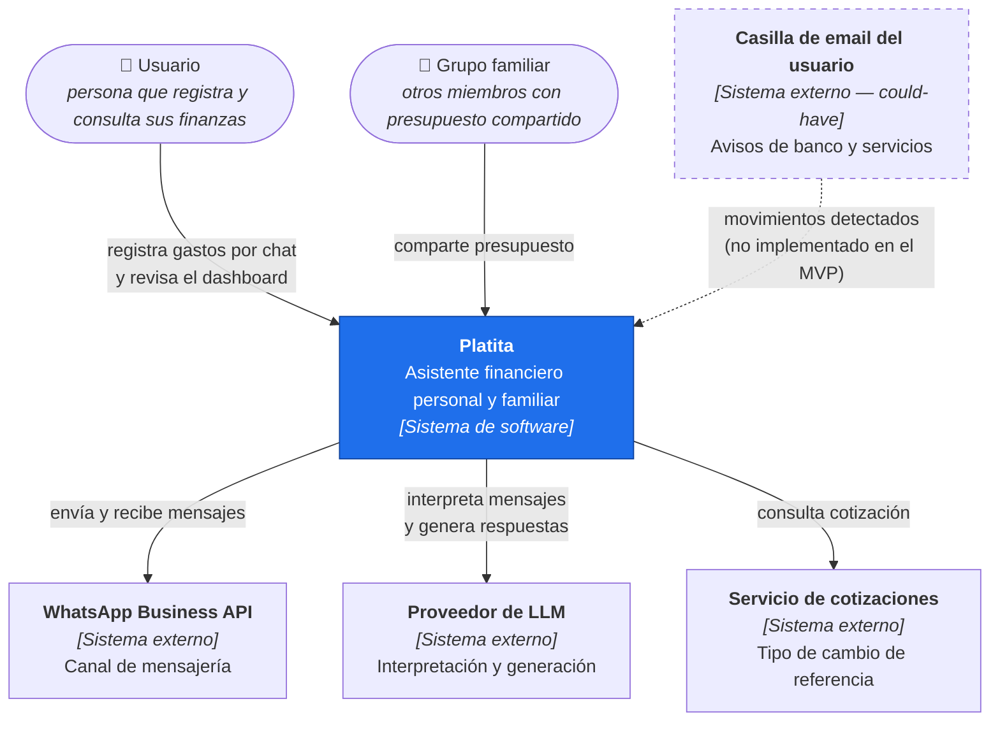
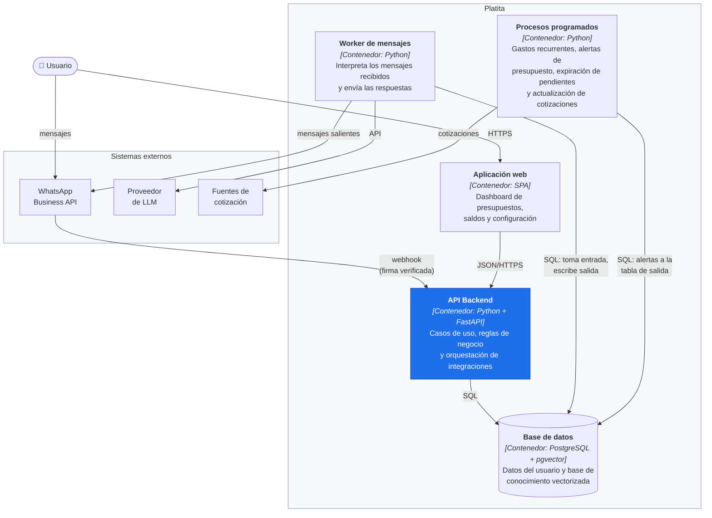
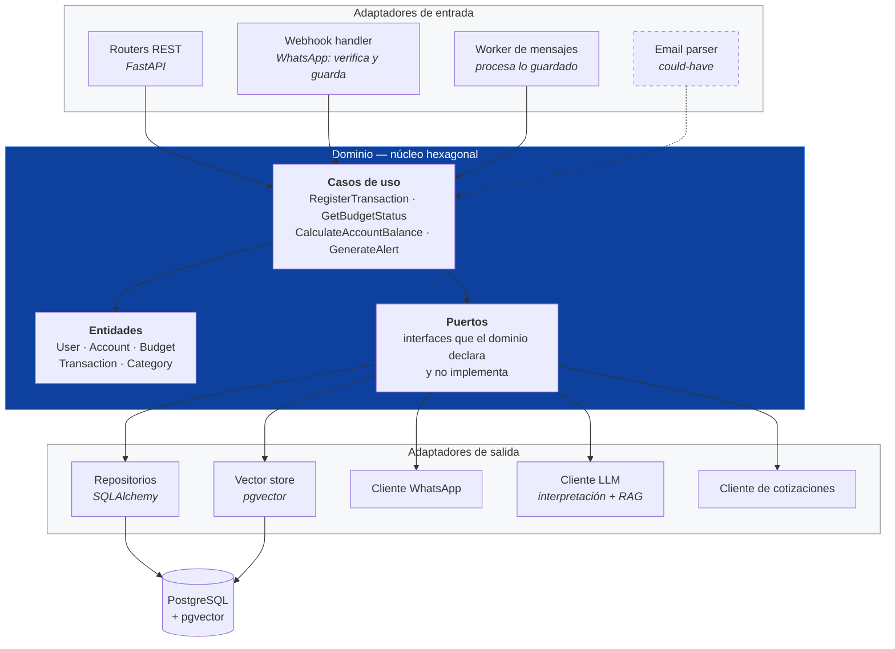
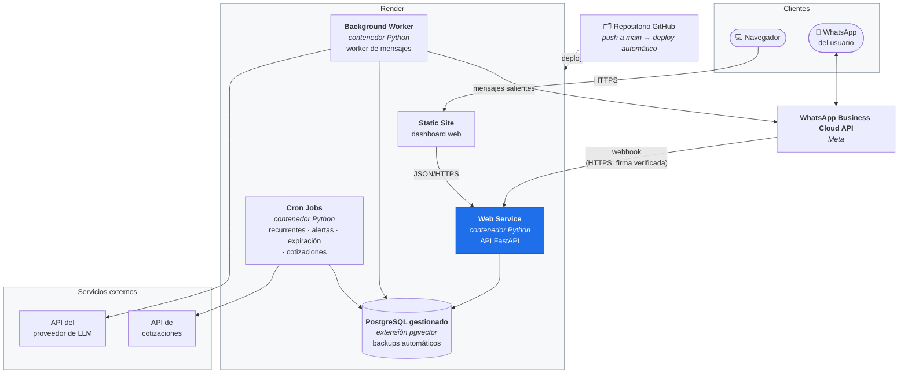

# 2. Arquitectura del sistema

### **2.1. Diagrama de arquitectura:**

La arquitectura se documenta siguiendo el **modelo C4 de Simon Brown**, en tres niveles de zoom: contexto (quién usa el sistema y con qué se integra), contenedores (las piezas desplegables) y componentes (el interior del backend). Están escritos en Mermaid, según las [convenciones de documentación](08-convenciones-de-documentacion.md#82-diagramas).

#### Nivel 1 — Contexto

Quién usa Platita y de qué sistemas externos depende.



#### Nivel 2 — Contenedores

Las piezas desplegables del sistema y cómo se comunican entre sí.



#### Nivel 3 — Componentes del backend

El interior del contenedor API, donde se ve el patrón arquitectónico elegido.



**Patrón elegido:** **arquitectura hexagonal (ports & adapters)**, con el dominio (entidades + casos de uso) aislado de los detalles de infraestructura detrás de puertos, y **backend y frontend desacoplados**, comunicados únicamente por API REST.

El contexto que llevó a elegirlo, sus beneficios, los sacrificios asumidos y la alternativa descartada están en el [ADR 0001](adr/0001-arquitectura-hexagonal.md).

### **2.2. Descripción de componentes principales:**

| Componente | Tecnología | Responsabilidad |
|---|---|---|
| Backend API | Python + FastAPI | Adaptador de entrada: expone la API REST y traduce requests HTTP a casos de uso del dominio |
| Dominio | Python puro (sin dependencias de framework) | Entidades, casos de uso y puertos — la lógica de negocio en sí |
| Auth | JWT + código de un solo uso enviado por WhatsApp | Login del dashboard web sin contraseñas, reutilizando el teléfono ya verificado como identidad (ver [2.5](#25-seguridad)) |
| Integración WhatsApp | API oficial de WhatsApp Business (Meta Cloud API / Twilio) | Adaptador de entrada/salida: recibe y envía mensajes vía webhook |
| Parser de emails *(could-have)* | Python (reglas + LLM para casos ambiguos) | Adaptador de entrada: detecta movimientos financieros en la casilla de correo del usuario (con consentimiento explícito). Diseñado, no implementado en el MVP — ver [1.2](01-producto.md#12-características-y-funcionalidades-principales) |
| Motor RAG | LLM + embeddings sobre pgvector, detrás de un puerto propio | Responde consultas financieras y genera alertas proactivas a partir de la base de conocimiento curada por el producto |
| Base de datos relacional | PostgreSQL | Adaptador de salida: usuarios, cuentas, grupos familiares, presupuestos, movimientos, categorías |
| Base de datos vectorial | pgvector (extensión de PostgreSQL) | Adaptador de salida: embeddings del contenido de consejos financieros |
| Frontend | Aplicación web responsiva | Dashboard de visualización y configuración de usuario |

*(pgvector sobre PostgreSQL en vez de una base vectorial dedicada, como decisión de arranque — no definitiva, y aislada detrás de un puerto propio para poder reemplazarla. Ver [ADR 0004](adr/0004-postgres-con-pgvector-como-unico-almacen.md).)*

### **2.3. Descripción de alto nivel del proyecto y estructura de ficheros**

`Se completa en la Entrega 2 junto con el scaffold real. Estructura prevista (arquitectura hexagonal dentro del backend, nombres de carpetas y ficheros en inglés):`

```text
/backend
  /app
    /domain
      /entities         # User, Account, Budget, Transaction, Category, RecurringExpense, AdviceDocument
      /use_cases         # RegisterTransaction, GetBudgetStatus, CalculateAccountBalance, GenerateProactiveAlert...
      /ports             # interfaces the domain depends on but does not implement
        - transaction_repository_port.py
        - account_repository_port.py
        - vector_store_port.py
        - whatsapp_gateway_port.py
        - exchange_rate_port.py
        - llm_port.py
    /adapters
      /inbound
        /api               # FastAPI routers — translate HTTP into use case calls
        /whatsapp_webhook   # translate WhatsApp payloads into use case calls
      /outbound
        /postgres           # SQLAlchemy repositories implementing the *_repository ports
        /pgvector            # VectorStorePort implementation
        /whatsapp_client      # sends outbound WhatsApp messages
        /email_reader          # IMAP/Gmail integration (could-have, not in the MVP)
        /exchange_rate_client   # currency quote provider
        /llm_client              # LLM client (interpretation + RAG)
  /tests
  /migrations          # Alembic
/frontend
  ...
docs/
  01-producto.md
  02-arquitectura.md
  03-modelo-de-datos.md
  04-api.md
  05-historias-de-usuario.md
  06-tickets.md
  07-pull-requests.md
  08-convenciones-de-documentacion.md
  reglas-de-dominio.md      # dueño único de las reglas de negocio
  adr/                      # decisiones de arquitectura, formato Michael Nygard
README.md                   # portada, ficha del proyecto e índice
AGENTS.md                   # contrato para asistentes de IA (fuente única)
CLAUDE.md -> AGENTS.md      # symlink, por compatibilidad de herramientas
LICENSE
prompts.md
llms.txt                    # descripción del proyecto para agentes de IA
```

`/backend` y `/frontend` son la estructura prevista para la Entrega 2; el resto es la estructura real del repositorio hoy.

### **2.4. Infraestructura y despliegue**

`Propuesto, a confirmar en la Entrega 2 contra el despliegue real:` Render para backend + PostgreSQL, por simplicidad de despliegue para un proyecto individual y porque pgvector está soportado como extensión estándar de su Postgres gestionado, sin depender de elegir la plantilla correcta como sí pasa en otras plataformas. El frontend se sirve como sitio estático.



**Proceso de despliegue previsto:** push a `main` dispara el build y deploy automático del servicio web y del sitio estático. Las migraciones de Alembic corren como paso previo al arranque del contenedor. Los secretos (credenciales de WhatsApp, LLM y base de datos) se configuran como variables de entorno en la plataforma, nunca versionados. Los mensajes de WhatsApp se procesan en un worker aparte del servicio web: el webhook solo verifica la firma, guarda el mensaje y responde, y el worker lo interpreta y contesta. Así un reintento del proveedor no duplica movimientos y una caída del LLM demora la respuesta sin perder el mensaje ([ADR 0010](adr/0010-webhook-asincrono-con-tabla-de-entrada.md)). Todo mensaje saliente, incluidas las alertas, pasa por la tabla de salida que envía ese worker. Los procesos programados corren como cron jobs separados del servicio web, de modo que un fallo en el motor de recurrentes o de alertas no afecte la disponibilidad del webhook — es la mitigación concreta del riesgo de acoplamiento señalado en [2.1](#21-diagrama-de-arquitectura).

### **2.5. Seguridad**

- **Login sin contraseñas**: código de un solo uso por WhatsApp intercambiado por un JWT de corta duración, con rate limiting sobre el endpoint de login para evitar fuerza bruta sobre el código. El fundamento de la decisión está en el [ADR 0003](adr/0003-login-por-codigo-unico.md).
- **Consentimiento explícito y revocable** para el acceso a la casilla de email (configuración de usuario, no un permiso obligatorio del sistema).
- **Verificación de firma del webhook de WhatsApp** en cada request entrante, para descartar mensajes falsificados.
- **Nunca loggear en crudo** número de teléfono, montos ni texto de usuario sin enmascarar.
- **Secretos fuera del código**: credenciales de WhatsApp, LLM y base de datos vía variables de entorno, nunca hardcodeadas ni versionadas.
- **HTTPS** en toda comunicación externa.
- Validación de entrada tanto en el webhook de WhatsApp como en los endpoints propios del frontend (cliente y servidor).

### **2.6. Tests**

`Se define con detalle en la Entrega final. Estrategia prevista: tests unitarios sobre los casos de uso del dominio (conversión de moneda, cálculo de saldo por cuenta, categorización, presupuesto ajustado por inflación) usando dobles de prueba en lugar de los adaptadores reales — la ventaja directa de tener puertos —, tests de integración sobre los adaptadores (Postgres, pgvector) y los endpoints principales, y al menos un test end-to-end del flujo principal (registrar un gasto por WhatsApp → verlo reflejado en el saldo de la cuenta y en el presupuesto del dashboard).`
