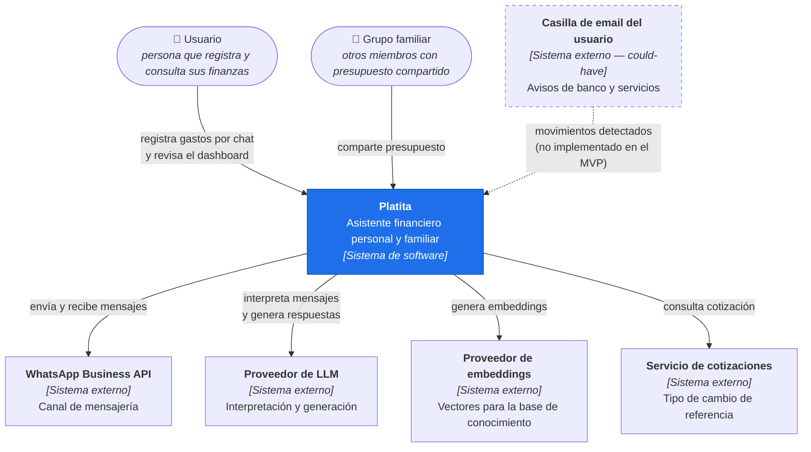
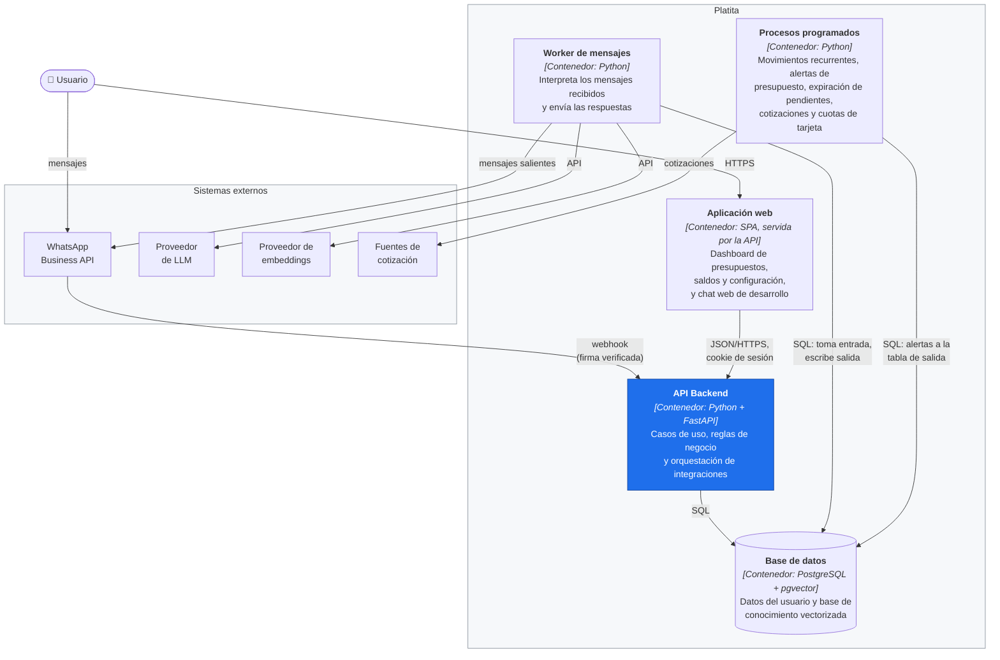
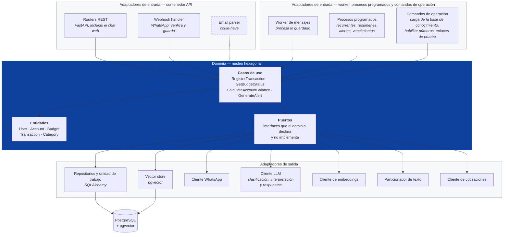
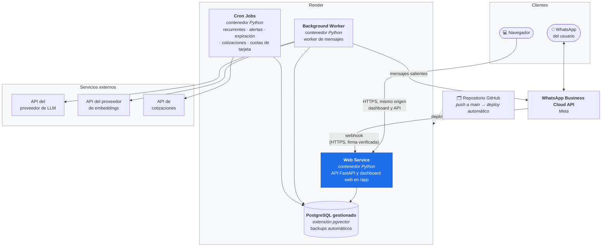

# 2. Arquitectura del sistema

### **2.1. Diagrama de arquitectura:**

La arquitectura se documenta siguiendo el **modelo C4 de Simon Brown**, en tres niveles de zoom: contexto (quién usa el sistema y con qué se integra), contenedores (las piezas desplegables) y componentes (el interior del backend). Están escritos en Mermaid, según las [convenciones de documentación](08-convenciones-de-documentacion.md#82-diagramas).

#### Nivel 1 — Contexto

Quién usa Platita y de qué sistemas externos depende.


```mermaid
flowchart TB
    USER(["👤 Usuario<br/><i>persona que registra y consulta sus finanzas</i>"])
    FAMILY(["👥 Grupo familiar<br/><i>otros miembros con presupuesto compartido</i>"])

    PLATITA["<b>Platita</b><br/>Asistente financiero personal y familiar<br/><i>[Sistema de software]</i>"]

    WACLOUD["<b>WhatsApp Business API</b><br/><i>[Sistema externo]</i><br/>Canal de mensajería"]
    LLM["<b>Proveedor de LLM</b><br/><i>[Sistema externo]</i><br/>Interpretación y generación"]
    EMB["<b>Proveedor de embeddings</b><br/><i>[Sistema externo]</i><br/>Vectores para la base de conocimiento"]
    FX["<b>Servicio de cotizaciones</b><br/><i>[Sistema externo]</i><br/>Tipo de cambio de referencia"]
    MAILBOX["<b>Casilla de email del usuario</b><br/><i>[Sistema externo — could-have]</i><br/>Avisos de banco y servicios"]

    USER -->|"registra gastos por chat<br/>y revisa el dashboard"| PLATITA
    FAMILY -->|"comparte presupuesto"| PLATITA
    PLATITA -->|"envía y recibe mensajes"| WACLOUD
    PLATITA -->|"interpreta mensajes<br/>y genera respuestas"| LLM
    PLATITA -->|"genera embeddings"| EMB
    PLATITA -->|"consulta cotización"| FX
    MAILBOX -.->|"movimientos detectados<br/>(no implementado en el MVP)"| PLATITA

    style PLATITA fill:#1f6feb,stroke:#0d419d,color:#fff
    style MAILBOX stroke-dasharray: 5 5
```

#### Nivel 2 — Contenedores

Las piezas desplegables del sistema y cómo se comunican entre sí.


```mermaid
flowchart TB
    USER(["👤 Usuario"])

    subgraph EXTERNOS["Sistemas externos"]
        direction LR
        WACLOUD["WhatsApp<br/>Business API"]
        LLM["Proveedor<br/>de LLM"]
        EMB["Proveedor de<br/>embeddings"]
        FX["Fuentes de<br/>cotización"]
    end

    subgraph PLATITA["Platita"]
        SPA["<b>Aplicación web</b><br/><i>[Contenedor: SPA, servida por la API]</i><br/>Dashboard de presupuestos,<br/>saldos y configuración,<br/>y chat web de desarrollo"]
        API["<b>API Backend</b><br/><i>[Contenedor: Python + FastAPI]</i><br/>Casos de uso, reglas de negocio<br/>y orquestación de integraciones"]
        MSGW["<b>Worker de mensajes</b><br/><i>[Contenedor: Python]</i><br/>Interpreta los mensajes recibidos<br/>y envía las respuestas"]
        WORKER["<b>Procesos programados</b><br/><i>[Contenedor: Python]</i><br/>Movimientos recurrentes, alertas de<br/>presupuesto, expiración de pendientes,<br/>cotizaciones y cuotas de tarjeta"]
        DB[("<b>Base de datos</b><br/><i>[Contenedor: PostgreSQL + pgvector]</i><br/>Datos del usuario y base de<br/>conocimiento vectorizada")]
    end

    USER -->|"mensajes"| WACLOUD
    USER -->|"HTTPS"| SPA
    WACLOUD -->|"webhook<br/>(firma verificada)"| API
    MSGW -->|"mensajes salientes"| WACLOUD
    SPA -->|"JSON/HTTPS,<br/>cookie de sesión"| API
    API -->|"SQL"| DB
    MSGW -->|"SQL: toma entrada,<br/>escribe salida"| DB
    MSGW -->|"API"| LLM
    MSGW -->|"API"| EMB
    WORKER -->|"SQL: alertas a la<br/>tabla de salida"| DB
    WORKER -->|"cotizaciones"| FX

    style API fill:#1f6feb,stroke:#0d419d,color:#fff
    style PLATITA fill:#f6f8fa,stroke:#8b949e
    style EXTERNOS fill:#f6f8fa,stroke:#8b949e
```

#### Nivel 3 — Componentes del backend

El interior del backend, donde se ve el patrón arquitectónico elegido. El diagrama reúne los tres
contenedores que comparten ese código: la API (routers y webhook handler), el worker de mensajes
([ADR 0010](adr/0010-webhook-asincrono-con-tabla-de-entrada.md)) y los procesos programados. Los
tres son adaptadores de entrada con su propio punto de entrada, y los tres llegan a la base solo
por los casos de uso y los repositorios. Los comandos de operación son un cuarto adaptador de
entrada, que corre a pedido y no es un contenedor.


```mermaid
flowchart TB
    subgraph INBOUND["Adaptadores de entrada — contenedor API"]
        ROUTERS["Routers REST<br/><i>FastAPI, incluido el chat web</i>"]
        HOOK["Webhook handler<br/><i>WhatsApp: verifica y guarda</i>"]
        PARSE["Email parser<br/><i>could-have</i>"]
    end

    subgraph WORKERBOX["Adaptadores de entrada — worker, procesos programados y comandos de operación"]
        MSGWK["Worker de mensajes<br/><i>procesa lo guardado</i>"]
        SCHED["Procesos programados<br/><i>recurrentes, resúmenes,<br/>alertas, vencimientos</i>"]
        CLI["Comandos de operación<br/><i>carga de la base de conocimiento,<br/>habilitar números, enlaces de prueba</i>"]
    end

    subgraph DOMAIN["Dominio — núcleo hexagonal"]
        UC["<b>Casos de uso</b><br/>RegisterTransaction · GetBudgetStatus<br/>CalculateAccountBalance · GenerateAlert"]
        ENT["<b>Entidades</b><br/>User · Account · Budget<br/>Transaction · Category"]
        PORTS["<b>Puertos</b><br/>interfaces que el dominio declara<br/>y no implementa"]
    end

    subgraph OUTBOUND["Adaptadores de salida"]
        REPO["Repositorios y unidad de trabajo<br/><i>SQLAlchemy</i>"]
        VECADAPT["Vector store<br/><i>pgvector</i>"]
        WACLIENT["Cliente WhatsApp"]
        LLMCLIENT["Cliente LLM<br/><i>clasificación, interpretación<br/>y respuestas</i>"]
        EMBCLIENT["Cliente de embeddings"]
        SPLIT["Particionador de texto"]
        FXCLIENT["Cliente de cotizaciones"]
    end

    DB[("PostgreSQL<br/>+ pgvector")]

    ROUTERS --> UC
    HOOK --> UC
    MSGWK --> UC
    SCHED --> UC
    CLI --> UC
    PARSE -.-> UC
    UC --> ENT
    UC --> PORTS
    PORTS --> REPO --> DB
    PORTS --> VECADAPT --> DB
    PORTS --> WACLIENT
    PORTS --> LLMCLIENT
    PORTS --> EMBCLIENT
    PORTS --> SPLIT
    PORTS --> FXCLIENT

    style DOMAIN fill:#0d419d,stroke:#1f6feb,color:#fff
    style INBOUND fill:#f6f8fa,stroke:#8b949e
    style WORKERBOX fill:#f6f8fa,stroke:#8b949e
    style OUTBOUND fill:#f6f8fa,stroke:#8b949e
    style PARSE stroke-dasharray: 5 5
```

**Patrón elegido:** **arquitectura hexagonal (ports & adapters)**, con el dominio (entidades + casos de uso) aislado de los detalles de infraestructura detrás de puertos, y **backend y frontend desacoplados**, comunicados únicamente por API REST.

**Acceso a la base de datos:** solo el backend la toca. Desde afuera se entra únicamente por la API HTTP; adentro, la API, el worker, los procesos programados y los comandos de operación pasan por los casos de uso, ninguno llama a otro por HTTP, y el SQL vive solo en los repositorios. Las excepciones son las migraciones, el script de datos de prueba y el acceso operativo.

El contexto que llevó a elegirlo, sus beneficios, los sacrificios asumidos, las alternativas descartadas y el detalle de quién accede a la base están en el [ADR 0001](adr/0001-arquitectura-hexagonal.md).

El recorrido de un usuario de punta a punta, con el tipo de llamada y las tablas de cada paso, está en [Recorrido completo](recorrido-completo.md).

### **2.2. Descripción de componentes principales:**

| Componente | Tecnología | Responsabilidad |
|---|---|---|
| Backend API | Python + FastAPI | Adaptador de entrada: expone la API REST y traduce requests HTTP a casos de uso del dominio |
| Dominio | Python puro (sin dependencias de framework) | Entidades, casos de uso y puertos — la lógica de negocio en sí |
| Auth | Código de un solo uso enviado por WhatsApp + sesión de servidor en PostgreSQL, en una cookie | Login del dashboard web sin contraseñas, reutilizando el teléfono ya verificado como identidad, con sesiones que se pueden revocar (ver [2.5](#25-seguridad)) |
| Integración WhatsApp | API oficial de WhatsApp Business (Meta Cloud API / Twilio) | Adaptador de entrada/salida: recibe y envía mensajes vía webhook |
| Parser de emails *(could-have)* | Python (reglas + LLM para casos ambiguos) | Adaptador de entrada: detecta movimientos financieros en la casilla de correo del usuario (con consentimiento explícito). Diseñado, no implementado en el MVP — ver [1.2](01-producto.md#12-características-y-funcionalidades-principales) |
| Motor RAG | LLM, embeddings por API y búsqueda sobre pgvector, cada uno detrás de su puerto, sin framework de orquestación | Responde consultas financieras y genera alertas proactivas a partir de la base de conocimiento curada por el producto. Cómo se carga, se parte y se recupera el contenido está en el [ADR 0019](adr/0019-base-de-conocimiento-embeddings-ingesta-y-recuperacion.md), y por qué no hay framework, en el [ADR 0020](adr/0020-sin-framework-de-orquestacion-de-ia.md) |
| Clasificación y memoria | Una llamada inicial al LLM, con salida estructurada | Decide si el mensaje es un registro, una consulta o un consejo antes de cobrar la cuota, y acota cuánta conversación ve el modelo ([ADR 0018](adr/0018-clasificacion-inicial-y-memoria-de-conversacion.md)) |
| Base de datos relacional | PostgreSQL | Adaptador de salida: usuarios, cuentas, grupos familiares, presupuestos, movimientos, categorías |
| Base de datos vectorial | pgvector (extensión de PostgreSQL) | Adaptador de salida: embeddings de los fragmentos del contenido de consejos financieros |
| Frontend | Aplicación web responsiva | Dashboard de visualización, configuración y correcciones, y canal secundario de carga de gastos, ingresos y transferencias |
| Chat web | Pantalla del dashboard, detrás de una opción de configuración | Andamio de desarrollo y demostración: entra por el mismo camino asíncrono que WhatsApp y está apagado en producción ([ADR 0002](adr/0002-whatsapp-como-canal-principal.md)) |

*(pgvector sobre PostgreSQL en vez de una base vectorial dedicada, como decisión de arranque — no definitiva, y aislada detrás de un puerto propio para poder reemplazarla. Ver [ADR 0004](adr/0004-postgres-con-pgvector-como-unico-almacen.md).)*

### **2.3. Descripción de alto nivel del proyecto y estructura de ficheros**

`Se completa en la Entrega 2 junto con el scaffold real. Estructura prevista (arquitectura hexagonal dentro del backend, nombres de carpetas y ficheros en inglés):`

```text
/backend
  /app
    /domain
      /entities         # User, Account, Budget, Transaction, Category, RecurringRule, CardStatement, Transfer, AdviceDocument, AdviceChunk
      /use_cases         # RegisterTransaction, GetBudgetStatus, CalculateAccountBalance, GenerateProactiveAlert...
      /ports             # interfaces the domain depends on but does not implement
        - transaction_repository_port.py
        - account_repository_port.py
        - vector_store_port.py
        - whatsapp_gateway_port.py
        - exchange_rate_port.py
        - llm_port.py
        - embedding_port.py
        - text_splitter_port.py
        - llm_call_log_port.py
    /adapters
      /inbound
        /api               # FastAPI routers — translate HTTP into use case calls
        /whatsapp_webhook   # translate WhatsApp payloads into use case calls
        /message_worker     # worker entry point: takes stored messages, calls use cases
        /scheduler          # scheduled jobs entry point: calls use cases, never raw SQL
        /cli                # operator commands: knowledge base load, enabling phone numbers, personal links for the demo
      /outbound
        /postgres           # SQLAlchemy repositories, unit of work and connection setup
        /pgvector            # VectorStorePort implementation
        /whatsapp_client      # sends outbound WhatsApp messages
        /email_reader          # IMAP/Gmail integration (could-have, not in the MVP)
        /exchange_rate_client   # currency quote provider
        /llm_client              # LLM client: classification, interpretation and answers, provider SDK only
        /embedding_client         # embeddings provider client
        /text_splitter             # the only place that imports langchain-text-splitters
      /observability              # wrappers of the LLM and embedding ports that record each call
  /tests
  /migrations          # Alembic
/frontend
  ...
docs/
  01-producto.md
  02-arquitectura.md
  03-modelo-de-datos.md
  04-api.md
  05-historias-de-usuario.md
  06-tickets.md
  07-pull-requests.md
  08-convenciones-de-documentacion.md
  reglas-de-dominio.md      # dueño único de las reglas de negocio
  adr/                      # decisiones de arquitectura, formato Michael Nygard
README.md                   # portada, ficha del proyecto e índice
AGENTS.md                   # contrato para asistentes de IA (fuente única)
CLAUDE.md -> AGENTS.md      # symlink, por compatibilidad de herramientas
LICENSE
prompts.md
llms.txt                    # descripción del proyecto para agentes de IA
```

`/backend` y `/frontend` son la estructura prevista para la Entrega 2; el resto es la estructura real del repositorio hoy.

### **2.4. Infraestructura y despliegue**

`Propuesto, a confirmar en la Entrega 2 contra el despliegue real:` Render para backend + PostgreSQL, por simplicidad de despliegue para un proyecto individual y porque pgvector está soportado como extensión estándar de su Postgres gestionado, sin depender de elegir la plantilla correcta como sí pasa en otras plataformas. El build del frontend lo sirve el mismo servicio web que la API, bajo `/app`, para que la cookie de sesión funcione sin un dominio propio ([ADR 0016](adr/0016-sesion-de-servidor-en-el-mismo-origen.md)).


```mermaid
flowchart TB
    subgraph CLIENTES["Clientes"]
        direction LR
        PHONE(["📱 WhatsApp<br/>del usuario"])
        BROWSER(["💻 Navegador"])
    end

    DEV["🗂 Repositorio GitHub<br/><i>push a main → deploy automático</i>"]
    WACLOUD["<b>WhatsApp Business Cloud API</b><br/><i>Meta</i>"]

    subgraph RENDER["Render"]
        direction LR
        WEBSVC["<b>Web Service</b><br/><i>contenedor Python</i><br/>API FastAPI y dashboard web en /app"]
        BGW["<b>Background Worker</b><br/><i>contenedor Python</i><br/>worker de mensajes"]
        CRON["<b>Cron Jobs</b><br/><i>contenedor Python</i><br/>recurrentes · alertas · expiración<br/>· cotizaciones · cuotas de tarjeta"]
        PG[("<b>PostgreSQL gestionado</b><br/><i>extensión pgvector</i><br/>backups automáticos")]
    end

    subgraph EXT["Servicios externos"]
        direction LR
        LLMAPI["API del<br/>proveedor de LLM"]
        EMBAPI["API del proveedor<br/>de embeddings"]
        FXAPI["API de<br/>cotizaciones"]
    end

    PHONE <--> WACLOUD
    BROWSER -->|"HTTPS, mismo origen<br/>dashboard y API"| WEBSVC
    DEV -.->|"deploy"| RENDER
    WACLOUD -->|"webhook<br/>(HTTPS, firma verificada)"| WEBSVC
    BGW -->|"mensajes salientes"| WACLOUD
    WEBSVC --> PG
    BGW --> PG
    BGW --> LLMAPI
    BGW --> EMBAPI
    CRON --> PG
    CRON --> FXAPI

    style WEBSVC fill:#1f6feb,stroke:#0d419d,color:#fff
    style RENDER fill:#f6f8fa,stroke:#8b949e
    style EXT fill:#f6f8fa,stroke:#8b949e
    style CLIENTES fill:#f6f8fa,stroke:#8b949e
```

**Límite de gasto en el proveedor de LLM:** la cuenta del proveedor se configura con un tope mensual de 20 dólares, como corte de emergencia además de las cuotas por usuario de [reglas de dominio § 12](reglas-de-dominio.md#12-límites-de-uso-del-asistente).

**Proceso de despliegue previsto:** push a `main` dispara el build y deploy automático del servicio web, que incluye el build del dashboard. Las migraciones de Alembic corren una sola vez por despliegue, en el paso previo al despliegue que ofrece la plataforma y antes de que arranque cualquier contenedor nuevo; ni el servicio web, ni el worker, ni los cron jobs migran al arrancar. Si migraran los tres, arrancarían a la vez y competirían por aplicar la misma migración. Como el código anterior sigue corriendo unos instantes contra el esquema nuevo, cada migración tiene que ser compatible con la versión anterior del código: primero se agrega lo nuevo, y lo viejo se quita en un despliegue posterior. Los secretos (credenciales de WhatsApp, LLM y base de datos) se configuran como variables de entorno en la plataforma, nunca versionados. Los mensajes de WhatsApp se procesan en un worker aparte del servicio web: el webhook solo verifica la firma, guarda el mensaje y responde, y el worker lo interpreta y contesta. Así un reintento del proveedor no duplica movimientos y una caída del LLM demora la respuesta sin perder el mensaje ([ADR 0010](adr/0010-webhook-asincrono-con-tabla-de-entrada.md)). Todo mensaje saliente, incluidas las alertas, pasa por la tabla de salida que envía ese worker. Los procesos programados corren como cron jobs separados del servicio web, de modo que un fallo en el motor de recurrentes o de alertas no afecte la disponibilidad del webhook — es la mitigación concreta del riesgo de acoplamiento señalado en [2.1](#21-diagrama-de-arquitectura).

**En local, todo se levanta con un comando.** Docker Compose arranca la base, las migraciones, la API y el worker, con una sola imagen para los tres últimos; el orden repite el del despliegue: primero migra un proceso, después arranca el resto ([ADR 0021](adr/0021-una-imagen-docker-compose-y-pipeline-de-la-aplicacion.md)).

**Qué rama despliega qué.** La rama de la entrega despliega el entorno `demo`, que hace de entorno de pruebas, y `main` despliega `production` cuando exista, cada uno con su propia base ([ADR 0021](adr/0021-una-imagen-docker-compose-y-pipeline-de-la-aplicacion.md)).

Cómo se opera —entornos, pipeline de la aplicación, vuelta atrás de un despliegue, copias de respaldo y observabilidad— está en [Operación](operacion.md), que separa lo ya decidido de lo que sigue como propuesta.

### **2.5. Seguridad**

- **Login sin contraseñas**: código de un solo uso por WhatsApp intercambiado por una sesión guardada en la base, que viaja en una cookie que ningún script puede leer y que se puede revocar, con límites por número y por IP que no revelan si el número está registrado ([ADR 0017](adr/0017-limites-del-login-y-codigos-con-proposito.md)). El dashboard se sirve desde el mismo origen que la API, así que la API no habilita CORS. El contrato y los límites concretos están en [la API](04-api.md). El fundamento de la decisión está en el [ADR 0016](adr/0016-sesion-de-servidor-en-el-mismo-origen.md), que reemplaza al [ADR 0003](adr/0003-login-por-codigo-unico.md).
- **Consentimiento explícito y revocable** para el acceso a la casilla de email (configuración de usuario, no un permiso obligatorio del sistema).
- **Verificación de firma del webhook de WhatsApp** en cada request entrante, para descartar mensajes falsificados.
- **Nunca loggear en crudo** número de teléfono, montos ni texto de usuario sin enmascarar. Los registros salen en JSON, pasan por un filtro que quita los datos personales, y los eventos de seguridad son eventos de ese mismo registro ([ADR 0023](adr/0023-observabilidad-de-las-llamadas-al-llm-registros-y-eventos-de-seguridad.md)).
- **Cada llamada al modelo queda registrada sin contenido**: propósito, modelo, tokens, duración, costo y resultado, nunca el texto. No se usa una plataforma externa de observabilidad de LLM, porque recibiría los prompts y las respuestas ([ADR 0023](adr/0023-observabilidad-de-las-llamadas-al-llm-registros-y-eventos-de-seguridad.md)).
- **Retención limitada**: el texto de los mensajes se borra pasado un plazo configurable, y al proveedor de LLM nunca se le envían identificadores ([reglas de dominio § 14](reglas-de-dominio.md#14-privacidad-retención-borrado-de-cuenta-y-derechos), [ADR 0013](adr/0013-datos-minimos-al-proveedor-de-llm.md)).
- **Configuración en YAML versionado**: el plazo de retención de mensajes (`message_retention_days`, 60 por defecto), el plazo de gracia del borrado de cuenta (`account_deletion_grace_days`, 7 por defecto), las cuotas de uso del asistente y el tope diario total, los dos valores de la memoria de conversación (3 intercambios y 30 minutos), los parámetros de partición y de recuperación de la base de conocimiento, los precios por modelo con que se estima el costo de cada llamada, los umbrales de las alertas de presupuesto y las fuentes de cotización viven en archivos YAML del repositorio, no en el código ni en la base.
- **Entorno declarado y andamios que no arrancan en producción**: la configuración dice si el entorno es `local`, `demo` o `production`. El chat web y la entrada de desarrollo, que abre una sesión sin código, se habilitan solo en los dos primeros; con alguno encendido en `production`, ningún proceso arranca. En `demo` se entra solo con un enlace personal, y la primera vez hay que aceptar un aviso de prueba; cada persona que prueba ve únicamente sus datos ([ADR 0016](adr/0016-sesion-de-servidor-en-el-mismo-origen.md)).
- **Inyección de prompts**: la defensa principal es que el modelo no puede escribir ni pedir datos de otro usuario. Además, todo dato que entra al prompt va delimitado, y la salida se valida en código antes de enviarla ([ADR 0013](adr/0013-datos-minimos-al-proveedor-de-llm.md)).
- **El prompt de sistema se escribe como si fuera público**: no lleva secretos ni datos de ningún usuario ([ADR 0013](adr/0013-datos-minimos-al-proveedor-de-llm.md)).
- **La respuesta del modelo se muestra como texto**: el chat web nunca la interpreta como HTML ([ADR 0016](adr/0016-sesion-de-servidor-en-el-mismo-origen.md)).
- **Los diez riesgos de una aplicación con LLM**, uno por uno, con lo que los cubre y lo que falta, están en [seguridad de la capa de IA](seguridad-llm.md).
- **Números habilitados**: Platita solo le responde a los números que quien la opera habilitó antes ([reglas de dominio § 11](reglas-de-dominio.md#11-alta-de-usuario-consentimiento-y-mensajes-proactivos)).
- **Secretos fuera del código**: credenciales de WhatsApp, LLM y base de datos vía variables de entorno, nunca hardcodeadas ni versionadas.
- **HTTPS** en toda comunicación externa.
- Validación de entrada tanto en el webhook de WhatsApp como en los endpoints propios del frontend (cliente y servidor).

### **2.6. Tests**

`Se define con detalle en la Entrega final. Estrategia prevista: tests unitarios sobre los casos de uso del dominio (conversión de moneda, cálculo de saldo por cuenta, categorización, presupuesto ajustado por inflación) usando dobles de prueba en lugar de los adaptadores reales — la ventaja directa de tener puertos —, tests de integración sobre los adaptadores (Postgres, pgvector) y los endpoints principales, y al menos un test end-to-end del flujo principal (registrar un gasto por WhatsApp → verlo reflejado en el saldo de la cuenta y en el presupuesto del dashboard).`

Los escenarios de los recorridos de usuario, con sus montos y resultados esperados, están en la [validación por casos de uso](use-case-walkthrough.md#anexo-a-uso-de-los-casos-en-las-pruebas).
