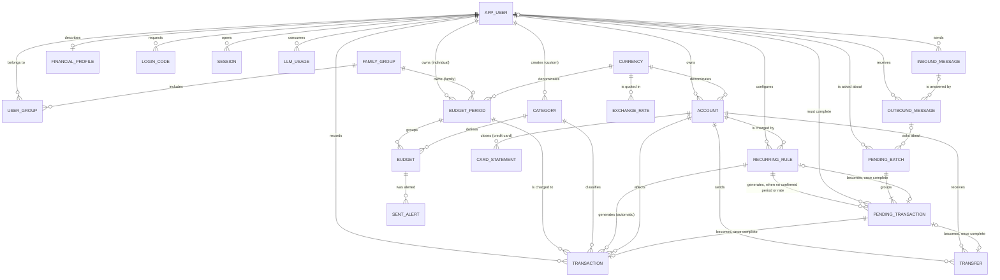
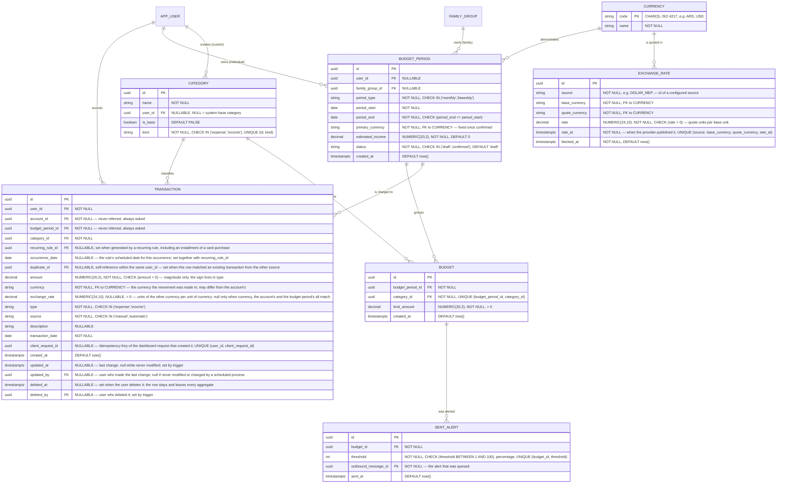
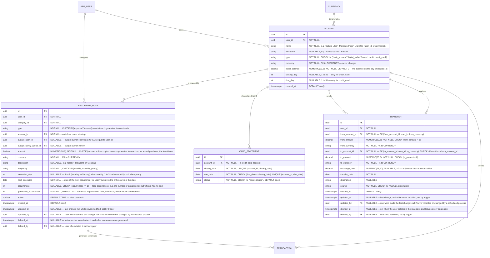
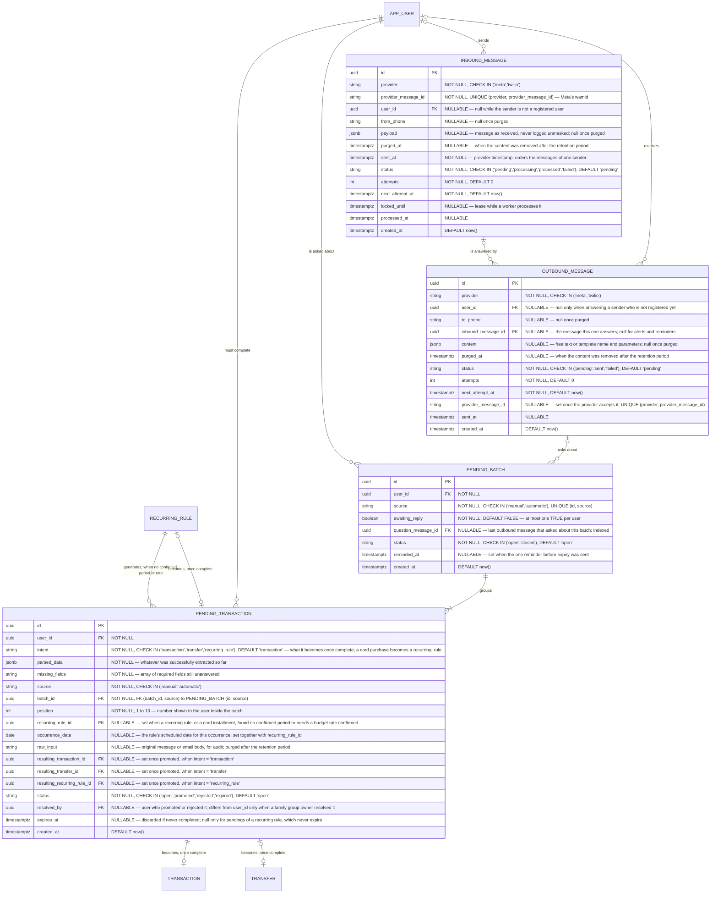

# 3. Modelo de datos

### **3.1. Diagrama del modelo de datos:**

El modelo tiene demasiadas entidades para leerse con sus campos en un solo diagrama. Primero va
una vista general con todas las relaciones y sin campos; después, un diagrama por área con los
campos de sus entidades. En el diagrama de un área, las entidades de otra aparecen sin campos,
solo para mostrar la relación: sus campos están en el diagrama de su propia área.

#### Vista general

#### Usuarios, acceso y asesoramiento

Quién es el usuario, a qué grupo familiar pertenece, cómo entra al dashboard y cuánto consume
del LLM. `ADVICE_DOCUMENT` y `AUTH_THROTTLE` no tienen relaciones: la primera es la base de
conocimiento del asesoramiento y la segunda cuenta intentos por teléfono o IP, no por usuario.

```mermaid
erDiagram
    APP_USER ||--o{ USER_GROUP : "belongs to"
    FAMILY_GROUP ||--o{ USER_GROUP : includes
    APP_USER ||--o| FINANCIAL_PROFILE : "describes"
    APP_USER ||--o{ LOGIN_CODE : "requests"
    APP_USER ||--o{ SESSION : "opens"
    APP_USER ||--o{ LLM_USAGE : "consumes"

    APP_USER {
        uuid id PK
        string name "NULLABLE until onboarding is completed"
        string whatsapp_phone "UNIQUE, NULLABLE only once the account is deleted"
        string email "NULLABLE"
        boolean email_connected "DEFAULT FALSE"
        string country "NULLABLE until onboarding is completed"
        string time_zone "NULLABLE until onboarding is completed, IANA name, e.g. America/Argentina/Buenos_Aires"
        string primary_currency "NULLABLE until onboarding is completed, FK to CURRENCY"
        string inflation_source "NULLABLE, e.g. REM_BCRA"
        string exchange_rate_reference "NULLABLE, e.g. DOLAR_MEP — id of a configured source; null means no suggestion"
        timestamptz terms_accepted_at "NOT NULL — the row is created only once the terms are accepted"
        string terms_version "NOT NULL — version of the terms and privacy policy accepted"
        boolean notifications_opt_in "NOT NULL, DEFAULT FALSE — permission for proactive messages"
        string onboarding_status "NOT NULL, CHECK IN ('in_progress','completed'), DEFAULT 'in_progress'"
        string account_status "NOT NULL, CHECK IN ('active','deactivated','deleted'), DEFAULT 'active'"
        timestamptz deactivated_at "NULLABLE — start of the grace period before deletion"
        timestamptz created_at "DEFAULT now()"
    }

    FAMILY_GROUP {
        uuid id PK
        string name "NOT NULL"
        timestamptz created_at "DEFAULT now()"
    }

    USER_GROUP {
        uuid user_id FK "PK (user_id, family_group_id)"
        uuid family_group_id FK "PK (user_id, family_group_id)"
        string role "NOT NULL, CHECK IN ('owner','member'), DEFAULT 'member'"
        timestamptz joined_at "NOT NULL, DEFAULT now()"
        timestamptz left_at "NULLABLE — set when the member leaves; the row is never deleted"
    }

    FINANCIAL_PROFILE {
        uuid user_id PK "FK to APP_USER — at most one profile per user"
        string income_range "NULLABLE, CHECK IN a fixed set of ranges"
        int dependents "NULLABLE, CHECK (dependents >= 0)"
        boolean has_debts "NULLABLE"
        decimal emergency_fund_months "NUMERIC(4,1), NULLABLE, CHECK (emergency_fund_months >= 0)"
        string main_goal "NULLABLE, CHECK IN ('save','pay_debts','emergency_fund','invest')"
        string risk_tolerance "NULLABLE, CHECK IN ('low','medium','high')"
        timestamptz updated_at "NOT NULL, DEFAULT now()"
    }

    LLM_USAGE {
        uuid user_id FK "NOT NULL"
        date usage_date "NOT NULL — calendar day in the user's time_zone"
        string quota "NOT NULL, CHECK IN ('registration','advice'), PK (user_id, usage_date, quota)"
        int message_count "NOT NULL, DEFAULT 0, CHECK (message_count >= 0)"
        int input_tokens "NOT NULL, DEFAULT 0"
        int output_tokens "NOT NULL, DEFAULT 0"
    }

    LOGIN_CODE {
        uuid id PK
        uuid user_id FK "NOT NULL"
        string purpose "NOT NULL, CHECK IN ('login','account_deletion') — the only use it is valid for"
        string code_hash "NOT NULL — HMAC-SHA256 with a server key, never the code itself"
        timestamptz expires_at "NOT NULL — created_at + 5 minutes"
        int attempts "NOT NULL, DEFAULT 0, CHECK (attempts BETWEEN 0 AND 5)"
        timestamptz used_at "NULLABLE — set on the one successful exchange"
        timestamptz created_at "DEFAULT now()"
    }

    SESSION {
        uuid id PK
        uuid user_id FK "NOT NULL"
        string token_hash "NOT NULL, UNIQUE — hash of the random cookie token, never the token itself"
        timestamptz created_at "NOT NULL, DEFAULT now()"
        timestamptz last_seen_at "NOT NULL, DEFAULT now() — idle expiry counts from here"
        timestamptz expires_at "NOT NULL — created_at + 12 hours, absolute"
        timestamptz revoked_at "NULLABLE — set on logout, logout-all or account deletion request"
    }

    AUTH_THROTTLE {
        uuid id PK
        string key_type "NOT NULL, CHECK IN ('phone','ip')"
        string key_hash "NOT NULL — HMAC-SHA256 of the E.164 phone or of the IP, with a server key"
        string event "NOT NULL, CHECK IN ('code_request','token_failure')"
        timestamptz created_at "NOT NULL, DEFAULT now() — purged after 24 hours"
    }

    ADVICE_DOCUMENT {
        uuid id PK
        text content "NOT NULL"
        vector embedding "pgvector, NOT NULL"
        string topic "NOT NULL, e.g. credit_card, emergency_fund, basic_investing"
        string source "NULLABLE, source URL or reference"
        date publication_date "NULLABLE"
        date last_reviewed_at "NOT NULL, DEFAULT now()"
        string status "NOT NULL, CHECK IN ('current','needs_review','outdated'), DEFAULT 'current'"
        timestamptz created_at "DEFAULT now()"
    }
```

#### Presupuestos y movimientos

Los períodos, sus presupuestos por categoría, los movimientos que se imputan a ellos y las
monedas y cotizaciones con que se convierten.

#### Cuentas, tarjeta de crédito, transferencias y reglas recurrentes

Las cuentas y lo que genera movimientos sobre ellas: resúmenes de tarjeta, transferencias y
reglas recurrentes, que incluyen las compras con tarjeta en cuotas.

#### Pendientes y mensajería

Los movimientos que esperan datos del usuario, los lotes en que se le preguntan y los mensajes
de WhatsApp entrantes y salientes.

**Tipos:**

- **Montos**: `NUMERIC(20,2)`, nunca un tipo de punto flotante. PostgreSQL redondea en silencio
  al insertar un valor con más decimales, así que el dominio redondea explícitamente a 2
  decimales antes de guardar, y un test lo verifica. Las monedas del alcance usan 2 decimales o
  ninguno; sumar una con 3 exige una migración.
- **Cotizaciones**: `NUMERIC(24,10)`, porque una cotización inversa, como dólares por peso, tiene
  muchos decimales significativos.
- **Instantes**: `timestamptz`, que guarda un momento exacto. Las fechas contables
  (`transaction_date`, `period_start`, `closing_date` y similares) son `date`, calculadas en la
  zona horaria del usuario.
- **Monedas**: `CHAR(3)` con clave foránea a `CURRENCY` en toda columna de moneda, así la base
  rechaza un código inexistente o mal escrito (`usd`, `US$`).
- **Nombres de tabla**: en singular y en `snake_case`, igual que en los diagramas (`ACCOUNT` es
  `account`). La tabla de usuarios es `app_user` y no `user`, porque `user` es palabra reservada
  en PostgreSQL y obligaría a escribirla entre comillas en todo SQL escrito a mano. La entidad del
  dominio sigue siendo `User`.

### **3.2. Descripción de entidades principales:**

Cada tabla lleva su descripción y, si las tiene, sus restricciones de integridad. Están agrupadas
por área, en el mismo orden que los diagramas de [3.1](#31-diagrama-del-modelo-de-datos).

#### Usuarios, acceso y asesoramiento

##### APP_USER

Persona que usa el asistente. Guarda su configuración regional (país, zona horaria, moneda primaria, fuente de inflación, cotización de referencia) para que el sistema no esté atado al caso argentino. `whatsapp_phone` es único porque es la clave de entrada del canal conversacional.

**Restricciones:**

- En `APP_USER`, `whatsapp_phone` es nulo si y solo si `account_status = 'deleted'`, y `deactivated_at` es obligatorio si la cuenta está desactivada o borrada (`CHECK`). Una cuenta borrada conserva su fila sin datos personales, porque los movimientos familiares anonimizados siguen apuntando a ella. La regla está en [reglas de dominio § 14](reglas-de-dominio.md#14-privacidad-retención-borrado-de-cuenta-y-derechos).
- En `APP_USER`, `onboarding_status = 'completed'` exige `name`, `country`, `time_zone` y `primary_currency` no nulos (`CHECK`). `time_zone` es un nombre de la base IANA, validado en el adaptador de entrada: la fecha de "hoy" de un movimiento, el día de las cuotas de uso y las fechas de los procesos programados se calculan en esa zona. La fila se crea recién cuando el usuario acepta los términos: antes de eso solo existe su mensaje en `INBOUND_MESSAGE`. La regla está en [reglas de dominio § 11](reglas-de-dominio.md#11-alta-de-usuario-consentimiento-y-mensajes-proactivos).

##### FAMILY_GROUP y USER_GROUP

Relación muchos-a-muchos entre usuarios y grupos familiares (una persona puede pertenecer a más de un grupo; un grupo tiene varios miembros), con un rol por membresía: el dueño (`owner`) administra los miembros del grupo. La membresía no se borra al salir: se cierra con `left_at`, porque de ese intervalo depende qué períodos del grupo sigue viendo quien salió (ver [reglas de dominio § 10](reglas-de-dominio.md#10-grupos-familiares-administración-salida-y-visibilidad)).

**Restricciones:**

- En `USER_GROUP`, un grupo tiene como mucho un dueño vigente: índice único parcial sobre `family_group_id` donde `role = 'owner'` y `left_at` es nulo. `left_at`, si está, es posterior a `joined_at` (`CHECK`). La regla de salida y de visibilidad está en [reglas de dominio § 10](reglas-de-dominio.md#10-grupos-familiares-administración-salida-y-visibilidad).

##### FINANCIAL_PROFILE

Respuestas opcionales del usuario que permiten que un consejo se cruce con su situación real, más allá de sus gastos. Todo es nulable porque cada pregunta se puede saltear, y `updated_at` indica si el dato puede haber quedado viejo. El ingreso se guarda por rango y no exacto. Son datos sensibles, por lo que la política de privacidad tiene que cubrirlos explícitamente. Las preguntas están en [reglas de dominio § 11](reglas-de-dominio.md#11-alta-de-usuario-consentimiento-y-mensajes-proactivos).

##### LOGIN_CODE

Códigos de un solo uso para entrar al dashboard, enviados por WhatsApp ([ADR 0016](adr/0016-sesion-de-servidor-en-el-mismo-origen.md)). Se guarda el HMAC y no el código, para que una filtración de la tabla no permita entrar con los códigos vigentes. `purpose` separa los códigos de login de los de borrado de cuenta. El contrato está en [la API](04-api.md).

**Restricciones:**

- En `LOGIN_CODE`, un código se canjea una sola vez (`used_at`), vence a los 5 minutos y admite como mucho 5 intentos fallidos; al quinto queda inutilizable. Se guarda solo su HMAC. Sirve solo para su `purpose`.

##### SESSION

Sesión del dashboard, creada al canjear un código de login. El token viaja en una cookie y la base guarda solo su hash, así que una filtración de la tabla no permite entrar. Existe como fila, y no como un token firmado que se valida solo, para que cerrar sesión, cerrar todas o pedir el borrado de la cuenta corten el acceso en el momento ([ADR 0016](adr/0016-sesion-de-servidor-en-el-mismo-origen.md)). Un proceso programado borra las vencidas o revocadas.

**Restricciones:**

- En `SESSION`, `UNIQUE (token_hash)`, y `expires_at` posterior a `created_at` (`CHECK`). Una sesión vale mientras `revoked_at` sea nulo, no haya pasado `expires_at` y `last_seen_at` tenga menos de 30 minutos.

##### AUTH_THROTTLE

Registro de pedidos de código y canjes fallidos, del que salen los límites del login. Guarda un HMAC del teléfono o de la IP, nunca el valor, y no depende de que el número sea de un usuario: si dependiera, el límite delataría qué números usan Platita ([ADR 0017](adr/0017-limites-del-login-y-codigos-con-proposito.md)). Las filas se borran a las 24 horas.

**Restricciones:**

- En `AUTH_THROTTLE`, un índice sobre `(key_type, key_hash, event, created_at)`: cada pedido de código y cada canje fallido cuenta las filas recientes de su número y de su IP. No tiene clave foránea a `APP_USER`, porque cuenta también los números que no son de nadie.

##### LLM_USAGE

Consumo diario de cada usuario, por cuota. Se suma en la misma transacción que procesa el mensaje, y la cuota se consulta antes de llamar al LLM. Los tokens no deciden el límite, que es por cantidad de mensajes, pero permiten saber cuánto cuesta cada usuario y ajustar los límites con datos. La regla está en [reglas de dominio § 12](reglas-de-dominio.md#12-límites-de-uso-del-asistente).

##### ADVICE_DOCUMENT

Base de conocimiento financiero curada por el equipo del producto (no por cada usuario final) — es contenido compartido que cualquier usuario puede consultar vía RAG, no datos personales. `topic` clasifica el fragmento (tarjeta de crédito, fondo de emergencia, inversión básica, etc.) para poder acotar la búsqueda además de la similitud semántica. `status` y `last_reviewed_at` existen para poder listar qué contenido lleva mucho sin revisarse y decidir si actualizarlo — no hay actualización automática en el MVP, es un chequeo periódico manual apoyado en esa marca.

#### Presupuestos y movimientos

##### CURRENCY

Catálogo de monedas ISO 4217, cargado como dato de referencia en una migración y compartido por todos los usuarios. Existe para que la moneda no sea texto libre: toda columna de moneda la referencia.

##### EXCHANGE_RATE

Historial de cotizaciones obtenidas de las fuentes configuradas. No pertenece a ningún usuario: la comparten todos los que eligieron esa fuente en `exchange_rate_reference`. La conversión usa la fila más reciente de la fuente del usuario, nunca una consulta al proveedor en el momento. Las fuentes en sí no son una tabla: viven en un archivo de configuración versionado, por el [ADR 0011](adr/0011-cotizaciones-con-adaptador-generico-configurable.md). La cotización que efectivamente se usó en un movimiento queda copiada en `TRANSACTION.exchange_rate`, así el historial del movimiento no depende de esta tabla.

##### CATEGORY

Catálogo mixto — categorías base del sistema (`user_id` nulo, `is_base = true`) más categorías propias por usuario, para evitar que la IA invente una categoría nueva en cada gasto. `kind` separa las de gasto de las de ingreso ([reglas de dominio § 4](reglas-de-dominio.md#4-categorías-catálogo-base-categorías-propias-y-creación-con-confirmación)).

**Restricciones:**

- En `CATEGORY`, un usuario no tiene dos categorías con el mismo nombre, sin distinguir mayúsculas: índice único sobre `(user_id, lower(name))`, más un índice único parcial sobre `lower(name)` donde `user_id` es nulo para el catálogo base, porque en un `UNIQUE` dos nulos no chocan.

Ver también, en otra tabla: [la categoría del mismo tipo que el movimiento, en TRANSACTION](#transaction).

##### BUDGET_PERIOD

El "presupuesto del mes" (o de la quincena) como concepto completo — puede pertenecer a un usuario individual o a un grupo familiar (nunca ambos, ver sus restricciones). `period_type` define la cadencia (mensual o quincenal) y determina cómo se calculan `period_start`/`period_end` del siguiente período al generarlo. `estimated_income` guarda el ingreso proyectado para el período completo, para que armar el presupuesto sea contrastar gastos planeados contra ingreso esperado, no solo poner topes por categoría sueltos. `status` distingue un período todavía en armado (`draft`, generado por la sugerencia de IA o creado a mano) de uno ya confirmado por el usuario — cuándo debe estar en `confirmed` y qué recordatorio se dispara si sigue en `draft` está en [reglas de dominio § 3](reglas-de-dominio.md#3-presupuestos-individual-o-familiar-períodos-y-confirmación-previa-al-inicio).

**Restricciones:**

- En `BUDGET_PERIOD`, exactamente uno de `user_id` / `family_group_id` debe ser no nulo (`CHECK` a nivel de base de datos) — un período de presupuesto es individual o familiar, nunca ambos ni ninguno.
- En `BUDGET_PERIOD`, los períodos de un mismo dueño no se solapan: dos restricciones de exclusión (`EXCLUDE USING gist`), una sobre `user_id` y otra sobre `family_group_id`, cada una con el rango `[period_start, period_end]` y el operador de superposición. Requieren la extensión `btree_gist`. La regla está en [reglas de dominio § 3](reglas-de-dominio.md#3-presupuestos-individual-o-familiar-períodos-y-confirmación-previa-al-inicio).
- En `BUDGET_PERIOD`, `primary_currency` no cambia una vez confirmado el período: un trigger `BEFORE UPDATE` rechaza el cambio si `status` ya era `confirmed`. Un presupuesto en otra moneda es otro período. Mientras está en `draft` se puede cambiar, porque todavía no tiene movimientos.

Ver también, en otra tabla: [la imputación solo a un período confirmado y la cotización del movimiento, en TRANSACTION](#transaction).

##### BUDGET

El límite de gasto de **una** categoría dentro de un `BUDGET_PERIOD` (ej. "comida: $300.000 en septiembre"). Un mismo período agrupa varios `BUDGET`, uno por categoría con tope definido, y la base lo garantiza con `UNIQUE (budget_period_id, category_id)` (ver sus restricciones) — así `period_start`, `period_end` y `primary_currency` viven una sola vez en el período en vez de repetirse por cada categoría.

**Restricciones:**

- En `BUDGET`, `UNIQUE (budget_period_id, category_id)`: un período tiene como mucho un límite por categoría, así el gastado de una categoría se contrasta contra un único tope y no contra dos filas que se contradicen.

##### SENT_ALERT

Registro de las alertas de presupuesto ya enviadas. Existe para que el proceso periódico que revisa presupuestos sepa que ya avisó: sin él, un presupuesto que pasó el umbral recibiría una alerta en cada corrida hasta fin de mes (ver [HU5](05-historias-de-usuario.md)). `threshold` deja lugar a más de un umbral por presupuesto (por ejemplo 80% y 100%) sin cambiar el esquema.

**Restricciones:**

- En `SENT_ALERT`, `UNIQUE (budget_id, threshold)`: un presupuesto recibe como mucho una alerta por umbral. Como cada `BUDGET` pertenece a un solo período, eso equivale a una por período. La fila se inserta en la misma transacción que encola el mensaje, así una segunda corrida del proceso choca con la clave en vez de mandar otra alerta.

##### TRANSACTION

Gasto o ingreso ya completo y válido — si está en esta tabla, tiene cuenta, categoría y período de presupuesto asignados, sin excepción (ver sus restricciones). Guarda el monto en la moneda en que se hizo el movimiento (`amount`, `currency`) y, si hace falta convertir, una sola cotización (`exchange_rate`), de la que salen tanto lo que se mueve en la cuenta como lo que pesa en el presupuesto; también guarda el `source` (manual o automático) para auditoría y para medir cuánto resuelve cada vía. `recurring_rule_id` distingue, dentro de los automáticos, cuáles vinieron del motor de recurrencia. `duplicate_of` es el mecanismo previsto de detección de duplicados entre carga manual y automática (criterio en [reglas de dominio § 7](reglas-de-dominio.md#7-chequeo-de-duplicados-entre-origen-manual-y-automático)). La columna existe desde el esquema inicial; la lógica llega junto con la carga por email (could-have).

**Restricciones:**

- **Campos obligatorios de un movimiento.** Una fila en `TRANSACTION` solo existe con `amount`, `currency`, `type`, `transaction_date`, `category_id`, `account_id` y `budget_period_id` presentes, todos `NOT NULL` en la base de datos. De dónde sale cada valor —lo que el sistema resuelve solo, lo que exige confirmación del usuario, y la excepción de las reglas recurrentes— está en [reglas de dominio § 1](reglas-de-dominio.md#1-registro-de-un-movimiento-qué-se-asume-y-qué-se-confirma) y [§ 8](reglas-de-dominio.md#8-movimientos-recurrentes-la-excepción-a-la-confirmación).
- Un `TRANSACTION` solo se imputa a un `BUDGET_PERIOD` con `status = 'confirmed'`, y un período con movimientos no vuelve a `draft`. Como un `CHECK` no puede mirar otra tabla, lo imponen dos triggers: uno en `TRANSACTION` al insertar o cambiar `budget_period_id`, y otro en `BUDGET_PERIOD` al cambiar `status`.
- La categoría de un movimiento es del mismo tipo que el movimiento: `TRANSACTION (category_id, type)` es una clave foránea compuesta contra `CATEGORY (id, kind)`, apoyada en el `UNIQUE (id, kind)`. Los valores de `type` y de `kind` son los mismos (`expense`, `income`) para que la clave funcione. Lo mismo vale para `RECURRING_RULE (category_id, type)`: una regla de ingreso usa una categoría de ingreso.
- En `TRANSACTION`, `UNIQUE (user_id, client_request_id)`: un pedido repetido del dashboard, con la misma `Idempotency-Key`, no crea un segundo movimiento ([la API](04-api.md)). Las filas con `client_request_id` nulo, las que no vienen del dashboard, no entran en la restricción.
- `TRANSACTION.amount` lleva `CHECK (amount > 0)`: guarda la magnitud, nunca el signo. Si el movimiento resta o suma lo dice `type`, que es el único lugar donde vive esa distinción — un monto negativo con `type = 'expense'` sumaría al saldo en vez de restar.
- La cuenta de un movimiento es del mismo usuario, y la base lo impone: `TRANSACTION (account_id, user_id)` es una clave foránea compuesta contra `ACCOUNT (id, user_id)`, apoyada en un `UNIQUE (id, user_id)` en `ACCOUNT`. Así un error al resolver una cuenta por nombre no puede imputar un gasto a la cuenta de otro usuario. En `RECURRING_RULE` la clave es `(account_id, user_id, currency)` contra `ACCOUNT (id, user_id, currency)`, porque una regla va siempre en la moneda de su cuenta. Que el período familiar sea de un grupo al que el usuario pertenece, y que la categoría sea suya o del catálogo base, no se puede expresar con una clave foránea: lo valida la aplicación dentro de la misma transacción. La regla está en [reglas de dominio § 2](reglas-de-dominio.md#2-cuentas-y-saldo-calculado).
- **Una sola cotización por movimiento.** Intervienen tres monedas: la del movimiento (`currency`), la de su cuenta y la de su período. Un trigger `BEFORE INSERT OR UPDATE` en `TRANSACTION` lee la moneda de la cuenta y la del período, porque un `CHECK` no puede mirar otra tabla, y rechaza la fila si entre las tres hay más de dos monedas distintas, si falta `exchange_rate` cuando alguna difiere, o si viene informada cuando las tres coinciden. `exchange_rate > 0` (`CHECK`). El fundamento está en el [ADR 0011](adr/0011-cotizaciones-con-adaptador-generico-configurable.md).
- Los montos convertidos no se guardan: se calculan con la cotización guardada y se redondean a 2 decimales fila por fila, antes de sumar. Lo que se mueve en la cuenta es `amount` si `currency` es la de la cuenta, y `ROUND(amount × exchange_rate, 2)` si no; lo que pesa en el presupuesto se calcula igual contra la moneda del período. Como la cotización queda en la fila, el cálculo da siempre lo mismo. Es la cotización que el usuario vio y confirmó ([reglas de dominio § 6](reglas-de-dominio.md#6-multimoneda-y-cotización)), y la que el dashboard muestra junto al movimiento ([HU4](05-historias-de-usuario.md)).
- En `TRANSACTION`, `recurring_rule_id` y `occurrence_date` van los dos nulos o los dos informados (`CHECK`), con `UNIQUE (recurring_rule_id, occurrence_date)`: una regla recurrente genera como mucho un movimiento por ocurrencia. Si el proceso programado corre dos veces o se reintenta, el segundo insert choca con la clave en vez de duplicar el cargo. La clave va sobre `occurrence_date` y no sobre `transaction_date` porque en una tarjeta el movimiento lleva la fecha de vencimiento del resumen, que puede ser la misma para dos ocurrencias. Las filas con `recurring_rule_id` nulo no entran en la restricción.
- En `TRANSACTION`, `TRANSFER` y `RECURRING_RULE`, `updated_at` y `updated_by` los fija un trigger `BEFORE UPDATE`: la hora del cambio, y el usuario que la aplicación indicó con `SET LOCAL app.actor_id`, o nulo si el cambio lo hace un proceso programado. `updated_by` informado exige `updated_at` informado (`CHECK`). No se guarda el valor anterior; la decisión está en el [ADR 0014](adr/0014-marca-de-edicion-en-movimientos.md).
- En `TRANSACTION`, `TRANSFER` y `RECURRING_RULE`, borrar es fijar `deleted_at`, y el mismo trigger completa `deleted_by`. `deleted_by` informado exige `deleted_at` informado (`CHECK`). El rol de la aplicación no tiene permiso de `DELETE` sobre ellas: solo el proceso de borrado de cuenta elimina filas. El fundamento está en el [ADR 0015](adr/0015-borrado-logico-de-movimientos.md).
- `TRANSACTION.duplicate_of` referencia otra `TRANSACTION` **del mismo usuario** cuando ambas describen probablemente el mismo gasto real. Esa pertenencia se impone en la base: la autorreferencia es una clave foránea compuesta `(user_id, duplicate_of)` contra `(user_id, id)`, apoyada en un `UNIQUE (user_id, id)` en `TRANSACTION`; la columna sigue siendo nullable. Sin eso un movimiento podría enlazarse al de otro usuario. El criterio de detección, y cuándo se puebla la columna, están en [reglas de dominio § 7](reglas-de-dominio.md#7-chequeo-de-duplicados-entre-origen-manual-y-automático).

#### Cuentas, tarjeta de crédito, transferencias y reglas recurrentes

##### ACCOUNT

Cuenta bancaria, billetera virtual, broker de inversión o efectivo que el usuario da de alta (ej. "Galicia en dólares", "Mercado Pago", "Balanz"). El **saldo no se guarda como columna**, se calcula con los movimientos con fecha hasta hoy: lo que tiene fecha futura es deuda o ingreso previsto, no saldo (ver [reglas de dominio § 2](reglas-de-dominio.md#2-cuentas-y-saldo-calculado)). Si el volumen de cuentas/movimientos creciera al punto de que ese cálculo en cada consulta sea un problema de performance, se puede materializar/cachear más adelante sin cambiar el modelo, es una optimización, no un rediseño.

**Restricciones:**

- En `ACCOUNT`, `closing_day` y `due_day` son obligatorios si y solo si `type = 'credit_card'` (`CHECK`).
- Una cuenta no registra nada anterior a su alta: en `TRANSACTION` y en `TRANSFER`, la fecha no puede ser anterior al día de `created_at` de la cuenta, en la zona horaria del usuario. Un trigger `BEFORE INSERT OR UPDATE` en cada tabla lo rechaza; en `TRANSFER`, contra las dos cuentas. `initial_balance` es el saldo de ese día ([reglas de dominio § 2](reglas-de-dominio.md#2-cuentas-y-saldo-calculado)).
- En `ACCOUNT`, `currency` no cambia nunca: un trigger `BEFORE UPDATE` rechaza el cambio. Una cuenta en otra moneda es otra cuenta ([reglas de dominio § 2](reglas-de-dominio.md#2-cuentas-y-saldo-calculado)).
- En `ACCOUNT`, un usuario no tiene dos cuentas con el mismo nombre, sin distinguir mayúsculas: índice único sobre `(user_id, lower(name))`. El asistente resuelve la cuenta por el nombre que el usuario menciona, y dos cuentas "Galicia" harían imposible saber a cuál se refiere ([reglas de dominio § 2](reglas-de-dominio.md#2-cuentas-y-saldo-calculado)).

Ver también, en otra tabla: [la clave compuesta contra `ACCOUNT (id, user_id)` y la cotización del movimiento, en TRANSACTION](#transaction).

##### CARD_STATEMENT

Cada resumen de una tarjeta. Sus fechas se generan a partir de `closing_day` y `due_day` de la cuenta, y el usuario puede corregirlas mientras el resumen está abierto. Al cerrarse, el proceso programado genera las ocurrencias de las reglas recurrentes de esa tarjeta que entran en él, incluidas las cuotas de las compras.

**Restricciones:**

- En `CARD_STATEMENT`, `UNIQUE (account_id, closing_date)` y `UNIQUE (account_id, due_date)`: una tarjeta no tiene dos resúmenes con el mismo cierre ni con el mismo vencimiento. `due_date` posterior a `closing_date` (`CHECK`). Un movimiento no guarda su resumen: pertenece al resumen de su cuenta cuyo `due_date` es igual a su `transaction_date`, que es la fecha con que se generó. Un resumen cerrado no se corrige, así que ese vínculo no cambia.

##### TRANSFER

Movimiento de plata entre dos cuentas del mismo usuario, incluido el pago del resumen de una tarjeta. No es un gasto ni un ingreso: no tiene categoría ni período y no entra en ningún presupuesto; solo cambia el saldo de las dos cuentas.

**Restricciones:**

- En `TRANSFER`, origen y destino son cuentas distintas del mismo usuario, cada monto en la moneda de su cuenta: `(from_account_id, user_id, from_currency)` y `(to_account_id, user_id, to_currency)` son claves foráneas compuestas contra `ACCOUNT (id, user_id, currency)`, así las dos cuentas son del usuario de la transferencia. Si las monedas coinciden, los montos son iguales y `exchange_rate` es nulo; si difieren, `exchange_rate` es obligatorio (`CHECK`).

Ver también, en otra tabla: [la marca de edición y el borrado lógico, en TRANSACTION](#transaction).

##### RECURRING_RULE

Regla que el usuario configura una vez (ej. alquiler, una suscripción, el sueldo, una compra con tarjeta en cuotas), de gasto o de ingreso según `type`, y que el sistema ejecuta sola en cada ciclo según `frequency`, generando la `TRANSACTION` correspondiente sin intervención manual. La regla define desde el alta todo lo que un movimiento necesita, que es lo que le permite no volver a preguntar mes a mes (ver [reglas de dominio § 8](reglas-de-dominio.md#8-movimientos-recurrentes-la-excepción-a-la-confirmación)). Guarda el dueño y no un `budget_period_id` concreto porque la regla vive a lo largo de muchos períodos: en cada ejecución se resuelve el período de ese dueño que cubre la fecha. `next_execution` es lo que consulta el proceso periódico para saber qué reglas ejecutar hoy; `active` permite pausarla sin borrar el historial de lo ya generado. `occurrences` le pone un final: una compra en 6 cuotas es una regla mensual sobre la tarjeta, con el monto de la cuota y `occurrences = 6`, y una compra en un pago tiene `occurrences = 1`. Si la cuenta es una tarjeta, cada ocurrencia se genera al cerrar el resumen que la incluye, con la fecha de vencimiento ([reglas de dominio § 13](reglas-de-dominio.md#13-tarjetas-de-crédito-y-transferencias)). Lo comprometido a futuro de una tarjeta son las ocurrencias de sus reglas que todavía no se generaron. El fundamento está en el [ADR 0012](adr/0012-tarjetas-de-credito-y-transferencias.md).

**Restricciones:**

- En `RECURRING_RULE`, exactamente uno de `budget_user_id` / `budget_family_group_id` debe ser no nulo (`CHECK`), por el mismo criterio que en `BUDGET_PERIOD`. `amount > 0` (`CHECK`), igual que en `TRANSACTION`: el monto de la regla se copia a cada movimiento que genera, así que una regla con monto cero o negativo no podría generar ninguno.
- En `RECURRING_RULE`, `budget_user_id` es nulo o igual a `user_id` (`CHECK`): un presupuesto individual solo puede ser el propio.
- En `RECURRING_RULE`, `generated_occurrences` va de 0 a `occurrences` cuando `occurrences` está informado (`CHECK`). El motor lo avanza en la misma transacción que genera la ocurrencia y avanza `next_execution`; al llegar a `occurrences`, la regla deja de generar. Una regla borrada o pausada tampoco genera.
- En `RECURRING_RULE`, `execution_day` depende de `frequency` (`CHECK`): de 1 a 7 si es `weekly`, de 1 a 31 si es `monthly`, y nulo si es `yearly`, porque un día solo no define una fecha anual. En una regla anual, la fecha la da `next_execution`, que el motor avanza un año por vez. Qué pasa con los días 29 a 31 en meses más cortos está en [reglas de dominio § 8](reglas-de-dominio.md#8-movimientos-recurrentes-la-excepción-a-la-confirmación).

Ver también, en otra tabla: [la categoría del mismo tipo, la cuenta del mismo usuario, la unicidad por ocurrencia, la marca de edición y el borrado lógico, en TRANSACTION](#transaction).

#### Pendientes y mensajería

##### PENDING_TRANSACTION

Movimiento a medio completar, todavía no registrado. Puede terminar siendo un gasto o ingreso, una transferencia o una regla recurrente, como una compra con tarjeta en cuotas, según `intent`, y al promoverse queda enlazado a la fila que generó por la columna de resultado de ese tipo. Cuándo se crea y cuándo no, cómo continúa la conversación, cómo se promueve y cómo expira está en [reglas de dominio § 5](reglas-de-dominio.md#5-pending_transaction-creación-continuación-de-la-conversación-promoción-y-expiración). Será también el estado natural de lo que detecte el parser de emails cuando se implemente: un mail de aviso trae monto, fecha y normalmente la cuenta, pero nunca a qué presupuesto imputarlo, así que esperará acá la confirmación. Guarda lo interpretado (`parsed_data`), la lista de `missing_fields`, y el asistente pregunta por WhatsApp. Tener una tabla aparte, en vez de un `status` dentro de `TRANSACTION` con columnas nullables, es lo que permite que `TRANSACTION` mantenga sus `NOT NULL` reales: los datos incompletos no contaminan la tabla de la que salen saldos y presupuestos.

**Restricciones:**

- En `PENDING_TRANSACTION`, `status = 'promoted'` si y solo si está informada la columna de resultado que corresponde a su `intent` —`resulting_transaction_id`, `resulting_transfer_id` o `resulting_recurring_rule_id`—, y las otras dos son siempre nulas (`CHECK`). Un pendiente generado por una regla recurrente, incluida una cuota de tarjeta, tiene `intent = 'transaction'` (`CHECK`), porque lo que genera es un gasto o un ingreso. Un pendiente `open` es el que bloquea la salida de un grupo familiar.
- En `PENDING_TRANSACTION`, un pendiente tiene el mismo `source` que su lote: clave foránea compuesta `(batch_id, source)` contra `PENDING_BATCH (id, source)`, así un lote nunca mezcla manuales y automáticos. `UNIQUE (batch_id, position)` y `CHECK (position BETWEEN 1 AND 10)` garantizan que cada número que ve el usuario señala un solo pendiente, y que un lote no pasa de 10. La regla de lotes está en [reglas de dominio § 5](reglas-de-dominio.md#5-pending_transaction-creación-continuación-de-la-conversación-promoción-y-expiración).
- En `PENDING_TRANSACTION`, `expires_at` es nulo si y solo si `recurring_rule_id` está informado (`CHECK`): los pendientes de un recurrente, incluidas las cuotas de tarjeta, no vencen, y todos los demás sí. `recurring_rule_id` y `occurrence_date` van los dos nulos o los dos informados (`CHECK`), con `UNIQUE (recurring_rule_id, occurrence_date)`: una regla recurrente genera como mucho un pendiente por ocurrencia, igual que como mucho un movimiento.

Ver también, en otra tabla: [la unicidad por ocurrencia, en TRANSACTION](#transaction).

##### PENDING_BATCH

Grupo de pendientes que el asistente pregunta juntos, en un solo mensaje numerado. Es la unidad de conversación: el usuario responde sobre el lote, en general ("todos al familiar") o por número. `awaiting_reply` marca el único lote por el que el asistente espera respuesta; `question_message_id` es el mensaje que lo preguntó, y es lo que permite asociar una respuesta que cita ese mensaje aunque el lote no esté en conversación. `reminded_at` marca el último recordatorio enviado. En un lote que vence, es el único recordatorio previo al vencimiento que promete [HU3](05-historias-de-usuario.md), y el proceso que recuerda solo toma lotes sin esa marca; en un lote con pendientes de un recurrente, que no vencen, el proceso vuelve a recordar cuando pasaron 3 días desde `reminded_at`. Un gasto suelto es un lote de uno. Se cierra cuando todos sus pendientes quedan promovidos, rechazados o vencidos.

**Restricciones:**

- En `PENDING_BATCH`, un usuario tiene como mucho un lote en conversación: índice único parcial sobre `user_id` donde `awaiting_reply` es verdadero. Un lote cerrado no puede estar en conversación (`CHECK`).

Ver también, en otra tabla: [el índice sobre `question_message_id`, en OUTBOUND_MESSAGE](#outbound_message).

##### INBOUND_MESSAGE

Todo mensaje que llega por el webhook de WhatsApp, guardado antes de procesarlo. Es a la vez la cola de trabajo del worker y el registro de lo que entró por el canal. `status` recorre `pending` → `processing` → `processed`, o termina en `failed` tras agotar los reintentos, y en ese caso el usuario recibe un aviso. `sent_at` ordena los mensajes de un mismo remitente, que se procesan de a uno y en orden. `user_id` es nulo mientras el número no corresponde a un usuario registrado. Cómo se toma, se reintenta y se procesa está en el [ADR 0010](adr/0010-webhook-asincrono-con-tabla-de-entrada.md).

**Restricciones:**

- En `INBOUND_MESSAGE` y `OUTBOUND_MESSAGE`, el contenido y el teléfono (`payload` y `from_phone` en la entrada, `content` y `to_phone` en la salida) son nulos si y solo si `purged_at` está informado (`CHECK`): la purga borra los dos a la vez, como pide [reglas de dominio § 14](reglas-de-dominio.md#14-privacidad-retención-borrado-de-cuenta-y-derechos). Solo se purgan mensajes ya procesados, así que el worker, que identifica al remitente por `from_phone` cuando no hay `user_id`, nunca encuentra un pendiente sin teléfono.
- En `INBOUND_MESSAGE`, `UNIQUE (provider, provider_message_id)`: un mensaje del proveedor se guarda una sola vez, así un reintento del webhook no genera un segundo procesamiento. El fundamento está en el [ADR 0010](adr/0010-webhook-asincrono-con-tabla-de-entrada.md).

##### OUTBOUND_MESSAGE

Todo mensaje que Platita manda por WhatsApp, ya sea una respuesta, una alerta o un recordatorio. Se escribe en la misma transacción que lo origina y el worker lo envía después, de modo que un cambio en la base y su aviso al usuario no pueden separarse. `content` distingue texto libre de plantilla, porque fuera de la ventana de conversación Meta solo acepta plantillas preaprobadas.

**Restricciones:**

- En `OUTBOUND_MESSAGE`, `UNIQUE (provider, provider_message_id)`, y un índice sobre `PENDING_BATCH (question_message_id)`. Una respuesta que cita un mensaje trae el identificador de WhatsApp del mensaje citado; con él se encuentra el mensaje enviado y, desde ese mensaje, el lote que preguntaba ([reglas de dominio § 5](reglas-de-dominio.md#5-pending_transaction-creación-continuación-de-la-conversación-promoción-y-expiración)). La columna es nula hasta que el mensaje se envía, y en un `UNIQUE` dos nulos no chocan.

Ver también, en otra tabla: [la purga del contenido y del teléfono, en INBOUND_MESSAGE](#inbound_message).
