# 3. Modelo de datos

### **3.1. Diagrama del modelo de datos:**

```mermaid
erDiagram
    USER ||--o{ TRANSACTION : records
    USER ||--o{ USER_GROUP : "belongs to"
    FAMILY_GROUP ||--o{ USER_GROUP : includes
    USER ||--o{ BUDGET_PERIOD : "owns (individual)"
    FAMILY_GROUP ||--o{ BUDGET_PERIOD : "owns (family)"
    BUDGET_PERIOD ||--o{ BUDGET : groups
    BUDGET_PERIOD ||--o{ TRANSACTION : "is charged to"
    CATEGORY ||--o{ TRANSACTION : classifies
    CATEGORY ||--o{ BUDGET : defines
    USER ||--o{ CATEGORY : "creates (custom)"
    USER ||--o{ RECURRING_EXPENSE : configures
    RECURRING_EXPENSE ||--o{ TRANSACTION : "generates (automatic)"
    USER ||--o{ ACCOUNT : owns
    ACCOUNT ||--o{ TRANSACTION : affects
    USER ||--o{ PENDING_TRANSACTION : "must complete"
    PENDING_TRANSACTION ||--o| TRANSACTION : "becomes, once complete"

    USER {
        uuid id PK
        string name "NOT NULL"
        string whatsapp_phone "UNIQUE, NOT NULL"
        string email "NULLABLE"
        boolean email_connected "DEFAULT FALSE"
        string country "NOT NULL"
        string primary_currency "NOT NULL, ISO 4217"
        string inflation_source "NULLABLE, e.g. REM_BCRA"
        string exchange_rate_reference "NULLABLE, e.g. DOLAR_MEP"
        timestamp created_at "DEFAULT now()"
    }

    FAMILY_GROUP {
        uuid id PK
        string name "NOT NULL"
        timestamp created_at "DEFAULT now()"
    }

    USER_GROUP {
        uuid user_id FK "PK (user_id, family_group_id)"
        uuid family_group_id FK "PK (user_id, family_group_id)"
        string role "NOT NULL, CHECK IN ('owner','member'), DEFAULT 'member'"
        timestamp joined_at "NOT NULL, DEFAULT now()"
        timestamp left_at "NULLABLE — set when the member leaves; the row is never deleted"
    }

    ACCOUNT {
        uuid id PK
        uuid user_id FK "NOT NULL"
        string name "NOT NULL, e.g. 'Galicia USD', 'Mercado Pago'"
        string institution "NULLABLE, e.g. 'Banco Galicia', 'Balanz'"
        string type "NOT NULL, CHECK IN ('bank_account','digital_wallet','broker','cash')"
        string currency "NOT NULL, ISO 4217"
        decimal initial_balance "NOT NULL, DEFAULT 0"
        timestamp created_at "DEFAULT now()"
    }

    BUDGET_PERIOD {
        uuid id PK
        uuid user_id FK "NULLABLE"
        uuid family_group_id FK "NULLABLE"
        string period_type "NOT NULL, CHECK IN ('monthly','biweekly')"
        date period_start "NOT NULL"
        date period_end "NOT NULL"
        string primary_currency "NOT NULL"
        decimal estimated_income "NOT NULL, DEFAULT 0"
        string status "NOT NULL, CHECK IN ('draft','confirmed'), DEFAULT 'draft'"
        timestamp created_at "DEFAULT now()"
    }

    BUDGET {
        uuid id PK
        uuid budget_period_id FK "NOT NULL"
        uuid category_id FK "NOT NULL, UNIQUE (budget_period_id, category_id)"
        decimal limit_amount "NOT NULL, > 0"
        timestamp created_at "DEFAULT now()"
    }

    CATEGORY {
        uuid id PK
        string name "NOT NULL"
        uuid user_id FK "NULLABLE, NULL = system base category"
        boolean is_base "DEFAULT FALSE"
    }

    TRANSACTION {
        uuid id PK
        uuid user_id FK "NOT NULL"
        uuid account_id FK "NOT NULL — never inferred, always asked"
        uuid budget_period_id FK "NOT NULL — never inferred, always asked"
        uuid category_id FK "NOT NULL"
        uuid recurring_expense_id FK "NULLABLE, set when generated by a recurring rule"
        uuid duplicate_of FK "NULLABLE, self-reference within the same user_id — set when this row matched an existing transaction from the other source"
        decimal amount "NOT NULL, CHECK (amount > 0) — magnitude only, the sign lives in type"
        string currency "NOT NULL, ISO 4217"
        decimal converted_amount "NOT NULL, in the budget period's primary_currency"
        decimal original_amount "NULLABLE — amount as the user said it, when in another currency than the account"
        string original_currency "NULLABLE, ISO 4217 — set together with original_amount and exchange_rate"
        decimal exchange_rate "NULLABLE, > 0 — rate used to convert original_amount into the account currency"
        string type "NOT NULL, CHECK IN ('expense','income')"
        string source "NOT NULL, CHECK IN ('manual','automatic')"
        string description "NULLABLE"
        date transaction_date "NOT NULL"
        timestamp created_at "DEFAULT now()"
    }

    PENDING_TRANSACTION {
        uuid id PK
        uuid user_id FK "NOT NULL"
        jsonb parsed_data "NOT NULL — whatever was successfully extracted so far"
        string missing_fields "NOT NULL — array of required fields still unanswered"
        string source "NOT NULL, CHECK IN ('manual','automatic')"
        string raw_input "NULLABLE — original message or email body, for audit"
        uuid resulting_transaction_id FK "NULLABLE — set once completed and promoted"
        string status "NOT NULL, CHECK IN ('open','promoted','rejected','expired'), DEFAULT 'open'"
        uuid resolved_by FK "NULLABLE — user who promoted or rejected it; differs from user_id only when a family group owner resolved it"
        timestamp expires_at "NOT NULL — discarded if never completed"
        timestamp created_at "DEFAULT now()"
    }

    RECURRING_EXPENSE {
        uuid id PK
        uuid user_id FK "NOT NULL"
        uuid category_id FK "NOT NULL"
        uuid account_id FK "NOT NULL — defined once, at setup"
        uuid budget_user_id FK "NULLABLE — budget owner: individual"
        uuid budget_family_group_id FK "NULLABLE — budget owner: family"
        decimal amount "NOT NULL"
        string currency "NOT NULL, ISO 4217"
        string frequency "NOT NULL, CHECK IN ('weekly','monthly','yearly')"
        int execution_day "NOT NULL, day of month/week"
        date next_execution "NOT NULL"
        boolean active "DEFAULT TRUE"
        timestamp created_at "DEFAULT now()"
    }

    ADVICE_DOCUMENT {
        uuid id PK
        text content "NOT NULL"
        vector embedding "pgvector, NOT NULL"
        string topic "NOT NULL, e.g. credit_card, emergency_fund, basic_investing"
        string source "NULLABLE, source URL or reference"
        date publication_date "NULLABLE"
        date last_reviewed_at "NOT NULL, DEFAULT now()"
        string status "NOT NULL, CHECK IN ('current','needs_review','outdated'), DEFAULT 'current'"
        timestamp created_at "DEFAULT now()"
    }
```

**Restricciones de integridad relevantes:**

- En `BUDGET_PERIOD`, exactamente uno de `user_id` / `family_group_id` debe ser no nulo (`CHECK` a nivel de base de datos) — un período de presupuesto es individual o familiar, nunca ambos ni ninguno.
- **Campos obligatorios de un movimiento.** Una fila en `TRANSACTION` solo existe con `amount`, `currency`, `type`, `transaction_date`, `category_id`, `account_id` y `budget_period_id` presentes, todos `NOT NULL` en la base de datos. De dónde sale cada valor —lo que el sistema resuelve solo, lo que exige confirmación del usuario, y la excepción de las reglas recurrentes— está en [reglas de dominio § 1](reglas-de-dominio.md#1-registro-de-un-movimiento-qué-se-asume-y-qué-se-confirma) y [§ 8](reglas-de-dominio.md#8-gastos-recurrentes-la-excepción-a-la-confirmación).
- En `USER_GROUP`, un grupo tiene como mucho un dueño vigente: índice único parcial sobre `family_group_id` donde `role = 'owner'` y `left_at` es nulo. `left_at`, si está, es posterior a `joined_at` (`CHECK`). La regla de salida y de visibilidad está en [reglas de dominio § 10](reglas-de-dominio.md#10-grupos-familiares-administración-salida-y-visibilidad).
- En `PENDING_TRANSACTION`, `status = 'promoted'` si y solo si `resulting_transaction_id` no es nulo (`CHECK`). Un pendiente `open` es el que bloquea la salida de un grupo familiar.
- En `RECURRING_EXPENSE`, exactamente uno de `budget_user_id` / `budget_family_group_id` debe ser no nulo (`CHECK`), por el mismo criterio que en `BUDGET_PERIOD`.
- En `BUDGET`, `UNIQUE (budget_period_id, category_id)`: un período tiene como mucho un límite por categoría, así el gastado de una categoría se contrasta contra un único tope y no contra dos filas que se contradicen.
- `TRANSACTION.amount` lleva `CHECK (amount > 0)`: guarda la magnitud, nunca el signo. Si el movimiento resta o suma lo dice `type`, que es el único lugar donde vive esa distinción — un monto negativo con `type = 'expense'` sumaría al saldo en vez de restar.
- La moneda de un movimiento es la de su cuenta, y la base lo impone: `TRANSACTION (account_id, currency)` es una clave foránea compuesta contra `ACCOUNT (id, currency)`, apoyada en un `UNIQUE (id, currency)` en `ACCOUNT`. Con `ON UPDATE RESTRICT`, esa misma clave impide cambiar la moneda de una cuenta que ya tiene movimientos. Lo mismo vale para `RECURRING_EXPENSE (account_id, currency)`. La regla está en [reglas de dominio § 2](reglas-de-dominio.md#2-cuentas-y-saldo-calculado).
- En `TRANSACTION`, `original_amount`, `original_currency` y `exchange_rate` van los tres nulos o los tres informados (`CHECK`), y si están informados `original_currency` es distinta de `currency` y `exchange_rate > 0`. Guardan el gasto tal como lo dijo el usuario cuando fue en otra moneda que la de la cuenta: el saldo usa siempre `amount`, y estas columnas son la evidencia de la conversión que el usuario confirmó.
- `TRANSACTION.duplicate_of` referencia otra `TRANSACTION` **del mismo usuario** cuando ambas describen probablemente el mismo gasto real. Esa pertenencia se impone en la base: la autorreferencia es una clave foránea compuesta `(user_id, duplicate_of)` contra `(user_id, id)`, apoyada en un `UNIQUE (user_id, id)` en `TRANSACTION`; la columna sigue siendo nullable. Sin eso un movimiento podría enlazarse al de otro usuario. El criterio de detección, y cuándo se puebla la columna, están en [reglas de dominio § 7](reglas-de-dominio.md#7-chequeo-de-duplicados-entre-origen-manual-y-automático).

### **3.2. Descripción de entidades principales:**

- **USER**: persona que usa el asistente. Guarda su configuración regional (país, moneda primaria, fuente de inflación, cotización de referencia) para que el sistema no esté atado al caso argentino. `whatsapp_phone` es único porque es la clave de entrada del canal conversacional.
- **FAMILY_GROUP** / **USER_GROUP**: relación muchos-a-muchos entre usuarios y grupos familiares (una persona puede pertenecer a más de un grupo; un grupo tiene varios miembros), con un rol por membresía: el dueño (`owner`) administra los miembros del grupo. La membresía no se borra al salir: se cierra con `left_at`, porque de ese intervalo depende qué períodos del grupo sigue viendo quien salió (ver [reglas de dominio § 10](reglas-de-dominio.md#10-grupos-familiares-administración-salida-y-visibilidad)).
- **ACCOUNT**: cuenta bancaria, billetera virtual, broker de inversión o efectivo que el usuario da de alta (ej. "Galicia en dólares", "Mercado Pago", "Balanz"). El **saldo no se guarda como columna**, se calcula (ver [reglas de dominio § 2](reglas-de-dominio.md#2-cuentas-y-saldo-calculado)). Si el volumen de cuentas/movimientos creciera al punto de que ese cálculo en cada consulta sea un problema de performance, se puede materializar/cachear más adelante sin cambiar el modelo, es una optimización, no un rediseño.
- **BUDGET_PERIOD**: el "presupuesto del mes" (o de la quincena) como concepto completo — puede pertenecer a un usuario individual o a un grupo familiar (nunca ambos, ver restricción arriba). `period_type` define la cadencia (mensual o quincenal) y determina cómo se calculan `period_start`/`period_end` del siguiente período al generarlo. `estimated_income` guarda el ingreso proyectado para el período completo, para que armar el presupuesto sea contrastar gastos planeados contra ingreso esperado, no solo poner topes por categoría sueltos. `status` distingue un período todavía en armado (`draft`, generado por la sugerencia de IA o creado a mano) de uno ya confirmado por el usuario — cuándo debe estar en `confirmed` y qué recordatorio se dispara si sigue en `draft` está en [reglas de dominio § 3](reglas-de-dominio.md#3-presupuestos-individual-o-familiar-períodos-y-confirmación-previa-al-inicio).
- **BUDGET**: el límite de gasto de **una** categoría dentro de un `BUDGET_PERIOD` (ej. "comida: $300.000 en septiembre"). Un mismo período agrupa varios `BUDGET`, uno por categoría con tope definido, y la base lo garantiza con `UNIQUE (budget_period_id, category_id)` (ver restricción arriba) — así `period_start`, `period_end` y `primary_currency` viven una sola vez en el período en vez de repetirse por cada categoría.
- **CATEGORY**: catálogo mixto — categorías base del sistema (`user_id` nulo, `is_base = true`) más categorías propias por usuario, para evitar que la IA invente una categoría nueva en cada gasto.
- **TRANSACTION**: gasto o ingreso ya completo y válido — si está en esta tabla, tiene cuenta, categoría y período de presupuesto asignados, sin excepción (ver restricción arriba). Guarda tanto el monto original (`amount`, `currency`) como el convertido a la moneda primaria del período (`converted_amount`), y el `source` (manual o automático) para auditoría y para medir cuánto resuelve cada vía. `recurring_expense_id` distingue, dentro de los automáticos, cuáles vinieron del motor de recurrencia. `duplicate_of` es el mecanismo previsto de detección de duplicados entre carga manual y automática (criterio en [reglas de dominio § 7](reglas-de-dominio.md#7-chequeo-de-duplicados-entre-origen-manual-y-automático)). La columna existe desde el esquema inicial; la lógica llega junto con la carga por email (could-have).
- **PENDING_TRANSACTION**: movimiento a medio completar, todavía no registrado. Cuándo se crea y cuándo no, cómo continúa la conversación, cómo se promueve y cómo expira está en [reglas de dominio § 5](reglas-de-dominio.md#5-pending_transaction-creación-continuación-de-la-conversación-promoción-y-expiración). Será también el estado natural de lo que detecte el parser de emails cuando se implemente: un mail de aviso trae monto, fecha y normalmente la cuenta, pero nunca a qué presupuesto imputarlo, así que esperará acá la confirmación. Guarda lo interpretado (`parsed_data`), la lista de `missing_fields`, y el asistente pregunta por WhatsApp. Tener una tabla aparte, en vez de un `status` dentro de `TRANSACTION` con columnas nullables, es lo que permite que `TRANSACTION` mantenga sus `NOT NULL` reales: los datos incompletos no contaminan la tabla de la que salen saldos y presupuestos.
- **RECURRING_EXPENSE**: regla que el usuario configura una vez (ej. alquiler, una suscripción) y que el sistema ejecuta sola en cada ciclo según `frequency`, generando la `TRANSACTION` correspondiente sin intervención manual. La regla define desde el alta todo lo que un movimiento necesita, que es lo que le permite no volver a preguntar mes a mes (ver [reglas de dominio § 8](reglas-de-dominio.md#8-gastos-recurrentes-la-excepción-a-la-confirmación)). Guarda el dueño y no un `budget_period_id` concreto porque la regla vive a lo largo de muchos períodos: en cada ejecución se resuelve el período de ese dueño que cubre la fecha. `next_execution` es lo que consulta el proceso periódico para saber qué reglas ejecutar hoy; `active` permite pausarla sin borrar el historial de lo ya generado.
- **ADVICE_DOCUMENT**: base de conocimiento financiero curada por el equipo del producto (no por cada usuario final) — es contenido compartido que cualquier usuario puede consultar vía RAG, no datos personales. `topic` clasifica el fragmento (tarjeta de crédito, fondo de emergencia, inversión básica, etc.) para poder acotar la búsqueda además de la similitud semántica. `status` y `last_reviewed_at` existen para poder listar qué contenido lleva mucho sin revisarse y decidir si actualizarlo — no hay actualización automática en el MVP, es un chequeo periódico manual apoyado en esa marca.
