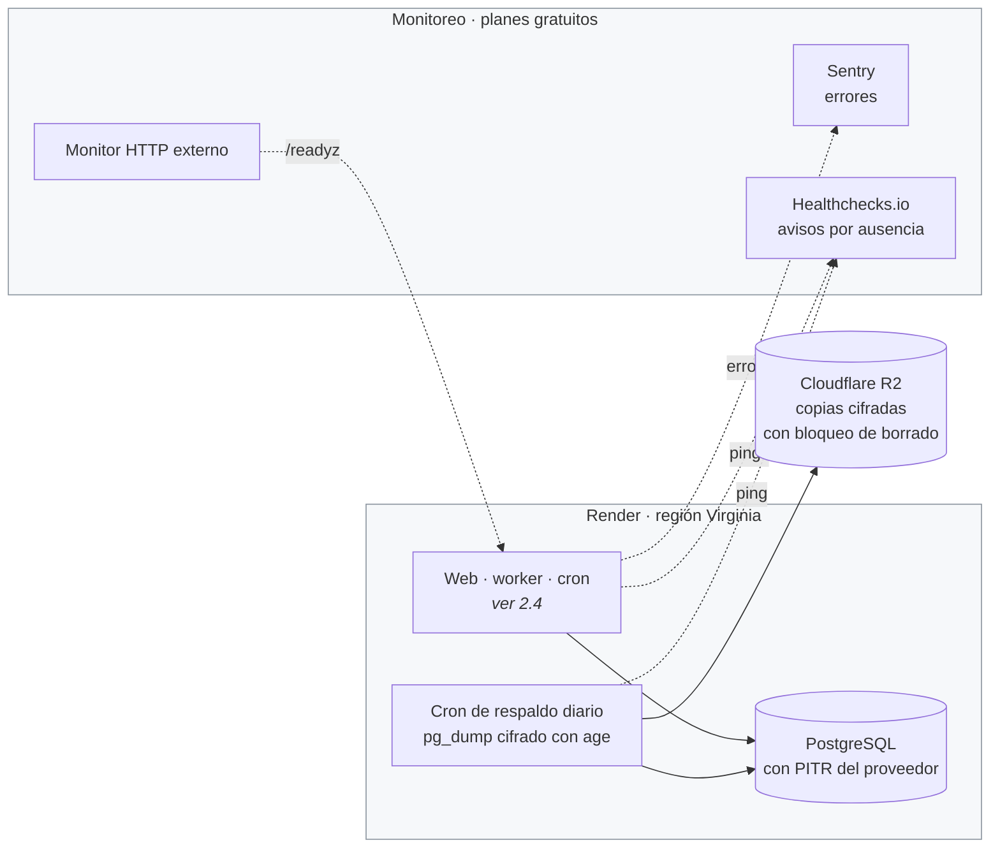

# Operación

Cómo se construye, se despliega, se respalda y se vigila Platita en su MVP. Una parte está
decidida y el resto sigue como propuesta, escrita para que esté a mano cuando se decida.

**Qué está decidido.** Lo que figura en esta tabla tiene su ADR y se puede implementar.

| Qué | Dónde está en este documento | Decisión | Desde cuándo |
|---|---|---|---|
| Una imagen y Docker Compose en local | [2](#2-entornos) | [ADR 0021](adr/0021-una-imagen-docker-compose-y-pipeline-de-la-aplicacion.md) | Entrega 2 |
| Qué rama despliega cada entorno: la de la entrega, `demo`; `main`, `production` | [2](#2-entornos) | [ADR 0021](adr/0021-una-imagen-docker-compose-y-pipeline-de-la-aplicacion.md) | El primer despliegue |
| Los cinco controles del pipeline | [3](#3-pipeline-de-la-aplicación) | [ADR 0021](adr/0021-una-imagen-docker-compose-y-pipeline-de-la-aplicacion.md) | El primer commit de código. El control de secretos y las acciones fijadas, desde ahora |
| Métricas de las llamadas al modelo | [6.2](#62-métricas) | [ADR 0023](adr/0023-observabilidad-de-las-llamadas-al-llm-registros-y-eventos-de-seguridad.md) | Entrega 2 |
| Registros en JSON, filtro de datos personales y eventos de seguridad | [6.3](#63-registros) | [ADR 0023](adr/0023-observabilidad-de-las-llamadas-al-llm-registros-y-eventos-de-seguridad.md) | El primer commit de código |
| Las tres rutas de salud | [6.4](#64-alertas) | [ADR 0023](adr/0023-observabilidad-de-las-llamadas-al-llm-registros-y-eventos-de-seguridad.md) | El primer commit de código |
| Sentry, el monitor externo y las dos alertas críticas | [6.4](#64-alertas) | [ADR 0023](adr/0023-observabilidad-de-las-llamadas-al-llm-registros-y-eventos-de-seguridad.md) | El primer despliegue |

**Qué sigue como propuesta.** Todo lo demás: el proveedor y el plan, los costos, el despliegue y
la vuelta atrás, las copias de respaldo, los objetivos de servicio, las otras cinco alertas y
cuándo crecer. Cada sección lo marca con `Propuesto, sin decidir:`. Para eso, lo vigente es
[2.4. Infraestructura y despliegue](02-arquitectura.md#24-infraestructura-y-despliegue), y lo que
falta resolver está en las [decisiones abiertas de la hoja de ruta](hoja-de-ruta.md#decisiones-abiertas).
Un asistente de IA no implementa nada de lo propuesto sin que antes exista el ADR
correspondiente.

El criterio del diseño, en este orden: que los datos se puedan recuperar, que lo opere una sola
persona, incluso fuera de horario, y que cueste lo mínimo posible sin perder lo primero. Cada
componente se justifica con un requisito; lo que no se justifica, no está.

Los precios son orientativos y hay que verificarlos al contratar.

## 1. Qué se suma a la arquitectura

`Propuesto, sin decidir.` La topología base —servicio web, worker, procesos programados y PostgreSQL en Render— es la de
[2.4](02-arquitectura.md#24-infraestructura-y-despliegue) y no se repite. Esta propuesta le
agrega solo tres cosas: una copia de la base fuera de Render, un plan de pago mínimo en lugar
del gratuito, y un monitoreo con servicios de plan gratuito.


```mermaid
flowchart LR
    subgraph RENDER["Render · región Virginia"]
        APP["Web · worker · cron<br/><i>ver 2.4</i>"]
        BKP["Cron de respaldo diario<br/>pg_dump cifrado con age"]
        PG[("PostgreSQL<br/>con PITR del proveedor")]
    end

    R2[("Cloudflare R2<br/>copias cifradas<br/>con bloqueo de borrado")]

    subgraph OBS["Monitoreo · planes gratuitos"]
        SENTRY["Sentry<br/>errores"]
        HC["Healthchecks.io<br/>avisos por ausencia"]
        UP["Monitor HTTP externo"]
    end

    APP --> PG
    BKP --> PG
    BKP --> R2
    APP -.->|errores| SENTRY
    APP -.->|pings| HC
    BKP -.->|ping| HC
    UP -.->|/readyz| APP

    style RENDER fill:#f6f8fa,stroke:#8b949e
    style OBS fill:#f6f8fa,stroke:#8b949e
```

| Componente | Requisito que lo justifica | Costo mensual orientativo |
|---|---|---|
| Servicio web, plan Starter | El webhook tiene que estar siempre despierto: el plan gratuito se duerme y el arranque en frío demora la respuesta a Meta. El plan pago además habilita el paso previo al despliegue y el despliegue sin corte | US$7 |
| Worker, plan Starter | Procesa los mensajes aparte del webhook ([ADR 0010](adr/0010-webhook-asincrono-con-tabla-de-entrada.md)). El plan gratuito no incluye workers | US$7 |
| Un cron despachador cada 15 minutos | Corre las tareas programadas que vencieron: recurrentes, alertas, expiración, cotizaciones y cuotas. Uno solo cuesta menos que uno por tarea | ~US$1 |
| Cron de respaldo diario | Una copia fuera de Render, para sobrevivir a la pérdida de la cuenta o del proveedor | ~US$1 |
| PostgreSQL Basic-256mb | El plan pago más chico con copias y restauración a un punto en el tiempo. El gratuito vence a los 30 días y no tiene copias | US$6 más el disco |
| Cloudflare R2 | Guarda las copias sin costo de salida al restaurar | US$0 hasta 10 GB |
| Dominio propio con DNS en Cloudflare | Exigido antes de abrir a usuarios reales ([hoja de ruta](hoja-de-ruta.md#decisiones-abiertas)). Render emite el certificado TLS sin costo | ~US$1 |
| Sentry, Healthchecks.io y un monitor HTTP | Enterarse de un error nuevo, de un proceso que dejó de correr o de una caída sin mirar los registros | US$0 |
| **Total** | | **~US$23 a 25** |

El tope de gasto del proveedor de LLM va aparte y ya está fijado en [2.4](02-arquitectura.md#24-infraestructura-y-despliegue).

Quedan afuera una cola dedicada, porque la descarta el [ADR 0010](adr/0010-webhook-asincrono-con-tabla-de-entrada.md);
una caché y una CDN, porque ningún requisito de latencia ni de tráfico las pide; un registro de
imágenes, porque Render construye la imagen desde el repositorio; y Terraform, porque el
`render.yaml` versionado alcanza para reconstruir todo en otra cuenta.

**La alternativa más barata** es un servidor virtual único, por ejemplo en Hetzner, con Docker
Compose: unos US$6 por mes. Ahorra unos US$17 por mes, pero suma parchear el sistema operativo,
administrar PostgreSQL, montar la restauración a un punto en el tiempo con pgBackRest, renovar
TLS y escribir los despliegues sin corte. Para una sola persona de guardia, esa diferencia de
costo compra casi toda la operación.

## 2. Entornos

El entorno local y el de CI están decididos, y también qué rama despliega cada entorno: la rama
de la entrega despliega `demo`, y `main`, `production` ([ADR 0021](adr/0021-una-imagen-docker-compose-y-pipeline-de-la-aplicacion.md)). El local levanta cuatro servicios
con un comando: la base, las migraciones, la API y el worker, los tres últimos con la misma
imagen. Las pruebas manuales usan el modelo real, con la clave en un `.env` sin versionar. Dónde
se despliegan demostración y producción sigue como propuesta.

| Entorno | Para qué | En qué se diferencia | Cómo se promueve |
|---|---|---|---|
| Local | Desarrollo y pruebas manuales del flujo por WhatsApp | Docker Compose con la imagen `pgvector/pgvector:pg16`, el número de prueba gratuito de Meta detrás de un túnel, y datos semilla que se niegan a correr contra producción | Pull request |
| CI, efímero | Tests de integración y migraciones contra un PostgreSQL real | PostgreSQL como contenedor del job, sin secretos, con dobles de prueba para Meta, el LLM, los embeddings y las cotizaciones | Merge a la rama de despliegue con todos los checks en verde |
| Demostración y pruebas | Mostrar el flujo conversacional por el chat web, sin WhatsApp, y que lo pruebe otra persona | Entorno `demo`: usuarios de prueba, chat web encendido y entrada por un enlace personal, uno por persona, con un aviso de prueba que se acepta la primera vez ([ADR 0016](adr/0016-sesion-de-servidor-en-el-mismo-origen.md)). Tiene su propia base. Dónde se aloja está sin decidir | Con cada integración a la rama de la entrega |
| Producción | Usuarios | Entorno `production`: Render, con los secretos en un Environment Group y registros en nivel INFO. No arranca con el chat web ni la entrada de desarrollo encendidos | Despliegue automático de Render cuando pasan los checks |

El entorno `demo` no figura en los costos de [1](#1-qué-se-suma-a-la-arquitectura): es una
segunda instancia con su base, y cuánto cuesta depende del proveedor que se elija.

Un staging igual a producción no está al lanzamiento: duplicaría el costo, y el riesgo principal que cubriría, una
migración que rompe, lo cubre la CI probando la migración desde el esquema de la versión
anterior. Cuándo agregarlo está en [7](#7-cuándo-crecer).

## 3. Pipeline de la aplicación

Se suma al que ya valida la documentación ([ADR 0009](adr/0009-validacion-de-documentacion-en-ci.md)),
en GitHub Actions. Todas las etapas corren en paralelo y apuntan a menos de diez minutos.

Las etapas marcadas como decididas son los cinco controles del [ADR 0021](adr/0021-una-imagen-docker-compose-y-pipeline-de-la-aplicacion.md). Corren con
permiso de solo lectura y con cada acción fijada al hash de su commit. Para que bloqueen un
merge, la rama de la entrega tiene que estar protegida en GitHub con esos controles como
obligatorios.

| Etapa | Herramienta | ¿Bloquea? | Estado |
|---|---|---|---|
| Formato y lint | ruff | El merge | Decidido, control 1 |
| Tipos | mypy en modo estricto, que hace cumplir la prohibición de `Any` | El merge | Decidido, control 1 |
| Frontend | lint, tipos y build | El merge | Decidido, control 1 |
| Tests unitarios | pytest, y los tests de los cuatro estados del dashboard | El merge | Decidido, control 2 |
| Tests de integración, incluido el aislamiento entre usuarios | pytest contra PostgreSQL con pgvector, con dobles para el LLM y los embeddings | El merge | Decidido, control 2 |
| Migraciones desde una base vacía | `alembic upgrade head` en cada corrida de los tests | El merge | Decidido, control 2 |
| Regla hexagonal y documentación | Los dos verificadores que ya existen | El merge | Decidido, control 3 |
| Secretos en el código | gitleaks | El merge | Decidido, control 4. Ya corre |
| Vulnerabilidades en dependencias | pip-audit y `npm audit` | El merge. En Python, ante cualquiera que tenga arreglo; en el dashboard, desde severidad alta | Decidido, control 5 |
| Actualización de dependencias | Dependabot, una vez por semana | No: abre un pull request | Decidido, control 5. Ya corre para las acciones y el portal |
| Migraciones desde el esquema de la versión anterior | `alembic upgrade head` sobre el esquema anterior, más `alembic check` | El merge | Entrega final |
| Imagen | build de Docker, escaneo e inventario de componentes | El merge, si hay críticas con arreglo | Entrega final |
| Migración en producción | `preDeployCommand` de Render | El despliegue | Propuesto |
| Chequeo de salud | `/readyz` | El cambio de tráfico a la versión nueva | Propuesto |

**El pipeline no guarda secretos.** Render lee el repositorio desde GitHub y despliega solo
cuando los checks pasaron, así que Actions no necesita ni una clave de despliegue ni un token de
Render. Los secretos de ejecución viven únicamente en el Environment Group de Render. La clave
privada que descifra las copias no está ni en Render ni en GitHub.

```yaml
# render.yaml, fragmento ilustrativo; verificar la sintaxis vigente del Blueprint.
services:
  - type: web
    name: platita-web
    runtime: docker
    region: virginia
    plan: starter
    autoDeployTrigger: checksPass
    preDeployCommand: ./scripts/migrate_guarded.sh
    healthCheckPath: /readyz
    envVars:
      - fromGroup: platita-prod
```

Las herramientas nuevas se justifican porque hoy no hay ninguna herramienta de código: ruff,
mypy y pytest son las de base para Python, y gitleaks y pip-audit cubren lo que ningún
verificador del repositorio mira. Sentry entra porque nada de lo instalado agrupa errores ni
avisa cuando aparece uno nuevo. Con qué herramienta se escanea la imagen se elige en la entrega
final.

## 4. Despliegue y vuelta atrás

`Propuesto, sin decidir.`

**Patrón.** Con una instancia por proceso y menos de un mensaje por segundo, un canary no tiene
tráfico que medir y un blue/green propio duplicaría el costo. Se usa el despliegue sin corte de
Render: levanta la versión nueva, espera a que `/readyz` responda, y recién entonces apaga la
anterior. Es un blue/green de una instancia, incluido en el plan.

**Apagado ordenado.** Al recibir `SIGTERM`, el servicio web termina las requests en curso y el
worker deja de tomar mensajes, termina el que tiene o lo libera, y sale. Si muere a mitad de
camino, vence su reserva y otro worker toma el mensaje ([ADR 0010](adr/0010-webhook-asincrono-con-tabla-de-entrada.md)).

**Migraciones.** Cada migración es compatible con la versión anterior del código, como exige
[2.4](02-arquitectura.md#24-infraestructura-y-despliegue). En la práctica, un cambio de esquema
que rompe se reparte en cuatro despliegues: se agrega lo nuevo sin restricciones, se rellenan
los datos en lotes con un script que se puede repetir, el código pasa a leer solo lo nuevo, y lo
viejo se borra cuando la versión anterior lleva al menos 24 horas estable. Los índices se crean
con `CONCURRENTLY`.

**Vuelta atrás del código.** Con el botón *Rollback* de Render, que redespliega la imagen
anterior. Funciona porque la migración ya aplicada es compatible con esa versión. Hay una
trampa: la versión anterior no conoce la revisión nueva de Alembic, así que si el paso previo
vuelve a correr al revertir, `alembic upgrade head` falla y el rollback se traba. Por eso la
migración corre dentro de `migrate_guarded.sh`, que aplica las migraciones solo si la revisión
actual de la base está entre las que conoce esa versión; si la base está más adelante, lo deja
registrado y termina sin error. Hay que confirmar si Render repite el paso previo al revertir.

**Vuelta atrás de los datos.** `alembic downgrade` no se corre nunca en producción: se corrige
hacia adelante, con una migración nueva. Si una migración o un error rompieron datos, se
restaura la base a un punto en el tiempo, un minuto antes del despliegue, en una instancia
nueva; se cambia `DATABASE_URL` en el Environment Group y se redespliega. Se pierde lo que entró
después de ese minuto, y Meta no vuelve a entregar esos mensajes, así que se avisa por WhatsApp a
los usuarios afectados.

## 5. Copias de respaldo y recuperación

`Propuesto, sin decidir.`

| Qué | Frecuencia | Retención | Dónde | Cifrado | Prueba de restauración |
|---|---|---|---|---|---|
| PostgreSQL, restauración a un punto en el tiempo | Continua | La del plan, a verificar; unos 3 días en el workspace gratuito | Render | En reposo, del proveedor | Trimestral: restaurar en una instancia nueva, correr el script de sanidad y borrarla |
| PostgreSQL, volcado lógico con `pg_dump` | Diaria | 7 diarias y 4 semanales, como mucho 35 días | Cloudflare R2, con borrado bloqueado durante 7 días | `age`: la clave pública en Render, la privada fuera de línea | Mensual: descargar, descifrar, restaurar en Docker local y correr el script de sanidad |
| `render.yaml`, migraciones y configuración YAML | Con cada commit | El historial de git | GitHub | — | En cada simulacro de pérdida total |
| Secretos | Con cada rotación | El vigente y el anterior | Un gestor de contraseñas personal | El del gestor | Semestral, en el simulacro de pérdida total |

El **script de sanidad** comprueba cuatro cosas: la revisión de Alembic esperada, el conteo de
filas por tabla dentro de lo esperado, que el saldo recalculado de una muestra de cuentas cierre,
y que una búsqueda en pgvector responda. Una copia cuenta como copia recién cuando su simulacro
pasó, y el primero se hace antes del primer usuario real.

| Escenario | Pérdida de datos máxima | Tiempo de recuperación |
|---|---|---|
| Un error o una migración rompen datos | Minutos | Alrededor de una hora |
| Se pierde la cuenta de Render o el proveedor | 24 horas | Unas cuatro horas: el Blueprint en una cuenta nueva, la restauración y el cambio de DNS |

Los datos de una cuenta borrada sobreviven en las copias hasta que vencen: con esta propuesta,
hasta 35 días más la ventana de restauración del plan. Es la cifra que tiene que informar la
[política de privacidad](terminos-y-privacidad.md), y confirmarla es un pendiente ya anotado en la
[hoja de ruta](hoja-de-ruta.md#entrega-2).

## 6. Observabilidad

### 6.1. Objetivos de servicio

`Propuesto, sin decidir.`

| Flujo | Disponibilidad en 30 días | Latencia |
|---|---|---|
| Recepción del webhook | 99,5 % de los envíos de Meta responden 2xx | p95 menor a 500 ms |
| Respuesta a un mensaje, de punta a punta | 99 % contestados en menos de 5 minutos | p95 menor a 30 segundos |
| API del dashboard | 99,5 % | p95 menor a 800 ms |
| Tareas programadas | Todos los recurrentes vencidos, generados en el día | El despachador no se atrasa más de 30 minutos |

Con este tráfico, las alertas por consumo del presupuesto de error hacen ruido. Se usan umbrales
de síntoma con ventanas largas, y el consumo del objetivo se revisa en el resumen semanal.

### 6.2. Métricas

**Decidido: las métricas de las llamadas al modelo** ([ADR 0023](adr/0023-observabilidad-de-las-llamadas-al-llm-registros-y-eventos-de-seguridad.md)). Salen de la tabla
[`LLM_CALL`](03-modelo-de-datos.md#llm_call), con consultas SQL en un script del repositorio,
`scripts/llm_metrics.sql`, que se corre con `psql`. No son código de la aplicación.

| Métrica | Cómo se calcula |
|---|---|
| Latencia | Duración de las llamadas, por propósito |
| Costo | Costo estimado, por día y por propósito |
| Calidad | Porcentaje de registros confirmados sin ninguna corrección, y porcentaje de llamadas con salida de formato inválido |
| Alucinaciones | Porcentaje de respuestas bloqueadas por la validación de salida |
| Recuperación, cuando existan los consejos | Porcentaje de respuestas sin ningún fragmento por encima del umbral de similitud, que es un parámetro del script |

`Propuesto, sin decidir:` el resto de esta sección.

- **Por servicio**, tasa, errores y latencia: las del servicio web por grupo de rutas (webhook,
  login, dashboard), desde las métricas de Render; las del worker, con mensajes procesados,
  fallidos, tiempo de procesamiento y antigüedad del mensaje pendiente más viejo, desde la base.
- **Por recurso**, uso y saturación: CPU y memoria de cada servicio, y en PostgreSQL las
  conexiones, el disco y la proporción de lecturas servidas desde la caché. Las conexiones se
  acotan con un pool de cinco por proceso.
- **De negocio**, en un resumen diario que arma el despachador y manda por Telegram, sin datos
  personales: mensajes recibidos, porcentaje interpretado sin repreguntar, movimientos
  confirmados, pendientes vencidos, ingestas fallidas, envíos fallidos, tokens y costo del LLM,
  usuarios activos por día y por semana, recurrentes generados contra vencidos, y antigüedad de la
  última cotización. Los tokens y el costo saldrían de las consultas de arriba.

### 6.3. Registros

El principio es el de [2.5](02-arquitectura.md#25-seguridad): nada personal en crudo. Está
decidido ([ADR 0023](adr/0023-observabilidad-de-las-llamadas-al-llm-registros-y-eventos-de-seguridad.md)), salvo la retención, que depende del proveedor.

- **Formato:** JSON de una línea a la salida estándar, con la librería estándar de logging y un
  formateador propio. Campos: momento, nivel, proceso, versión desplegada, identificador del
  mensaje, identificador interno del usuario, evento, duración y resultado.
- **Correlación:** el identificador es el `id` del mensaje en la tabla de entrada. El worker lo
  pone en cada registro mientras procesa ese mensaje, y es el mismo que queda en la tabla de
  llamadas al modelo y en la respuesta de la tabla de salida. Un mensaje se sigue de punta a
  punta con un solo valor, sin columnas nuevas. Un pedido a la API que no es un mensaje lleva un
  identificador generado al recibirlo.
- **Eventos de seguridad:** son eventos de este mismo registro, sin tabla ni herramienta aparte.

  | Evento | Qué registra | Llega con |
  |---|---|---|
  | `auth.code_requested` | Se pidió un código de acceso | El login por código |
  | `auth.code_failed` | Un canje de código falló | El login por código |
  | `auth.session_created` | Se abrió una sesión, por código, por la lista de `local` o por un enlace personal | El primer commit de código |
  | `auth.throttled` | Se alcanzó un límite de intentos | El login por código |
  | `usage.quota_exceeded` | Un usuario superó una cuota o el tope diario total | El primer commit de código |
  | `llm.output_blocked` | La validación de salida frenó una respuesta | Las consultas y los consejos |
  | `dev.scaffold_enabled` | Al arrancar, el chat web o la entrada de desarrollo están encendidos | El primer commit de código |

  Un evento sobre un número que todavía no es de un usuario lleva el mismo HMAC del teléfono
  que guarda `AUTH_THROTTLE`, nunca el número. Los eventos propios de WhatsApp, como una firma
  inválida del webhook, llegan con ese adaptador.
- **Niveles:** INFO en producción. DEBUG nunca, porque es donde terminan volcados los payloads.
- **Retención:** `Propuesto, sin decidir:` la de Render y la de Sentry, de días a semanas según
  el plan. Retener poco es también una medida de privacidad.
- **Lo que no se registra nunca:** el teléfono, ni entero ni en parte; el nombre; el texto de los
  mensajes, las descripciones y lo que se envía o recibe del LLM; montos y saldos; los nombres de
  cuentas y categorías, que pueden identificar a la persona o a su banco; códigos de login,
  cookies y tokens de sesión; firmas del webhook, claves de API y la URL de la base; el contenido
  de los emails; y la IP completa, que se trunca si hace falta para los límites de uso.
- **Cómo se hace cumplir:** un filtro de logging que redacta por nombre de campo; Sentry sin datos
  personales por defecto y con un filtro que quita cuerpo, cookies y headers; y un test que corre
  el registro de un gasto con datos de ejemplo y falla si algún registro contiene el teléfono, el
  monto o el texto.

### 6.4. Alertas

Pocas, por síntoma, y cada una con qué hacer.

**Decidido** ([ADR 0023](adr/0023-observabilidad-de-las-llamadas-al-llm-registros-y-eventos-de-seguridad.md)): tres rutas de salud desde el primer commit de código, y con el
primer despliegue Sentry en su plan gratuito, un monitor externo y las dos alertas críticas.
`GET /healthz` dice si el proceso vive, `GET /readyz` si llega a la base, y `GET /queuez` falla
cuando un mensaje espera hace más de 10 minutos ([la API](04-api.md#get-healthz-get-readyz-y-get-queuez)).
Las dos alertas las da el monitor externo, por su propio canal de avisos.

`Propuesto, sin decidir:` las otras cinco alertas, que esperan a que haya usuarios reales, el
aviso por Telegram y el servicio de avisos por ausencia para las tareas programadas.

| Alerta | Condición | Severidad | Qué hacer | Estado |
|---|---|---|---|---|
| Servicio caído | El monitor externo falla dos veces seguidas en `/readyz` | Crítica | Mirar los eventos de Render. Si hubo un despliegue en la última hora, revertirlo. Si falla la base, revisar PostgreSQL y la página de estado del proveedor | Decidido |
| Mensajes sin procesar | El monitor externo falla dos veces seguidas en `/queuez` | Crítica | Mirar los registros del worker. Si el LLM está caído, esperar: los mensajes se conservan. Si un mensaje bloquea a un remitente, marcarlo como fallido. Si no, reiniciar el worker | Decidido |
| Fallan los envíos | Más de 5 envíos fallidos en una hora | Alta | Revisar el token de Meta y las plantillas, y rotar el token en el Environment Group | Propuesto |
| No corrió una tarea programada | El despachador no avisa en 30 minutos, o el respaldo en 26 horas | Alta | Ver el error en Sentry, corregir y relanzar a mano. Si faltó el respaldo, hacerlo en el día | Propuesto |
| Gasto del LLM | El gasto del día supera US$1,50, lo que proyecta llegar al tope | Alta | Identificar a los usuarios que más consumen, por identificador interno, y bajarles la cuota | Propuesto |
| Error nuevo | Un error que Sentry no había visto, o más de 20 en una hora | Media | Revisarlo. Si está ligado al último despliegue, revertirlo | Propuesto |
| Base casi llena | Disco por encima del 80 % | Media | Ampliar el disco desde Render y revisar la retención de mensajes | Propuesto |

Bajar una cuota hoy exige desplegar, porque las cuotas viven en YAML versionado; esa
contradicción ya está entre las [decisiones abiertas](hoja-de-ruta.md#decisiones-abiertas). Ahí
está también lo que falta de los eventos de seguridad: cuál de ellos dispara una alerta.

## 7. Cuándo crecer

`Propuesto, sin decidir.`

| Fase | Qué se agrega | Qué la dispara | Costo adicional orientativo |
|---|---|---|---|
| Lanzamiento | Dockerfile único con tres comandos de arranque, `render.yaml`, `/healthz` y `/readyz`, apagado ordenado, pipeline de la aplicación, registros redactados con su test, Sentry, Healthchecks, copia en R2 con su primer simulacro, y dominio | Antes del primer usuario externo | Es el total de [1](#1-qué-se-suma-a-la-arquitectura) |
| Staging | Un segundo Blueprint con un servicio web gratuito, una base barata y el número de prueba de Meta | Más de 10 usuarios externos, o la primera migración que rompió algo sin que la CI lo detectara | US$0 a 7 |
| Instancias más grandes | Servicio web y worker en el plan siguiente, y PostgreSQL con 1 GB de memoria | CPU sostenida por encima del 70 %, latencia fuera del objetivo, menos del 99 % de lecturas servidas desde la caché, o disco por encima del 70 % | US$30 a 50 |
| Redundancia | Dos instancias web, concurrencia en el worker y un workspace pago con más retención de registros | Dos meses seguidos fuera del objetivo de disponibilidad, o más de dos mensajes por segundo sostenidos. Si la toma de mensajes muestra contención, revisar el [ADR 0010](adr/0010-webhook-asincrono-con-tabla-de-entrada.md) | Desde US$40 |

## 8. Qué hace falta para que el resto deje de ser propuesta

Las decisiones que lo bloquean están en las [decisiones abiertas de la hoja de ruta](hoja-de-ruta.md#decisiones-abiertas):
el proveedor y el plan, la pérdida de datos y el tiempo de recuperación aceptados, quién genera
las alertas proactivas, y si los procesos programados corren
en un solo cron o en uno por tarea. Cuando se tomen, cada una se escribe en un ADR, y su parte
de este documento pasa a la tabla de lo decidido.
