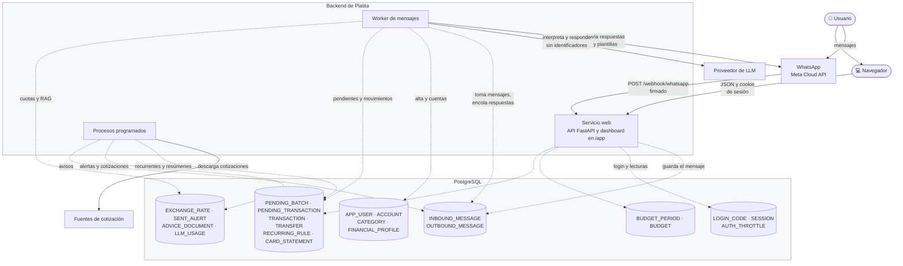
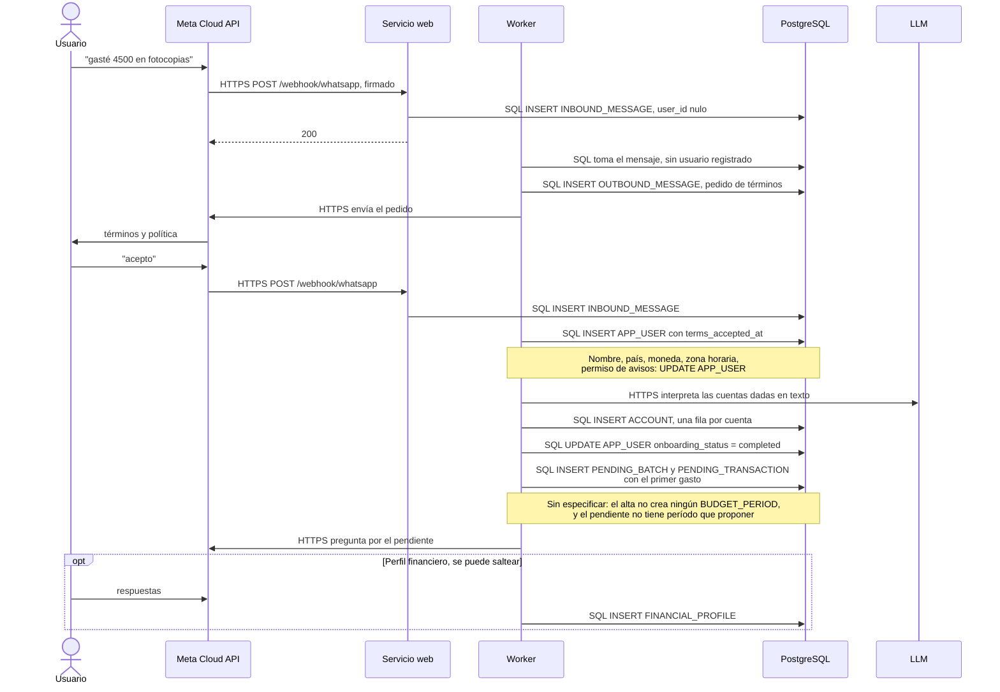
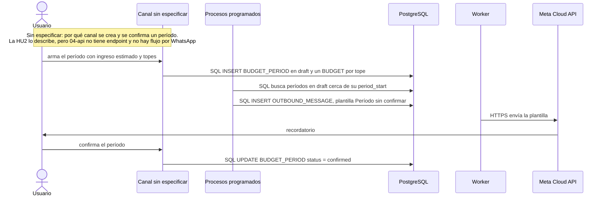
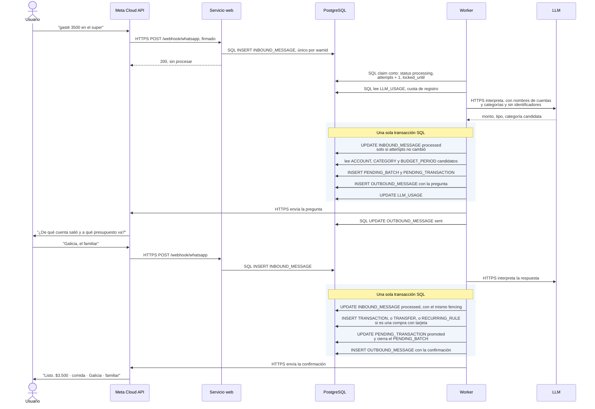
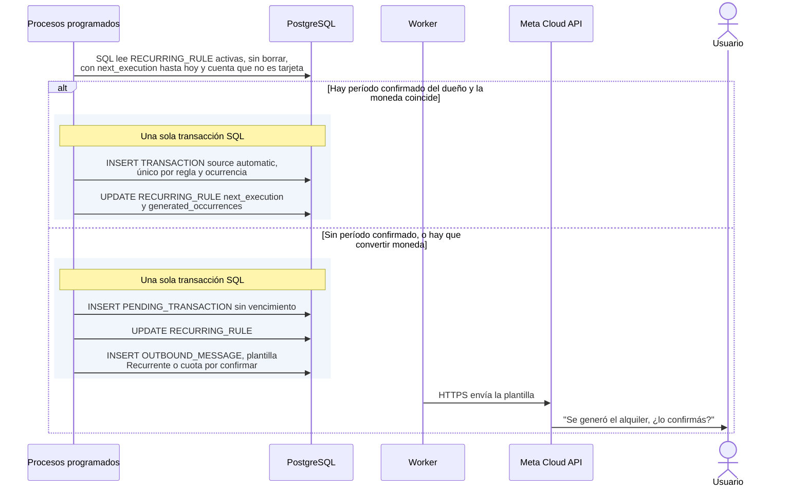
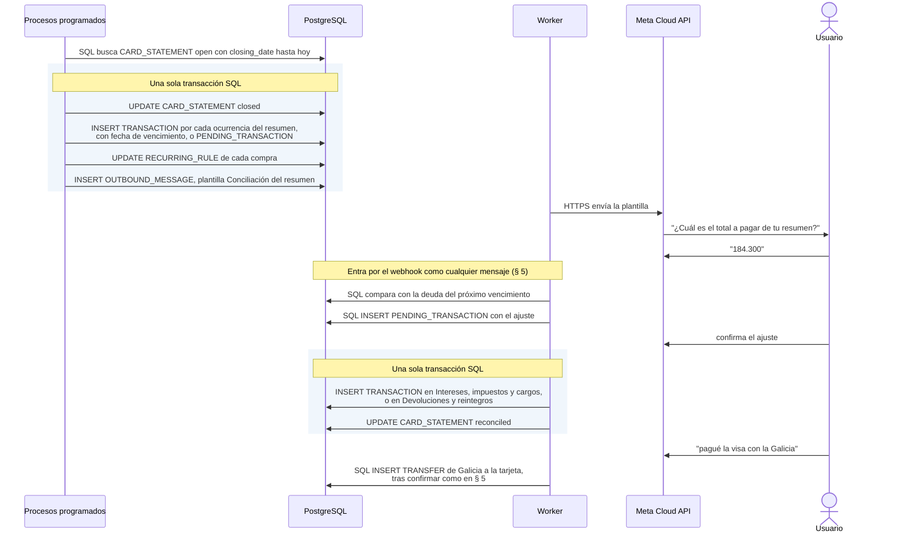
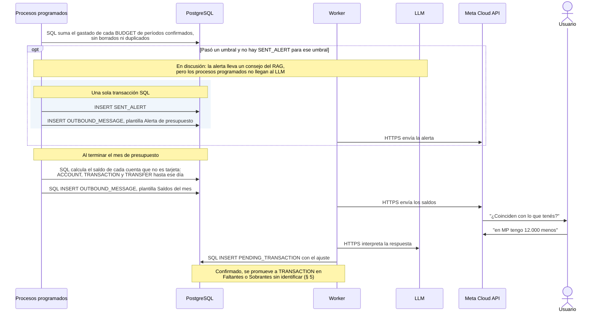
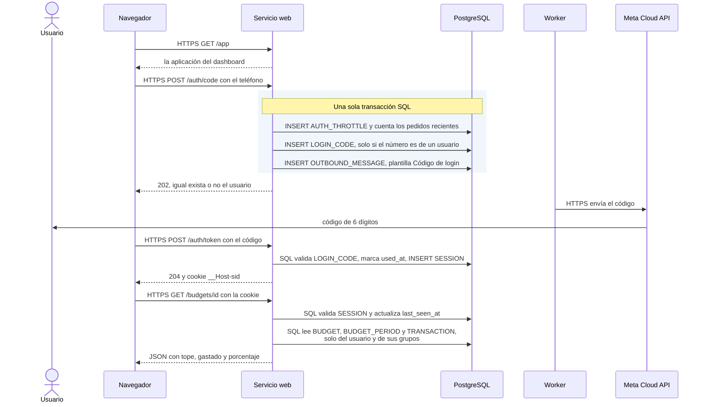
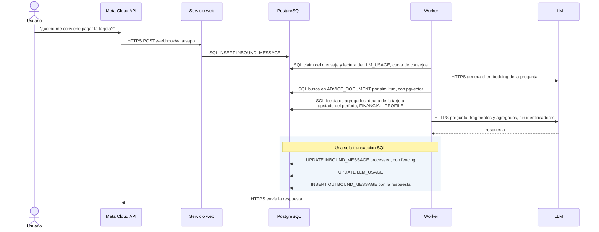

# Recorrido completo

El recorrido de un usuario por Platita de punta a punta, desde el primer mensaje hasta el
consejo. En cada paso se ve qué proceso actúa, cómo se hace la llamada y qué tablas se leen o se
escriben. No agrega reglas: las reglas están en [reglas de dominio](reglas-de-dominio.md), las
tablas en el [modelo de datos](03-modelo-de-datos.md) y los contratos en [la API](04-api.md).
Cuando un paso no está especificado, el diagrama lo marca en vez de completarlo.

## 1. Cómo se habla cada pieza

Hay dos formas de llamada y ninguna más:

| Tipo de llamada | Entre quiénes | Cómo |
|---|---|---|
| **HTTPS** | Todo lo que cruza el borde de Platita: el navegador con la API, Meta con el webhook, el worker con Meta y con el proveedor de LLM, los procesos programados con las fuentes de cotización | Requests HTTP con TLS. Meta firma lo que envía y el navegador lleva la cookie de sesión |
| **SQL** | Los tres procesos del backend con PostgreSQL | Siempre a través de un caso de uso y un repositorio. Ningún proceso del backend llama a otro por HTTP: se coordinan por tablas |

Los tres procesos del backend son el servicio web (la API, que además sirve el dashboard), el
worker de mensajes y los procesos programados. La regla completa está en el
[ADR 0001](adr/0001-arquitectura-hexagonal.md).

Dos tablas hacen de cola entre procesos: `INBOUND_MESSAGE`, de la API al worker, y
`OUTBOUND_MESSAGE`, de cualquier proceso al worker, que es el único que envía mensajes
([ADR 0010](adr/0010-webhook-asincrono-con-tabla-de-entrada.md)).

## 2. Vista general

Las seis etapas y quién actúa en cada una. Las flechas continuas son HTTPS y las punteadas, SQL.

| Etapa | Por dónde entra | Quién la procesa | Qué escribe | Detalle |
|---|---|---|---|---|
| 1. Alta | WhatsApp | Worker | `APP_USER`, `ACCOUNT`, `FINANCIAL_PROFILE` | [§ 3](#3-alta) |
| 2. Presupuesto del período | Sin especificar | Sin especificar | `BUDGET_PERIOD`, `BUDGET` | [§ 4](#4-presupuesto-del-período) |
| 3. Registro diario | WhatsApp o dashboard | Worker o API | `PENDING_*`, luego `TRANSACTION`, `TRANSFER` o `RECURRING_RULE` | [§ 5](#5-registro-de-un-movimiento-por-whatsapp) |
| 4. Lo que corre solo | Una hora del día | Procesos programados | `TRANSACTION` o `PENDING_TRANSACTION`, `CARD_STATEMENT`, `EXCHANGE_RATE` | [§ 6](#6-recurrentes-y-cuotas-de-tarjeta) y [§ 7](#7-cierre-y-conciliación-de-un-resumen) |
| 5. Avisos y contrastes | Una hora del día | Procesos programados, y el worker para las respuestas | `SENT_ALERT`, `OUTBOUND_MESSAGE`, ajustes en `TRANSACTION` | [§ 8](#8-alertas-y-contraste-mensual-de-saldos) |
| 6. Consulta y consejos | Navegador o WhatsApp | API o worker | `SESSION`, `LLM_USAGE` | [§ 9](#9-dashboard) y [§ 10](#10-consejo-por-whatsapp) |

## 3. Alta

El primer contacto de un número desconocido. Hasta que acepta los términos, solo existe su
mensaje en `INBOUND_MESSAGE`, y no se procesa con IA
([reglas de dominio § 11](reglas-de-dominio.md#11-alta-de-usuario-consentimiento-y-mensajes-proactivos)).

## 4. Presupuesto del período

El período tiene que estar confirmado antes de que empiece, y solo un período confirmado recibe
movimientos ([reglas de dominio § 3](reglas-de-dominio.md#3-presupuestos-individual-o-familiar-períodos-y-confirmación-previa-al-inicio)).

## 5. Registro de un movimiento por WhatsApp

El camino más frecuente. La versión centrada en la experiencia está en
[1.3](01-producto.md#13-diseño-y-experiencia-de-usuario); esta muestra procesos y tablas.

Desde el dashboard, el mismo movimiento entra por `POST /transactions` y el servicio web escribe
`TRANSACTION` en una sola transacción SQL, sin pendiente, porque la pantalla ya pidió todos los
datos ([la API](04-api.md)). Que el dashboard sea un canal de carga está en discusión: el
[ADR 0002](adr/0002-whatsapp-como-canal-principal.md) dice que no.

## 6. Recurrentes y cuotas de tarjeta

Lo que genera un proceso programado sin que el usuario escriba nada
([reglas de dominio § 8](reglas-de-dominio.md#8-movimientos-recurrentes-la-excepción-a-la-confirmación)).
Las reglas sobre una tarjeta no se generan en su fecha: esperan al cierre del resumen (§ 7).

## 7. Cierre y conciliación de un resumen

La tarjeta es una cuenta, cada compra es una regla y pagar el resumen es una transferencia
([reglas de dominio § 13](reglas-de-dominio.md#13-tarjetas-de-crédito-y-transferencias)).

## 8. Alertas y contraste mensual de saldos

Dos avisos que inicia Platita, solo si el usuario dio permiso
([reglas de dominio § 11](reglas-de-dominio.md#11-alta-de-usuario-consentimiento-y-mensajes-proactivos)).

## 9. Dashboard

El dashboard es una aplicación que el servicio web sirve bajo `/app`, en el mismo origen que la
API. No tiene acceso a la base: todo lo que muestra lo pide por HTTPS
([ADR 0016](adr/0016-sesion-de-servidor-en-el-mismo-origen.md)).

## 10. Consejo por WhatsApp

Una pregunta financiera usa la otra cuota diaria y la base de conocimiento
([reglas de dominio § 12](reglas-de-dominio.md#12-límites-de-uso-del-asistente)). El modelo nunca
consulta la base: recibe solo lo que el caso de uso le envía
([ADR 0013](adr/0013-datos-minimos-al-proveedor-de-llm.md)).

## 11. Lo que el recorrido deja a la vista

Los diagramas marcan cuatro puntos que la especificación todavía no resuelve:

- **El alta no crea un período** (§ 3). El primer gasto queda pendiente sin un período que
  proponer.
- **No hay canal para armar y confirmar un período** (§ 4). La HU2 lo pide, pero no hay endpoint
  en [la API](04-api.md) ni un flujo por WhatsApp.
- **Las alertas usan el LLM, pero los procesos programados no llegan a él** (§ 8). Ya está en
  las decisiones abiertas de la [hoja de ruta](hoja-de-ruta.md#decisiones-abiertas).
- **El dashboard como canal de carga** (§ 5). El ADR 0002 y la API dicen cosas distintas.

El alta de cuentas desde el dashboard, que pide la HU1, tampoco tiene endpoint en
[la API](04-api.md), que por ahora documenta solo los endpoints principales.
