# Recorrido completo

El recorrido de un usuario por Platita de punta a punta, desde el primer mensaje hasta el
consejo. En cada paso se ve qué proceso actúa, cómo se hace la llamada y qué tablas se leen o se
escriben. No agrega reglas: las reglas están en [reglas de dominio](reglas-de-dominio.md), las
tablas en el [modelo de datos](03-modelo-de-datos.md) y los contratos en [la API](04-api.md).
Cuando un paso no está especificado, el diagrama lo marca en vez de completarlo.

## 1. Cómo se habla cada pieza

Hay dos formas de llamada y ninguna más:

| Tipo de llamada | Entre quiénes | Cómo |
|---|---|---|
| **HTTPS** | Todo lo que cruza el borde de Platita: el navegador con la API, Meta con el webhook, el worker con Meta, con el proveedor de LLM y con el de embeddings, los procesos programados con las fuentes de cotización | Requests HTTP con TLS. Meta firma lo que envía y el navegador lleva la cookie de sesión |
| **SQL** | Los tres procesos del backend con PostgreSQL | Siempre a través de un caso de uso y un repositorio. Ningún proceso del backend llama a otro por HTTP: se coordinan por tablas |

Los tres procesos del backend son el servicio web (la API, que además sirve el dashboard), el
worker de mensajes y los procesos programados. La regla completa está en el
[ADR 0001](adr/0001-arquitectura-hexagonal.md).

Dos tablas hacen de cola entre procesos: `INBOUND_MESSAGE`, de la API al worker, y
`OUTBOUND_MESSAGE`, de cualquier proceso al worker, que es el único que envía mensajes
([ADR 0010](adr/0010-webhook-asincrono-con-tabla-de-entrada.md)). El chat web de desarrollo usa
las mismas dos tablas: la API guarda lo que el usuario escribe y lee lo que el worker respondió
([§ 5](#5-registro-de-un-movimiento-por-whatsapp)).

## 2. Vista general

Las seis etapas y quién actúa en cada una. Las flechas continuas son HTTPS y las punteadas, SQL.

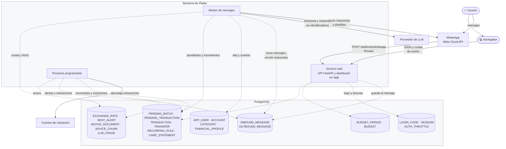
```mermaid
flowchart TB
    U(["👤 Usuario"])
    META["WhatsApp<br/>Meta Cloud API"]
    NAV(["💻 Navegador"])
    LLM["Proveedor de LLM"]
    FX["Fuentes de cotización"]

    subgraph BACKEND["Backend de Platita"]
        API["Servicio web<br/>API FastAPI y dashboard en /app"]
        WK["Worker de mensajes"]
        SCH["Procesos programados"]
    end

    subgraph DB["PostgreSQL"]
        COLAS[("INBOUND_MESSAGE<br/>OUTBOUND_MESSAGE")]
        USUARIO[("APP_USER · ACCOUNT<br/>CATEGORY · FINANCIAL_PROFILE")]
        PRESU[("BUDGET_PERIOD · BUDGET")]
        MOV[("PENDING_BATCH · PENDING_TRANSACTION<br/>TRANSACTION · TRANSFER<br/>RECURRING_RULE · CARD_STATEMENT")]
        APOYO[("EXCHANGE_RATE · SENT_ALERT<br/>ADVICE_DOCUMENT · ADVICE_CHUNK<br/>LLM_USAGE")]
        ACCESO[("LOGIN_CODE · SESSION<br/>AUTH_THROTTLE")]
    end

    U -->|"mensajes"| META
    META -->|"POST /webhook/whatsapp<br/>firmado"| API
    WK -->|"envía respuestas<br/>y plantillas"| META
    WK -->|"interpreta y responde<br/>sin identificadores"| LLM
    SCH -->|"descarga cotizaciones"| FX
    U --> NAV
    NAV -->|"JSON y cookie<br/>de sesión"| API

    API -.->|"guarda el mensaje"| COLAS
    API -.->|"login y lecturas"| ACCESO
    API -.-> PRESU
    API -.-> MOV
    WK -.->|"toma mensajes,<br/>encola respuestas"| COLAS
    WK -.->|"alta y cuentas"| USUARIO
    WK -.->|"pendientes y movimientos"| MOV
    WK -.->|"cuotas y RAG"| APOYO
    SCH -.->|"recurrentes y resúmenes"| MOV
    SCH -.->|"alertas y cotizaciones"| APOYO
    SCH -.->|"avisos"| COLAS

    style BACKEND fill:#f6f8fa,stroke:#8b949e
    style DB fill:#f6f8fa,stroke:#8b949e
```

| Etapa | Por dónde entra | Quién la procesa | Qué escribe | Detalle |
|---|---|---|---|---|
| 1. Alta | WhatsApp | Worker | `APP_USER`, `ACCOUNT`, el primer `BUDGET_PERIOD`, `FINANCIAL_PROFILE` | [§ 3](#3-alta) |
| 2. Presupuesto del período | Una hora del día, WhatsApp o dashboard | Procesos programados, worker o API | `BUDGET_PERIOD`, `BUDGET` | [§ 4](#4-presupuesto-del-período) |
| 3. Registro diario | WhatsApp, chat web o dashboard | Worker o API | `PENDING_*`, luego `TRANSACTION`, `TRANSFER` o `RECURRING_RULE` | [§ 5](#5-registro-de-un-movimiento-por-whatsapp) |
| 4. Lo que corre solo | Una hora del día | Procesos programados | `TRANSACTION` o `PENDING_TRANSACTION`, `CARD_STATEMENT`, `EXCHANGE_RATE` | [§ 6](#6-recurrentes-y-cuotas-de-tarjeta) y [§ 7](#7-cierre-y-conciliación-de-un-resumen) |
| 5. Avisos y contrastes | Una hora del día | Procesos programados, y el worker para las respuestas | `SENT_ALERT`, `OUTBOUND_MESSAGE`, ajustes en `TRANSACTION` | [§ 8](#8-alertas-y-contraste-mensual-de-saldos) |
| 6. Consulta y consejos | Navegador o WhatsApp | API o worker | `SESSION`, `LLM_USAGE` | [§ 9](#9-dashboard), [§ 10](#10-consejo-por-whatsapp) y [§ 12](#12-pregunta-sobre-los-propios-datos) |
| Corregir, borrar o restaurar | WhatsApp o dashboard | Worker o API | `PENDING_TRANSACTION` de tipo cambio, luego el movimiento corregido | [§ 11](#11-corregir-o-borrar-por-whatsapp) |

## 3. Alta

El primer contacto de un número habilitado que todavía no es usuario. Hasta que acepta los
términos, solo existe su mensaje en `INBOUND_MESSAGE`, y no se procesa con IA
([reglas de dominio § 11](reglas-de-dominio.md#11-alta-de-usuario-consentimiento-y-mensajes-proactivos)).

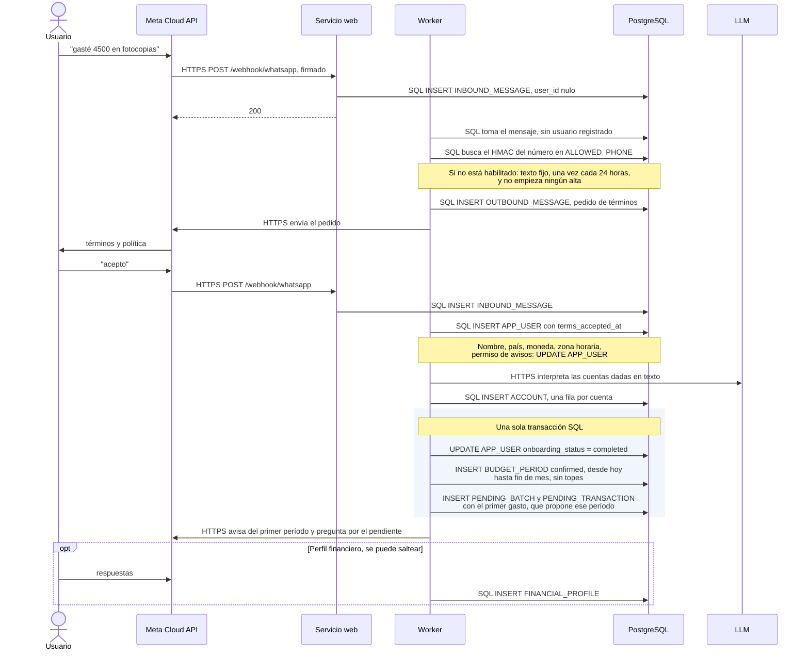
```mermaid
sequenceDiagram
    actor U as Usuario
    participant M as Meta Cloud API
    participant API as Servicio web
    participant W as Worker
    participant DB as PostgreSQL
    participant L as LLM

    U->>M: "gasté 4500 en fotocopias"
    M->>API: HTTPS POST /webhook/whatsapp, firmado
    API->>DB: SQL INSERT INBOUND_MESSAGE, user_id nulo
    API-->>M: 200
    W->>DB: SQL toma el mensaje, sin usuario registrado
    W->>DB: SQL busca el HMAC del número en ALLOWED_PHONE
    Note over W,DB: Si no está habilitado: texto fijo, una vez cada 24 horas,<br/>y no empieza ningún alta
    W->>DB: SQL INSERT OUTBOUND_MESSAGE, pedido de términos
    W->>M: HTTPS envía el pedido
    M->>U: términos y política
    U->>M: "acepto"
    M->>API: HTTPS POST /webhook/whatsapp
    API->>DB: SQL INSERT INBOUND_MESSAGE
    W->>DB: SQL INSERT APP_USER con terms_accepted_at
    Note over W,DB: Nombre, país, moneda, zona horaria,<br/>permiso de avisos: UPDATE APP_USER
    W->>L: HTTPS interpreta las cuentas dadas en texto
    W->>DB: SQL INSERT ACCOUNT, una fila por cuenta
    rect rgb(240, 246, 252)
        Note over W,DB: Una sola transacción SQL
        W->>DB: UPDATE APP_USER onboarding_status = completed
        W->>DB: INSERT BUDGET_PERIOD confirmed, desde hoy<br/>hasta fin de mes, sin topes
        W->>DB: INSERT PENDING_BATCH y PENDING_TRANSACTION<br/>con el primer gasto, que propone ese período
    end
    W->>M: HTTPS avisa del primer período y pregunta por el pendiente
    opt Perfil financiero, se puede saltear
        U->>M: respuestas
        W->>DB: SQL INSERT FINANCIAL_PROFILE
    end
```

## 4. Presupuesto del período

Los períodos siguientes al primero. El borrador se genera solo y se confirma por WhatsApp tal
cual, o se arma y se confirma en el dashboard. En un período familiar, todo eso lo hace solo el
dueño del grupo ([reglas de dominio § 3](reglas-de-dominio.md#3-presupuestos-individual-o-familiar-períodos-y-confirmación-previa-al-inicio)).

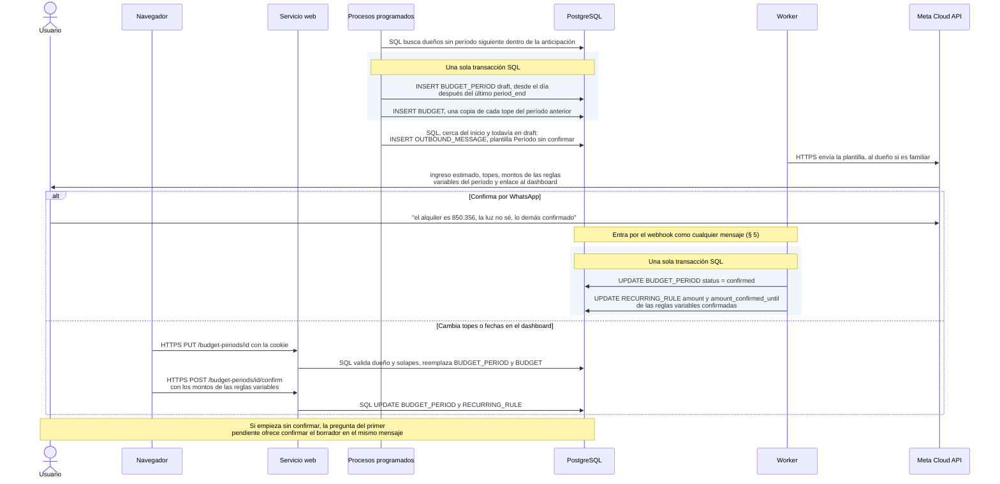
```mermaid
sequenceDiagram
    actor U as Usuario
    participant N as Navegador
    participant API as Servicio web
    participant S as Procesos programados
    participant DB as PostgreSQL
    participant W as Worker
    participant M as Meta Cloud API

    S->>DB: SQL busca dueños sin período siguiente dentro de la anticipación
    rect rgb(240, 246, 252)
        Note over S,DB: Una sola transacción SQL
        S->>DB: INSERT BUDGET_PERIOD draft, desde el día<br/>después del último period_end
        S->>DB: INSERT BUDGET, una copia de cada tope del período anterior
    end
    S->>DB: SQL, cerca del inicio y todavía en draft:<br/>INSERT OUTBOUND_MESSAGE, plantilla Período sin confirmar
    W->>M: HTTPS envía la plantilla, al dueño si es familiar
    M->>U: ingreso estimado, topes, montos de las reglas<br/>variables del período y enlace al dashboard
    alt Confirma por WhatsApp
        U->>M: "el alquiler es 850.356, la luz no sé, lo demás confirmado"
        Note over W,DB: Entra por el webhook como cualquier mensaje (§ 5)
        rect rgb(240, 246, 252)
            Note over W,DB: Una sola transacción SQL
            W->>DB: UPDATE BUDGET_PERIOD status = confirmed
            W->>DB: UPDATE RECURRING_RULE amount y amount_confirmed_until<br/>de las reglas variables confirmadas
        end
    else Cambia topes o fechas en el dashboard
        N->>API: HTTPS PUT /budget-periods/id con la cookie
        API->>DB: SQL valida dueño y solapes, reemplaza BUDGET_PERIOD y BUDGET
        N->>API: HTTPS POST /budget-periods/id/confirm<br/>con los montos de las reglas variables
        API->>DB: SQL UPDATE BUDGET_PERIOD y RECURRING_RULE
    end
    Note over U,DB: Si empieza sin confirmar, la pregunta del primer<br/>pendiente ofrece confirmar el borrador en el mismo mensaje
```

## 5. Registro de un movimiento por WhatsApp

El camino más frecuente. La versión centrada en la experiencia está en
[1.3](01-producto.md#13-diseño-y-experiencia-de-usuario); esta muestra procesos y tablas.

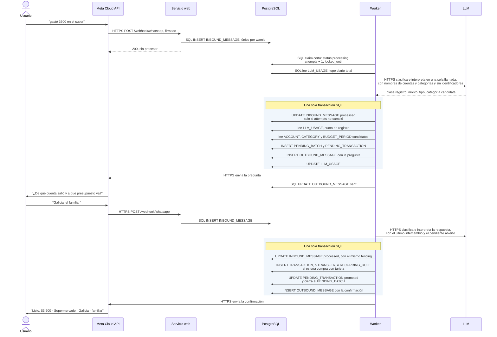
```mermaid
sequenceDiagram
    actor U as Usuario
    participant M as Meta Cloud API
    participant API as Servicio web
    participant DB as PostgreSQL
    participant W as Worker
    participant L as LLM

    U->>M: "gasté 3500 en el super"
    M->>API: HTTPS POST /webhook/whatsapp, firmado
    API->>DB: SQL INSERT INBOUND_MESSAGE, único por wamid
    API-->>M: 200, sin procesar
    W->>DB: SQL claim corto: status processing,<br/>attempts + 1, locked_until
    W->>DB: SQL lee LLM_USAGE, tope diario total
    W->>L: HTTPS clasifica e interpreta en una sola llamada,<br/>con nombres de cuentas y categorías y sin identificadores
    L-->>W: clase registro: monto, tipo, categoría candidata
    rect rgb(240, 246, 252)
        Note over W,DB: Una sola transacción SQL
        W->>DB: UPDATE INBOUND_MESSAGE processed<br/>solo si attempts no cambió
        W->>DB: lee LLM_USAGE, cuota de registro
        W->>DB: lee ACCOUNT, CATEGORY y BUDGET_PERIOD candidatos
        W->>DB: INSERT PENDING_BATCH y PENDING_TRANSACTION
        W->>DB: INSERT OUTBOUND_MESSAGE con la pregunta
        W->>DB: UPDATE LLM_USAGE
    end
    W->>M: HTTPS envía la pregunta
    W->>DB: SQL UPDATE OUTBOUND_MESSAGE sent
    M->>U: "¿De qué cuenta salió y a qué presupuesto va?"
    U->>M: "Galicia, el familiar"
    M->>API: HTTPS POST /webhook/whatsapp
    API->>DB: SQL INSERT INBOUND_MESSAGE
    W->>L: HTTPS clasifica e interpreta la respuesta,<br/>con el último intercambio y el pendiente abierto
    rect rgb(240, 246, 252)
        Note over W,DB: Una sola transacción SQL
        W->>DB: UPDATE INBOUND_MESSAGE processed, con el mismo fencing
        W->>DB: INSERT TRANSACTION, o TRANSFER, o RECURRING_RULE<br/>si es una compra con tarjeta
        W->>DB: UPDATE PENDING_TRANSACTION promoted<br/>y cierra el PENDING_BATCH
        W->>DB: INSERT OUTBOUND_MESSAGE con la confirmación
    end
    W->>M: HTTPS envía la confirmación
    M->>U: "Listo. $3.500 · Supermercado · Galicia · familiar"
```

Si la cuota de registro está agotada, o el tope diario total alcanzado, no hay efectos: el
mensaje vuelve a `pending` para el día siguiente, se encola el texto fijo y los mensajes
posteriores del remitente se siguen procesando
([reglas de dominio § 12](reglas-de-dominio.md#12-límites-de-uso-del-asistente)).

Desde el formulario del dashboard, el mismo movimiento entra por `POST /transactions` y el
servicio web escribe `TRANSACTION` en una sola transacción SQL, sin pendiente, porque la pantalla
ya pidió todos los datos ([la API](04-api.md)). Una transferencia entra igual por
`POST /transfers`. Las compras con tarjeta y las reglas recurrentes se cargan solo conversando
([ADR 0002](adr/0002-whatsapp-como-canal-principal.md)).

### Por el chat web

El chat web de desarrollo recorre el mismo camino. Cambian solo los bordes: quién guarda el
mensaje y cómo llega la respuesta. El worker, las tablas y las transacciones son los de arriba.

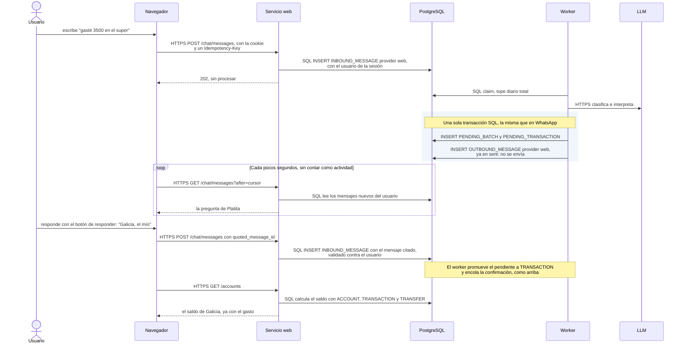
```mermaid
sequenceDiagram
    actor U as Usuario
    participant N as Navegador
    participant API as Servicio web
    participant DB as PostgreSQL
    participant W as Worker
    participant L as LLM

    U->>N: escribe "gasté 3500 en el super"
    N->>API: HTTPS POST /chat/messages, con la cookie<br/>y un Idempotency-Key
    API->>DB: SQL INSERT INBOUND_MESSAGE provider web,<br/>con el usuario de la sesión
    API-->>N: 202, sin procesar
    W->>DB: SQL claim, tope diario total
    W->>L: HTTPS clasifica e interpreta
    rect rgb(240, 246, 252)
        Note over W,DB: Una sola transacción SQL, la misma que en WhatsApp
        W->>DB: INSERT PENDING_BATCH y PENDING_TRANSACTION
        W->>DB: INSERT OUTBOUND_MESSAGE provider web,<br/>ya en sent: no se envía
    end
    loop Cada pocos segundos, sin contar como actividad
        N->>API: HTTPS GET /chat/messages?after=cursor
        API->>DB: SQL lee los mensajes nuevos del usuario
        API-->>N: la pregunta de Platita
    end
    U->>N: responde con el botón de responder: "Galicia, el mío"
    N->>API: HTTPS POST /chat/messages con quoted_message_id
    API->>DB: SQL INSERT INBOUND_MESSAGE con el mensaje citado,<br/>validado contra el usuario
    Note over W,DB: El worker promueve el pendiente a TRANSACTION<br/>y encola la confirmación, como arriba
    N->>API: HTTPS GET /accounts
    API->>DB: SQL calcula el saldo con ACCOUNT, TRANSACTION y TRANSFER
    API-->>N: el saldo de Galicia, ya con el gasto
```

## 6. Recurrentes y cuotas de tarjeta

Lo que genera un proceso programado sin que el usuario escriba nada
([reglas de dominio § 8](reglas-de-dominio.md#8-movimientos-recurrentes-la-excepción-a-la-confirmación)).
Las reglas sobre una tarjeta no se generan en su fecha: esperan al cierre del resumen (§ 7).

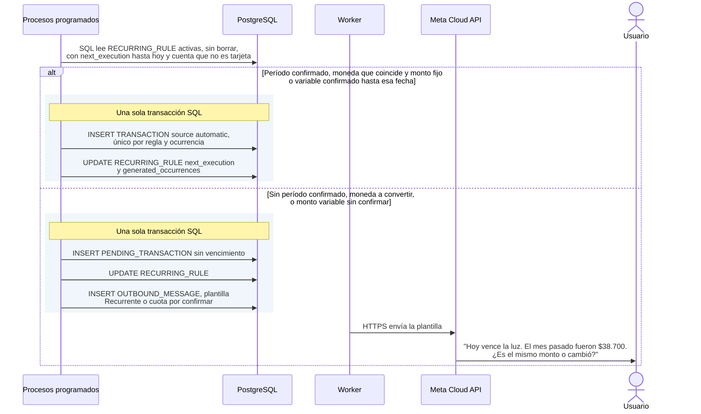
```mermaid
sequenceDiagram
    participant S as Procesos programados
    participant DB as PostgreSQL
    participant W as Worker
    participant M as Meta Cloud API
    actor U as Usuario

    S->>DB: SQL lee RECURRING_RULE activas, sin borrar,<br/>con next_execution hasta hoy y cuenta que no es tarjeta
    alt Período confirmado, moneda que coincide y monto fijo<br/>o variable confirmado hasta esa fecha
        rect rgb(240, 246, 252)
            Note over S,DB: Una sola transacción SQL
            S->>DB: INSERT TRANSACTION source automatic,<br/>único por regla y ocurrencia
            S->>DB: UPDATE RECURRING_RULE next_execution<br/>y generated_occurrences
        end
    else Sin período confirmado, moneda a convertir,<br/>o monto variable sin confirmar
        rect rgb(240, 246, 252)
            Note over S,DB: Una sola transacción SQL
            S->>DB: INSERT PENDING_TRANSACTION sin vencimiento
            S->>DB: UPDATE RECURRING_RULE
            S->>DB: INSERT OUTBOUND_MESSAGE, plantilla<br/>Recurrente o cuota por confirmar
        end
        W->>M: HTTPS envía la plantilla
        M->>U: "Hoy vence la luz. El mes pasado fueron $38.700.<br/>¿Es el mismo monto o cambió?"
    end
```

## 7. Cierre y conciliación de un resumen

La tarjeta es una cuenta, cada compra es una regla y pagar el resumen es una transferencia
([reglas de dominio § 13](reglas-de-dominio.md#13-tarjetas-de-crédito-y-transferencias)).

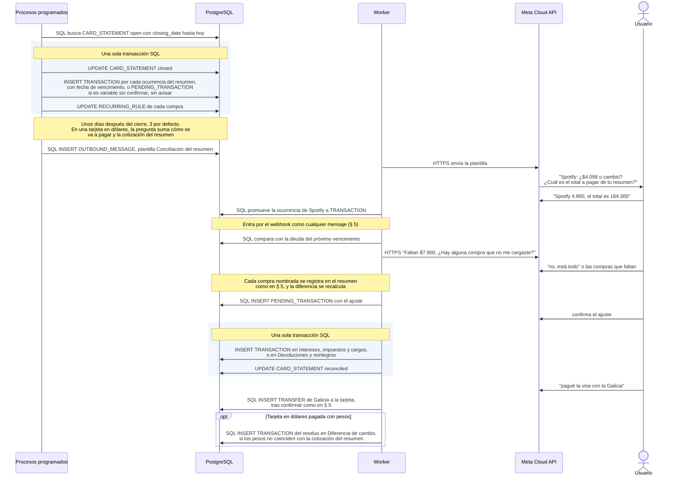
```mermaid
sequenceDiagram
    participant S as Procesos programados
    participant DB as PostgreSQL
    participant W as Worker
    participant M as Meta Cloud API
    actor U as Usuario

    S->>DB: SQL busca CARD_STATEMENT open con closing_date hasta hoy
    rect rgb(240, 246, 252)
        Note over S,DB: Una sola transacción SQL
        S->>DB: UPDATE CARD_STATEMENT closed
        S->>DB: INSERT TRANSACTION por cada ocurrencia del resumen,<br/>con fecha de vencimiento, o PENDING_TRANSACTION<br/>si es variable sin confirmar, sin avisar
        S->>DB: UPDATE RECURRING_RULE de cada compra
    end
    Note over S,DB: Unos días después del cierre, 3 por defecto.<br/>En una tarjeta en dólares, la pregunta suma cómo se<br/>va a pagar y la cotización del resumen
    S->>DB: SQL INSERT OUTBOUND_MESSAGE, plantilla Conciliación del resumen
    W->>M: HTTPS envía la plantilla
    M->>U: "Spotify: ¿$4.058 o cambió?<br/>¿Cuál es el total a pagar de tu resumen?"
    U->>M: "Spotify 4.890, el total es 184.300"
    W->>DB: SQL promueve la ocurrencia de Spotify a TRANSACTION
    Note over W,DB: Entra por el webhook como cualquier mensaje (§ 5)
    W->>DB: SQL compara con la deuda del próximo vencimiento
    W->>M: HTTPS "Faltan $7.900. ¿Hay alguna compra que no me cargaste?"
    U->>M: "no, está todo" o las compras que faltan
    Note over W,DB: Cada compra nombrada se registra en el resumen<br/>como en § 5, y la diferencia se recalcula
    W->>DB: SQL INSERT PENDING_TRANSACTION con el ajuste
    U->>M: confirma el ajuste
    rect rgb(240, 246, 252)
        Note over W,DB: Una sola transacción SQL
        W->>DB: INSERT TRANSACTION en Intereses, impuestos y cargos,<br/>o en Devoluciones y reintegros
        W->>DB: UPDATE CARD_STATEMENT reconciled
    end
    U->>M: "pagué la visa con la Galicia"
    W->>DB: SQL INSERT TRANSFER de Galicia a la tarjeta,<br/>tras confirmar como en § 5
    opt Tarjeta en dólares pagada con pesos
        W->>DB: SQL INSERT TRANSACTION del residuo en Diferencia de cambio,<br/>si los pesos no coinciden con la cotización del resumen
    end
```

## 8. Alertas y contraste mensual de saldos

Dos avisos que inicia Platita, solo si el usuario dio permiso
([reglas de dominio § 11](reglas-de-dominio.md#11-alta-de-usuario-consentimiento-y-mensajes-proactivos)).

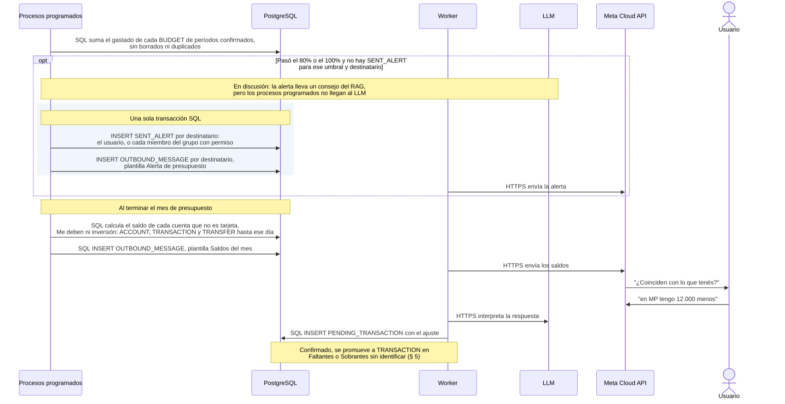
```mermaid
sequenceDiagram
    participant S as Procesos programados
    participant DB as PostgreSQL
    participant W as Worker
    participant L as LLM
    participant M as Meta Cloud API
    actor U as Usuario

    S->>DB: SQL suma el gastado de cada BUDGET de períodos confirmados,<br/>sin borrados ni duplicados
    opt Pasó el 80% o el 100% y no hay SENT_ALERT<br/>para ese umbral y destinatario
        Note over S,L: En discusión: la alerta lleva un consejo del RAG,<br/>pero los procesos programados no llegan al LLM
        rect rgb(240, 246, 252)
            Note over S,DB: Una sola transacción SQL
            S->>DB: INSERT SENT_ALERT por destinatario:<br/>el usuario, o cada miembro del grupo con permiso
            S->>DB: INSERT OUTBOUND_MESSAGE por destinatario,<br/>plantilla Alerta de presupuesto
        end
        W->>M: HTTPS envía la alerta
    end
    Note over S,DB: Al terminar el mes de presupuesto
    S->>DB: SQL calcula el saldo de cada cuenta que no es tarjeta,<br/>Me deben ni inversión: ACCOUNT, TRANSACTION y TRANSFER hasta ese día
    S->>DB: SQL INSERT OUTBOUND_MESSAGE, plantilla Saldos del mes
    W->>M: HTTPS envía los saldos
    M->>U: "¿Coinciden con lo que tenés?"
    U->>M: "en MP tengo 12.000 menos"
    W->>L: HTTPS interpreta la respuesta
    W->>DB: SQL INSERT PENDING_TRANSACTION con el ajuste
    Note over W,DB: Confirmado, se promueve a TRANSACTION en<br/>Faltantes o Sobrantes sin identificar (§ 5)
```

## 9. Dashboard

El dashboard es una aplicación que el servicio web sirve bajo `/app`, en el mismo origen que la
API. No tiene acceso a la base: todo lo que muestra lo pide por HTTPS
([ADR 0016](adr/0016-sesion-de-servidor-en-el-mismo-origen.md)). El diagrama muestra el login por
código, que se construye junto con el adaptador de WhatsApp. Mientras tanto el andamio entra por
`POST /dev/session`, que crea la misma `SESSION`: eligiendo un usuario de prueba en `local`, o con
un enlace personal en `demo`.

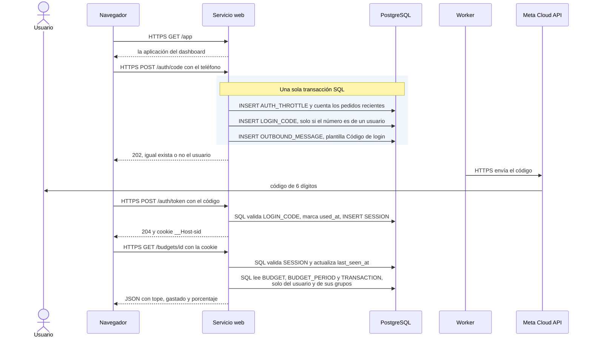
```mermaid
sequenceDiagram
    actor U as Usuario
    participant N as Navegador
    participant API as Servicio web
    participant DB as PostgreSQL
    participant W as Worker
    participant M as Meta Cloud API

    N->>API: HTTPS GET /app
    API-->>N: la aplicación del dashboard
    N->>API: HTTPS POST /auth/code con el teléfono
    rect rgb(240, 246, 252)
        Note over API,DB: Una sola transacción SQL
        API->>DB: INSERT AUTH_THROTTLE y cuenta los pedidos recientes
        API->>DB: INSERT LOGIN_CODE, solo si el número es de un usuario
        API->>DB: INSERT OUTBOUND_MESSAGE, plantilla Código de login
    end
    API-->>N: 202, igual exista o no el usuario
    W->>M: HTTPS envía el código
    M->>U: código de 6 dígitos
    N->>API: HTTPS POST /auth/token con el código
    API->>DB: SQL valida LOGIN_CODE, marca used_at, INSERT SESSION
    API-->>N: 204 y cookie __Host-sid
    N->>API: HTTPS GET /budgets/id con la cookie
    API->>DB: SQL valida SESSION y actualiza last_seen_at
    API->>DB: SQL lee BUDGET, BUDGET_PERIOD y TRANSACTION,<br/>solo del usuario y de sus grupos
    API-->>N: JSON con tope, gastado y porcentaje
```

## 10. Consejo por WhatsApp

Una pregunta financiera usa la cuota diaria de consejos y la base de conocimiento
([reglas de dominio § 12](reglas-de-dominio.md#12-límites-de-uso-del-asistente)). El modelo nunca
consulta la base: recibe solo lo que el caso de uso le envía
([ADR 0013](adr/0013-datos-minimos-al-proveedor-de-llm.md)).

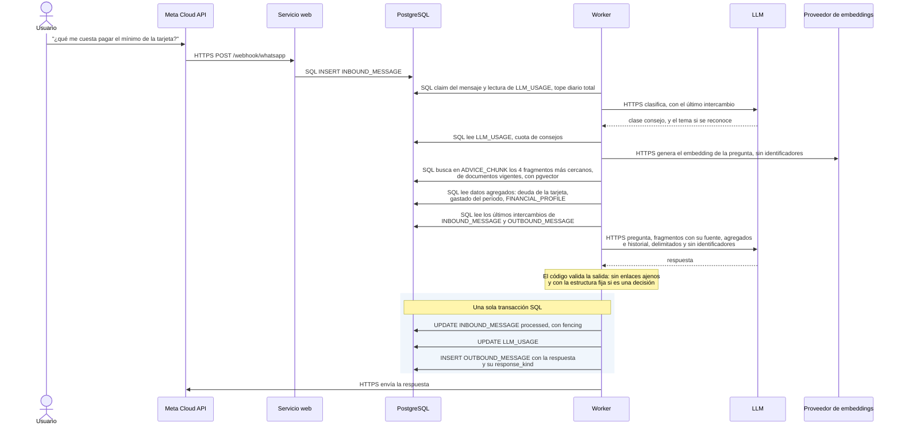
```mermaid
sequenceDiagram
    actor U as Usuario
    participant M as Meta Cloud API
    participant API as Servicio web
    participant DB as PostgreSQL
    participant W as Worker
    participant L as LLM
    participant E as Proveedor de embeddings

    U->>M: "¿qué me cuesta pagar el mínimo de la tarjeta?"
    M->>API: HTTPS POST /webhook/whatsapp
    API->>DB: SQL INSERT INBOUND_MESSAGE
    W->>DB: SQL claim del mensaje y lectura de LLM_USAGE, tope diario total
    W->>L: HTTPS clasifica, con el último intercambio
    L-->>W: clase consejo, y el tema si se reconoce
    W->>DB: SQL lee LLM_USAGE, cuota de consejos
    W->>E: HTTPS genera el embedding de la pregunta, sin identificadores
    W->>DB: SQL busca en ADVICE_CHUNK los 4 fragmentos más cercanos,<br/>de documentos vigentes, con pgvector
    W->>DB: SQL lee datos agregados: deuda de la tarjeta,<br/>gastado del período, FINANCIAL_PROFILE
    W->>DB: SQL lee los últimos intercambios de<br/>INBOUND_MESSAGE y OUTBOUND_MESSAGE
    W->>L: HTTPS pregunta, fragmentos con su fuente, agregados<br/>e historial, delimitados y sin identificadores
    L-->>W: respuesta
    Note over W: El código valida la salida: sin enlaces ajenos<br/>y con la estructura fija si es una decisión
    rect rgb(240, 246, 252)
        Note over W,DB: Una sola transacción SQL
        W->>DB: UPDATE INBOUND_MESSAGE processed, con fencing
        W->>DB: UPDATE LLM_USAGE
        W->>DB: INSERT OUTBOUND_MESSAGE con la respuesta<br/>y su response_kind
    end
    W->>M: HTTPS envía la respuesta
```

## 11. Corregir o borrar por WhatsApp

Un movimiento confirmado se señala citando su confirmación o describiéndolo. Por el chat web es
igual, y la cita se hace con el botón de responder. Nunca por ser el último ([reglas de dominio § 15](reglas-de-dominio.md#15-corregir-borrar-y-restaurar-un-movimiento-confirmado)).

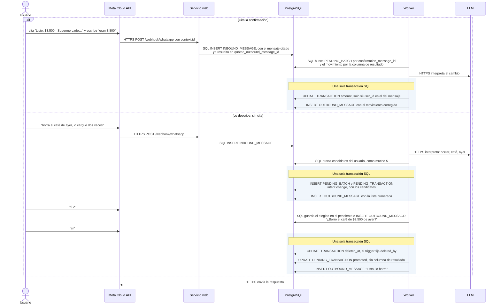
```mermaid
sequenceDiagram
    actor U as Usuario
    participant M as Meta Cloud API
    participant API as Servicio web
    participant DB as PostgreSQL
    participant W as Worker
    participant L as LLM

    alt Cita la confirmación
        U->>M: cita "Listo. $3.500 · Supermercado…" y escribe "eran 3.800"
        M->>API: HTTPS POST /webhook/whatsapp con context.id
        API->>DB: SQL INSERT INBOUND_MESSAGE, con el mensaje citado<br/>ya resuelto en quoted_outbound_message_id
        W->>DB: SQL busca PENDING_BATCH por confirmation_message_id<br/>y el movimiento por la columna de resultado
        W->>L: HTTPS interpreta el cambio
        rect rgb(240, 246, 252)
            Note over W,DB: Una sola transacción SQL
            W->>DB: UPDATE TRANSACTION amount, solo si user_id es el del mensaje
            W->>DB: INSERT OUTBOUND_MESSAGE con el movimiento corregido
        end
    else Lo describe, sin cita
        U->>M: "borrá el café de ayer, lo cargué dos veces"
        M->>API: HTTPS POST /webhook/whatsapp
        API->>DB: SQL INSERT INBOUND_MESSAGE
        W->>L: HTTPS interpreta: borrar, café, ayer
        W->>DB: SQL busca candidatos del usuario, como mucho 5
        rect rgb(240, 246, 252)
            Note over W,DB: Una sola transacción SQL
            W->>DB: INSERT PENDING_BATCH y PENDING_TRANSACTION<br/>intent change, con los candidatos
            W->>DB: INSERT OUTBOUND_MESSAGE con la lista numerada
        end
        U->>M: "el 2"
        W->>DB: SQL guarda el elegido en el pendiente e INSERT OUTBOUND_MESSAGE:<br/>"¿Borro el café de $2.500 de ayer?"
        U->>M: "sí"
        rect rgb(240, 246, 252)
            Note over W,DB: Una sola transacción SQL
            W->>DB: UPDATE TRANSACTION deleted_at, el trigger fija deleted_by
            W->>DB: UPDATE PENDING_TRANSACTION promoted, sin columna de resultado
            W->>DB: INSERT OUTBOUND_MESSAGE "Listo, lo borré"
        end
    end
    W->>M: HTTPS envía la respuesta
```

## 12. Pregunta sobre los propios datos

El modelo no consulta la base: pide datos a funciones de solo lectura, que el caso de uso ejecuta
filtrando por el usuario del mensaje. La misma llamada que clasifica el mensaje ya trae los
primeros pedidos, así que una consulta son dos llamadas al modelo
([ADR 0018](adr/0018-clasificacion-inicial-y-memoria-de-conversacion.md)). Las funciones están
en [reglas de dominio § 17](reglas-de-dominio.md#17-preguntas-sobre-los-propios-datos).

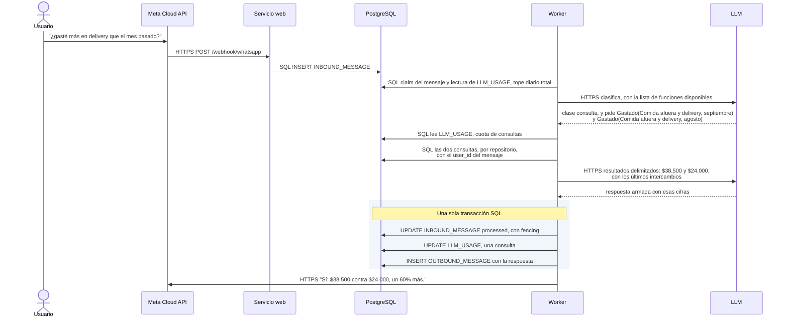
```mermaid
sequenceDiagram
    actor U as Usuario
    participant M as Meta Cloud API
    participant API as Servicio web
    participant DB as PostgreSQL
    participant W as Worker
    participant L as LLM

    U->>M: "¿gasté más en delivery que el mes pasado?"
    M->>API: HTTPS POST /webhook/whatsapp
    API->>DB: SQL INSERT INBOUND_MESSAGE
    W->>DB: SQL claim del mensaje y lectura de LLM_USAGE, tope diario total
    W->>L: HTTPS clasifica, con la lista de funciones disponibles
    L-->>W: clase consulta, y pide Gastado(Comida afuera y delivery, septiembre)<br/>y Gastado(Comida afuera y delivery, agosto)
    W->>DB: SQL lee LLM_USAGE, cuota de consultas
    W->>DB: SQL las dos consultas, por repositorio,<br/>con el user_id del mensaje
    W->>L: HTTPS resultados delimitados: $38.500 y $24.000,<br/>con los últimos intercambios
    L-->>W: respuesta armada con esas cifras
    rect rgb(240, 246, 252)
        Note over W,DB: Una sola transacción SQL
        W->>DB: UPDATE INBOUND_MESSAGE processed, con fencing
        W->>DB: UPDATE LLM_USAGE, una consulta
        W->>DB: INSERT OUTBOUND_MESSAGE con la respuesta
    end
    W->>M: HTTPS "Sí: $38.500 contra $24.000, un 60% más."
```

## 13. Lo que el recorrido deja a la vista

Los diagramas marcan dos puntos que la especificación todavía no resuelve:

- **Las alertas usan el LLM, pero los procesos programados no llegan a él** (§ 8). Ya está en
  las decisiones abiertas de la [hoja de ruta](hoja-de-ruta.md#decisiones-abiertas).

El alta de cuentas desde el dashboard, que pide la HU1, tampoco tiene endpoint en
[la API](04-api.md), que por ahora documenta solo los endpoints principales.
