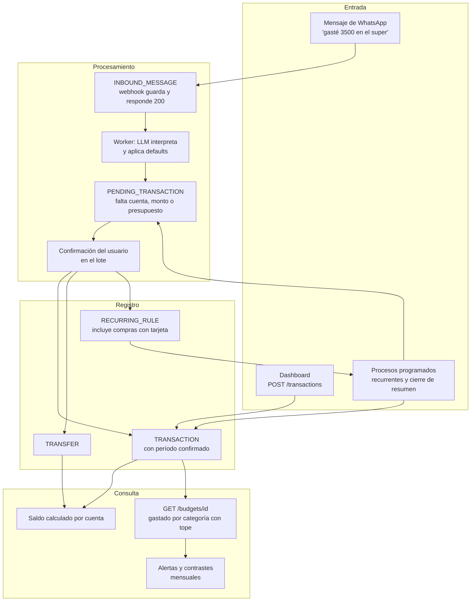

# Platita — Validación de diseño por casos de uso

- **Fecha de la corrida:** 2026-09-25
- **Rama analizada:** `feature/entrega-1-VNZ`, commit `4775459`

> **Esto no es especificación.** Es un registro: el diagnóstico de la especificación tal como
> estaba en la fecha de la corrida. Sus recomendaciones y sus decisiones D1 a D12 son propuestas,
> no reglas. Ninguna se implementa hasta que la autora la decide y la regla se escribe en el
> documento que corresponde —[reglas de dominio](reglas-de-dominio.md), el
> [modelo de datos](03-modelo-de-datos.md) o un ADR—, que es lo que manda. Criterio en
> [`AGENTS.md`](../AGENTS.md) §10.
>
> **Cómo se actualiza.** No se edita a mano: se vuelve a correr el mismo ejercicio, que lee esta
> corrida, la compara y sobrescribe el archivo. Las secciones 6 y 9 sirven de backlog: un caso
> deja de estar abierto cuando cambia la especificación, no cuando se edita este informe. La
> sección 14 explica cómo usar los casos en las pruebas.

**Documentos analizados**

- `AGENTS.md` (y `CLAUDE.md`, que es un enlace simbólico a él)
- `README.md`
- `llms.txt`
- `docs/01-producto.md`
- `docs/02-arquitectura.md`
- `docs/03-modelo-de-datos.md`
- `docs/04-api.md`
- `docs/05-historias-de-usuario.md`
- `docs/06-tickets.md`
- `docs/07-pull-requests.md`
- `docs/08-convenciones-de-documentacion.md`
- `docs/reglas-de-dominio.md`
- `docs/convenciones-de-desarrollo.md`
- `docs/hoja-de-ruta.md`
- `docs/terminos-y-privacidad.md`
- `docs/operacion.md`
- `docs/documentacion-viva.md`
- `docs/flujo-de-trabajo-con-ia.md`
- `docs/conversacion-reestructuracion-docs.md`
- `docs/features/TEMPLATE/` (`spec.md`, `ui_contract.md`, `qa_plan.md`, `pr.md`)
- `docs/adr/0001` a `docs/adr/0017`

No hay diagramas en imagen: todos los diagramas están en Mermaid, dentro de los Markdown. En
`site/` solo se consideró el código fuente del portal, que se genera desde `docs/` y no es
fuente de diseño. `prompts.md` se revisó como contexto, no como especificación.

**Después de esta corrida** cambiaron el ADR 0001, el ADR 0010 y el ADR 0013 (quién accede a la
base, el fencing del worker y el LLM sin acceso a la base), y se agregó
[Recorrido completo](recorrido-completo.md). Ninguno de esos cambios modifica un veredicto de
este informe. El recorrido encontró un hueco nuevo que la próxima corrida tiene que incorporar:
no hay un canal especificado para armar y confirmar un período de presupuesto, y eso agrava la
decisión D1.

---

## 1. Mapa del diseño (Fase 0)

### 1.1. Documentos existentes

| Documento | Qué cubre | Nivel de detalle |
|---|---|---|
| `01-producto.md` | Objetivo, catálogo must/should/could, fuera de alcance y un diagrama de secuencia del registro por WhatsApp | Especificación funcional |
| `reglas-de-dominio.md` | Dueño único de las reglas de negocio, en 14 grupos: registro, saldo, presupuestos, categorías, pendientes, multimoneda, duplicados, recurrentes, origen, grupos familiares, alta, límites, tarjetas y transferencias, privacidad | Especificación funcional detallada, con reglas de borde |
| `03-modelo-de-datos.md` | Diagramas ER por área, 23 entidades con sus columnas y restricciones (`CHECK`, claves compuestas, triggers) | Diseño técnico |
| `04-api.md` | Webhook, `GET /budgets/{id}`, `POST /transactions`, login, exportaciones y borrado de cuenta | Diseño técnico, parcial ("endpoints principales") |
| `05-historias-de-usuario.md` | HU1 a HU6 con criterios de aceptación | Especificación funcional |
| `06-tickets.md` | Tres tickets: webhook e interpretación, vista de presupuesto y esquema inicial | Diseño técnico |
| `02-arquitectura.md` | C4 en tres niveles, componentes, despliegue y seguridad | Diseño técnico |
| `hoja-de-ruta.md` | Pendientes de la entrega 2 y decisiones abiertas | Idea general y registro de decisiones |
| `terminos-y-privacidad.md` | Índice de lo que tienen que cubrir los términos y la política | Idea general |
| `adr/0001` a `0017` | Decisiones de arquitectura. Las que tocan el dominio son la 0011 (cotizaciones), 0012 (tarjetas y transferencias), 0014 (marca de edición) y 0015 (borrado lógico) | Diseño técnico, con alternativas |
| `operacion.md`, `documentacion-viva.md`, `flujo-de-trabajo-con-ia.md`, `convenciones-de-desarrollo.md`, `08-…`, `07-…`, `features/TEMPLATE/` | Operación, método de trabajo y plantillas | No describen comportamiento financiero |

### 1.2. Diseño reconstruido

**Funcionalidades** (`01-producto.md` §1.2):

- **Must-have:**
  - Registro conversacional por WhatsApp, con defaults acotados (fecha, moneda y categoría) y confirmación obligatoria de monto, cuenta y presupuesto.
  - Cuentas con saldo calculado.
  - Transferencias entre cuentas propias.
  - Presupuestos individuales o familiares, con período confirmado.
  - Categorías semi-guiadas.
  - Dashboard.
  - Alta por WhatsApp y login por código.
  - Trazabilidad de origen.
  - Configuración regional.
- **Should-have:**
  - Tarjetas de crédito.
  - Movimientos recurrentes.
  - Consejos con RAG.
  - Multimoneda.
- **Could-have:**
  - Carga desde email.
  - Detección de duplicados.
  - Presupuesto ajustado por inflación.
  - Exportación.

**Entidades centrales** (`03-modelo-de-datos.md` §3.1 y §3.2):

| Entidad | Qué es |
|---|---|
| `ACCOUNT` | Una moneda por cuenta, y el saldo no se guarda |
| `TRANSACTION` | `account_id`, `budget_period_id` y `category_id` son `NOT NULL`; `amount > 0`; una sola `exchange_rate` |
| `BUDGET_PERIOD` y `BUDGET` | El período es individual o familiar, sin solapes, y solo recibe movimientos si está `confirmed`. `BUDGET` es el tope por categoría |
| `CATEGORY` | Base o propia; `kind` es gasto o ingreso |
| `RECURRING_RULE` | Monto fijo, dueño de presupuesto fijo, con fin opcional. También representa las compras con tarjeta |
| `CARD_STATEMENT` | Resumen de una tarjeta |
| `TRANSFER` | Movimiento entre cuentas propias |
| `PENDING_TRANSACTION` y `PENDING_BATCH` | Movimientos a medio completar y los lotes en que se preguntan |
| `FINANCIAL_PROFILE` | Perfil financiero opcional |
| `ADVICE_DOCUMENT` | Base de conocimiento de los consejos |
| `EXCHANGE_RATE` | Historial de cotizaciones |

**Flujo central: cómo entra, cómo se guarda y cómo se consulta un dato**

**Cómo entra un movimiento.** El mensaje se guarda en `INBOUND_MESSAGE` y un worker lo interpreta
(ADR 0010, `06-tickets.md` Ticket 1). La fecha y la moneda se completan solas, y la categoría se
resuelve contra el catálogo. La cuenta, el monto y el presupuesto se confirman siempre. Mientras
falte algo, el movimiento es un `PENDING_TRANSACTION` que vive en un lote numerado; con todo
confirmado se promueve a `TRANSACTION`, `TRANSFER` o `RECURRING_RULE` (`reglas-de-dominio.md`
§1 y §5). Las reglas recurrentes generan el movimiento completo sin preguntar (§8). Las compras
con tarjeta son reglas que se generan al cerrar el resumen, con fecha de vencimiento (§13).

**Cómo se guarda y se corrige.** Cada movimiento se guarda con su moneda de origen y una sola
cotización (§6, ADR 0011). Una corrección se marca con `updated_at` y `updated_by` (ADR 0014), y
un borrado es lógico (ADR 0015).

**Cómo se consulta.** Hay tres vías:

- **Saldo:** se calcula con fecha hasta hoy (§2).
- **Gastado por categoría con tope:** `GET /budgets/{id}` (`04-api.md`) alimenta la vista de la
  HU4.
- **Contrastes:** alertas por umbral (HU5), el contraste mensual de saldos (§2) y la conciliación
  de cada resumen de tarjeta (§13).

### 1.3. Áreas sin cobertura

Ningún documento trata estos temas:

1. **Consultas de datos por WhatsApp**, como "¿cuánto gasté en delivery?" o "¿cuánto tengo en
   MP?". La cuota de "consejos" (§12) cubre solo las consultas a la base de conocimiento.
2. **Reportes fuera del tope.** No hay un gastado por categoría sin tope, ni tendencias, ni
   comparación contra inflación. El `README.md` promete esa comparación, pero no hay regla,
   pantalla ni endpoint que la especifique.
3. **Terceros:** gastos compartidos con personas que no son usuarias, préstamos a terceros y
   deudas entre miembros de un grupo.
4. **Inversiones como activos.** No hay valuación de mercado ni rendimientos. Los activos que no
   son ISO 4217, como USDT, no existen.
5. **Vínculo entre un ingreso y el gasto que compensa:** reintegros, devoluciones y cashback.
6. **Recurrentes de monto variable:** servicios, alquiler indexado, jubilación con movilidad.
7. **Corregir o borrar un movimiento ya confirmado desde WhatsApp.** No se define cómo se
   identifica el movimiento.
8. **Contenido del catálogo base de categorías.** Solo se nombran las cinco de ajuste
   (`06-tickets.md` Ticket 3).
9. **Cuándo empieza un período mensual.** No está definido si empieza siempre el día 1, y el
   alta a mitad de mes queda sin respuesta.
10. **Impuestos recuperables**, como la percepción del 30%, que funciona como pago a cuenta.

### 1.4. Contradicciones visibles entre documentos

| # | Contradicción | Documentos |
|---|---|---|
| X1 | El alta obligatoria es "lo mínimo para registrar el primer gasto" y no incluye crear ni confirmar un período. Pero ningún movimiento existe sin un período confirmado | `reglas-de-dominio.md` §11 contra §1 y §3; `03-modelo-de-datos.md` TRANSACTION; HU2 y HU6 |
| X2 | El dashboard es un canal "de visualización, no de carga", pero la API tiene `POST /transactions` "desde el dashboard" | ADR 0002 (Decisión) y `01-producto.md` §1.2 contra `04-api.md` |
| X3 | La HU5 dice "no más de una alerta por presupuesto y período", pero `SENT_ALERT` admite una por umbral, por ejemplo 80% y 100% | `05-historias-de-usuario.md` HU5 contra `03-modelo-de-datos.md` SENT_ALERT |
| X4 | Los consejos son "concretos sobre la situación real" y cruzan el perfil de riesgo, pero los términos dicen que no son "una recomendación de inversión personalizada" | `01-producto.md` §1.1 y §1.2 y `reglas-de-dominio.md` §11, contra `terminos-y-privacidad.md` y `hoja-de-ruta.md` (Obligaciones legales) |
| X5 | Ya registradas en la hoja de ruta: cuotas en YAML contra "sin desplegar"; la rama desde la que se despliega; que las alertas usen RAG pero el cron no llegue al LLM | `hoja-de-ruta.md`, Decisiones abiertas |
| X6 | *No es especificación, se reporta igual:* el `README.md` describe la lectura de emails como si existiera y promete "comparación contra inflación" | `README.md` contra `01-producto.md` §1.2 (could-have) |

### 1.5. Preguntas bloqueantes

Ninguna. El flujo central se puede reconstruir de punta a punta.

---

## 2. Supuestos asumidos

Los campos que el prompt dejó vacíos se completaron desde `docs/`, a pedido de la autora:

- **Público objetivo:** personas y hogares de Argentina, bancarizados, que usan WhatsApp y
  manejan varias cuentas, billeteras y monedas (`01-producto.md` §1.1; alcance de lanzamiento solo
  Argentina, ADR 0011 Contexto). La documentación no fija rango de edad: se asumieron adultos de
  18 a 75 años.
- **Canales:** WhatsApp para cargar y dashboard web para consultar (ADR 0002). La app móvil no
  tiene fecha (`hoja-de-ruta.md`).
- **Fuera de alcance:** modo offline, lectura de capturas de pantalla y conexión con bancos
  (`01-producto.md` §1.2 y `AGENTS.md` §1). La lectura de emails y la detección de duplicados
  son could-have.

Otros supuestos:

- Se evalúa **el diseño completo documentado**, incluidas las should-have (tarjetas,
  recurrentes, multimoneda, consejos), porque la documentación las especifica en detalle. Cuando
  un caso depende de una could-have, se dice.
- La cotización de referencia del usuario es **MEP**, una de las dos que ofrece el alta
  (`reglas-de-dominio.md` §11).
- Los montos y las normas son de septiembre de 2026 (sección 13). Son orientativos.
- **[INFERIDO]** marca lo que se deduce del diseño sin estar escrito.
- Las frecuencias sin fuente llevan **[ESTIMADO]**.

---

## 3. Resumen ejecutivo

**Madurez general: alta en la escritura, baja en la lectura y en la corrección.** El diseño
especifica con mucha precisión cómo entra un movimiento y qué impide la base de datos. Hay más
de 50 restricciones, y cuenta, presupuesto y cotización requieren confirmación explícita. Los
casos básicos del día a día quedan bien resueltos: gasto con débito, retiro de efectivo, compra
de dólares, cuotas sin interés, pago mínimo y préstamo recibido.

Donde falla es en tres lugares:

- **Lo que pasa después de registrar:** corregir, borrar, consultar, reportar.
- **Los montos que cambian solos:** inflación, índices, dólar tarjeta.
- **Los terceros:** gastos compartidos, reintegros, préstamos.

De los 42 casos recorridos:

| Veredicto | Casos |
|---|---|
| INCORRECTO | 10 |
| CONTRADICTORIO | 4 |
| NO ESPECIFICADO | 9 |
| NO SOPORTADO | 3 |
| PARCIAL | 7 |
| SOPORTADO | 9 |

**Los 5 problemas más graves**

1. **Nadie puede registrar su primer gasto** (CONTRADICTORIO, A5.6). El alta no crea un período
   de presupuesto, y un movimiento sin período confirmado no puede existir. La regla de que el
   período se confirme antes de que arranque el mes tampoco se puede cumplir para quien se da de
   alta a mitad de mes.
2. **Las reglas recurrentes registran montos viejos en silencio** (INCORRECTO: A3.2, A3.3, A4.2,
   A6.2). Una regla copia un monto fijo y no vuelve a preguntar. En Argentina, en septiembre de
   2026:
   - El alquiler por IPC sube 9,02% en el ajuste cuatrimestral.
   - La jubilación sube 2,1% por mes.
   - El monotributo subió 16,8% en agosto.
   - La luz y el gas cambian cada mes.

   El saldo y el presupuesto quedan mal hasta el contraste mensual, que además carga la
   diferencia en "Faltantes sin identificar" y no en la categoría real.
3. **Un consumo en dólares de la tarjeta pagado con pesos deja fuera del presupuesto cerca del 30%
   de su costo** (INCORRECTO, A1.3). La cuota pesa con la cotización de referencia (MEP, $1.544),
   pero se paga al dólar tarjeta ($2.002). El pago es una transferencia, y las transferencias no
   entran en ningún presupuesto.
4. **Los ajustes automáticos meten en el presupuesto cosas que no son gasto, o las clasifican
   mal** (INCORRECTO: A2.4, A1.5, A5.4).
   - En el contraste mensual, una baja de los CEDEARs se registra como un gasto en "Faltantes
     sin identificar".
   - En la conciliación, una compra con tarjeta que el usuario olvidó cargar termina en
     "Intereses, impuestos y cargos".
5. **Los ingresos que compensan un gasto inflan las categorías** (INCORRECTO: A5.2, A6.3). Por
   ejemplo, la parte de una cena que devuelven los amigos o un reintegro de Cuenta DNI. El
   diseño no puede vincular un ingreso con el gasto que compensa, así que "comida" muestra lo
   pagado bruto.

**Decisiones pendientes más urgentes:** D1 (presupuesto inicial en el alta), D2 (recurrentes de
monto variable), D5 (cómo se identifica un movimiento confirmado para corregirlo por WhatsApp) y
D9 (alcance legal de los consejos de inversión, que ya bloquea abrir el producto según
`hoja-de-ruta.md`).

---

## 4. Comparación con la corrida anterior

No aplica: es la primera corrida. No existía un `use-case-walkthrough.md` previo.

---

## 5. Arquetipos

| Arquetipo | Situación | Qué necesita de Platita |
|---|---|---|
| **A1 · Lucía, asalariada en relación de dependencia** | 34 años, CABA. Sueldo neto de $1.450.000. Galicia en pesos y en dólares, Mercado Pago, y una Visa con saldo en pesos y en dólares. Paga ChatGPT Plus (USD 20) y compras online en dólares | Saber cuánto gasta por rubro, llegar al vencimiento de la tarjeta sin sorpresas y entender el costo real de lo que paga en dólares |
| **A2 · Martín, freelancer que cobra del exterior** | 29 años, desarrollador. Factura unos USD 2.500 por mes con Factura E, cobra por Payoneer (comisión ~2%) y a veces en USDT. Vende dólares al MEP para sus gastos y tiene CEDEARs en Balanz | Llevar ingresos en dólares y gastos en pesos sin mezclar monedas, y ver su patrimonio |
| **A3 · Carla, monotributista con ingresos irregulares** | 41 años, psicóloga, categoría C ($66.020 desde agosto de 2026). Cobra cada sesión por transferencia y la mayoría de los pacientes le paga cerca del 10. Alquila un consultorio | Presupuestar con ingresos que varían, separar lo del consultorio de lo personal y no olvidar vencimientos |
| **A4 · Sofía y Nico, pareja que comparte gastos** | Convivientes, cada uno con sus cuentas. Alquiler de $780.000 con ajuste cuatrimestral por IPC, presupuesto familiar compartido y cuotas de electrodomésticos | Ver entre los dos cuánto llevan gastado y saber cuánto puso cada uno |
| **A5 · Tomás, estudiante** | 20 años, Córdoba. Recibe $250.000 por mes de sus padres. Usa Mercado Pago, con su tarjeta Naranja X vinculada, divide cenas con amigos y comparte departamento | Registro rápido de gastos chicos y saber cuánto le deben y cuánto debe |
| **A6 · Norma, jubilada** | 70 años, Lanús. Cobra $498.633 (mínima más bono, septiembre de 2026) en Cuenta DNI. Usa efectivo y reintegros. Su hija la ayuda con la computadora | Que registrar sea simple, controlar el efectivo y aprovechar los reintegros sin perder la cuenta |

---

## 6. Matriz de casos

Frecuencias: salvo cita, **[ESTIMADO]**. Orden: veredicto, y dentro de cada veredicto de más a
menos frecuente.

| # | Arquetipo | Caso | Tipo | Frecuencia | Veredicto | Evidencia (doc/sección) | Cambio mínimo | Parte afectada |
|---|---|---|---|---|---|---|---|---|
| A5.2 | A5 | Paga una cena de $64.000 y los tres amigos le transfieren $48.000 | Incómodo (gasto compartido) | Semanal [ESTIMADO] | INCORRECTO | `reglas-de-dominio.md` §1 y §4; `03-modelo-de-datos.md` TRANSFER (solo cuentas propias) | Regla de "reintegro de un gasto": un ingreso vinculado que resta del gastado de la categoría del gasto | Modelo de datos, reportes |
| A5.4 | A5 | Paga $18.500 con QR de Mercado Pago usando la Naranja X vinculada y dice "con Mercado Pago" | Incómodo (varias cuentas) | Semanal [ESTIMADO] | INCORRECTO | `reglas-de-dominio.md` §2 (resolución por nombre), §13 (conciliación) y §2 (contraste mensual) | Al resolver una billetera, preguntar "¿con saldo o con tarjeta?" si el usuario tiene una tarjeta dada de alta | Flujo de ingesta |
| A6.3 | A6 | Reintegro del 20% de Cuenta DNI ($3.200 de $16.000 en el almacén) acreditado 10 días hábiles después | Incómodo (devolución) | Semanal (promo vigente, Infobae 02/09/2026) | INCORRECTO | `reglas-de-dominio.md` §4 y §2 ("Devoluciones y reintegros" es de ingreso) | La misma regla de reintegro vinculado que en A5.2 | Modelo de datos, reportes |
| A1.3 | A1 | Paga con pesos el saldo en dólares de la Visa (USD 65) | Incómodo (moneda extranjera) | Mensual | INCORRECTO | `reglas-de-dominio.md` §13 (el pago es una transferencia) y §6; ADR 0012 punto 5 | Al pagar un saldo en USD con pesos, la diferencia entre lo que pesó en el presupuesto y los pesos pagados se registra como gasto de ajuste en el período del pago | Flujo de ingesta, reportes |
| A1.5 | A1 | Se olvidó de cargar una compra de $42.000 con la Visa; aparece en el resumen | Error / incómodo | Mensual [ESTIMADO] | INCORRECTO | `reglas-de-dominio.md` §13 (conciliación y consumos no reconocidos); `03-modelo-de-datos.md` CARD_STATEMENT | Antes del ajuste, preguntar por consumos olvidados, igual que el contraste mensual; definir qué pasa con una compra cargada después del cierre | Flujo de ingesta |
| A2.4 | A2 | Sus CEDEARs en Balanz bajan 8% en el mes y el contraste mensual no coincide | Incómodo (inversiones) | Mensual | INCORRECTO | `reglas-de-dominio.md` §2 (contraste mensual: toda cuenta salvo tarjetas; el ajuste pesa en el presupuesto) | Excluir las cuentas `broker` del ajuste que pesa en el presupuesto | Modelo de datos, reportes |
| A3.2 | A3 | La cuota de monotributo pasa de $56.525 a $66.020 (+16,8%) en agosto; la tiene como recurrente | Cotidiano (pagar servicios) | Mensual | INCORRECTO | `reglas-de-dominio.md` §8; `03-modelo-de-datos.md` RECURRING_RULE (`amount` se copia) | Reglas de monto variable: cada ocurrencia se genera como pendiente con el monto sugerido | Modelo de datos, flujo de ingesta |
| A3.3 | A3 | La luz del consultorio llega por $38.700 un mes y $51.200 el siguiente; la tiene como recurrente | Cotidiano (pagar servicios) | Mensual | INCORRECTO | `01-producto.md` §1.2 ("servicios fijos"); `reglas-de-dominio.md` §8 | Igual que A3.2 | Modelo de datos, flujo de ingesta |
| A4.2 | A4 | El alquiler de $780.000 sube 9,02% por IPC en el ajuste cuatrimestral | Incómodo (recurrente indexado) | Mensual (ajuste cada 3 o 4 meses, La Nación 10/09/2026) | INCORRECTO | `reglas-de-dominio.md` §8 (el ejemplo es el alquiler); RECURRING_RULE | Igual que A3.2, más un aviso si la regla no se editó en N meses | Modelo de datos, flujo de ingesta |
| A6.2 | A6 | La jubilación, cargada como ingreso recurrente, sube 2,1% por mes por movilidad | Cotidiano (cobrar) | Mensual | INCORRECTO | `01-producto.md` §1.2 ("el sueldo"); `reglas-de-dominio.md` §8 | Igual que A3.2 | Modelo de datos, flujo de ingesta |
| A6.4 | A6 | Prefiere cargar sus gastos desde la computadora con su hija | Cotidiano | Semanal | CONTRADICTORIO | ADR 0002 Decisión y `01-producto.md` §1.2, contra `04-api.md` `POST /transactions` | Decidir si el dashboard es canal de carga y corregir el documento que no lo sea | Flujo de ingesta |
| A4.6 | A4 | El rubro comida pasa del 80% y después del 100% | Cotidiano (alertas) | Mensual | CONTRADICTORIO | HU5 ("no más de una alerta por presupuesto y período") contra `03-modelo-de-datos.md` SENT_ALERT (una por umbral) | Fijar los umbrales (80% y 100%) y quién los configura, y alinear la HU5 | Reportes |
| A5.6 | A5 | Se da de alta el 18/09 y su primer mensaje es "gasté 4.500 en fotocopias" | Cotidiano (primer uso) | Ocasional (una vez por usuario; afecta a todos) | CONTRADICTORIO | `reglas-de-dominio.md` §11 ("lo mínimo para registrar el primer gasto") contra §1 y §3; `03-modelo-de-datos.md` TRANSACTION | El alta crea y confirma un período inicial que arranca el día del alta | Flujo de ingesta, modelo de datos |
| K3 | A2 | "Tengo USD 3.000 ahorrados, ¿CEDEARs o plazo fijo en dólares?" | Consejo / inversión | Ocasional | CONTRADICTORIO | `01-producto.md` §1.1 y §1.2; `reglas-de-dominio.md` §11 (perfil de riesgo), contra `terminos-y-privacidad.md` y `hoja-de-ruta.md` | Acotar el consejo a educación general, sin instrumentos concretos | Consejos |
| A1.6 | A1 | Después del "Listo. $3.500 · comida…" responde "eran 3.800" | Error (monto mal cargado) | Semanal [ESTIMADO] | NO ESPECIFICADO | `reglas-de-dominio.md` §1 y §5; HU3; ADR 0014 Contexto; `hoja-de-ruta.md` (citar una confirmación, "a futuro") | Definir que una corrección sin cita aplica al último movimiento confirmado dentro de una ventana, y que se confirma | Flujo de ingesta |
| A2.6 | A2 | "Le pasé 300 lucas a MP": ¿transferencia propia o gasto? | Error / incómodo | Semanal | NO ESPECIFICADO | `reglas-de-dominio.md` §1 (tipo ambiguo, solo gasto o ingreso) y §5 (`intent`) | Criterio explícito: si el destino coincide con una cuenta propia, proponer transferencia y confirmarlo | Flujo de ingesta |
| A5.1 | A5 | Pregunta por WhatsApp "¿cuánto gasté en delivery este mes?" | Cotidiano (revisar) | Semanal | NO ESPECIFICADO | `reglas-de-dominio.md` §12 (la cuota de consejos es para la base de conocimiento); `04-api.md` | Definir las consultas de datos por WhatsApp y qué cuota consumen | Reportes |
| A5.5 | A5 | Cargó dos veces "café 2.500" y quiere borrar uno por WhatsApp | Error (duplicado) | Semanal | NO ESPECIFICADO | `reglas-de-dominio.md` §2 (se puede borrar, sin canal ni forma de identificarlo); ADR 0015 | La misma identificación que A1.6, con confirmación antes de borrar | Flujo de ingesta |
| A1.2 | A1 | En el dashboard: "¿en qué se me fue la plata este mes?", incluidos rubros sin tope | Cotidiano (revisar) | Mensual | NO ESPECIFICADO | HU4; `04-api.md` `GET /budgets/{id}` (solo categorías con `BUDGET`); `01-producto.md` §1.2 ("gráficos, tendencias") | Una vista de gastado por categoría del período, con o sin tope | Reportes |
| A3.4 | A3 | Quiere que su presupuesto vaya del 10 al 9, porque cobra cerca del 10 | Incómodo (ingreso irregular) | Mensual | NO ESPECIFICADO | `reglas-de-dominio.md` §3; `03-modelo-de-datos.md` BUDGET_PERIOD | Decir si un período mensual puede arrancar cualquier día | Modelo de datos |
| A6.6 | A6 | Escribe "fue el martes" y el martes era 30/09, del período anterior | Error (fecha mal cargada) | Mensual | NO ESPECIFICADO | `reglas-de-dominio.md` §1 (la fecha acota el período) y §14 (rectificación) | Una corrección de fecha que cambia de período vuelve a pedir la confirmación del período | Flujo de ingesta |
| K5 | A4 | "¿Cuánto deberíamos tener de fondo de emergencia como pareja?" | Consejo | Ocasional | NO ESPECIFICADO | `reglas-de-dominio.md` §11 (el perfil es individual); `03-modelo-de-datos.md` FINANCIAL_PROFILE | Definir si un consejo familiar usa los datos del grupo y los perfiles de quiénes | Consejos |
| A6.5 | A6 | Borró por error el gasto de la farmacia ($27.300) y lo quiere recuperar | Error (borrado) | Ocasional | NO ESPECIFICADO | ADR 0015 ("se puede deshacer"; la interfaz no se decide ahí) | Una regla de restauración: quién, desde dónde y con qué efecto sobre alertas ya enviadas | Flujo de ingesta |
| A2.3 | A2 | Un cliente le paga USD 600 en USDT a Binance | Incómodo (moneda) | Mensual | NO SOPORTADO | `03-modelo-de-datos.md` Tipos (moneda `CHAR(3)` ISO 4217) y CURRENCY | Decidir si se admiten activos no ISO (USDT) en `CURRENCY`, o registrarlos como USD | Modelo de datos |
| A4.4 | A4 | "¿Cuánto puso cada uno este mes y quién le debe a quién?" (con cuenta conjunta) | Incómodo (compartidos) | Mensual | NO SOPORTADO | `reglas-de-dominio.md` §10; `hoja-de-ruta.md` (cuenta compartida "a futuro") | Un resumen por miembro de lo imputado al período familiar, sin saldar deudas | Reportes |
| A5.3 | A5 | Le presta $30.000 a un compañero, que se los devuelve en dos semanas | Incómodo (deudas entre personas) | Ocasional | NO SOPORTADO | `reglas-de-dominio.md` §8 (solo préstamos recibidos); `03-modelo-de-datos.md` TRANSFER (solo cuentas propias) | Documentar el camino: una cuenta "Me deben" de tipo `cash` y transferencias | Modelo de datos |
| A3.6 | A3 | Carga una compra "Salud" que era del consultorio | Error (categoría) | Semanal | PARCIAL | `reglas-de-dominio.md` §14 (rectificación por dashboard y WhatsApp); ADR 0014 | Por dashboard alcanza; por WhatsApp depende de D5 | Flujo de ingesta |
| A2.5 | A2 | Figma (USD 15) en la Visa USD con presupuesto en ARS: pendiente de cotización todos los meses | Incómodo (suscripción en USD) | Mensual | PARCIAL | `reglas-de-dominio.md` §8 y §13 (si la moneda difiere, pendiente cada 3 días) | Permitir que una regla guarde "aceptar la cotización de referencia del día" | Flujo de ingesta |
| A3.5 | A3 | Separar los gastos del consultorio de los personales | Incómodo | Mensual | PARCIAL | `reglas-de-dominio.md` §3 (un período por dueño y fecha) y §4 | Documentar el uso de categorías propias; no hay un presupuesto aparte | Reportes |
| A4.5 | A4 | Sofía y Nico cargan los dos el mismo super de $92.000 al presupuesto familiar | Error (duplicado) | Mensual | PARCIAL | `reglas-de-dominio.md` §7 (duplicados solo entre manual y automático, del mismo usuario) | Aviso de posible duplicado entre miembros (mismo monto, período y día) antes de confirmar | Flujo de ingesta |
| K2 | A5 | "¿Qué es un FCI? ¿Me conviene más que dejar la plata en MP?" | Consejo / inversión | Ocasional | PARCIAL | `01-producto.md` §1.2 (ejemplo "¿qué es un FCI?"); ADVICE_DOCUMENT (revisión manual) | Las tasas no van en la base de conocimiento; se responde con conceptos y la fecha del contenido | Consejos |
| K1 | A3 | "Me sobraron $400.000 este mes, ¿qué hago?" | Consejo / ahorro | Mensual | PARCIAL | `01-producto.md` §1.2 (fondo de emergencia); `reglas-de-dominio.md` §11 (perfil) | Criterio de respuesta: fondo de emergencia primero, sin nombrar productos | Consejos |
| K6 | A6 | "¿Me conviene un plazo fijo con lo que me sobra de la jubilación?" | Consejo / inversión | Ocasional | PARCIAL | Ídem K2; `terminos-y-privacidad.md` | Ídem K2 y D9 | Consejos |
| A1.1 | A1 | "Gasté 58.400 en el super con la Galicia" | Cotidiano | Diaria | SOPORTADO | `01-producto.md` §1.3; `reglas-de-dominio.md` §1 y §3 | — | — |
| A3.1 | A3 | "Me pagaron 35.000 de una sesión en la Galicia" | Cotidiano (ingreso) | Diaria | SOPORTADO | `reglas-de-dominio.md` §1 y §4 (categoría de ingreso) | — | — |
| A4.1 | A4 | Nico paga el super familiar ($92.000) con su MP y lo imputa al presupuesto familiar | Cotidiano | Semanal | SOPORTADO | `reglas-de-dominio.md` §1, §5 y §10 | — | — |
| A1.4 | A1 | Paga el mínimo de la Visa y arrastra el resto con intereses | Incómodo (tarjeta) | Mensual | SOPORTADO | `reglas-de-dominio.md` §13 (saldo vencido que se arrastra, intereses por conciliación) | — | — |
| A2.1 | A2 | Cobra USD 2.450 netos en Payoneer; presupuesto en ARS | Cotidiano (ingreso en USD) | Mensual | SOPORTADO | `reglas-de-dominio.md` §6 (conversión al presupuesto confirmada) | — | — |
| A2.2 | A2 | Vende USD 800 al MEP ($1.544) y los pasa a su cuenta en pesos | Incómodo (cambio de moneda) | Mensual | SOPORTADO | `reglas-de-dominio.md` §13 (transferencia con dos montos); `03-modelo-de-datos.md` TRANSFER | — | — |
| A6.1 | A6 | Saca $150.000 del cajero | Cotidiano (efectivo) | Mensual | SOPORTADO | `reglas-de-dominio.md` §13 (sacar efectivo es transferencia) | — | — |
| A4.3 | A4 | Heladera de $1.200.000 en 12 cuotas sin interés con la Visa de Sofía | Incómodo (cuotas) | Ocasional | SOPORTADO | `reglas-de-dominio.md` §8 (comprometido) y §13; ADR 0012 | — | — |
| K4 | A1 | "¿Cómo me conviene pagar la tarjeta?" | Consejo | Ocasional | SOPORTADO | `01-producto.md` §1.2 (ejemplo literal) | — | — |

---

## 7. Detalle de los casos INCORRECTO y CONTRADICTORIO

### A1.3 · Saldo en dólares de la tarjeta pagado con pesos (INCORRECTO)

**Qué hace el usuario.** Lucía pagó ChatGPT (USD 20) y una compra online (USD 45) con su Visa.
Al vencimiento no tiene dólares propios y paga el saldo en USD con pesos, desde Galicia pesos.

**Recorrido en el diseño.**

1. La Visa USD es una cuenta propia (`reglas-de-dominio.md` §13). Cada consumo es una regla
   sobre ella, que se genera al cierre como gasto en USD.
2. El presupuesto de Lucía está en ARS. La ocurrencia queda pendiente hasta que confirma la
   cotización de referencia, MEP $1.544,35 (§8 y §13). En su presupuesto pesan
   USD 65 × 1.544,35 = **$100.383**.
3. El pago es una `TRANSFER` de Galicia pesos a Visa USD, con un monto en cada moneda (§13). El
   banco convierte al dólar tarjeta, $2.002 (La Nación, 25/09/2026), así que de Galicia salen
   **$130.130**.
4. Las transferencias "no entran en ningún presupuesto ni en ninguna alerta" (§13;
   `03-modelo-de-datos.md` TRANSFER).

**Dónde falla.** Los **$29.747** de diferencia (un 30% del costo) salen de la cuenta y no pesan en
ningún período. Los saldos quedan bien, pero el presupuesto subestima de forma sistemática lo
que cuesta todo consumo en dólares con tarjeta. La conciliación de la Visa USD no lo detecta,
porque compara en dólares y en dólares no hay diferencia. La percepción del 30% es un pago a
cuenta recuperable ante ARCA (Minuto Neuquén, 24/06/2026), así que tampoco es obvio que deba ir
como "cargo". Es una decisión de producto (D3).

### A1.5 · Compra con tarjeta olvidada (INCORRECTO)

**Qué hace el usuario.** Lucía no cargó una compra de $42.000 en una farmacia con la Visa pesos.
Cierra el resumen y el asistente le pide el total del banco.

**Recorrido en el diseño.** La conciliación compara el total del banco con lo que Platita tiene
pendiente de pago. La diferencia se registra como **un solo ajuste** en "Intereses, impuestos y
cargos" (§13). El asistente recomienda revisar los consumos **no reconocidos**, que son otra
cosa: son compras que el usuario desconoce.

**Dónde falla.**

- La compra olvidada entra en el presupuesto como un cargo del banco. El rubro farmacia queda
  subestimado y "cargos" sobreestimado.
- A diferencia del contraste mensual (§2), que "primero ayuda a encontrar lo que falta cargar",
  la conciliación no busca faltantes.
- Si Lucía carga la compra después, la regla tiene su ocurrencia en un resumen ya cerrado ("un
  resumen ya cerrado no se corrige", §13). No está especificado si se genera. Si se genera, se
  cuenta dos veces, porque la diferencia ya está en el ajuste.

### A5.4 · Pago con QR de Mercado Pago usando la tarjeta vinculada (INCORRECTO)

**Qué hace el usuario.** Tomás paga $18.500 en una pizzería con el QR de Mercado Pago, eligiendo
su Naranja X como medio de pago, y escribe "18.500 en pizza con Mercado Pago".

**Recorrido en el diseño.**

1. La cuenta se resuelve por nombre. "Mercado Pago" coincide con una sola cuenta, así que el
   asistente no pregunta (§2 y §1).
2. El gasto baja el saldo de Mercado Pago, que en realidad no se movió.
3. Al cerrar la Naranja X, los $18.500 aparecen como diferencia y van a "Intereses, impuestos y
   cargos" (§13). Es el mismo defecto de A1.5.
4. En el contraste mensual, Mercado Pago tiene $18.500 más de lo que calcula Platita. Tomás no
   sabe explicarlo y se registra un ingreso en "Sobrantes sin identificar" (§2).

**Dónde falla.** El presupuesto suma el gasto dos veces (comida y cargos) y lo compensa con un
ingreso ficticio. Los totales de las categorías quedan mal, y la tarjeta muestra un cargo que no
existió. El caso es cotidiano: el 98,8% de los pagos con transferencia se inician con QR (BCRA,
marzo de 2026), y las billeteras permiten pagar con tarjeta vinculada.

### A2.4 · Caída de CEDEARs en el contraste mensual (INCORRECTO)

**Qué hace el usuario.** Martín tiene una cuenta `broker` en Balanz, en pesos, con saldo inicial
de $3.000.000 en CEDEARs. En el mes bajan 8%. En el contraste mensual dice que tiene $2.760.000.

**Recorrido en el diseño.** El contraste mensual abarca "cada cuenta, salvo las tarjetas" (§2).
Lo que queda sin explicar se registra como un gasto en "Faltantes sin identificar", imputado al
período, y "el ajuste pesa en el presupuesto" (§2).

**Dónde falla.** Una pérdida de valuación de **$240.000** aparece como gasto del mes y dispara
alertas. Si al mes siguiente suben, aparece como un ingreso en "Sobrantes". El diseño no
distingue una cuenta de consumo de una cuenta de inversión: el tipo `broker` existe
(`03-modelo-de-datos.md` ACCOUNT), pero no tiene ninguna regla propia.

### A3.2, A3.3, A4.2 y A6.2 · Recurrentes de monto fijo en montos que cambian (INCORRECTO)

**Qué hace el usuario.** Siguen los ejemplos que el mismo producto propone para una regla
recurrente (`01-producto.md` §1.2): alquiler, servicios fijos y sueldo.

| Caso | Regla | Monto real del mes | Diferencia |
|---|---|---|---|
| A3.2 | Monotributo $56.525 | $66.020 desde agosto de 2026 (+16,8%, iProfesional) | $9.495 por mes |
| A3.3 | Luz $38.700 | $51.200 | $12.500 |
| A4.2 | Alquiler $780.000 | $850.356 tras el ajuste cuatrimestral por IPC (+9,02%, La Nación 10/09/2026) | $70.356 por mes |
| A6.2 | Jubilación $488.380 (ingreso) | $498.633 con movilidad de 2,1% | $10.253 por mes |

**Recorrido en el diseño.** La regla guarda `amount`, que "se copia a cada movimiento que
genera" (`03-modelo-de-datos.md` RECURRING_RULE). En cada ciclo el motor inserta la `TRANSACTION`
"ya completa", y "no se vuelve a pedir mes a mes" (§8). Las únicas excepciones que generan un
pendiente son la falta de un período confirmado o una conversión de moneda (§8).

**Dónde falla.** Se registra en silencio un monto que el usuario nunca confirmó para ese mes. Es
la única vía por la que entra un monto sin confirmar, y va contra la regla de que el monto
siempre se confirma (§1; AGENTS.md §5). El saldo queda mal hasta el contraste mensual, y ahí la
diferencia va a "Faltantes" o "Sobrantes sin identificar", no a alquiler, servicios o
jubilación. Con la inflación de agosto de 2026 en 1,7% mensual (INDEC), casi ninguna regla sin
fin mantiene su monto seis meses.

### A5.2 y A6.3 · Ingresos que compensan un gasto (INCORRECTO)

**Qué hace el usuario.**

- **A5.2:** Tomás paga la cena ($64.000) y cada amigo le transfiere $16.000.
- **A6.3:** Norma paga $16.000 en el almacén con Cuenta DNI y a los 10 días hábiles recibe
  $3.200 de reintegro (Infobae, 02/09/2026).

**Recorrido en el diseño.** Un movimiento es gasto o ingreso, con `amount > 0`, y la categoría
es del mismo tipo (§4; `03-modelo-de-datos.md` TRANSACTION). La transferencia solo une cuentas
propias (TRANSFER), así que el dinero de los amigos no puede ser una transferencia. Lo único que
el diseño permite es registrar un gasto por el total y un ingreso aparte, por ejemplo en
"Devoluciones y reintegros". **[INFERIDO]**

**Dónde falla.** El gastado del rubro comida queda en $64.000, cuando lo que Tomás gastó fueron
$16.000. Las alertas de ese rubro saltan de más y el ingreso aparece inflado en $48.000. Lo mismo
le pasa a Norma, en menor escala y todas las semanas.

### A5.6 · El primer gasto después del alta (CONTRADICTORIO)

**Qué hace el usuario.** Tomás le escribe a Platita por primera vez el 18 de septiembre:
"gasté 4.500 en fotocopias". Acepta los términos, da nombre, país y permiso para avisos, y da de
alta su Mercado Pago.

**Recorrido en el diseño.**

- `reglas-de-dominio.md` §11: la parte obligatoria "es lo mínimo para registrar el primer
  gasto": consentimiento, nombre y país, avisos y cuentas. Al terminar, el primer mensaje "se
  retoma como un pendiente normal".
- §1 y `03-modelo-de-datos.md` TRANSACTION: `budget_period_id` es `NOT NULL`. §3: "solo un
  período confirmado recibe movimientos", y un período mensual tiene que confirmarse "antes de
  que arranque el mes".
- La HU2 y el orden de las historias ("después armo el presupuesto del período, ahí empiezo a
  registrar") suponen un período armado antes del primer gasto. Pero la HU6 no lo incluye.

**Dónde falla.** Al retomarse, el pendiente no tiene ningún período candidato que proponer. El
diseño no dice si el asistente ofrece crearlo, si lo crea con topes vacíos, ni cómo cumplir "se
confirma antes de que arranque" cuando el mes ya empezó. Es el primer contacto de cada usuario
con el producto.

### A6.4 · Cargar desde el dashboard (CONTRADICTORIO)

**Qué hace el usuario.** Norma quiere cargar los gastos de la semana desde la computadora de su
hija.

**Qué dice cada documento.**

- ADR 0002, Decisión: "El dashboard web queda como canal de visualización, no de carga".
- `01-producto.md` §1.2: "WhatsApp queda como canal de carga rápida, no de visualización".
- `04-api.md`, `POST /transactions`: "Registra un movimiento manualmente desde el dashboard",
  con `Idempotency-Key` y la cotización confirmada en pantalla.

**Dónde falla.** Los documentos no se ponen de acuerdo en si el dashboard carga movimientos.
Además, la API solo carga `TRANSACTION`: no hay forma de cargar desde el dashboard una
transferencia, una compra con tarjeta ni un recurrente. Así, un retiro de efectivo cargado desde
ahí tendría que entrar como gasto, cuando es una transferencia. **[INFERIDO]**

### A4.6 · Alertas al 80% y al 100% (CONTRADICTORIO)

**Qué hace el usuario.** El rubro comida del presupuesto familiar pasa del 80% el día 18 y del
100% el día 26.

**Qué dice cada documento.** La HU5 dice que no se envía "más de una alerta por presupuesto y
período". `03-modelo-de-datos.md` SENT_ALERT dice "un presupuesto recibe como mucho una alerta por
umbral" y deja lugar a "80% y 100%". Ningún documento dice qué umbrales existen ni quién los
configura: la HU5 habla de un "umbral configurado".

**Dónde falla.** Según la HU5, la pareja no se entera de que se pasó. Según el modelo, sí.

### K3 · "¿CEDEARs o plazo fijo en dólares?" (CONTRADICTORIO)

Se detalla en la sección 8.

---

## 8. Casos de consejos e inversiones

| Caso | ¿Respuesta útil con el diseño? | Datos de los que depende y su frescura | Riesgo de recomendación personalizada |
|---|---|---|---|
| **K1** · "Me sobraron $400.000, ¿qué hago?" (Carla) | Parcial. El RAG cruza su historial con el fondo de emergencia (`01-producto.md` §1.2). Pero el excedente de un mes con ingresos irregulares puede ser el faltante del siguiente, y el diseño no tiene un promedio ni la variabilidad del ingreso, solo `estimated_income` por período | Gastos reales por período (confiables); `FINANCIAL_PROFILE.emergency_fund_months` (fecha en `updated_at`) | Medio: si sugiere un instrumento concreto con el perfil de riesgo, cruza la línea de D9 |
| **K2** · "¿Qué es un FCI y conviene más que MP?" (Tomás) | Útil para el concepto. Comparar exige tasas: MP rinde ~18,6% TNA y Ualá 19% (comparatasas, septiembre de 2026), y cambian cada semana. `ADVICE_DOCUMENT` solo se revisa a mano, sin fuente automática (`03-modelo-de-datos.md` ADVICE_DOCUMENT) | Tasas de billeteras y FCI: vencen en días | Bajo si se limita al concepto; medio si recomienda "pasate a X" |
| **K3** · "USD 3.000: ¿CEDEARs o plazo fijo en USD?" (Martín) | La pregunta pide elegir un instrumento para su caso. El producto promete consejos "concretos sobre la situación real del usuario, no contenido genérico" (§1.1), cruzados con el objetivo "empezar a invertir" y la tolerancia al riesgo (§11) | Tasas en USD (1,25% a 5% TNA, Ámbito, septiembre de 2026), precios de CEDEARs (tiempo real) y perfil de riesgo | **Alto.** El asesoramiento de inversiones está reservado a agentes registrados en la CNV (AAGI, RG CNV 710). Los términos dicen que no es una recomendación personalizada, y la hoja de ruta marca el encuadre como "sin validar", bloqueante para abrir |
| **K4** · "¿Cómo me conviene pagar la tarjeta?" (Lucía) | Sí: es un ejemplo literal de §1.2, y el diseño tiene la deuda del próximo vencimiento y lo comprometido (§13). Puede explicar el costo de pagar el mínimo (CFT de más del 80%, Rankia 2026) y el de pagar el saldo en USD con pesos | Deuda y vencimientos (confiables); tasas de financiación (cambian por mes) | Bajo: es gestión de deuda, no inversión |
| **K5** · Fondo de emergencia de la pareja | No especificado. `FINANCIAL_PROFILE` es por usuario y el consejo cruza "los datos reales del usuario que pregunta". No se dice si se usan los gastos del período familiar ni los perfiles de los otros miembros, que son datos sensibles de un tercero | Gastos del período familiar | Bajo en inversión, pero con un riesgo de privacidad entre miembros |
| **K6** · "¿Plazo fijo con lo que me sobra?" (Norma) | Parcial. Puede explicar plazo fijo contra inflación: plazo fijo de 16% a 21% TNA e inflación de 1,7% mensual en agosto de 2026 (El Destape e INDEC). Para eso necesita esos dos datos al día, y el diseño no tiene fuente automática de inflación: `inflation_source` existe, pero solo para el could-have | Tasa de plazo fijo (semanal), inflación (mensual) | Medio: un público mayor tiende a tomar la respuesta como una indicación |

**Conclusión.** El diseño sirve para educación financiera y para gestionar deuda y presupuesto.
Para preguntas de inversión tiene dos límites:

1. **Datos de mercado vencidos.** La base de conocimiento es estática y se revisa a mano, sin
   fuentes de tasas.
2. **Un contrato de producto que pide lo que la regulación reserva.** Promete consejos
   "concretos" cruzados con el perfil de riesgo, y eso es lo que el asesoramiento reservado a
   agentes CNV cubre.

---

## 9. Decisiones pendientes (Fase 3)

### D1 · Período de presupuesto al alta y a mitad de mes

- **Contexto:** todo movimiento necesita un período confirmado, pero el alta no crea ninguno.
  Tampoco está definido si un período mensual puede arrancar cualquier día.
- **Casos que la originan:** A5.6, A3.4.
- **Opciones:**
  1. El alta crea y confirma un período individual mensual desde el día del alta hasta fin de
     mes, sin topes y con ingreso estimado 0. Los siguientes se arman con la HU2.
  2. El alta incluye un paso obligatorio para armar el primer presupuesto, con ingreso y topes.
  3. Permitir movimientos sin período mientras no exista ninguno, lo que exige hacer
     `budget_period_id` nulable.
- **Consecuencias:**
  1. Es el alta más corta, y el primer gasto se registra enseguida. El primer período es corto
     y no tiene topes, así que no hay alertas.
  2. Da un presupuesto real desde el día uno, pero alarga el alta, que la HU6 quiere "en pocos
     minutos".
  3. Rompe una invariante central (§1) y todas las agregaciones.
- **Recomendación:** opción 1, y además definir que `period_start` de un período mensual puede
  ser cualquier día. Eso resuelve también el caso de Carla.
- **Dónde registrarla:** `reglas-de-dominio.md` §3 y §11, HU6.

### D2 · Recurrentes de monto variable

- **Contexto:** una regla genera el monto fijo sin confirmar. En Argentina casi todos los
  recurrentes cambian.
- **Casos que la originan:** A3.2, A3.3, A4.2, A6.2, y el aumento de precio de una suscripción
  en A2.5.
- **Opciones:**
  1. Una marca por regla, fijo o variable. En una variable, cada ocurrencia nace como un
     pendiente de recurrente, con el último monto sugerido, que no vence (§5 y §8).
  2. Todas las reglas generan el movimiento, y el asistente avisa y pide confirmar el monto en
     el mismo mensaje.
  3. Una regla indexada, con índice y período de ajuste.
- **Consecuencias:**
  1. Reutiliza el mecanismo de pendientes que ya existe y cumple "el monto siempre se
     confirma". Suma una pregunta por mes por regla variable.
  2. Registra primero y corrige después: el saldo queda mal hasta que el usuario responde.
  3. Es la más precisa para el alquiler, pero requiere fuentes de IPC e ICL y cálculo de
     índices. Es un rediseño.
- **Recomendación:** opción 1. El alta de la regla pregunta "¿es siempre el mismo monto?".
- **Dónde registrarla:** `reglas-de-dominio.md` §8 y `03-modelo-de-datos.md` RECURRING_RULE.

### D3 · Costo en pesos de los consumos en dólares con tarjeta

- **Contexto:** la cuota en USD pesa con la cotización de referencia, pero se paga al dólar
  tarjeta. La diferencia sale de la cuenta y no entra en ningún presupuesto.
- **Casos que la originan:** A1.3, A2.5.
- **Opciones:**
  1. Al registrar un pago en pesos de una tarjeta en USD, se registra además un gasto de ajuste
     por la diferencia contra la cotización de las cuotas. Es un pendiente confirmado, en una
     categoría base "Diferencia de cambio y percepciones".
  2. Para cuentas `credit_card` en USD, la cotización sugerida es "dólar tarjeta" y no la de
     referencia.
  3. Documentarlo como limitación conocida.
- **Consecuencias:**
  1. El presupuesto refleja el costo real, y si el usuario paga con dólares propios no hay
     ajuste. Suma una categoría base y un paso al pagar.
  2. Es más simple, pero se equivoca cuando el usuario paga con dólares propios, y además
     presume la percepción.
  3. Deja un sesgo del 30% en todo consumo en dólares.
- **Recomendación:** opción 1. Registrar en la categoría que la percepción es recuperable, para
  que un consejo pueda mencionarlo.
- **Dónde registrarla:** `reglas-de-dominio.md` §13 y ADR 0012 (todavía sin marca de producción).

### D4 · Reintegros, devoluciones y gastos compartidos

- **Contexto:** no hay forma de que un ingreso reduzca el gasto que compensa.
- **Casos que la originan:** A5.2, A6.3, más las devoluciones de compras con débito o en cuotas
  (sin veredicto propio, mismo hueco).
- **Opciones:**
  1. Una columna opcional `refund_of` en `TRANSACTION`: un ingreso que la tiene resta del
     gastado de la categoría y del período del gasto original. El asistente pregunta "¿esto
     devuelve algún gasto?" cuando el ingreso es de "Devoluciones y reintegros".
  2. Registrar solo la parte propia: Tomás carga $16.000 y el resto va a una cuenta "Me deben".
  3. Aceptar el bruto y mostrar los reintegros aparte en los reportes.
- **Consecuencias:**
  1. Los números por categoría son correctos, a costo de una columna y de reglas de agregación
     nuevas (período cruzado, cuotas).
  2. No toca el modelo, pero el saldo de Mercado Pago no coincide con el real hasta que llegan
     las transferencias.
  3. Los topes siguen alertando de más.
- **Recomendación:** opción 1, y la opción 2 documentada como camino para prestar plata (A5.3).
- **Dónde registrarla:** `reglas-de-dominio.md` §4, y un grupo nuevo "Reintegros y gastos
  compartidos"; `03-modelo-de-datos.md` TRANSACTION.

### D5 · Identificar un movimiento confirmado desde WhatsApp

- **Contexto:** §1, la HU3 y el ADR 0014 prometen correcciones como "eran 3.800", y §2 permite
  borrar. Pero ninguna regla dice cómo se sabe a qué movimiento se refiere el usuario. Citar la
  confirmación está marcado "a futuro".
- **Casos que la originan:** A1.6, A5.5, A6.5, A6.6, A3.6.
- **Opciones:**
  1. Una corrección sin cita aplica al último lote promovido, si llega dentro de una ventana
     (por ejemplo 30 minutos). Pasada la ventana, el asistente busca por descripción y ofrece
     candidatos numerados. Borrar y restaurar siempre piden confirmación.
  2. Adelantar el "citar la confirmación" de la hoja de ruta.
  3. Correcciones y borrados solo desde el dashboard.
- **Consecuencias:**
  1. Cubre el caso frecuente sin cambiar el modelo, y cita la HU3.
  2. Es precisa, pero exige enlazar mensajes con movimientos, que es el costo que la hoja de
     ruta ya identificó.
  3. Es la más simple, pero contradice "sus movimientos también por WhatsApp" (§14) y la
     promesa de la HU3.
- **Recomendación:** opción 1. Agregar que un cambio de fecha que cambia de período vuelve a
  pedir la confirmación del período (§1).
- **Dónde registrarla:** `reglas-de-dominio.md` §1 y §5, y un apartado "Corregir y borrar por
  WhatsApp".

### D6 · Cuentas de inversión y rendimientos en el contraste mensual

- **Contexto:** el contraste convierte variaciones de valuación y rendimientos en gastos o
  ingresos del presupuesto.
- **Casos que la originan:** A2.4. Afecta también al rendimiento diario de las billeteras, que
  el contraste manda a "Devoluciones y reintegros".
- **Opciones:**
  1. Las cuentas `broker` no entran en el contraste. Su saldo es "aportes netos" (transferencias
     y movimientos), no valuación.
  2. Las diferencias de una cuenta `broker` se registran en una categoría base "Resultado de
     inversiones", excluida de los topes y de las alertas.
  3. No cambiar nada.
- **Consecuencias:**
  1. Es la solución mínima y honesta: Platita no valúa carteras. No muestra ganancias.
  2. Muestra el resultado, pero exige que haya categorías excluidas de las agregaciones, algo
     que hoy no existe.
  3. Pérdidas de mercado en el presupuesto.
- **Recomendación:** opción 1. Para los rendimientos de billeteras, usar una categoría base de
  ingreso "Rendimientos" en vez de "Devoluciones y reintegros".
- **Dónde registrarla:** `reglas-de-dominio.md` §2.

### D7 · Conciliación de tarjeta y compras que faltan

- **Contexto:** todo lo que no se cargó termina en "cargos". Tampoco está definido qué pasa con
  una compra cargada después del cierre.
- **Casos que la originan:** A1.5, A5.4.
- **Opciones:**
  1. Antes del ajuste, el asistente muestra la diferencia y pregunta si falta cargar alguna
     compra, igual que en el contraste mensual. Una compra cargada con fecha dentro de un
     resumen ya cerrado se registra como gasto común con la fecha del vencimiento de ese
     resumen, y reduce el ajuste.
  2. Mantener un solo ajuste y aceptar la mala clasificación.
- **Consecuencias:**
  1. Las categorías quedan correctas, a costo de un turno más en la conversación mensual.
  2. Es más simple, pero los rubros se subestiman.
- **Recomendación:** opción 1. Para A5.4, cuando el usuario nombra una billetera y tiene una
  tarjeta dada de alta, preguntar "¿con saldo o con tarjeta?".
- **Dónde registrarla:** `reglas-de-dominio.md` §13 y §2.

### D8 · Consultas y reportes

- **Contexto:** el diseño solo expone el estado de las categorías con tope. No hay consultas por
  WhatsApp.
- **Casos que la originan:** A1.2, A5.1.
- **Opciones:**
  1. Un endpoint de resumen del período, con gastado por categoría con y sin tope, más una
     intención "consulta" por WhatsApp que responde con los mismos datos y consume la cuota de
     registro.
  2. Solo el dashboard, y WhatsApp responde "miralo en el dashboard".
- **Consecuencias:**
  1. Cubre "¿en qué se me fue la plata?", que es el motivo de uso del producto (§1.1), a costo
     de un endpoint y un caso de uso.
  2. Contradice el objetivo de no tener que abrir una app.
- **Recomendación:** opción 1. Aprovechar para decidir si "comparación contra inflación", que
  el `README.md` promete, entra en el alcance o se saca del `README.md`.
- **Dónde registrarla:** `01-producto.md` §1.2, HU4, `04-api.md`.

### D9 · Alcance de los consejos de inversión

- **Contexto:** el producto promete consejos concretos cruzados con el perfil de riesgo, y los
  términos dicen que no son una recomendación personalizada.
- **Casos que la originan:** K3, K1, K6.
- **Opciones:**
  1. Educación general: explicar instrumentos, riesgos y costos con datos fechados. Cruzar con
     los datos del usuario solo para presupuesto, deuda y fondo de emergencia, nunca para elegir
     un instrumento. `risk_tolerance` se usa solo para el tono y los ejemplos.
  2. Recomendaciones personalizadas a través de un AAGI registrado en la CNV, como socio.
  3. Quitar la inversión del alcance.
- **Consecuencias:**
  1. Es compatible con los términos actuales, pero reduce la promesa de §1.1.
  2. Cumple la promesa, con un costo regulatorio y comercial alto.
  3. Pierde parte de la propuesta de valor.
- **Recomendación:** opción 1, hasta la validación legal que la hoja de ruta ya pide.
- **Dónde registrarla:** `01-producto.md` §1.1 y §1.2, `terminos-y-privacidad.md`, y un ADR
  nuevo sobre el alcance del asesoramiento.

### D10 · ¿El dashboard carga movimientos?

- **Contexto:** es la contradicción X2.
- **Casos que la originan:** A6.4.
- **Opciones:**
  1. Sí, y se corrigen el ADR 0002 (todavía sin marca de producción) y §1.2. Hay que agregar
     endpoints para transferencias y compras con tarjeta.
  2. No, y se quita `POST /transactions` de `04-api.md`.
- **Consecuencias:**
  1. Accesible para usuarios que prefieren la computadora, pero suma superficie de API.
  2. Coherente con el ADR 0002, pero deja sin carga a quien no puede o no quiere usar WhatsApp
     para eso.
- **Recomendación:** opción 1, acotada a los movimientos comunes en esta entrega, y dejar
  documentado que transferencias y tarjetas se cargan solo por WhatsApp.
- **Dónde registrarla:** ADR 0002, `01-producto.md` §1.2, `04-api.md`.

### D11 · Umbrales de alerta

- **Contexto:** es la contradicción X3.
- **Casos que la originan:** A4.6.
- **Opciones:**
  1. Umbrales fijos de 80% y 100%, uno por cada umbral, y se corrige la HU5.
  2. Una sola alerta, al 80%, y se corrige el comentario de SENT_ALERT.
  3. Umbrales configurables por usuario.
- **Consecuencias:**
  1. Avisa del exceso, que es lo más útil, a costo de una plantilla más por período.
  2. Menos mensajes, pero no avisa cuando se pasa.
  3. Exige una pantalla y más configuración.
- **Recomendación:** opción 1.
- **Dónde registrarla:** HU5 y `03-modelo-de-datos.md` SENT_ALERT.

### D12 · ¿Transferencia o gasto?

- **Contexto:** §1 solo contempla la ambigüedad entre gasto e ingreso. No hay un criterio para
  distinguir una transferencia propia de un pago a un tercero.
- **Casos que la originan:** A2.6.
- **Opciones:**
  1. Si el mensaje nombra como destino una cuenta propia, se propone una transferencia. Si
     nombra una persona o un comercio, un gasto. Si no queda claro, se pregunta.
  2. Preguntar siempre que aparezca "pasé" o "transferí".
- **Consecuencias:**
  1. Resuelve el caso común sin preguntar de más.
  2. Suma fricción.
- **Recomendación:** opción 1, con el tipo siempre visible en la confirmación.
- **Dónde registrarla:** `reglas-de-dominio.md` §1 y §13.

---

## 10. Patrones

1. **Montos que se fijan una vez y no se vuelven a mirar.**
   - *Casos:* A3.2, A3.3, A4.2, A6.2, A1.3, A2.5.
   - *Causa en el diseño:* la regla recurrente y la cotización de referencia se tratan como
     verdades estables. La confirmación ocurre una sola vez, al dar de alta la regla (§8), o
     contra una cotización que no es la del pago (§13). El diseño supone precios estables, en un
     contexto con 1,7% de inflación mensual e índices que ajustan cada 3 o 4 meses.
2. **Los ajustes funcionan como un cajón de sastre que pesa en el presupuesto.**
   - *Casos:* A1.5, A2.4, A5.4, y los rendimientos de billetera.
   - *Causa en el diseño:* la conciliación (§13) y el contraste mensual (§2) resuelven toda
     diferencia con una sola categoría genérica imputada al período. Es buena idea para no
     perder plata, pero no distingue compras olvidadas, valuación de mercado y rendimientos.
3. **El mundo tiene un solo usuario y sus cuentas.**
   - *Casos:* A5.2, A5.3, A6.3, A4.4.
   - *Causa en el diseño:* `TRANSFER` une solo cuentas propias. Un ingreso no se vincula con
     ningún gasto. No hay representación de terceros ni de lo que se debe entre miembros. El
     grupo familiar comparte presupuestos, pero no dinero (`hoja-de-ruta.md`, cuenta
     compartida).
4. **Especificación asimétrica: la escritura está completa, la lectura y la corrección no.**
   - *Casos:* A1.2, A5.1, A1.6, A5.5, A6.5, A6.6.
   - *Causa en el diseño:* cada documento parte del registro de un movimiento: la HU3 tiene 13
     puntos y el Ticket 1 es entero sobre eso. La API expone un solo endpoint de lectura. Las
     reglas de corrección y borrado se definen en la base (ADR 0014 y 0015) y delegan la
     interacción a "cuando se especifique la pantalla".
5. **El alcance se definió por funcionalidad, no por recorrido de usuario.**
   - *Casos:* A5.6, A6.4, K3.
   - *Causa en el diseño:* cada funcionalidad es coherente por dentro, pero nadie recorrió el
     primer día de un usuario ni cruzó la promesa de producto con los términos. Por eso aparecen
     las contradicciones entre documentos, más que dentro de ellos.

---

## 11. Cambios a la documentación priorizados

Prioridad = frecuencia × impacto sobre la exactitud de los números.

| # | Cambio | Documento | Decisión |
|---|---|---|---|
| 1 | El alta crea y confirma un período inicial desde el día del alta, y `period_start` mensual puede ser cualquier día | `reglas-de-dominio.md` §3 y §11; HU6 | D1 |
| 2 | Reglas recurrentes de monto variable, cuyas ocurrencias nacen como pendiente con monto sugerido | `reglas-de-dominio.md` §8; `03-modelo-de-datos.md` RECURRING_RULE | D2 |
| 3 | Cómo se identifica por WhatsApp el movimiento a corregir, borrar o restaurar, y que un cambio de fecha puede pedir de nuevo el período | `reglas-de-dominio.md` §1, §2 y §5 | D5 |
| 4 | Ingreso vinculado a un gasto (`refund_of`) que resta del gastado, y el camino de "Me deben" para préstamos a terceros | `reglas-de-dominio.md` §4 (o un grupo nuevo); `03-modelo-de-datos.md` TRANSACTION | D4 |
| 5 | Ajuste por diferencia de cambio al pagar en pesos una tarjeta en USD, en una categoría base nueva | `reglas-de-dominio.md` §13; ADR 0012; `06-tickets.md` Ticket 3 (seed) | D3 |
| 6 | La conciliación pregunta por compras olvidadas antes del ajuste; qué pasa con una compra cargada después del cierre; "¿con saldo o con tarjeta?" en billeteras | `reglas-de-dominio.md` §13 | D7 |
| 7 | Excluir las cuentas `broker` del contraste mensual, y una categoría base "Rendimientos" | `reglas-de-dominio.md` §2; Ticket 3 (seed) | D6 |
| 8 | Resumen del período por categoría, con y sin tope, y consultas de datos por WhatsApp | `01-producto.md` §1.2; HU4; `04-api.md`; `reglas-de-dominio.md` §12 | D8 |
| 9 | Alcance del consejo: educación general, sin elegir instrumentos. Un ADR nuevo | `01-producto.md` §1.1 y §1.2; `terminos-y-privacidad.md`; `docs/adr/` | D9 |
| 10 | Resolver si el dashboard carga movimientos, y alinear las alertas del 80% y el 100% | ADR 0002 o `04-api.md`; HU5 o SENT_ALERT | D10 y D11 |

---

## 12. Preguntas de producto (no bloqueantes)

1. ¿Los freelancers que cobran en USDT o USDC son parte del público? Si lo son, `CURRENCY`
   necesita activos que no son ISO 4217 (A2.3).
2. ¿La percepción del 30% es un gasto, o un crédito fiscal que el usuario recupera? Esto cambia
   cómo pesa en el presupuesto y si un consejo puede recordarle pedir la devolución.
3. ¿Platita quiere servir a monotributistas para separar la actividad de lo personal (A3.5)? Hoy
   un usuario tiene como mucho un período individual por fecha.
4. ¿Cuál es el catálogo base completo de categorías? Solo se nombran las cinco de ajuste. De ese
   catálogo depende cuántas veces el alta pregunta por categorías nuevas.
5. ¿Un aguinaldo, o cualquier ingreso semestral, se configura como dos reglas anuales? La
   frecuencia `yearly` lo permite, pero el monto es variable (D2).
6. En un grupo familiar, ¿un miembro puede ver el perfil financiero de otro para un consejo
   conjunto (K5)?
7. Con las cuotas sin interés de bancos y MODO, y sin Cuota Simple desde el 30/06/2025, ¿conviene
   que el asistente pregunte siempre la cantidad de cuotas al detectar una compra con tarjeta?
8. ¿La comparación contra inflación que promete el `README.md` es parte del producto? Si no, hay
   que quitarla de ahí.

---

## 13. Fuentes consultadas

Consultadas el 25/09/2026. Las cifras son orientativas y dependen de normativa que cambia.

**Tipos de cambio e impuestos**

- La Nación, "Dólar blue hoy", 25/09/2026. Oficial BNA $1.540 venta, MEP $1.544,35, tarjeta $2.002. <https://www.lanacion.com.ar/economia/dolar/dolar-blue-hoy-a-cuanto-cotiza-el-viernes-25-de-septiembre-nid25092026/>
- El Cronista, cotizaciones del 25/09/2026. <https://www.cronista.com/finanzas-mercados/dolar-blue-hoy-a-cuanto-cotiza-el-viernes-25-de-septiembre-con-el-mep-y-el-ccl/>
- iProfesional, fin del impuesto PAIS (diciembre de 2024). <https://www.iprofesional.com/finanzas/445708-fin-del-impuesto-pais-como-impacta-la-baja-del-30-en-consumos-con-tarjeta-en-el-exterior>
- El Cronista, "Por qué no se eliminó el dólar tarjeta", 2026. <https://www.cronista.com/economia-politica/por-que-no-se-elimino-el-dolar-tarjeta-cuanto-recaudo-arca-en-lo-que-va-de-2026/>
- Diario Jornada, "Ningún chau al dólar tarjeta", 02/01/2026. <https://www.diariojornada.com.ar/408822/economia/ningun_chau_al_dolar_tarjeta_el_recargo_del_30_sigue_vigente>
- Minuto Neuquén, requisitos de ARCA para recuperar el 30%, 24/06/2026. <https://www.minutoneuquen.com/nacionales/2026/6/24/dolar-tarjeta-los-nuevos-requisitos-de-arca-para-recuperar-el-30-de-los-gastos-en-el-exterior-407092.html>
- El Destape, pagar la tarjeta en dólares, septiembre de 2026. <https://www.eldestapeweb.com/economia/pagar-dolares-tarjeta-septiembre-2026-ahorrar-evitar-recargos-20269316554>

**Tarjetas**

- Rankia, tarjetas de crédito en Argentina, 2026: CFT de más del 80%. <https://www.rankia.com.ar/blog/mejores-tarjetas-credito-debito-argentina/4092875-mejores-tarjetas-credito>
- CAME, fin de Cuota Simple (30/06/2025). <https://www.redcame.org.ar/novedades/14257/fin-del-cuota-simple-came-garantiza-nuevo-programa-de-cuotas-para-el-comercio-pyme>
- Infobae, CABA elimina sellos sobre tarjetas, 13/03/2026. <https://www.infobae.com/economia/2026/03/13/la-ciudad-elimino-un-impuesto-que-pesaba-sobre-tarjetas-de-credito-que-beneficio-genera-para-los-que-pagan-el-minimo/>

**Billeteras y medios de pago**

- Infobae, cuentas remuneradas, 07/08/2026. <https://www.infobae.com/economia/2026/08/07/cuentas-remuneradas-cuales-son-las-billeteras-y-bancos-que-mas-rendimiento-ofrecen-a-sus-clientes/>
- comparatasas.ar, tasas vigentes al 24/09/2026. <https://comparatasas.ar/>
- BCRA, Informe de Pagos Minoristas, marzo de 2026. <https://www.bcra.gob.ar/publicaciones/informe-de-pagos-minoristas-marzo-de-2026/>
- Infobae, promociones de Cuenta DNI, 02/09/2026. <https://www.infobae.com/economia/2026/09/02/cuenta-dni-uno-por-uno-todos-los-descuentos-y-las-promociones-para-aprovechar-en-septiembre-2026/>

**Ingresos**

- Infobae, aguinaldo, 30/06/2026. <https://www.infobae.com/economia/2026/06/30/aguinaldo-hasta-cuando-se-puede-cobrar-y-como-se-calcula/>
- iProfesional, escalas del monotributo desde agosto de 2026. <https://www.iprofesional.com/impuestos/461293-monotributo-asi-quedan-las-escalas-topes-e-importes-a-pagar-desde-agosto-2026>
- Conta Online, cobrar del exterior, 2026. <https://www.contaonline.com.ar/blog/deel-payoneer-wise-cobrar-exterior-argentina-2026/>
- Bloomberg Línea, jubilación mínima de septiembre de 2026. <https://www.bloomberglinea.com/latinoamerica/argentina/jubilacion-minima-en-argentina-cuanto-cobras-en-septiembre-2026-con-el-bono-de-anses/>

**Gastos del hogar**

- Ámbito, tarifas de luz y gas, septiembre de 2026. <https://www.ambito.com/energia/tarifas-luz-y-gas-septiembre-aumentos-175-y-nuevo-tope-200-kwh-consumo-electrico-subsidiado-n6316967>
- La Nación, aumentos de alquileres, 10/09/2026. <https://www.lanacion.com.ar/propiedades/casas-y-departamentos/alquileres-como-calcular-los-aumentos-por-inflacion-en-septiembre-2026-segun-los-distintos-indices-nid10092026/>
- Infobae, precios de Netflix, 06/09/2026. <https://www.infobae.com/tecno/2026/09/06/cuanto-cuesta-cada-plan-de-netflix-en-argentina-precios-septiembre-2026/>

**Inversiones y regulación**

- El Destape, tasas de plazo fijo, septiembre de 2026. <https://www.eldestapeweb.com/economia/plazo-fijo-cual-banco-interes-paga-segunda-semana-septiembre-2026-20269714340>
- Ámbito, plazo fijo en dólares, septiembre de 2026. <https://www.ambito.com/economia/plazo-fijo-dolares-cuanto-se-gana-y-que-bancos-ofrecen-las-mejores-tasas-septiembre-2026-n6324066>
- Argentina.gob.ar, inscripción como Agente Asesor Global de Inversión (RG CNV 710). <https://www.argentina.gob.ar/servicio/inscribirse-como-agente-asesor-global-de-inversion-aagi>
- Boletín Oficial, RG CNV 1126/2026 (FCI money market), 09/04/2026. <https://www.boletinoficial.gob.ar/detalleAviso/primera/340504/20260409>

**Inflación**

- INDEC, IPC de agosto de 2026: 1,7% mensual y 33,5% interanual. <https://www.indec.gob.ar/uploads/informesdeprensa/ipc_09_26A1BE2DC4CD.pdf>

**Datos que no se encontraron** y que quedaron marcados [ESTIMADO] o sin cifra: la fórmula del
pago mínimo, el porcentaje de consumo en cuotas, las transacciones por persona por mes y las
normas específicas de la CNV sobre apps que dan consejos.

---

## 14. Uso de los casos en las pruebas

Los casos de la matriz tienen montos, cuentas y fechas concretos, así que sirven como
escenarios de prueba tal como están. Qué se hace con cada uno depende de su veredicto. Los
niveles son los de [2.6](02-arquitectura.md#26-tests): unitario sobre los casos de uso con dobles
de prueba, integración contra PostgreSQL real, y extremo a extremo.

| Veredicto | Qué se hace con el caso |
|---|---|
| SOPORTADO | Una prueba que tiene que pasar desde la primera implementación. Está en la tabla de abajo |
| PARCIAL | Una prueba del comportamiento actual. La fricción se anota como deuda, no como fallo |
| INCORRECTO y CONTRADICTORIO | Ninguna prueba hasta que se decida. Decidida la opción, el caso se escribe como prueba de regresión con sus mismos números, y tiene que fallar contra el diseño anterior |
| NO ESPECIFICADO y NO SOPORTADO | Ninguna prueba: no hay regla que verificar. La prueba nace con la regla |

Las restricciones de la base que enumera el [Ticket 3](06-tickets.md) ya son criterios de
aceptación propios. Estos casos no las repiten: prueban recorridos de usuario.

### Pruebas de los casos SOPORTADO

La cotización de referencia de los ejemplos es MEP $1.544,35. Cada monto convertido se redondea
a 2 decimales por fila, antes de sumar.

| Caso | Escenario | Resultado esperado | Nivel |
|---|---|---|---|
| A1.1 | "gasté 58.400 en el super con la Galicia", respuesta "el mío" | Un `TRANSACTION` de 58.400 ARS en la categoría de supermercado. El saldo de Galicia baja 58.400 y el gastado del rubro sube 58.400 en `GET /budgets/{id}`. Sin la respuesta, no hay `TRANSACTION` | Extremo a extremo |
| A3.1 | "me pagaron 35.000 de una sesión en la Galicia" | Un ingreso de 35.000 con una categoría de ingreso. El saldo sube 35.000, y el gastado de ningún `BUDGET` cambia | Integración |
| A4.1 | Nico imputa $92.000 de su Mercado Pago al período familiar | Sofía lo ve en `GET /budgets/{id}` del período familiar. Baja solo el saldo del Mercado Pago de Nico. Un usuario ajeno al grupo recibe `404` | Integración |
| A1.4 | Resumen de $184.300, pago de $30.000 antes del vencimiento | Después del vencimiento, $154.300 quedan como saldo vencido. En la conciliación siguiente, la diferencia contra el total del banco se registra como un ajuste en "Intereses, impuestos y cargos" | Integración |
| A4.3 | Heladera de $1.200.000 en 12 cuotas con la Visa | Una regla de $100.000 con 12 ocurrencias. Después del primer cierre, $1.100.000 comprometidos. Correr dos veces el cierre deja una sola ocurrencia por resumen | Integración |
| A2.1 | Ingreso de USD 2.450 en la cuenta Payoneer, período en ARS | En el presupuesto pesa $3.783.657,50. El saldo de Payoneer sube USD 2.450. `exchange_rate` guardado: 1.544,35 | Unitario e integración |
| A2.2 | Transferencia de USD 800 a Galicia pesos, a $1.544,35 | `TRANSFER` de USD 800 a $1.235.480. Ningún presupuesto ni alerta cambia | Integración |
| A6.1 | Retiro de $150.000 de Cuenta DNI a la cuenta de efectivo | `TRANSFER` entre las dos cuentas. Los saldos se mueven y ningún presupuesto cambia | Integración |
| K4 | "¿cómo me conviene pagar la tarjeta?", con el LLM reemplazado por un doble | El pedido al LLM no lleva teléfono, nombre ni ids. La cuota de consejos sube 1 y la de registro no cambia | Unitario |

### Pruebas de regresión que quedan esperando una decisión

Cuando se decida la opción, estas son las propiedades que la prueba tiene que verificar. No
dependen de qué opción se elija.

| Caso | Propiedad a verificar | Decisión |
|---|---|---|
| A5.6 | El primer gasto se registra el día del alta, sin que el usuario arme antes un presupuesto a mano | D1 |
| A3.2, A3.3, A4.2, A6.2 | Ninguna ocurrencia de una regla de monto variable llega a `TRANSACTION` sin un monto confirmado para ese ciclo | D2 |
| A1.3 | Lo que pesa en los presupuestos por USD 65 pagados en pesos suma los $130.130 que salieron de Galicia | D3 |
| A5.2, A6.3 | El gastado del rubro comida es $16.000 en la cena y $12.800 en el almacén | D4 |
| A1.6, A5.5 | "eran 3.800" corrige el último movimiento confirmado, y borrar pide confirmación | D5 |
| A2.4 | Una baja de $240.000 en la cuenta `broker` no cambia el gastado de ningún presupuesto | D6 |
| A1.5, A5.4 | Una compra que se olvidó cargar termina en su rubro y no en "Intereses, impuestos y cargos". El gasto de A5.4 cuenta una sola vez, y el saldo de Mercado Pago no se mueve | D7 |
| A4.6 | Cruzar el 80% y después el 100% manda exactamente las alertas que diga la regla decidida | D11 |
