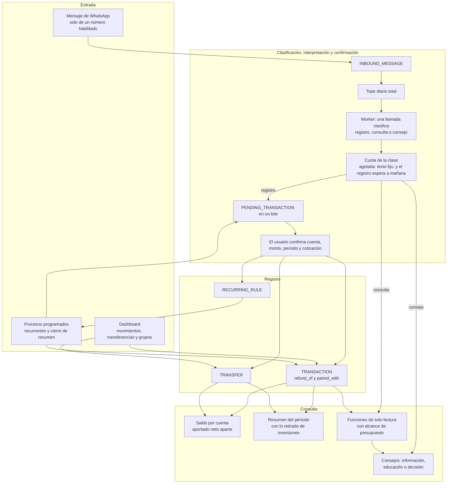

# Platita — Validación de diseño por casos de uso

- **Fecha de la corrida:** 2026-10-04 (sexta corrida)
- **Rama analizada:** `feature/entrega-1-VNZ`, commit `d986cb9`, más lo que se escribió durante esta corrida: las cuentas de §17 (D34), la fecha de un mensaje de §1 (D31), el aviso al invitar de §10 (D32), el aviso de cifra parcial de §17 (D33), a qué vencimiento corresponde la cuota nombrada (§13) y el enlace del login en `01-producto.md`
- **Corrida anterior:** 2026-09-27, commit `35433ef` (3 commits antes)

> **Esto no es especificación.** Es un registro: el diagnóstico de la especificación tal como
> estaba en la fecha de la corrida. Sus recomendaciones son propuestas, no reglas. Ninguna se
> implementa hasta que la autora la decide y la regla se escribe en el
> documento que corresponde —[reglas de dominio](reglas-de-dominio.md), el
> [modelo de datos](03-modelo-de-datos.md) o un ADR—, que es lo que manda. Criterio en
> [`AGENTS.md`](../AGENTS.md) §10.
>
> **Cómo se actualiza.** No se edita a mano: se vuelve a correr el mismo ejercicio, que lee esta
> corrida, la compara y sobrescribe el archivo. Las decisiones siguen una sola numeración entre
> corridas: D1 a D34 están cerradas, y una referencia vieja nunca apunta a otra decisión.

**Decisiones de la autora que esta corrida respeta.** Se tratan como cerradas y no se vuelven a
proponer:

- **Un movimiento pertenece a un solo presupuesto** (A3.8, `reglas-de-dominio.md` §1).
- **Las devoluciones con tarjeta son una limitación conocida, no bloqueante** (A1.4,
  `hoja-de-ruta.md`).
- **El efectivo de la actividad usado para gastos personales** se registra como un retiro del
  titular; recordarlo es del usuario (A3.3).
- **La plata que un miembro le pasa a otro para gastos del grupo** va como gasto individual de
  quien la da e ingreso individual de quien la recibe, sin escribirlo en la especificación (A5.2).
- **El alta y la edición de cuentas desde el dashboard quedan para después.** Conversando, una
  cuenta se da de alta en cualquier momento (§2).
- **El chat web es un andamio de desarrollo y demostración, no un canal del producto** (ADR
  0002). No se evalúa como canal.
- **Solo escriben los números que quien opera Platita habilitó,** con un comando de operación, y
  un invitado a un grupo también tiene que estar habilitado (§11). Tramitar esa habilitación le
  toca al dueño del grupo, que recibe el aviso al invitar (§10, D32). Platita no guarda el número
  del invitado. La pantalla de administración queda como mejora.
- **Un registro que supera su cuota espera al día siguiente sin trabar los mensajes que siguen**
  (§12, ADR 0010).
- **La segunda insistencia se cuenta dentro del historial reciente,** de 30 minutos (§18, ADR
  0018).
- **La fecha de un movimiento es el día en que el usuario escribió,** no el día en que se
  procesa (§1, D31).
- **Una respuesta con datos del usuario avisa si hay mensajes demorados o pendientes sin
  confirmar** (§17, D33).
- **Los datos salen de las funciones y las cuentas las hace el modelo** (§17, D34). No se
  propone una función de cálculo.
- **La tasa de plazo fijo como dato descargado está en revisión** (`hoja-de-ruta.md`). Mientras
  siga escrita, se evalúa como está.

**Documentos analizados**

- `AGENTS.md` (y `CLAUDE.md`, que es un enlace simbólico a él)
- `README.md`
- `llms.txt`
- `prompts.md` (como contexto, no como especificación)
- `docs/01-producto.md`
- `docs/02-arquitectura.md`
- `docs/03-modelo-de-datos.md`
- `docs/04-api.md`
- `docs/05-historias-de-usuario.md`
- `docs/06-tickets.md`
- `docs/07-pull-requests.md`
- `docs/08-convenciones-de-documentacion.md`
- `docs/reglas-de-dominio.md`
- `docs/recorrido-completo.md`
- `docs/convenciones-de-desarrollo.md`
- `docs/hoja-de-ruta.md`
- `docs/terminos-y-privacidad.md`
- `docs/operacion.md`
- `docs/documentacion-viva.md`
- `docs/flujo-de-trabajo-con-ia.md`
- `docs/conversacion-reestructuracion-docs.md` (registro, no especificación)
- `docs/features/TEMPLATE/` (`spec.md`, `ui_contract.md`, `qa_plan.md`, `pr.md`)
- `docs/adr/0001` a `docs/adr/0020`
- `.claude/skills/domain-rules/SKILL.md` y `.claude/commands/` (contexto de trabajo)

No hay diagramas en imagen: todos están en Mermaid, dentro de los Markdown. `site/` se genera
desde `docs/` y no es fuente. La corrida anterior de este archivo se leyó solo para la sección 5.
Los datos de mercado son los de las corridas anteriores.

Se evalúa el diseño completo documentado, no el recorte de la entrega 2 que describe la hoja de
ruta. Los 51 casos se recorrieron de nuevo contra la especificación del commit analizado, también
los que no tocan las reglas que cambiaron, y se rehicieron sus cuentas.

---

## 1. Mapa del diseño (Fase 0)

### 1.1. Documentos existentes

| Documento | Qué cubre | Nivel de detalle |
|---|---|---|
| `01-producto.md` | Objetivo, catálogo must/should/could, fuera de alcance y la secuencia del registro por WhatsApp | Especificación funcional |
| `reglas-de-dominio.md` | Dueño de las reglas de negocio, en 18 grupos. Desde la corrida anterior suma los números habilitados (§11), la clasificación del mensaje y el tope diario total (§12), la deuda de una tarjeta anterior a su alta (§13) y la separación entre clase de mensaje y clase de respuesta (§18) | Especificación funcional detallada, con reglas de borde |
| `03-modelo-de-datos.md` | Diagramas ER por área y 28 entidades; suma `ALLOWED_PHONE` y `ADVICE_CHUNK`, el mensaje citado y el tipo de respuesta en los mensajes | Diseño técnico |
| `04-api.md` | Webhook, chat web, cuentas con saldo, presupuestos y períodos, resumen del período, movimientos, transferencias, grupos e invitaciones, login, entrada de desarrollo, exportaciones y borrado de cuenta | Diseño técnico, parcial ("endpoints principales") |
| `05-historias-de-usuario.md` | HU1 a HU7 | Especificación funcional |
| `06-tickets.md` | Webhook e interpretación, vista de presupuesto y esquema inicial, con su reparto entre entregas | Diseño técnico |
| `02-arquitectura.md` y `recorrido-completo.md` | C4, despliegue, seguridad y el recorrido de punta a punta, ahora con el registro por chat web | Diseño técnico |
| `hoja-de-ruta.md` | Alcance de la entrega 2, pendientes y decisiones abiertas | Idea general y registro de decisiones |
| `terminos-y-privacidad.md` | Índice de lo que tienen que cubrir los términos | Idea general |
| `adr/0001` a `0020` | Decisiones de arquitectura. Las tres nuevas: clasificación y memoria (0018), base de conocimiento (0019) y sin framework de orquestación (0020) | Diseño técnico, con alternativas |
| El resto de `docs/` | Operación, método de trabajo, convenciones y plantillas | No describen comportamiento financiero |

### 1.2. Diseño reconstruido

**Funcionalidades** (`01-producto.md` §1.2): sin cambios en el catálogo. Cambió quién puede
empezar un alta: solo un número habilitado.

**Entidades centrales** (`03-modelo-de-datos.md` §3.2):

| Entidad | Qué es |
|---|---|
| `ACCOUNT` | Una moneda por cuenta, saldo calculado, alta en cualquier momento. Una cuenta de inversión por moneda; un plazo fijo es una cuenta bancaria |
| `TRANSACTION` | Gasto o ingreso completo, en un solo período. `paired_with` enlaza retiros y aportes del titular |
| `TRANSFER` | Entre dos cuentas propias. En la misma moneda, montos iguales; la comisión es un gasto aparte |
| `CATEGORY` | Catálogo base fijo más categorías propias, sin nombres repetidos entre las dos |
| `BUDGET_PERIOD` y `BUDGET` | Período individual o de grupo, sin solapes, `draft` o `confirmed` |
| `FAMILY_GROUP`, `USER_GROUP` y `GROUP_INVITATION` | Familia o actividad; se crea con su primer período y se entra con un código que comparte el dueño |
| `RECURRING_RULE` y `CARD_STATEMENT` | Reglas fijas o variables, compras con tarjeta y resúmenes conciliados. Una compra puede nacer con cuotas ya contadas, las que se pagaron antes de dar de alta la tarjeta |
| `PENDING_TRANSACTION` y `PENDING_BATCH` | Lo que espera una decisión del usuario, en lotes numerados |
| `INBOUND_MESSAGE` y `OUTBOUND_MESSAGE` | Cola del worker, registro del canal y memoria de conversación. Guardan el mensaje citado y el tipo de cada respuesta |
| `LLM_USAGE` | Las tres cuotas diarias y el contador del tope total |
| `ALLOWED_PHONE` | Los números habilitados para escribirle a Platita, como HMAC |
| `ADVICE_DOCUMENT` y `ADVICE_CHUNK`, `INDICATOR_VALUE` y `EXCHANGE_RATE` | Base de educación financiera en documentos y fragmentos, indicadores y cotizaciones, con antigüedad máxima por fuente |

**Flujo central: cómo entra, cómo se guarda y cómo se consulta un dato**

```mermaid
flowchart TB
    subgraph ENTRADA["Entrada"]
        WA["Mensaje de WhatsApp<br/>solo de un número habilitado"]
        DASH["Dashboard<br/>movimientos, transferencias y grupos"]
        CRON["Procesos programados<br/>recurrentes y cierre de resumen"]
    end
    subgraph PROCESO["Clasificación, interpretación y confirmación"]
        INB["INBOUND_MESSAGE"]
        TOPE["Tope diario total"]
        WK["Worker: una llamada clasifica<br/>registro, consulta o consejo"]
        CUOTA["Cuota de la clase<br/>agotada: texto fijo, y el registro espera a mañana"]
        PEND["PENDING_TRANSACTION en un lote"]
        CONF["El usuario confirma cuenta,<br/>monto, período y cotización"]
    end
    subgraph DATOS["Registro"]
        TX["TRANSACTION<br/>refund_of y paired_with"]
        TR["TRANSFER"]
        RR["RECURRING_RULE"]
    end
    subgraph LECTURA["Consulta"]
        SALDO["Saldo por cuenta<br/>aportado neto aparte"]
        SUM["Resumen del período<br/>con lo retirado de inversiones"]
        FN["Funciones de solo lectura<br/>con alcance de presupuesto"]
        ADV["Consejos: información,<br/>educación o decisión"]
    end
    WA --> INB --> TOPE --> WK --> CUOTA
    CUOTA -->|registro| PEND --> CONF
    CUOTA -->|consulta| FN
    CUOTA -->|consejo| ADV
    CONF --> TX
    CONF --> TR
    CONF --> RR
    DASH --> TX
    DASH --> TR
    RR --> CRON
    CRON --> TX
    CRON --> PEND
    TX --> SALDO
    TR --> SALDO
    TX --> SUM
    TR --> SUM
    TX --> FN
    FN --> ADV
```

- **Entrada.** Fecha, moneda (la de la cuenta nombrada, o la primaria) y categoría del catálogo
  se completan solas y se muestran; monto, cuenta y período se confirman siempre
  (`reglas-de-dominio.md` §1 y §4). Una cuenta nombrada que no existe no se crea sola: el
  asistente pregunta si darla de alta (§2). Un número que no está habilitado recibe un texto fijo
  y no empieza ningún alta (§11).
- **Clasificación.** Una llamada inicial dice si el mensaje es un registro, una consulta o un
  consejo, y después se cobra la cuota de esa clase (§12, ADR 0018). Un registro que supera su
  cuota, o cualquier mensaje pasado el tope total, espera al día siguiente.
- **Registro.** Un movimiento pertenece a un solo presupuesto (§1), y se puede pasar a otro
  nombrándolo (§15). Ninguna cuenta registra nada anterior a su alta; en una tarjeta cuenta la
  fecha del vencimiento, y lo que ya debía se carga al darla de alta (§2 y §13).
- **Consulta.** Las funciones de §17 suman el presupuesto individual por defecto, un grupo si se
  lo nombra, o todo si se pide el total. Los consejos responden en tres clases de respuesta
  (§18), con los últimos intercambios como contexto.

### 1.3. Decisiones confirmadas en la documentación

Las tres están documentadas, sin contradicciones con otros documentos. El detalle está en la
sección 2.

### 1.4. Áreas sin cobertura

Ninguna nueva.

El alta de cuentas desde el dashboard sigue sin endpoint, pero la autora decidió dejarla para
después; no se cuenta como hueco. El alta por el chat web y qué pasa al deshabilitar el número de
un usuario ya están en las decisiones abiertas de la hoja de ruta.

### 1.5. Contradicciones visibles entre documentos

| # | Contradicción | Documentos |
|---|---|---|
| X4 | Siguen registradas en la hoja de ruta: cuotas en YAML contra "sin desplegar", rama de despliegue y quién genera las alertas con RAG | `hoja-de-ruta.md`, Decisiones abiertas |

X10 y X11 de la corrida anterior quedaron resueltas, y X12 y X13 se abrieron y se cerraron en
esta (sección 5).

### 1.6. Preguntas bloqueantes

Ninguna.

---

## 2. Decisiones confirmadas

| Decisión | ¿Documentada? | Dónde | Contradicciones | Casos límite sin resolver |
|---|---|---|---|---|
| **1. Actividades** con presupuesto propio y autotransferencias para pagarse un sueldo | Sí | `reglas-de-dominio.md` §10 (crear, invitar, aceptar, conflicto de nombre, retiro con una o dos cuentas, aporte, totales consolidados); §2 (alta de la cuenta de una actividad en cualquier momento); §15; §18; `03-modelo-de-datos.md` TRANSACTION y GROUP_INVITATION; `04-api.md`; HU7; §4 | Ninguna | Ninguno. Con los números habilitados, invitar a alguien que no usa Platita exige que el dueño tramite la habilitación antes de que venza el código (A5.8) |
| **2. Cuentas de inversión opacas** | Sí | `reglas-de-dominio.md` §2 (aportes y retiros, una cuenta por moneda, aportado neto fuera de los totales, plazo fijo, alta en cualquier momento); §17; HU1; `04-api.md` (`GET /accounts`, con `balance_kind`) | Ninguna | Ninguno |
| **3. Educación, no recomendación** | Sí | `reglas-de-dominio.md` §18; §17 (Indicadores); §12; `01-producto.md` §1.1 y §1.2; `terminos-y-privacidad.md`; ADR 0013 (validación de la salida) y ADR 0018 (tipo de respuesta) | Ninguna | La cuenta del paso 3 de una decisión la hace el modelo, con datos que salen de las funciones; su exactitud depende del modelo. Que un mensaje es una insistencia lo sigue detectando el modelo; el código garantiza la secuencia. No hay fuente de datos con nombre de entidad en el MVP |

---

## 3. Supuestos asumidos

- **Público objetivo:** personas y hogares de Argentina, adultos de 18 a 75 años [supuesto],
  bancarizados y usuarios de WhatsApp, con varias cuentas, billeteras y monedas, y
  monotributistas con una actividad (`01-producto.md` §1.1; decisión 1). Lanzamiento solo en
  Argentina (ADR 0011).
- **Canales:** WhatsApp como canal principal y dashboard web para ver, configurar y cargar
  gastos, ingresos y transferencias (ADR 0002). El chat web es un andamio y no se evalúa.
- **Todos los arquetipos tienen su número habilitado,** salvo donde el caso dice lo contrario.
- **Fuera de alcance:** modo offline, lectura de capturas y conexión con bancos
  (`01-producto.md` §1.2, `AGENTS.md` §1). Email y duplicados automáticos son could-have.
- Se evalúa el diseño completo documentado, incluidas las should-have.
- La cotización de referencia del usuario es MEP.
- Los montos y normas son de septiembre de 2026 (sección 14). Son orientativos.
- **[INFERIDO]** marca lo que se deduce sin estar escrito. Las frecuencias sin fuente llevan
  **[ESTIMADO]**.

---

## 4. Resumen ejecutivo

**Madurez general: alta.** Las 30 decisiones de las corridas anteriores están cerradas, y el
problema más relevante de la corrida anterior, la deuda de una tarjeta anterior a su alta, quedó
resuelto. Lo que aparece ahora no viene de las reglas financieras sino de decisiones de
arquitectura y de acceso tomadas después: demorar los registros que superan su cuota, y habilitar
los números uno por uno. Al recorrer otra vez los casos anteriores apareció además un hueco en
las cuentas de un consejo. La autora lo cerró durante la corrida (D34), igual que la fecha de un
gasto que se procesa al día siguiente (D31), el circuito para invitar a alguien que todavía no
está habilitado (D32) y el aviso de una cifra parcial (D33). No queda ninguna decisión
pendiente.

De los 51 casos recorridos (los 48 anteriores y 3 nuevos):

| Veredicto | Casos |
|---|---|
| INCORRECTO | 1 |
| CONTRADICTORIO | 0 |
| NO ESPECIFICADO | 0 |
| NO SOPORTADO | 1 |
| PARCIAL | 0 |
| SOPORTADO | 49 |

**Lo que queda**

1. **Las devoluciones con tarjeta** siguen inflando el ingreso del período (INCORRECTO, A1.4),
   aceptado como limitación conocida.
2. **Un gasto mixto va entero a un presupuesto** (NO SOPORTADO, A3.8), por decisión.

**Decisiones pendientes:** ninguna.

---

## 5. Comparación con la corrida anterior

La corrida anterior recorrió 48 casos: 2 INCORRECTO, 0 CONTRADICTORIO, 0 NO ESPECIFICADO, 1 NO
SOPORTADO, 0 PARCIAL y 45 SOPORTADO.

### 5.1. Casos que cambiaron de veredicto

| Caso | Antes | Ahora | Qué lo cerró |
|---|---|---|---|
| A1.7 · Deuda de una tarjeta anterior a su alta | INCORRECTO | SOPORTADO | §13 "Lo que la tarjeta ya debía al darla de alta"; §2 aclara que en una tarjeta cuenta la fecha del vencimiento (D30) |

### 5.2. Decisiones pendientes que se cerraron

| Decisión | Cómo se cerró |
|---|---|
| D30 · Deuda anterior al alta de una tarjeta | Opción 1, con la forma que le dio la autora: la compra se carga diciendo en qué cuota va, como "cuota 5 de 12", y se registran solo las que faltan. El asistente pregunta una vez al dar de alta la tarjeta. Sin cambios de esquema: la regla nace con las cuotas pagadas ya contadas |

| D31 · Qué día es "hoy" para un mensaje que se procesa otro día | Se abrió y se cerró en esta corrida, con el caso nuevo A3.11. Opción 1: la fecha es el día en que el usuario escribió, porque al usuario no le importa cuándo se procesó. Quedó en §1, "Hoy es el día en que el usuario escribió" |
| D32 · Cómo se habilita el número de alguien que quiere entrar | Se abrió y se cerró en esta corrida, con el caso nuevo A5.8. Una mezcla de las opciones 1 y 2: al crear la invitación, el dueño recibe el aviso de que tiene que tramitar con el administrador la habilitación de ese número. El pedido va por fuera de Platita, que no pide ni guarda el número del invitado. Quedó en §10, "Invitar", y en §11 |
| D33 · Qué dice una consulta cuando hay mensajes sin procesar | Se abrió y se cerró en esta corrida, con el caso nuevo A3.12. Opción 1: el código agrega una línea fija a la respuesta. Quedó en §17, "Una cifra parcial se avisa" |
| D34 · Quién hace las cuentas de una respuesta | Se abrió y se cerró en esta corrida. Al recorrer A6.7 apareció que §18 pedía responder con un cálculo, que §17 decía que el modelo no suma ni resta, y que ninguna función calculaba una proporción, un promedio ni una diferencia. La autora decidió que la regla existe para que el modelo no invente datos, no para impedirle calcular: los datos salen de las funciones, y las cuentas las hace el modelo, sin una función aritmética en código. §17 y §18 quedaron escritas así |

También se cerraron dos contradicciones: X10, porque §2 ya no dice que la deuda de una tarjeta
está en su saldo inicial, y X11, el conteo del `README.md`.

### 5.3. Problemas nuevos

- **A3.11**: la fecha de un mensaje que se procesa otro día. Entró como NO ESPECIFICADO y se
  cerró en la misma corrida (D31); queda como caso soportado, con su prueba.
- **A5.8**: cómo se habilita el número de un invitado. Nace con la regla de los números
  habilitados. Entró como NO ESPECIFICADO y se cerró en la misma corrida (D32).
- **A3.12**: una consulta con registros demorados. Nace de que una consulta del mismo día ahora
  se responde aunque haya registros esperando. Entró como PARCIAL y se cerró en la misma corrida
  (D33).
- **X12**: el catálogo de producto mandaba al ADR 0003 para el login, que está reemplazado por
  el 0016. No era nueva en el repositorio; no se había reportado. Se corrigió el enlace durante
  la corrida.
- **X13**: el recorrido mostraba al modelo calculando "un 60% más", contra la regla de §17. Con
  D34 dejó de ser una contradicción.

### 5.4. Problemas que siguen abiertos

- A1.4, como limitación aceptada.
- X4, en la hoja de ruta.

---

## 6. Arquetipos

| Arquetipo | Situación | Qué necesita de Platita |
|---|---|---|
| **A1 · Lucía, asalariada** | 34 años, CABA. Sueldo neto de $1.450.000 con paritarias. Galicia en pesos y en dólares, Mercado Pago, Visa con saldo en pesos y en dólares, y una Visa del Santander que suma después. Paga ChatGPT en dólares | Saber en qué se le va la plata, llegar al vencimiento sin sorpresas y entender qué cuesta un préstamo |
| **A2 · Martín, freelancer que cobra del exterior** | 29 años, desarrollador, monotributista. Factura unos USD 2.500 por mes con factura E y cobra por Payoneer; a veces en USDT. Vende dólares al MEP | Llevar ingresos en dólares y gastos en pesos sin mezclar monedas, y aprender qué hacer con lo que ahorra |
| **A3 · Carla, microemprendedora** (obligatorio) | 38 años, Morón. Vende viandas y tortas; monotributo categoría A ($49.527). Cobra por el mismo Mercado Pago que usa para lo personal y en efectivo en ferias. Factura unos $2.400.000 por mes y se paga $900.000 | Separar la actividad de lo personal, pagarse un sueldo y saber si el emprendimiento se sostiene |
| **A4 · Diego, inversor** (obligatorio) | 46 años, Rosario. Empleado con $2.100.000 netos. Tiene CEDEARs y FCI en Balanz, en pesos y en dólares, saldo remunerado en Mercado Pago y un plazo fijo. Completa los gastos del mes retirando del broker | Saber cuánto puso y sacó de cada inversión, sin que Platita pretenda saber cuánto vale |
| **A5 · Sofía y Nico, pareja** | Convivientes, cada uno con sus cuentas. Presupuesto de grupo "Casa". Alquiler de $850.356 con ajuste por IPC. Sofía también está en el grupo "Familia" de sus padres | Ver cuánto llevan gastado entre los dos y cuánto puso cada uno |
| **A6 · Norma, jubilada** | 70 años, Lanús. Cobra $505.748,51 (mínima más bono, octubre de 2026) en Cuenta DNI. Usa efectivo y reintegros. Su hija la ayuda con la computadora | Registrar simple, controlar el efectivo y entender qué es cada cosa antes de que le ofrezcan algo |

---

## 7. Matriz de casos

Frecuencias: salvo cita, **[ESTIMADO]**. Orden: veredicto y, dentro de cada uno, de más a menos
frecuente. A3 y A4 tienen más de seis casos porque incluyen los casos límite obligatorios.

| # | Arquetipo | Caso | Tipo | Frecuencia | Veredicto | Evidencia (doc/sección) | Cambio mínimo | Parte afectada |
|---|---|---|---|---|---|---|---|---|
| A1.4 | A1 | Devuelve unas zapatillas de $180.000 compradas en 3 cuotas, después de pagar la primera | Incómodo (devolución) | Ocasional | INCORRECTO (limitación aceptada) | `reglas-de-dominio.md` §13 y §16; `hoja-de-ruta.md` ("Devoluciones con tarjeta: limitación conocida") | Ninguno: decidido como no bloqueante | Flujo de ingesta, reportes |
| A3.8 | A3 | El celular ($60.000 por mes) lo usa para la actividad y para lo personal | Incómodo (gasto mixto) | Mensual | NO SOPORTADO (por decisión) | §1 "Un movimiento, un presupuesto" | — | — |
| A1.1 | A1 | "Gasté 58.400 en el super con la Galicia" | Cotidiano | Diaria | SOPORTADO | `01-producto.md` §1.3; §1, §3 y §4 (Supermercado); §2 "Cada cuenta tiene un nombre distinto": "la Galicia" coincide con dos cuentas y el asistente pregunta cuál | — | — |
| A3.2 | A3 | Cobra una vianda de $18.000 por el Mercado Pago que usa también para lo personal | Cotidiano (actividad) | Diaria | SOPORTADO | §10 (cuenta y presupuesto independientes), §4 (Ventas) | — | — |
| A3.3 | A3 | Hace 22 ventas en efectivo en la feria del sábado, y con esa plata paga la verdulería | Incómodo (efectivo) | Semanal | SOPORTADO | §10 "El retiro del titular", sobre la cuenta de efectivo; decisión de la autora | — | — |
| A6.3 | A6 | Saca $150.000 del cajero y paga en efectivo | Cotidiano (efectivo) | Semanal (1,7 extracciones por adulto por mes, BCRA 30/04/2026) | SOPORTADO | §13 (sacar efectivo es transferencia) | — | — |
| A5.1 | A5 | Nico paga el super de $92.000 con su Mercado Pago y lo imputa a "Casa" | Cotidiano | Semanal | SOPORTADO | §1, §5 y §10 | — | — |
| A5.6 | A5 | "¿A cuánto está el MEP hoy?" antes de comprar dólares | Educación (información) | Semanal | SOPORTADO | §17 Indicadores; §18; §12 (cuenta como consulta) | — | — |
| A6.2 | A6 | Reintegro de $3.200 de Cuenta DNI por una compra de $16.000 | Incómodo (reintegro) | Semanal | SOPORTADO | §16 (`refund_of`) | — | — |
| A1.5 | A1 | Responde "eran 3.800" citando el "Listo…" | Error (monto) | Semanal | SOPORTADO | §15; el mensaje citado queda resuelto en `INBOUND_MESSAGE` (ADR 0010) | — | — |
| A4.5 | A4 | Mira el dashboard: ¿cuánto tiene en total? | Cotidiano (revisar) | Semanal | SOPORTADO | §2 "El aportado neto no suma en ningún total"; HU1 | — | — |
| A3.11 | A3 | Sábado 31/10, día de feria: ya gastó sus 50 mensajes de registro. A las 22:40 escribe "cobré 18.000 de una vianda, en efectivo" | Incómodo (límite de uso) | Mensual [ESTIMADO] para quien registra cada venta de a una | SOPORTADO | `reglas-de-dominio.md` §12 (el registro se demora al día siguiente, sin trabar lo que sigue) y §1 "Hoy es el día en que el usuario escribió": la venta queda con fecha 31/10 y propone el período de octubre | — | — |
| A3.12 | A3 | Con tres ventas demoradas hasta mañana, pregunta "¿cuánto vendí hoy en Cocina de Carla?" | Cotidiano (revisar) | Mensual [ESTIMADO] | SOPORTADO | §12 (una consulta del mismo día se responde igual); §17 (Ingresos; "La respuesta dice siempre qué sumó") y §17 "Una cifra parcial se avisa": el código agrega la línea de los mensajes demorados | — | — |
| A5.2 | A5 | Sofía le transfiere $300.000 a Nico para gastos de la casa | Incómodo (entre personas) | Mensual | SOPORTADO [INFERIDO] | Decisión de la autora: gasto individual de Sofía e ingreso individual de Nico (§1, §4 "Otros ingresos"); los gastos de la casa los carga quien paga (§10) | — | — |
| A5.4 | A5 | Los dos cargan el mismo super de $92.000 a "Casa" | Error (duplicado) | Mensual | SOPORTADO | §7 "Entre miembros de un grupo" | — | — |
| A1.3 | A1 | ChatGPT (USD 20) en la Visa USD, pagado en pesos al dólar tarjeta ($2.002) | Incómodo (moneda extranjera) | Mensual | SOPORTADO | §13 "Una tarjeta en otra moneda" y "El residuo al pagar" | — | — |
| A2.1 | A2 | Cobra USD 2.450 en Payoneer; su presupuesto es en pesos | Cotidiano (ingreso en USD) | Mensual | SOPORTADO | §6 | — | — |
| A2.2 | A2 | "Me pagaron 2400 en Payoneer", sin decir la moneda | Error (moneda) | Mensual | SOPORTADO | §1 "La moneda sale de la cuenta nombrada" | — | — |
| A2.3 | A2 | Pasa USD 2.450 de Payoneer a Galicia USD y llegan USD 2.401 | Incómodo (comisión) | Mensual | SOPORTADO | §13 "Una comisión en una transferencia es un gasto aparte"; §4 ("Comisiones") | — | — |
| A2.4 | A2 | Un cliente le paga USD 600 en USDT a Binance | Incómodo (moneda) | Mensual | SOPORTADO | §2 "Una stablecoin es una cuenta en dólares" | — | — |
| A2.5 | A2 | "Me sobraron USD 3.000 este mes, ¿qué hago?" | Educación (decisión) | Mensual | SOPORTADO | §18 "Cómo se responde una pregunta de decisión" | — | — |
| A3.4 | A3 | Se paga $900.000 de sueldo; todo pasa por el mismo Mercado Pago | Incómodo (actividad) | Mensual | SOPORTADO | §10 "El retiro del titular"; TRANSACTION `paired_with` | — | — |
| A3.5 | A3 | "¿Cuánto gasté este mes?" y "¿cuánto gasté contando todo?" | Cotidiano (revisar) | Mensual | SOPORTADO | §17 "A qué presupuesto se refiere una pregunta"; §10; la respuesta corta que corrige el alcance se entiende por el historial reciente (ADR 0018) | — | — |
| A3.6 | A3 | Con una cuenta Galicia propia de la actividad, se transfiere $900.000 de sueldo a su Mercado Pago | Incómodo (actividad) | Mensual | SOPORTADO | §10 "El retiro es igual con una cuenta o con dos"; §2 (alta de la cuenta en cualquier momento) | — | — |
| A3.9 | A3 | Imputó la harina ($35.000) al presupuesto personal en vez de a la actividad | Error (actividad equivocada) | Mensual | SOPORTADO | §15 "Cambiar el presupuesto" | — | — |
| A3.10 | A3 | "¿Cuánto me puedo pagar de sueldo sin fundir el emprendimiento?" | Educación (decisión con datos) | Mensual | SOPORTADO | §18 "La excepción es un grupo de un solo miembro" y "Cómo se responde una pregunta de decisión". Los datos salen de las funciones y la cuenta la hace el modelo (§17, D34) | — | — |
| A4.1 | A4 | Aporta $500.000 de Galicia a Balanz ARS | Cotidiano (inversión) | Mensual | SOPORTADO | §2 y §13; `POST /transfers` | — | — |
| A4.2 | A4 | Retira $400.000 por mes de Balanz para completar los gastos | Incómodo (inversión) | Mensual | SOPORTADO | §17 "Lo retirado de inversiones se muestra aparte" | — | — |
| A4.6 | A4 | Mercado Pago le rinde $11.400 en el mes (18,62% TNA) | Cotidiano (rendimiento) | Mensual | SOPORTADO | §2 (contraste mensual, "Rendimientos") | — | — |
| A4.7 | A4 | Arma un plazo fijo de $3.000.000 a 30 días al 20% de TNA | Incómodo (inversión) | Mensual | SOPORTADO | §2 "Un plazo fijo es una cuenta bancaria" y "Una cuenta se da de alta en cualquier momento" | — | — |
| A4.10 | A4 | Compra USD 1.000 al MEP ($1.544.350) dentro de Balanz, de "Balanz ARS" a "Balanz USD" | Incómodo (inversión) | Mensual | SOPORTADO | §2 "Una cuenta de inversión por moneda"; §17 (no cuenta como retirado) | — | — |
| A5.5 | A5 | El alquiler sube por IPC en el ajuste | Cotidiano (recurrente variable) | Mensual | SOPORTADO | §8 | — | — |
| A6.1 | A6 | Cobra la jubilación con aumento mensual y el bono de $70.000 | Cotidiano (ingreso) | Mensual | SOPORTADO | §8; §4 ("Jubilación y pensión") | — | — |
| A1.2 | A1 | Cobra aguinaldo de $725.000 en junio; el borrador de julio copia ese ingreso | Incómodo (aguinaldo) | Semestral (30/06 y 18/12, iProfesional 2026) | SOPORTADO | §3 "Confirmar tal cual, por WhatsApp"; §4 ("Aguinaldo") | — | — |
| A1.7 | A1 | Da de alta su Visa del Santander el 27/09. Ya tiene un celular de $1.080.000 en 12 cuotas desde junio (quedan 9 de $90.000) y $64.000 de compras del 20/09 en el resumen que vence el 5/10 | Incómodo (tarjeta) | Ocasional (una vez por tarjeta; afecta a casi todo usuario con tarjeta) | SOPORTADO | `reglas-de-dominio.md` §13 "Lo que la tarjeta ya debía al darla de alta": la cuota que nombra el usuario es la del próximo vencimiento; §2 "Nada antes del alta de la cuenta"; `03-modelo-de-datos.md` RECURRING_RULE (`generated_occurrences`) | — | — |
| A1.6 | A1 | "Me ofrecen un préstamo de $3.000.000 al 99% de TNA (CFTEA 207,94%), ¿me conviene?" | Educación (decisión) | Ocasional | SOPORTADO | §18 "Tres clases de respuesta" y "Cómo se responde una pregunta de decisión". Los datos salen de las funciones y la cuenta la hace el modelo (§17, D34) | — | — |
| A2.6 | A2 | Insiste: "no me expliques, decime vos: ¿CEDEARs o plazo fijo en dólares?" | Educación (decisión) | Ocasional | SOPORTADO | §18 "Si el usuario insiste": la secuencia la garantiza el código con el tipo de la respuesta anterior (ADR 0018) | — | — |
| A3.1 | A3 | Crea la actividad "Cocina de Carla" | Cotidiano (configuración) | Ocasional | SOPORTADO | §10 "Crear un grupo" y "El primer período nace con el grupo"; §12; HU7 | — | — |
| A3.7 | A3 | Pone $250.000 de sus ahorros para comprar un horno para la actividad | Incómodo (actividad) | Ocasional | SOPORTADO | §10 "El aporte del titular es el camino inverso"; §4 | — | — |
| A4.3 | A4 | Aportó $2.000.000 en total y retira $2.600.000 | Incómodo (inversión) | Ocasional | SOPORTADO | §2 (aportado neto negativo, fuera de los totales) | — | — |
| A4.4 | A4 | Aporta pesos a Balanz, compra MEP adentro y retira USD 1.000 a Galicia USD | Incómodo (inversión, monedas) | Ocasional | SOPORTADO | §2 "Una cuenta de inversión por moneda" y "Una cuenta se da de alta en cualquier momento" | — | — |
| A4.8 | A4 | Registró el aporte desde Mercado Pago cuando salió de Galicia | Error (cuenta) | Ocasional | SOPORTADO | §15 | — | — |
| A4.9 | A4 | "¿Qué banco paga más por un plazo fijo?" | Educación (información) | Ocasional | SOPORTADO | §18 "Información con nombre de entidad, solo si una fuente la publica" | — | — |
| A5.3 | A5 | Heladera de $1.200.000 en 12 cuotas sin interés con la tarjeta de Sofía | Incómodo (cuotas) | Ocasional | SOPORTADO | §8 y §13 | — | — |
| A5.7 | A5 | Nico invita a Sofía a su grupo "Familia"; Sofía ya está en el grupo "Familia" de sus padres | Incómodo (grupos) | Ocasional | SOPORTADO | §10 "Si el nombre del grupo choca, el código espera"; §11 | — | — |
| A5.8 | A5 | Nico invita a su hermano Tomás, que no usa Platita, al grupo "Familia". Tomás escribe el código | Incómodo (grupos, acceso) | Ocasional | SOPORTADO | `reglas-de-dominio.md` §10 "Invitar": al invitar, Nico recibe el aviso de que tiene que tramitar la habilitación con el administrador; §11 "Solo escriben los números habilitados"; §10 "Aceptar": el código no se consume. Si la habilitación llega después de los 7 días, Nico invita de nuevo | — | — |
| A6.4 | A6 | Borra por error la farmacia de $27.300 y la recupera | Error (borrado) | Ocasional | SOPORTADO | §15 "Borrar y restaurar" | — | — |
| A6.5 | A6 | "¿Qué es un fondo común de inversión?" | Educación (concepto) | Ocasional | SOPORTADO | §18, clase educación | — | — |
| A6.6 | A6 | "¿Cuánto paga hoy un plazo fijo?" | Educación (información) | Ocasional | SOPORTADO | §17 Indicadores; §18 y §12: la clasificación inicial la manda a la rama de consultas | — | — |
| A6.7 | A6 | "Si saco $1.000.000 en 12 cuotas de $140.000, ¿qué parte de mi jubilación es?" | Educación (decisión con datos) | Ocasional | SOPORTADO | §18, paso 3: los datos del usuario como cálculo, sin adjetivo. Los datos salen de las funciones y la cuenta la hace el modelo (§17, D34) | — | — |
| A6.8 | A6 | La hija de Norma le pide al asistente crear la categoría "Salud" para la prepaga; "Salud" ya está en el catálogo base | Error (categoría duplicada) | Ocasional | SOPORTADO | §4 "Una categoría propia no repite un nombre del catálogo base"; `03-modelo-de-datos.md` CATEGORY (trigger) | — | — |

---

## 8. Detalle de los casos que no quedan soportados

### A1.4 · Devolución de una compra en cuotas (INCORRECTO, limitación aceptada)

Sin cambios. La acreditación del banco llega como un ajuste sin vincular (§13 y §16). La autora lo
aceptó como limitación conocida (`hoja-de-ruta.md`). No se propone cambio.

---

## 9. Educación financiera

| Caso | Tipo (información/educación/decisión) | Respuesta prevista | ¿Enseña a razonar sin dar veredicto? | Fuente y actualización de datos |
|---|---|---|---|---|
| **A6.5** · "¿Qué es un FCI?" | Educación | Conceptos, riesgos y costos (§18), con la fuente citada por nombre y fecha | Sí | Base curada (`ADVICE_DOCUMENT` y `ADVICE_CHUNK`), revisión manual con `last_reviewed_at`; solo se recuperan los documentos vigentes |
| **A6.6** · "¿Cuánto paga hoy un plazo fijo?" | Consulta, no consejo | Tasa promedio del BCRA con su fecha, por la función Indicadores; cuenta como consulta (§12, §17, §18) | No aplica: es un dato | `INDICATOR_VALUE`, con antigüedad máxima por fuente. La autora tiene en revisión mantener este dato |
| **A5.6** · "¿A cuánto está el MEP?" | Consulta, no consejo | Última cotización de la fuente, con su fecha (§17 Indicadores) | No aplica | `EXCHANGE_RATE` (ADR 0011), con antigüedad máxima por fuente |
| **A4.9** · "¿Qué banco paga más?" | Consulta, no consejo | Sin fuente con nombre de entidad en el MVP: ofrece el promedio. Con fuente, lista ordenada por nombre | No aplica; evita el orden de preferencia | Ninguna fuente por entidad en el MVP |
| **A1.6** · "¿Me conviene un préstamo al 99%?" | Decisión | Conceptos, criterios, sus datos como cálculo y el cierre fijo (§18). El código verifica la estructura antes de enviar (ADR 0013) | Sí | El usuario trae la tasa; el CFT tiene que informarse destacado (BCRA) |
| **A2.5** · "Me sobraron USD 3.000" | Decisión | La misma estructura; ordenar prioridades es un criterio, no una indicación (§18) | Sí | Datos propios por las funciones de §17 |
| **A2.6** · Insiste "decime vos" | Decisión | Explica una vez el límite; a la segunda, dentro del historial reciente, texto fijo (§18, ADR 0018) | Sí | — |
| **A6.7** · "¿Qué parte de mi jubilación es la cuota?" | Decisión con datos | El cálculo, sin adjetivo (§18): el ingreso sale de una función y la cuenta la hace el modelo, mostrando los dos datos | Sí | Ingresos del historial real (§17) |
| **A3.10** · "¿Cuánto me puedo pagar de sueldo?" | Decisión con datos | La misma estructura, leyendo la actividad de un solo miembro (§18) | Sí | Presupuesto de la actividad y el individual |

**Huecos del diseño en esta área**

1. **Las cuentas las hace el modelo.** Los datos salen de las funciones, pero la proporción o el
   promedio de una respuesta los calcula el modelo (§17, D34). Su exactitud no la garantiza el
   código; la respuesta muestra los datos de cada cuenta, y la evaluación de proveedores mide si
   las hace bien. Aceptado por la autora.
2. **La insistencia tiene dos partes.** Que el mensaje es una insistencia lo detecta el modelo.
   La secuencia, primero la explicación y después el texto fijo, la garantiza el código, pero
   dentro de una ventana de 30 minutos: pasada, el usuario recibe otra vez la explicación. Nunca
   recibe un veredicto. Aceptado por la autora.
3. **No hay fuente de datos con nombre de entidad.** Hasta que se configure una, "¿qué banco paga
   más?" siempre responde con el promedio.
4. **Los umbrales de antigüedad son ejemplos** en §18. Conviene fijarlos en la configuración de
   cada fuente al crearla.
5. **La base de conocimiento todavía no tiene tablas ni contenido.** Se crean cuando se elija el
   modelo de embeddings (ADR 0019). Hasta entonces, los casos de educación son verificables solo
   en su forma, con un doble del modelo.
6. **La fuente se cita sin enlace.** El usuario no puede abrirla desde la respuesta (ADR 0013).
   Aceptado, con el enlace exacto a la fuente como mejora.

---

## 10. Decisiones pendientes (Fase 3)

Ninguna. Las cuatro que abrió esta corrida, D31 a D34, se cerraron durante la corrida y están
en la sección 5.2.

---

## 11. Patrones

1. **Una regla escrita para el momento en que llega el mensaje, y un mensaje que ahora se
   procesa en otro momento.**
   - *Casos:* A3.11 y A3.12, los dos ya resueltos.
   - *Causa en el diseño:* las reglas de registro (§1) se escribieron pensando que interpretar un
     mensaje ocurre cuando llega. Demorar un registro es una decisión correcta de costo, pero
     separa esos dos momentos, y las reglas que dependen de "ahora", como la fecha por defecto o
     el total del día, no se volvieron a leer contra eso. Es la misma forma del problema de la
     corrida anterior con las tarjetas: una regla general, y un caso posterior que le cambia el
     supuesto.
2. **Los límites aceptados quedan documentados donde el usuario no los ve.**
   - *Casos:* A1.4, A3.8, A5.2.
   - *Causa en el diseño:* están registrados en la hoja de ruta, en §1 y en este informe, pero
     ninguno llega al usuario. Si aparecen quejas, el lugar natural para explicarlos es una ayuda
     en el dashboard o un mensaje del asistente.

---

## 12. Cambios a la documentación priorizados

Ninguno pendiente. Los que encontró esta corrida se aplicaron durante la corrida: las cuatro
decisiones de la sección 5.2, la frase de §13 sobre a qué vencimiento corresponde la cuota que
el usuario nombra, y el enlace del login en `01-producto.md`.

---

## 13. Preguntas de producto (no bloqueantes)

1. ¿La percepción del 30% se muestra aparte como recuperable? §13 lo deja como mejora futura.
2. Una feriante con 20 o 30 ventas por día, ¿registra cada venta o un total diario? Si las manda
   de a una, cada venta son dos mensajes de registro, la venta y su respuesta, y 25 ventas ya
   agotan los 50 del día (§12). Los casos A3.11 y A3.12 salen de ahí. Juntando hasta diez por mensaje (§5)
   entra cómoda. ¿Conviene una cuota mayor, o que el asistente le proponga juntarlas?
3. Con una socia en la actividad, el grupo pasa a tener dos miembros y los consejos dejan de
   leerlo (§18). ¿Es lo esperado para una sociedad?
4. ¿Las limitaciones aceptadas se le explican al usuario en algún lado, como una ayuda del
   dashboard?
5. ¿Qué pasa con un usuario cuyo número se deshabilita? Ya está en las decisiones abiertas de la
   hoja de ruta.

---

## 14. Fuentes consultadas

Las mismas de las corridas anteriores, consultadas entre el 25/09/2026 y el 27/09/2026. No hubo
búsquedas nuevas: los tres casos nuevos no dependen de normativa ni de datos de mercado, y los
montos de los anteriores no se recalcularon.

**Tipos de cambio e impuestos**

- Diario Río Negro, cotizaciones del 24/09/2026: oficial BNA $1.540 venta, MEP $1.544,35, CCL
  $1.610,19, tarjeta $2.002. <https://www.rionegro.com.ar/economia/dolar-hoy-las-pizarras-de-banco-nacion-fijan-el-rumbo-del-dolar-oficial-mep-y-ccl-este-jueves-24-de-septiembre-2026-4734628/>
- El Destape, percepción del 30% (RG 5617/2024), 03/09/2026. <https://www.eldestapeweb.com/economia/pagar-dolares-tarjeta-septiembre-2026-ahorrar-evitar-recargos-20269316554>
- Blog del Contador, la percepción no se eliminó, 2026. <https://blogdelcontador.com.ar/news-45422-arca-percepcion-ganancias-operaciones-en-moneda-extranjera>
- Infobae, banda cambiaria de octubre, 15/09/2026. <https://www.infobae.com/economia/2026/09/15/a-cuanto-puede-llegar-el-dolar-en-octubre-sin-que-intervenga-el-gobierno-segun-la-nueva-banda-cambiaria/>

**Tasas, préstamos y cuotas**

- Ámbito, plazo fijo en pesos, septiembre de 2026: TNA de 16% a 24%. <https://www.ambito.com/economia/plazo-fijo-pesos-cuanto-se-gana-1-millon-y-que-tasas-ofrecen-los-bancos-septiembre-2026-n6324096>
- El Cronista, tasas de billeteras, septiembre de 2026 (Mercado Pago 18,62%). <https://www.cronista.com/infotechnology/finanzas-digitales/billeteras-virtuales-en-septiembre-cuales-pagan-mejores-tasas-en-pesos/>
- ADNSUR, préstamos personales, septiembre de 2026: BBVA 99% de TNA con CFTEA 207,94%. <https://www.adnsur.com.ar/economia/prestamos-personales-de--30-millones--que-bancos-los-dan--cuanto-cuestan-y-quienes-pueden-pedirlos_a6aa877983fae730a59107d40>
- BCRA, texto ordenado "Protección de los usuarios de servicios financieros". <https://www.bcra.gob.ar/archivos/Pdfs/texord/t-pusf.pdf>
- Infobae, 20 cuotas sin interés del BNA hasta el 31/01/2027, 30/03/2026. <https://www.infobae.com/economia/2026/03/30/vuelven-las-20-cuotas-sin-interes-que-se-puede-comprar-con-la-promocion-por-tiempo-limitado-que-anuncio-un-banco/>

**Medios de pago, ingresos e inflación**

- BCRA, Informe de Inclusión Financiera del segundo semestre de 2025, 30/04/2026. <https://www.bcra.gob.ar/en/publicaciones/financial-inclusion-report-second-half-of-2025/>
- iProfesional, escalas del monotributo desde el 01/08/2026. <https://www.iprofesional.com/impuestos/461293-monotributo-asi-quedan-las-escalas-topes-e-importes-a-pagar-desde-agosto-2026>
- iProfesional, aguinaldo 2026. <https://www.iprofesional.com/management/457174-aguinaldo-2026-cuando-se-paga-como-se-calcula-y-que-revisar-tras-la-reforma-laboral>
- Conta Online, cobrar del exterior, 2026. <https://www.contaonline.com.ar/blog/deel-payoneer-wise-cobrar-exterior-argentina-2026/>
- El Economista, jubilación de octubre de 2026. <https://eleconomista.com.ar/economia/anses-oficializo-aumento-octubre-cuanto-cobraran-jubilados-pasara-bono-70000-n98402>
- El Cronista, IPC de agosto de 2026: 1,7% mensual. <https://www.cronista.com/economia-politica/inflacion-de-agosto-2026-de-cuanto-fue-el-ipc-del-mes-pasado-segun-el-indec/>

**Regulación de inversiones**

- abogados.com.ar, RG CNV 710/2017 y el AAGI. <https://abogados.com.ar/la-cnv-crea-el-agente-asesor-global-de-inversiones-aagi-y-modifica-las-figuras-del-alyc-an-y-ap/20474>

---

## Anexo A. Uso de los casos en las pruebas

Los casos tienen montos, cuentas y fechas concretos, así que sirven como escenarios de prueba.
Los niveles son los de [2.6](02-arquitectura.md#26-tests).

| Veredicto | Qué se hace con el caso |
|---|---|
| SOPORTADO | Una prueba que tiene que pasar desde la primera implementación |
| PARCIAL | Una prueba del comportamiento actual; la fricción se anota como deuda |
| INCORRECTO y CONTRADICTORIO | Ninguna prueba hasta que se decida. Después, una prueba de regresión con sus mismos números. Una limitación aceptada lleva una prueba que documenta el comportamiento actual |
| NO ESPECIFICADO y NO SOPORTADO | Ninguna prueba: la prueba nace con la regla |

### Pruebas de los casos cerrados en esta serie

| Caso | Escenario | Resultado esperado | Nivel |
|---|---|---|---|
| A3.4 | Retiro de $900.000 sobre el Mercado Pago | Dos `TRANSACTION` enlazadas: gasto en "Retiro del titular" en el grupo, ingreso en "Retiro de la actividad" en lo individual. El saldo de Mercado Pago no cambia. Borrar una borra las dos | Integración |
| A3.6 | Retiro de $900.000 de Galicia (actividad) a Mercado Pago (personal) | El gasto va sobre Galicia y el ingreso sobre Mercado Pago. Galicia baja $900.000, Mercado Pago sube $900.000, y el ingreso real individual incluye los $900.000. No se crea ninguna `TRANSFER` | Integración |
| A3.7 | Aporte de $250.000 de la caja personal a la actividad | Gasto en "Aporte a la actividad" en lo individual e ingreso en "Aporte del titular" en el grupo. Un total que suma los dos presupuestos no los cuenta | Integración |
| A3.1 | "Creá una actividad que se llame Cocina de Carla" | Un `FAMILY_GROUP` con Carla como dueña y un período confirmado desde hoy hasta fin de mes. Un segundo grupo con el mismo nombre responde `409` | Integración |
| A3.9 | "La harina de ayer era de Cocina de Carla", citando la confirmación | El gasto pasa al período de la actividad que cubre su fecha; el gastado individual baja $35.000 | Integración |
| A5.7 | Sofía escribe el código de "Familia" de Nico estando ya en "Familia" de sus padres | No se crea membresía, el código sigue sin usar y Nico recibe el aviso con el motivo | Integración |
| A6.8 | "Creá la categoría salud", con "Salud" en el catálogo base | La base rechaza la categoría y el asistente ofrece usar la existente o elegir otro nombre | Integración |
| A2.3 | USD 2.450 salen de Payoneer y llegan USD 2.401 | `TRANSFER` de USD 2.401 y un gasto de USD 49 en "Comisiones" sobre Payoneer. Payoneer baja USD 2.450 | Integración |
| A2.2 | "Me pagaron 2400 en Payoneer", con la cuenta en USD | La confirmación propone USD 2.400, sin conversión | Unitario |
| A4.4 | Compra de USD 1.000 a $1.544,35 dentro de Balanz | `TRANSFER` de Balanz ARS a Balanz USD con `exchange_rate` 1.544,35. Ningún `TRANSACTION` sobre una cuenta de inversión | Integración |
| A4.10 | Compra de MEP de $1.544.350 dentro de Balanz y retiro de $400.000 a Galicia | Lo retirado de inversiones del período es $400.000 | Integración |
| A4.5 | Aportado neto de −$600.000 en Balanz ARS y $1.000.000 en Galicia | El total disponible en pesos es $1.000.000; Balanz aparece aparte | Integración |
| A4.7 | Vence un plazo fijo de $3.000.000 al 20% de TNA a 30 días | Un ingreso de $49.315,07 en "Rendimientos" sobre la cuenta del plazo fijo y una `TRANSFER` de $3.049.315,07 a la caja. La cuenta del plazo fijo queda en cero | Integración |
| A1.6, A2.6 | "¿Me conviene un préstamo al 99%?", con el LLM reemplazado por un doble | La respuesta tiene los cuatro pasos y termina con el cierre fijo. A la segunda insistencia, el texto fijo. | Unitario |
| A5.6 | "¿A cuánto está el MEP?" con la última cotización más vieja que la antigüedad máxima de su fuente | La respuesta dice la fecha del último dato y que puede estar desactualizado. Cuenta en la cuota de consultas | Unitario |
| A3.5 | "¿Cuánto gasté este mes?" con gastos en lo individual y en "Casa" | Suma solo lo individual y la respuesta lo nombra | Integración |
| A1.7 | Visa dada de alta el 27/09. "El celular, cuota 4 de 12, de $90.000" y $64.000 de compras del 20/09 | Una regla con `occurrences = 12` y `generated_occurrences = 3`, y otra de un pago. El resumen que vence el 5/10 tiene dos gastos, de $90.000 y de $64.000. Conciliar contra $154.000 no registra ningún ajuste, y el comprometido es $720.000 | Integración |
| A3.11 | Con la cuota de registro agotada, "cobré 18.000 de una vianda" a las 22:40 del 31/10, procesado el 1/11 | El ingreso queda con `transaction_date` 31/10 y propone el período de octubre de "Cocina de Carla". Los mensajes posteriores del 31/10 no esperaron | Integración |
| A5.8 | Nico crea una invitación para "Familia". Tomás, con un número que no está habilitado, escribe el código | La respuesta a Nico trae el aviso de que tiene que tramitar la habilitación, con el contacto del administrador. Tomás recibe el texto de número no habilitado, no se crea ninguna membresía y el código sigue sin usar. Habilitado el número dentro de los 7 días, el mismo código lo suma | Integración |
| A3.12 | Tres ventas demoradas por la cuota de registro y la pregunta "¿cuánto vendí hoy?" | La respuesta suma solo las ventas registradas, dice qué sumó y termina con la línea fija: tres mensajes se procesan mañana y no están en la cifra | Integración |

### Pruebas de regresión que esperan una decisión

| Caso | Propiedad a verificar | Decisión |
|---|---|---|
| A1.4 | Limitación aceptada: la prueba documenta que la devolución llega como un ingreso sin vincular | D18 |

Las cuentas que hace el modelo no se prueban con un doble, que devuelve lo que se le pide: se
miden en la evaluación de proveedores. Un caso para esa evaluación es A6.7, con su resultado ya
calculado: $140.000 sobre $505.748,51 es el 27,7%.
