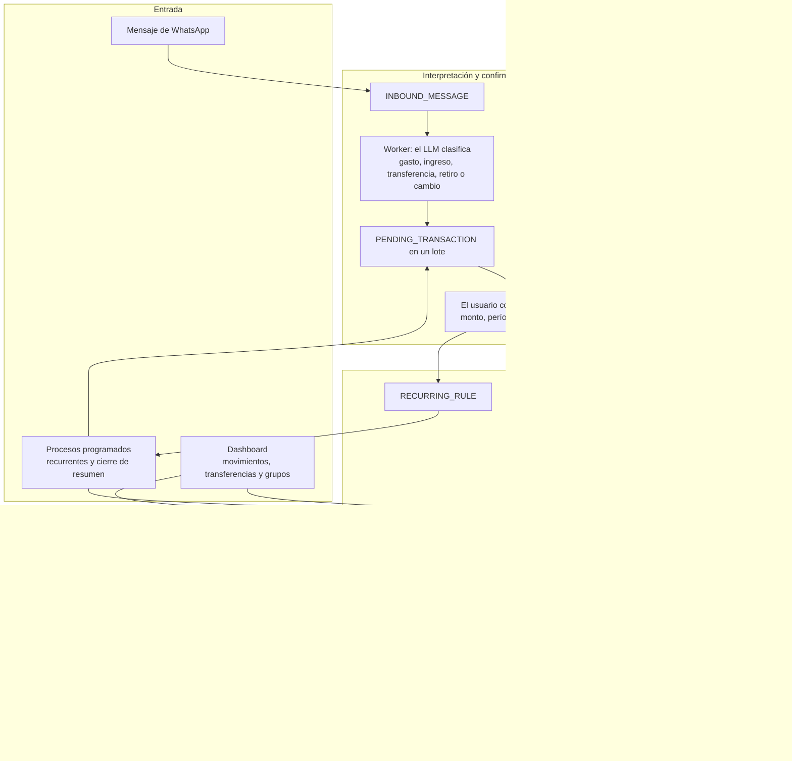

# Platita — Validación de diseño por casos de uso

- **Fecha de la corrida:** 2026-09-27 (tercera corrida)
- **Rama analizada:** `feature/entrega-1-VNZ`, commit `bdeb19a`
- **Corrida anterior:** 2026-09-27, commit `ab2156e` (8 commits antes)

> **Esto no es especificación.** Es un registro: el diagnóstico de la especificación tal como
> estaba en la fecha de la corrida. Sus recomendaciones y sus decisiones D27 y D28 son propuestas,
> no reglas. Ninguna se implementa hasta que la autora la decide y la regla se escribe en el
> documento que corresponde —[reglas de dominio](reglas-de-dominio.md), el
> [modelo de datos](03-modelo-de-datos.md) o un ADR—, que es lo que manda. Criterio en
> [`AGENTS.md`](../AGENTS.md) §10.
>
> **Cómo se actualiza.** No se edita a mano: se vuelve a correr el mismo ejercicio, que lee esta
> corrida, la compara y sobrescribe el archivo. Las decisiones siguen una sola numeración entre
> corridas: D1 a D26 están cerradas, y una referencia vieja nunca apunta a otra decisión.

**Después de esta corrida** se resolvieron D27 y D28, la definición de consulta de §12 (X6), la
hoja de ruta (X7) y el `README.md` (X5), el cambio de presupuesto de un movimiento (A3.9), la
cuota de los grupos y el catálogo base de categorías. Además, la autora decidió que los dos casos
que seguían abiertos se resuelven con lo que ya está definido, sin reglas nuevas:

- **A3.3 · Efectivo de la actividad usado para gastos personales:** se registra como un retiro del
  titular sobre la cuenta de efectivo (§10). Recordarlo es responsabilidad del usuario, no del
  diseño.
- **A5.2 · Plata que un miembro le pasa a otro para gastos del grupo:** quien la da la registra
  como un gasto en su presupuesto individual; quien la recibe, como un ingreso en el suyo; y los
  gastos del grupo los carga quien los paga. El camino no se escribe en la especificación: queda a
  criterio del usuario, con el riesgo aceptado de que cargarla también en el grupo la cuente dos
  veces.

La próxima corrida tiene que tratar estos dos casos como decididos, no como abiertos.

**Documentos analizados**

- `AGENTS.md` (y `CLAUDE.md`, que es un enlace simbólico a él)
- `README.md`
- `llms.txt`
- `prompts.md` (como contexto, no como especificación)
- `docs/01-producto.md`
- `docs/02-arquitectura.md`
- `docs/03-modelo-de-datos.md`
- `docs/04-api.md`
- `docs/05-historias-de-usuario.md`
- `docs/06-tickets.md`
- `docs/07-pull-requests.md`
- `docs/08-convenciones-de-documentacion.md`
- `docs/reglas-de-dominio.md`
- `docs/recorrido-completo.md`
- `docs/convenciones-de-desarrollo.md`
- `docs/hoja-de-ruta.md`
- `docs/terminos-y-privacidad.md`
- `docs/operacion.md`
- `docs/documentacion-viva.md`
- `docs/flujo-de-trabajo-con-ia.md`
- `docs/conversacion-reestructuracion-docs.md` (registro, no especificación)
- `docs/features/TEMPLATE/` (`spec.md`, `ui_contract.md`, `qa_plan.md`, `pr.md`)
- `docs/adr/0001` a `docs/adr/0017`
- `.claude/skills/domain-rules/SKILL.md` y `.claude/commands/` (contexto de trabajo)

No hay diagramas en imagen: todos están en Mermaid, dentro de los Markdown. `site/` se genera
desde `docs/` y no es fuente. La corrida anterior de este archivo se leyó solo para la sección 5.
Los datos de mercado son los de la corrida anterior, del mismo día.

---

## 1. Mapa del diseño (Fase 0)

### 1.1. Documentos existentes

| Documento | Qué cubre | Nivel de detalle |
|---|---|---|
| `01-producto.md` | Objetivo, catálogo must/should/could, fuera de alcance y la secuencia del registro por WhatsApp | Especificación funcional |
| `reglas-de-dominio.md` | Dueño de las reglas de negocio, en 18 grupos. Desde la corrida anterior suma: grupos y actividades con invitaciones, retiro y aporte del titular, un movimiento por presupuesto, moneda de la cuenta nombrada, cuentas de inversión por moneda, plazo fijo, comisiones, alcance de las consultas, indicadores de mercado y las tres clases de respuesta de los consejos | Especificación funcional detallada, con reglas de borde |
| `03-modelo-de-datos.md` | Diagramas ER por área y 26 entidades, con `GROUP_INVITATION` nueva | Diseño técnico |
| `04-api.md` | Webhook, presupuestos y períodos, resumen del período, movimientos, transferencias, grupos e invitaciones, login, exportaciones y borrado de cuenta | Diseño técnico, parcial ("endpoints principales") |
| `05-historias-de-usuario.md` | HU1 a HU7, con la HU7 nueva para crear grupos e invitar | Especificación funcional |
| `06-tickets.md` | Webhook e interpretación, vista de presupuesto y esquema inicial con su seed | Diseño técnico |
| `02-arquitectura.md` y `recorrido-completo.md` | C4, despliegue, seguridad y el recorrido de punta a punta | Diseño técnico |
| `hoja-de-ruta.md` | Pendientes de la entrega 2 y decisiones abiertas, incluidas dos limitaciones aceptadas en esta serie | Idea general y registro de decisiones |
| `terminos-y-privacidad.md` | Índice de lo que tienen que cubrir los términos | Idea general |
| `adr/0001` a `0017` | Decisiones de arquitectura. La 0011 suma la antigüedad máxima de cada fuente | Diseño técnico, con alternativas |
| El resto de `docs/` | Operación, método de trabajo, convenciones y plantillas | No describen comportamiento financiero |

### 1.2. Diseño reconstruido

**Funcionalidades** (`01-producto.md` §1.2): sin cambios de alcance. Must-have: registro por
WhatsApp, cuentas con saldo calculado, transferencias, presupuestos individuales o de grupo,
categorías, dashboard con carga secundaria, alta, login, trazabilidad y configuración regional.
Should-have: tarjetas, recurrentes, consejos, consultas y multimoneda. Could-have: email,
duplicados automáticos, inflación y exportación general.

**Entidades centrales** (`03-modelo-de-datos.md` §3.2):

| Entidad | Qué es |
|---|---|
| `ACCOUNT` | Una moneda por cuenta, saldo calculado. Una cuenta de inversión por moneda; un plazo fijo es una cuenta bancaria |
| `TRANSACTION` | Gasto o ingreso completo, en un solo período. `paired_with` enlaza retiros y aportes del titular, en una cuenta o en dos |
| `TRANSFER` | Entre dos cuentas propias. En la misma moneda, montos iguales; la comisión es un gasto aparte |
| `BUDGET_PERIOD` y `BUDGET` | Período individual o de grupo, sin solapes, `draft` o `confirmed` |
| `FAMILY_GROUP`, `USER_GROUP` y `GROUP_INVITATION` | Familia o actividad; se crea con su primer período y se entra con un código que comparte el dueño |
| `RECURRING_RULE` y `CARD_STATEMENT` | Reglas fijas o variables, compras con tarjeta y resúmenes conciliados |
| `PENDING_TRANSACTION` y `PENDING_BATCH` | Lo que espera una decisión del usuario, en lotes numerados |
| `ADVICE_DOCUMENT`, `INDICATOR_VALUE` y `EXCHANGE_RATE` | Base de educación financiera, indicadores y cotizaciones, con antigüedad máxima por fuente |

**Flujo central: cómo entra, cómo se guarda y cómo se consulta un dato**

```mermaid
flowchart TB
    subgraph ENTRADA["Entrada"]
        WA["Mensaje de WhatsApp"]
        DASH["Dashboard<br/>movimientos, transferencias y grupos"]
        CRON["Procesos programados<br/>recurrentes y cierre de resumen"]
    end
    subgraph PROCESO["Interpretación y confirmación"]
        INB["INBOUND_MESSAGE"]
        WK["Worker: el LLM clasifica<br/>gasto, ingreso, transferencia, retiro o cambio"]
        PEND["PENDING_TRANSACTION en un lote"]
        CONF["El usuario confirma cuenta,<br/>monto, período y cotización"]
    end
    subgraph DATOS["Registro"]
        TX["TRANSACTION<br/>refund_of y paired_with"]
        TR["TRANSFER"]
        RR["RECURRING_RULE"]
    end
    subgraph LECTURA["Consulta"]
        SALDO["Saldo por cuenta<br/>aportado neto aparte"]
        SUM["Resumen del período<br/>con lo retirado de inversiones"]
        FN["Funciones de solo lectura<br/>con alcance de presupuesto"]
        ADV["Consejos: información,<br/>educación o decisión"]
    end
    WA --> INB --> WK --> PEND --> CONF
    CONF --> TX
    CONF --> TR
    CONF --> RR
    DASH --> TX
    DASH --> TR
    RR --> CRON
    CRON --> TX
    CRON --> PEND
    TX --> SALDO
    TR --> SALDO
    TX --> SUM
    TR --> SUM
    TX --> FN
    FN --> ADV
```

- **Entrada.** Fecha, moneda (la de la cuenta nombrada, o la primaria) y categoría se completan
  solas y se muestran; monto, cuenta y período se confirman siempre (`reglas-de-dominio.md` §1).
- **Registro.** Un movimiento pertenece a un solo presupuesto (§1). El retiro y el aporte del
  titular son pares enlazados entre el presupuesto de un grupo y el individual (§10).
- **Consulta.** Las funciones de §17 suman el presupuesto individual por defecto, un grupo si se
  lo nombra, o todo si se pide el total. Los consejos responden en tres clases, y ante una
  decisión enseñan criterios sin dar veredicto (§18).

### 1.3. Decisiones confirmadas en la documentación

Las tres están documentadas y ya no tienen contradicciones con otros documentos. El detalle está
en la sección 2.

### 1.4. Áreas sin cobertura

1. **Qué cuota consume crear un grupo o invitar por WhatsApp.** §12 no lo dice. **[INFERIDO]**
   registro.
2. **El catálogo base completo de categorías.** El seed del Ticket 3 nombra solo las especiales.
3. **Alta y edición de cuentas desde el dashboard**, que pide la HU1 y no tiene endpoint
   (`recorrido-completo.md` §13).
4. **El camino transitorio para la plata entre miembros** mientras no exista la cuenta
   compartida (A5.2).

### 1.5. Contradicciones visibles entre documentos

| # | Contradicción | Documentos |
|---|---|---|
| X4 | Siguen registradas en la hoja de ruta: cuotas en YAML contra "sin desplegar", rama de despliegue y quién genera las alertas con RAG | `hoja-de-ruta.md`, Decisiones abiertas |
| X5 | *No es especificación, se reporta igual:* el `README.md` describe la lectura de emails como un módulo que existe, y dice "44 casos" de esta validación | `README.md` contra `01-producto.md` §1.2 |
| X6 | La tabla de cuotas dice que un dato de mercado es una consulta, pero el texto que la sigue define la consulta como "una que solo usa datos propios". No se contradicen, pero el texto quedó incompleto | `reglas-de-dominio.md` §12 |
| X7 | *No es especificación:* la hoja de ruta dice que las decisiones D13 a D26 están abiertas en este informe; ahora están cerradas y las abiertas son D27 y D28 | `hoja-de-ruta.md`, Decisiones abiertas |

X1, X2 y X3 de la corrida anterior quedaron resueltas (sección 5).

### 1.6. Preguntas bloqueantes

Ninguna.

---

## 2. Decisiones confirmadas

| Decisión | ¿Documentada? | Dónde | Contradicciones | Casos límite sin resolver |
|---|---|---|---|---|
| **1. Actividades** con presupuesto propio y autotransferencias para pagarse un sueldo | Sí | `reglas-de-dominio.md` §10 ("Crear un grupo", "Invitar", "El retiro del titular", "El retiro es igual con una cuenta o con dos", "El aporte del titular es el camino inverso", "Retiros y aportes no cuentan en los totales consolidados"); §18 (consejos sobre un grupo de un solo miembro); `03-modelo-de-datos.md` TRANSACTION `paired_with` y GROUP_INVITATION; `04-api.md` grupos; HU7; seed del Ticket 3 | Ninguna | El efectivo de la actividad usado para gastos personales sin registrar un retiro (A3.3). Un gasto mixto va entero a un presupuesto por decisión (A3.8) |
| **2. Cuentas de inversión opacas** | Sí | `reglas-de-dominio.md` §2 ("Una cuenta de inversión solo recibe aportes y retiros", "Una cuenta de inversión por moneda", "El aportado neto no suma en ningún total"); §17 (Saldos y lo retirado de inversiones); HU1; `04-api.md` resumen del período | Ninguna. La compra de MEP adentro del broker es la única operación interna que se registra, y la regla explica por qué | Lo retirado de inversiones cuenta también la compra de MEP entre dos cuentas de inversión (A4.10) |
| **3. Educación, no recomendación** | Sí | `reglas-de-dominio.md` §18 (tres clases, estructura de una respuesta de decisión, insistencia, antigüedad máxima, información con nombre de entidad, consejo de una alerta); §17 (Indicadores); `01-producto.md` §1.1 y §1.2; `terminos-y-privacidad.md`; `03-modelo-de-datos.md` ("educación financiera") | Ninguna | Detectar que una insistencia es "sobre la misma pregunta" queda en manos del modelo. No hay fuente de datos con nombre de entidad en el MVP |

---

## 3. Supuestos asumidos

- **Público objetivo:** personas y hogares de Argentina, adultos de 18 a 75 años [supuesto],
  bancarizados y usuarios de WhatsApp, con varias cuentas, billeteras y monedas, y
  monotributistas con una actividad (`01-producto.md` §1.1; decisión 1). Lanzamiento solo en
  Argentina (ADR 0011).
- **Canales:** WhatsApp como canal principal y dashboard web para ver, configurar y cargar
  gastos, ingresos y transferencias (ADR 0002).
- **Fuera de alcance:** modo offline, lectura de capturas y conexión con bancos
  (`01-producto.md` §1.2, `AGENTS.md` §1). Email y duplicados automáticos son could-have.
- Se evalúa el diseño completo documentado, incluidas las should-have.
- La cotización de referencia del usuario es MEP.
- Los montos y normas son de septiembre de 2026 (sección 14). Son orientativos.
- **[INFERIDO]** marca lo que se deduce sin estar escrito. Las frecuencias sin fuente llevan
  **[ESTIMADO]**.

---

## 4. Resumen ejecutivo

**Madurez general: alta.** Las 14 decisiones de la corrida anterior están cerradas: 12 con una
regla escrita, D15 por decisión de no dividir gastos y D18 aceptada como limitación conocida. Las
tres decisiones confirmadas quedaron reflejadas sin contradicciones. Los huecos que quedan son
chicos y de borde, y dos de ellos los abrieron reglas nuevas de esta serie.

De los 46 casos recorridos (los 44 anteriores y 2 nuevos):

| Veredicto | Casos |
|---|---|
| INCORRECTO | 2 |
| CONTRADICTORIO | 0 |
| NO ESPECIFICADO | 0 |
| NO SOPORTADO | 2 |
| PARCIAL | 2 |
| SOPORTADO | 40 |

**Los problemas que quedan, por gravedad**

1. **Lo retirado de inversiones cuenta la compra de MEP adentro del broker** (INCORRECTO, A4.10,
   nuevo). La regla suma "las transferencias que salieron" de las cuentas de inversión, y la
   compra de MEP es una transferencia entre dos de ellas. Diego compra USD 1.000 dentro de Balanz
   y su resumen muestra $1.544.350 "retirados de inversiones" que nunca salieron.
2. **Una devolución con tarjeta infla el ingreso y deja el gasto en su rubro** (INCORRECTO, A1.4).
   Está aceptado como limitación conocida en la hoja de ruta: la conciliación cuadra el total,
   pero no el reparto.
3. **Aceptar una invitación con un nombre de grupo que ya se usa deja al invitado bloqueado sin
   explicación** (PARCIAL, A5.7, nuevo). La regla dice que el dueño renombra, pero no qué se le
   dice al invitado, ni al dueño, ni qué pasa con el código.
4. **El efectivo de la actividad se usa para gastos personales sin que nada lo señale** (PARCIAL,
   A3.3). El retiro existe, pero depende de que la usuaria se acuerde.
5. **La plata que un miembro le pasa a otro para gastos del grupo** sigue sin camino hasta la
   cuenta compartida (NO SOPORTADO, A5.2). Si cada uno la registra a su manera, el grupo puede
   contarla dos veces.

**Decisiones pendientes:** D27 (qué cuenta como retirado de inversiones) y D28 (conflicto de
nombre al aceptar una invitación). Las dos son de una línea.

---

## 5. Comparación con la corrida anterior

La corrida anterior, del mismo día en el commit `ab2156e`, recorrió 44 casos: 2 INCORRECTO, 2
CONTRADICTORIO, 10 NO ESPECIFICADO, 2 NO SOPORTADO, 6 PARCIAL y 22 SOPORTADO.

### 5.1. Casos que cambiaron de veredicto

| Caso | Antes | Ahora | Qué lo cerró |
|---|---|---|---|
| A3.6 · Sueldo desde una cuenta separada | INCORRECTO | SOPORTADO | §10 "El retiro es igual con una cuenta o con dos" (D13) |
| A3.7 · Aporte personal a la actividad | CONTRADICTORIO | SOPORTADO | §10 "El aporte del titular es el camino inverso"; `paired_with` en los dos sentidos (D14) |
| A1.6 · "¿Me conviene este préstamo?" | CONTRADICTORIO | SOPORTADO | §18, estructura de una respuesta de decisión; `01-producto.md` §1.1 y §1.2 (D23) |
| A3.8 · Gasto mixto | NO ESPECIFICADO | NO SOPORTADO, por decisión | §1 "Un movimiento, un presupuesto" (D15) |
| A4.2 · Retiros del broker para gastos | NO ESPECIFICADO | SOPORTADO | §17 "Lo retirado de inversiones se muestra aparte" (D21) |
| A2.3 · Comisión en una transferencia | NO ESPECIFICADO | SOPORTADO | §13 "Una comisión en una transferencia es un gasto aparte" (D19) |
| A3.1 · Crear la actividad | NO ESPECIFICADO | SOPORTADO | §10 "Crear un grupo"; HU7; `04-api.md` (D16) |
| A4.4 · Aportar pesos y retirar dólares | NO ESPECIFICADO | SOPORTADO | §2 "Una cuenta de inversión por moneda" (D20) |
| A4.5 · Total en el dashboard | NO ESPECIFICADO | SOPORTADO | §2 "El aportado neto no suma en ningún total"; HU1 (D20) |
| A4.7 · Plazo fijo | NO ESPECIFICADO | SOPORTADO | §2 "Un plazo fijo es una cuenta bancaria" (D22) |
| A2.6 · Insistencia | NO ESPECIFICADO | SOPORTADO | §18 "Si el usuario insiste" (D23) |
| A4.9 · "¿Qué banco paga más?" | NO ESPECIFICADO | SOPORTADO | §18 "Información con nombre de entidad, solo si una fuente la publica" (D24) |
| A5.6 · "¿A cuánto está el MEP?" | NO ESPECIFICADO | SOPORTADO | §17 función Indicadores; §18 "Preguntar un dato de mercado es una consulta" (D24) |
| A3.10 · Consejo sobre la actividad | NO SOPORTADO | SOPORTADO | §18 "La excepción es un grupo de un solo miembro" (D17) |
| A2.2 · Moneda sin decir | PARCIAL | SOPORTADO | §1 "La moneda sale de la cuenta nombrada" (D25) |
| A1.2 · Aguinaldo en el borrador | PARCIAL | SOPORTADO | §3, corregir el ingreso estimado al confirmar (D26) |
| A3.5 · Consolidado | PARCIAL | SOPORTADO | §17 "A qué presupuesto se refiere una pregunta" |
| A2.5 · Excedente | PARCIAL | SOPORTADO | §18 (D23) |
| A6.7 · Cuota contra la jubilación | PARCIAL | SOPORTADO | §18, los datos del usuario como cálculo, sin adjetivo (D23) |
| A1.4 · Devolución con tarjeta | INCORRECTO | INCORRECTO, aceptado como limitación | `hoja-de-ruta.md` (D18) |

Siguen igual: A3.3 (PARCIAL) y A5.2 (NO SOPORTADO).

### 5.2. Decisiones pendientes que se cerraron

| Decisión | Cómo se cerró |
|---|---|
| D13 · Retiro entre cuentas separadas | Opción 1: el par enlazado, con cada mitad en su cuenta; con monedas distintas, la misma cotización en las dos mitades |
| D14 · Aporte a la actividad | Opción 1: par simétrico, con dos categorías base nuevas |
| D15 · Gastos mixtos | Opción 3: un movimiento pertenece a un solo presupuesto; el asistente no propone dividir |
| D16 · Crear un grupo | Variante de la opción 1: por WhatsApp o el dashboard, con primer período confirmado, e invitación por un código que comparte el dueño, no por teléfono. Volver a un grupo reabre la membresía; guardar varios intervalos quedó como mejora |
| D17 · Consejos sobre la actividad | Opción 1 |
| D18 · Devoluciones con tarjeta | Opción 3: limitación conocida, no bloqueante |
| D19 · Comisiones | Opción 1 |
| D20 · Inversiones: monedas y totales | Opción 1 |
| D21 · Retiros de inversiones | Opción 1, solo en períodos individuales |
| D22 · Plazo fijo | Opción 1; el vencimiento no se agenda |
| D23 · Preguntas de decisión | Opción 1, con la terminología corregida en cuatro documentos |
| D24 · Información de mercado | Opción 1: función Indicadores, antigüedad máxima por fuente, datos con nombre solo con fuente |
| D25 · Moneda de la cuenta nombrada | Opción 1 |
| D26 · Ingreso estimado | Opción 1 |

### 5.3. Problemas nuevos

- **A4.10** (INCORRECTO): la regla de D21 cuenta la transferencia de MEP que habilitó D20. Las
  dos reglas son correctas por separado; el cruce no se revisó.
- **A5.7** (PARCIAL): la regla de nombre único de D16 no define la conversación cuando bloquea
  una aceptación.
- **X6 y X7**: dos textos que quedaron atrás de las reglas nuevas.

### 5.4. Problemas que siguen abiertos

- A3.3 y A5.2, sin cambios.
- El catálogo base de categorías sigue sin definirse.
- El `README.md` sigue describiendo la lectura de emails como si existiera (X5).
- Las contradicciones operativas de la hoja de ruta (X4).

---

## 6. Arquetipos

| Arquetipo | Situación | Qué necesita de Platita |
|---|---|---|
| **A1 · Lucía, asalariada** | 34 años, CABA. Sueldo neto de $1.450.000 con paritarias. Galicia en pesos y en dólares, Mercado Pago, Visa con saldo en pesos y en dólares. Paga ChatGPT en dólares | Saber en qué se le va la plata, llegar al vencimiento sin sorpresas y entender qué cuesta un préstamo |
| **A2 · Martín, freelancer que cobra del exterior** | 29 años, desarrollador, monotributista. Factura unos USD 2.500 por mes con factura E y cobra por Payoneer; a veces en USDT. Vende dólares al MEP | Llevar ingresos en dólares y gastos en pesos sin mezclar monedas, y aprender qué hacer con lo que ahorra |
| **A3 · Carla, microemprendedora** (obligatorio) | 38 años, Morón. Vende viandas y tortas; monotributo categoría A ($49.527). Cobra por el mismo Mercado Pago que usa para lo personal y en efectivo en ferias. Factura unos $2.400.000 por mes y se paga $900.000 | Separar la actividad de lo personal, pagarse un sueldo y saber si el emprendimiento se sostiene |
| **A4 · Diego, inversor** (obligatorio) | 46 años, Rosario. Empleado con $2.100.000 netos. Tiene CEDEARs y FCI en Balanz, en pesos y en dólares, saldo remunerado en Mercado Pago y un plazo fijo. Completa los gastos del mes retirando del broker | Saber cuánto puso y sacó de cada inversión, sin que Platita pretenda saber cuánto vale |
| **A5 · Sofía y Nico, pareja** | Convivientes, cada uno con sus cuentas. Presupuesto de grupo "Casa". Alquiler de $850.356 con ajuste por IPC. Sofía también está en el grupo "Familia" de sus padres | Ver cuánto llevan gastado entre los dos y cuánto puso cada uno |
| **A6 · Norma, jubilada** | 70 años, Lanús. Cobra $505.748,51 (mínima más bono, octubre de 2026) en Cuenta DNI. Usa efectivo y reintegros. Su hija la ayuda con la computadora | Registrar simple, controlar el efectivo y entender qué es cada cosa antes de que le ofrezcan algo |

---

## 7. Matriz de casos

Frecuencias: salvo cita, **[ESTIMADO]**. Orden: veredicto y, dentro de cada uno, de más a menos
frecuente. A3 y A4 tienen más de seis casos porque incluyen los casos límite obligatorios.

| # | Arquetipo | Caso | Tipo | Frecuencia | Veredicto | Evidencia (doc/sección) | Cambio mínimo | Parte afectada |
|---|---|---|---|---|---|---|---|---|
| A4.10 | A4 | Compra USD 1.000 al MEP ($1.544.350) dentro de Balanz, de "Balanz ARS" a "Balanz USD" | Incómodo (inversión) | Mensual | INCORRECTO | `reglas-de-dominio.md` §2 ("Una cuenta de inversión por moneda": la compra es una transferencia entre las dos) y §17 ("la suma de las transferencias que salieron de ellas") | Contar solo las transferencias de una cuenta de inversión a una que no lo es (D27) | Reportes, cuentas de inversión |
| A1.4 | A1 | Devuelve unas zapatillas de $180.000 compradas en 3 cuotas, después de pagar la primera | Incómodo (devolución) | Ocasional | INCORRECTO (limitación aceptada) | `reglas-de-dominio.md` §13 y §16; `hoja-de-ruta.md` ("Devoluciones con tarjeta: limitación conocida") | Ninguno por ahora: decidido como no bloqueante | Flujo de ingesta, reportes |
| A3.8 | A3 | El celular ($60.000 por mes) lo usa para la actividad y para lo personal | Incómodo (gasto mixto) | Mensual | NO SOPORTADO (por decisión) | §1 "Un movimiento, un presupuesto" | — | — |
| A5.2 | A5 | Sofía le transfiere $300.000 a Nico para gastos de la casa | Incómodo (entre personas) | Mensual | NO SOPORTADO | §10 (saldar entre miembros queda para la cuenta compartida); `hoja-de-ruta.md` ("Cuenta compartida de un grupo familiar: a futuro") | Documentar el camino transitorio (pregunta 2) | Grupos |
| A3.3 | A3 | Hace 22 ventas en efectivo en la feria del sábado, y con esa plata paga la verdulería | Incómodo (efectivo) | Semanal | PARCIAL | §5 (lotes de 10), §12 (50 mensajes de registro por día), §10 (retiro manual) | El cierre del período de la actividad muestra su resultado y recuerda registrar como retiro lo usado para gastos personales | Actividades |
| A5.7 | A5 | Nico invita a Sofía a su grupo "Familia"; Sofía ya está en el grupo "Familia" de sus padres | Incómodo (grupos) | Ocasional | PARCIAL | §10 ("El nombre no se repite entre los grupos de un usuario… Si coincide, el dueño lo renombra") y "Aceptar" | Definir qué se le dice al invitado y al dueño, y que el código no se consume (D28) | Grupos |
| A1.1 | A1 | "Gasté 58.400 en el super con la Galicia" | Cotidiano | Diaria | SOPORTADO | `01-producto.md` §1.3; §1 y §3 | — | — |
| A3.2 | A3 | Cobra una vianda de $18.000 por el Mercado Pago que usa también para lo personal | Cotidiano (actividad) | Diaria | SOPORTADO | §10 (cuenta y presupuesto independientes), §1 | — | — |
| A6.3 | A6 | Saca $150.000 del cajero y paga en efectivo | Cotidiano (efectivo) | Semanal (1,7 extracciones por adulto por mes, BCRA 30/04/2026) | SOPORTADO | §13 (sacar efectivo es transferencia) | — | — |
| A5.1 | A5 | Nico paga el super de $92.000 con su Mercado Pago y lo imputa a "Casa" | Cotidiano | Semanal | SOPORTADO | §1, §5 y §10 | — | — |
| A5.6 | A5 | "¿A cuánto está el MEP hoy?" antes de comprar dólares | Educación (información) | Semanal | SOPORTADO | §17 función Indicadores; §18 "Preguntar un dato de mercado es una consulta" y "Cada fuente tiene una antigüedad máxima" | — | — |
| A6.2 | A6 | Reintegro de $3.200 de Cuenta DNI por una compra de $16.000 | Incómodo (reintegro) | Semanal | SOPORTADO | §16 (`refund_of`) | — | — |
| A1.5 | A1 | Responde "eran 3.800" citando el "Listo…" | Error (monto) | Semanal | SOPORTADO | §15 | — | — |
| A4.5 | A4 | Mira el dashboard: ¿cuánto tiene en total? | Cotidiano (revisar) | Semanal | SOPORTADO | §2 "El aportado neto no suma en ningún total"; HU1 | — | — |
| A5.4 | A5 | Los dos cargan el mismo super de $92.000 a "Casa" | Error (duplicado) | Mensual | SOPORTADO | §7 "Entre miembros de un grupo" | — | — |
| A1.3 | A1 | ChatGPT (USD 20) en la Visa USD, pagado en pesos al dólar tarjeta ($2.002) | Incómodo (moneda extranjera) | Mensual | SOPORTADO | §13 "Una tarjeta en otra moneda" y "El residuo al pagar" | — | — |
| A2.1 | A2 | Cobra USD 2.450 en Payoneer; su presupuesto es en pesos | Cotidiano (ingreso en USD) | Mensual | SOPORTADO | §6 | — | — |
| A2.2 | A2 | "Me pagaron 2400 en Payoneer", sin decir la moneda | Error (moneda) | Mensual | SOPORTADO | §1 "La moneda sale de la cuenta nombrada" | — | — |
| A2.3 | A2 | Pasa USD 2.450 de Payoneer a Galicia USD y llegan USD 2.401 | Incómodo (comisión) | Mensual | SOPORTADO | §13 "Una comisión en una transferencia es un gasto aparte"; seed del Ticket 3 ("Comisiones") | — | — |
| A2.4 | A2 | Un cliente le paga USD 600 en USDT a Binance | Incómodo (moneda) | Mensual | SOPORTADO | §2 "Una stablecoin es una cuenta en dólares" | — | — |
| A2.5 | A2 | "Me sobraron USD 3.000 este mes, ¿qué hago?" | Educación (decisión) | Mensual | SOPORTADO | §18 "Cómo se responde una pregunta de decisión" (prioridades generales como criterio) | — | — |
| A3.4 | A3 | Se paga $900.000 de sueldo; todo pasa por el mismo Mercado Pago | Incómodo (actividad) | Mensual | SOPORTADO | §10 "El retiro del titular"; TRANSACTION `paired_with` | — | — |
| A3.5 | A3 | "¿Cuánto gasté este mes?" y "¿cuánto gasté contando todo?" | Cotidiano (revisar) | Mensual | SOPORTADO | §17 "A qué presupuesto se refiere una pregunta"; §10 "Retiros y aportes no cuentan en los totales consolidados" | — | — |
| A3.6 | A3 | Con una cuenta Galicia propia de la actividad, se transfiere $900.000 de sueldo a su Mercado Pago | Incómodo (actividad) | Mensual | SOPORTADO | §10 "El retiro es igual con una cuenta o con dos" | — | — |
| A3.9 | A3 | Imputó la harina ($35.000) al presupuesto personal en vez de a la actividad | Error (actividad equivocada) | Mensual | SOPORTADO [INFERIDO] | §15 (corrección; si cambia de período se reconfirma) | Nombrar el presupuesto entre los campos corregibles de §15 | Flujo de ingesta |
| A3.10 | A3 | "¿Cuánto me puedo pagar de sueldo sin fundir el emprendimiento?" | Educación (decisión con datos) | Mensual | SOPORTADO | §18 "La excepción es un grupo de un solo miembro" y "Cómo se responde una pregunta de decisión" | — | — |
| A4.1 | A4 | Aporta $500.000 de Galicia a Balanz ARS | Cotidiano (inversión) | Mensual | SOPORTADO | §2 y §13; `POST /transfers` | — | — |
| A4.2 | A4 | Retira $400.000 por mes de Balanz para completar los gastos | Incómodo (inversión) | Mensual | SOPORTADO | §17 "Lo retirado de inversiones se muestra aparte"; `04-api.md` `withdrawn_from_investments` | — | — |
| A4.6 | A4 | Mercado Pago le rinde $11.400 en el mes (18,62% TNA) | Cotidiano (rendimiento) | Mensual | SOPORTADO | §2 (contraste mensual, "Rendimientos") | — | — |
| A4.7 | A4 | Arma un plazo fijo de $3.000.000 a 30 días al 20% de TNA | Incómodo (inversión) | Mensual | SOPORTADO | §2 "Un plazo fijo es una cuenta bancaria" | — | — |
| A5.5 | A5 | El alquiler sube por IPC en el ajuste | Cotidiano (recurrente variable) | Mensual | SOPORTADO | §8 | — | — |
| A6.1 | A6 | Cobra la jubilación con aumento mensual y el bono de $70.000 | Cotidiano (ingreso) | Mensual | SOPORTADO | §8 (regla variable para la jubilación, fija para el bono) | — | — |
| A1.2 | A1 | Cobra aguinaldo de $725.000 en junio; el borrador de julio copia ese ingreso | Incómodo (aguinaldo) | Semestral (30/06 y 18/12, iProfesional 2026) | SOPORTADO | §3 "Confirmar tal cual, por WhatsApp" (corrige el ingreso estimado) | — | — |
| A1.6 | A1 | "Me ofrecen un préstamo de $3.000.000 al 99% de TNA (CFTEA 207,94%), ¿me conviene?" | Educación (decisión) | Ocasional | SOPORTADO | §18 "Tres clases de respuesta" y "Cómo se responde una pregunta de decisión" | — | — |
| A2.6 | A2 | Insiste: "no me expliques, decime vos: ¿CEDEARs o plazo fijo en dólares?" | Educación (decisión) | Ocasional | SOPORTADO | §18 "Si el usuario insiste" | — | — |
| A3.1 | A3 | Crea la actividad "Cocina de Carla" | Cotidiano (configuración) | Ocasional | SOPORTADO | §10 "Crear un grupo" y "El primer período nace con el grupo"; HU7; `POST /family-groups` | — | — |
| A3.7 | A3 | Pone $250.000 de sus ahorros para comprar un horno para la actividad | Incómodo (actividad) | Ocasional | SOPORTADO | §10 "El aporte del titular es el camino inverso"; seed del Ticket 3 | — | — |
| A4.3 | A4 | Aportó $2.000.000 en total y retira $2.600.000 | Incómodo (inversión) | Ocasional | SOPORTADO | §2 (aportado neto negativo, fuera de los totales) | — | — |
| A4.4 | A4 | Aporta pesos a Balanz, compra MEP adentro y retira USD 1.000 a Galicia USD | Incómodo (inversión, monedas) | Ocasional | SOPORTADO | §2 "Una cuenta de inversión por moneda" | — | — |
| A4.8 | A4 | Registró el aporte desde Mercado Pago cuando salió de Galicia | Error (cuenta) | Ocasional | SOPORTADO | §15 | — | — |
| A4.9 | A4 | "¿Qué banco paga más por un plazo fijo?" | Educación (información) | Ocasional | SOPORTADO | §18 "Información con nombre de entidad, solo si una fuente la publica" (en el MVP ofrece el promedio) | — | — |
| A5.3 | A5 | Heladera de $1.200.000 en 12 cuotas sin interés con la tarjeta de Sofía | Incómodo (cuotas) | Ocasional | SOPORTADO | §8 y §13 | — | — |
| A6.4 | A6 | Borra por error la farmacia de $27.300 y la recupera | Error (borrado) | Ocasional | SOPORTADO | §15 "Borrar y restaurar" | — | — |
| A6.5 | A6 | "¿Qué es un fondo común de inversión?" | Educación (concepto) | Ocasional | SOPORTADO | §18, clase educación | — | — |
| A6.6 | A6 | "¿Cuánto paga hoy un plazo fijo?" | Educación (información) | Ocasional | SOPORTADO | §17 Indicadores; §18 | — | — |
| A6.7 | A6 | "Si saco $1.000.000 en 12 cuotas de $140.000, ¿qué parte de mi jubilación es?" | Educación (decisión con datos) | Ocasional | SOPORTADO | §18, paso 3: los datos del usuario como cálculo, sin adjetivo | — | — |

---

## 8. Detalle de los casos INCORRECTO y CONTRADICTORIO

### A4.10 · La compra de MEP adentro del broker cuenta como retiro (INCORRECTO)

**Qué hace el usuario.** Diego tiene "Balanz ARS" y "Balanz USD", como pide §2. El 12 de octubre
compra USD 1.000 al MEP ($1.544,35) dentro de Balanz, con pesos que ya estaban ahí. No sale plata
de Balanz.

**Recorrido en el diseño.**

1. §2, "Una cuenta de inversión por moneda": la compra es una transferencia de $1.544.350 de
   Balanz ARS a USD 1.000 en Balanz USD, con la cotización que Diego confirma.
2. §17, "Lo retirado de inversiones se muestra aparte": el resumen del período individual suma
   "las transferencias que salieron" de las cuentas de inversión con fecha en el período.
3. La transferencia salió de Balanz ARS, que es una cuenta de inversión.

**Dónde falla.** El resumen de octubre muestra $1.544.350 retirados de inversiones, además de los
$400.000 que Diego sí retiró. Parece que financió el mes con $1.944.350 de ahorro, cuando lo
retirado fueron $400.000. Las dos reglas se escribieron bien por separado —D20 y D21—, pero la de
D21 da por hecho que toda transferencia que sale de una cuenta de inversión termina fuera de las
inversiones, y D20 creó la primera excepción.

### A1.4 · Devolución de una compra en cuotas (INCORRECTO, limitación aceptada)

El recorrido es el de la corrida anterior: la acreditación del banco llega como un ajuste en
"Devoluciones y reintegros" que no se vincula a la compra (§13 y §16), así que suma como ingreso
del período y "Ropa" conserva lo gastado. Las cuotas restantes se generan hasta que la usuaria
borra la regla. La autora lo aceptó como limitación conocida y no bloqueante, con la conciliación
como red: el total de la tarjeta queda bien (`hoja-de-ruta.md`, Decisiones abiertas). No se
propone cambio en esta corrida.

---

## 9. Educación financiera

| Caso | Tipo (información/educación/decisión) | Respuesta prevista | ¿Enseña a razonar sin dar veredicto? | Fuente y actualización de datos |
|---|---|---|---|---|
| **A6.5** · "¿Qué es un FCI?" | Educación | Conceptos, riesgos y costos (§18) | Sí | Base curada (`ADVICE_DOCUMENT`), revisión manual con `last_reviewed_at` |
| **A6.6** · "¿Cuánto paga hoy un plazo fijo?" | Información | Tasa promedio del BCRA con su fecha, por la función Indicadores; cuenta como consulta (§17, §18) | No aplica: es un dato | `INDICATOR_VALUE`, con antigüedad máxima configurable por fuente (ejemplo: 10 días). Pasado el plazo, dice la fecha en vez de usarlo |
| **A5.6** · "¿A cuánto está el MEP?" | Información | Última cotización de la fuente, con su fecha (§17 Indicadores) | No aplica | `EXCHANGE_RATE` (ADR 0011); antigüedad máxima de ejemplo, 3 días |
| **A4.9** · "¿Qué banco paga más?" | Información | Sin fuente con nombre de entidad en el MVP: dice que no tiene el dato y ofrece el promedio. Con fuente, lista ordenada por nombre | No aplica; evita el orden de preferencia | Ninguna fuente por entidad en el MVP |
| **A1.6** · "¿Me conviene un préstamo al 99%?" | Decisión | Conceptos (deuda buena y mala, CFT contra TNA), criterios, sus datos como cálculo, cierre fijo (§18) | Sí | El usuario trae la tasa; el CFT tiene que informarse destacado (BCRA) |
| **A2.5** · "Me sobraron USD 3.000" | Decisión | La misma estructura; ordenar prioridades es un criterio que se explica, no una indicación (§18) | Sí | Datos propios por las funciones de §17 |
| **A2.6** · Insiste "decime vos" | Decisión | Explica una vez el límite y ofrece revisar un criterio; a la segunda, texto fijo (§18) | Sí | — |
| **A6.7** · "¿Qué parte de mi jubilación es la cuota?" | Decisión con datos | El cálculo ("la cuota sería el 28%…"), sin adjetivo (§18) | Sí | Ingresos del historial real (§17) |
| **A3.10** · "¿Cuánto me puedo pagar de sueldo?" | Decisión con datos | La misma estructura, leyendo los períodos de la actividad porque Carla es su único miembro (§18) | Sí | Presupuesto de la actividad y el individual |

**Huecos del diseño en esta área**

1. **La insistencia la detecta el modelo.** "Si vuelve a insistir sobre la misma pregunta" no se
   puede verificar sin interpretar el mensaje. La forma de la respuesta es verificable; la
   detección, no. Es el mismo criterio que la clasificación del tipo de un movimiento.
2. **No hay fuente de datos con nombre de entidad.** La regla está lista, pero hasta que se
   configure una fuente, "¿qué banco paga más?" siempre responde con el promedio.
3. **Los umbrales de antigüedad son ejemplos.** §18 los da como "por ejemplo"; el valor real vive
   en la configuración de cada fuente (ADR 0011). Conviene fijarlos en el archivo al crearlo.
4. **X6:** el texto de §12 que define la consulta no menciona los datos de mercado, aunque la
   tabla sí.

---

## 10. Decisiones pendientes (Fase 3)

### D27 · Qué cuenta como retirado de inversiones

- **Contexto:** la suma de lo retirado incluye transferencias entre dos cuentas de inversión.
- **Casos que la originan:** A4.10.
- **Opciones:**
  1. Contar solo las transferencias de una cuenta de inversión a una que no lo es.
  2. Contar el neto: lo que salió de las cuentas de inversión menos lo que entró a ellas en el
     período.
  3. Excluir solo las transferencias entre cuentas de la misma institución.
- **Consecuencias:**
  1. Una línea, determinista, y deja fuera la compra de MEP y cualquier movimiento entre brokers.
  2. Muestra el desahorro neto, pero un mes en que el usuario aporta y retira mostraría cero, y
     esconde que retiró.
  3. Depende del campo `institution`, que es opcional, y falla entre dos brokers distintos.
- **Recomendación:** opción 1.
- **Dónde registrarla:** `reglas-de-dominio.md` §17; el comentario de `withdrawn_from_investments`
  en `04-api.md`.

### D28 · Conflicto de nombre al aceptar una invitación

- **Contexto:** la regla impide sumarse a un grupo cuyo nombre coincide con otro del invitado, y
  dice que el dueño renombra, pero no qué pasa en la conversación.
- **Casos que la originan:** A5.7.
- **Opciones:**
  1. El asistente le explica al invitado que ya está en un grupo con ese nombre y que el dueño
     tiene que cambiarlo. El código no se consume y sigue valiendo hasta que vence. Si el dueño
     dio permiso para avisos, recibe un mensaje con el motivo. Cuando renombra, el invitado vuelve
     a escribir el mismo código.
  2. El invitado elige un nombre propio para ese grupo, que solo ve él.
  3. El invitado renombra su otro grupo, si es el dueño.
- **Consecuencias:**
  1. No toca el modelo y deja la decisión en quien la regla ya nombra. Suma una plantilla o un
     parámetro a "Miembro nuevo".
  2. Resuelve sin esperar a nadie, pero exige un nombre por membresía, una columna nueva que la
     regla de "sin tipo de grupo" quiso evitar.
  3. Solo sirve si el invitado es dueño del otro grupo; Sofía no lo es del de sus padres.
- **Recomendación:** opción 1.
- **Dónde registrarla:** `reglas-de-dominio.md` §10 ("Aceptar") y §11 (plantilla).

---

## 11. Patrones

1. **Las reglas que suman sobre un tipo de cuenta suponen que no hay movimientos internos.**
   - *Casos:* A4.10.
   - *Causa en el diseño:* lo retirado de inversiones se definió por el tipo de la cuenta de
     origen, sin mirar el destino. Mientras nada se movía entre cuentas de inversión, era
     equivalente. La regla de una cuenta por moneda lo cambió. Cada regla nueva que agregue una
     transferencia entre cuentas del mismo tipo tiene que revisar los agregados que usan ese tipo.
2. **Una regla que bloquea a un usuario por lo que tiene que hacer otro necesita su conversación.**
   - *Casos:* A5.7.
   - *Causa en el diseño:* §10 define el resultado (el dueño renombra) pero no el mensaje de quien
     queda esperando. El resto de §10 sí lo hace, por ejemplo el pendiente de un miembro que
     espera la confirmación del dueño (§3).
3. **Los límites aceptados empujan al usuario a atajos que pueden contar dos veces.**
   - *Casos:* A5.2, A3.8, A1.4, A3.3.
   - *Causa en el diseño:* no dividir gastos, no mover plata entre miembros y no vincular
     devoluciones son decisiones de alcance razonables. Pero ninguna dice qué hacer en su lugar, y
     la forma espontánea de resolverlos —registrar la transferencia al otro como gasto, o el gasto
     mixto dos veces— puede duplicar cifras en el presupuesto del grupo.

---

## 12. Cambios a la documentación priorizados

Prioridad = frecuencia × impacto sobre la exactitud de los números.

| # | Cambio | Documento | Decisión o caso |
|---|---|---|---|
| 1 | Lo retirado de inversiones cuenta solo las transferencias hacia cuentas que no son de inversión | `reglas-de-dominio.md` §17; `04-api.md` | D27 |
| 2 | Conversación del conflicto de nombre al aceptar una invitación | `reglas-de-dominio.md` §10 y §11 | D28 |
| 3 | El cierre del período de una actividad recuerda registrar como retiro lo usado para gastos personales | `reglas-de-dominio.md` §10 | A3.3 |
| 4 | Camino transitorio para la plata entre miembros hasta la cuenta compartida | `reglas-de-dominio.md` §10 | A5.2 |
| 5 | Completar la definición de consulta con los datos de mercado | `reglas-de-dominio.md` §12 | X6 |
| 6 | Nombrar el presupuesto entre los campos que se corrigen | `reglas-de-dominio.md` §15 | A3.9 |
| 7 | Qué cuota consume crear un grupo o invitar por WhatsApp | `reglas-de-dominio.md` §12 | 1.4 |
| 8 | Las decisiones abiertas de este informe pasan a ser D27 y D28 | `hoja-de-ruta.md` | X7 |
| 9 | Corregir la descripción de la lectura de emails y el conteo de casos | `README.md` | X5 |

---

## 13. Preguntas de producto (no bloqueantes)

1. ¿La percepción del 30% se muestra aparte como recuperable? §13 lo deja como mejora futura.
2. ¿Cuál es el camino, hasta que exista la cuenta compartida, para la plata que un miembro le pasa
   a otro para gastos del grupo (A5.2)?
3. ¿Cuál es el catálogo base completo de categorías, en particular las de una actividad
   ("Ventas", "Insumos")?
4. Una feriante con 20 o 30 ventas por día, ¿registra cada venta o un total diario? Con 50
   mensajes de registro por día (§12), el detalle puede chocar con la cuota.
5. Con una socia en la actividad, el grupo pasa a tener dos miembros y los consejos dejan de leerlo
   (§18). ¿Es lo esperado para una sociedad?

---

## 14. Fuentes consultadas

Las mismas de la corrida anterior, consultadas entre el 25/09/2026 y el 27/09/2026. No hubo
búsquedas nuevas: esta corrida no agregó casos que dependan de normativa o de datos de mercado
distintos.

**Tipos de cambio e impuestos**

- Diario Río Negro, cotizaciones del 24/09/2026: oficial BNA $1.540 venta, MEP $1.544,35, CCL
  $1.610,19, tarjeta $2.002. <https://www.rionegro.com.ar/economia/dolar-hoy-las-pizarras-de-banco-nacion-fijan-el-rumbo-del-dolar-oficial-mep-y-ccl-este-jueves-24-de-septiembre-2026-4734628/>
- El Destape, percepción del 30% (RG 5617/2024), 03/09/2026. <https://www.eldestapeweb.com/economia/pagar-dolares-tarjeta-septiembre-2026-ahorrar-evitar-recargos-20269316554>
- Blog del Contador, la percepción no se eliminó, 2026. <https://blogdelcontador.com.ar/news-45422-arca-percepcion-ganancias-operaciones-en-moneda-extranjera>
- Infobae, banda cambiaria de octubre, 15/09/2026. <https://www.infobae.com/economia/2026/09/15/a-cuanto-puede-llegar-el-dolar-en-octubre-sin-que-intervenga-el-gobierno-segun-la-nueva-banda-cambiaria/>

**Tasas y préstamos**

- Ámbito, plazo fijo en pesos, septiembre de 2026: TNA de 16% a 24%. <https://www.ambito.com/economia/plazo-fijo-pesos-cuanto-se-gana-1-millon-y-que-tasas-ofrecen-los-bancos-septiembre-2026-n6324096>
- El Cronista, tasas de billeteras, septiembre de 2026 (Mercado Pago 18,62%). <https://www.cronista.com/infotechnology/finanzas-digitales/billeteras-virtuales-en-septiembre-cuales-pagan-mejores-tasas-en-pesos/>
- ADNSUR, préstamos personales, septiembre de 2026: BBVA 99% de TNA con CFTEA 207,94%. <https://www.adnsur.com.ar/economia/prestamos-personales-de--30-millones--que-bancos-los-dan--cuanto-cuestan-y-quienes-pueden-pedirlos_a6aa877983fae730a59107d40>
- BCRA, texto ordenado "Protección de los usuarios de servicios financieros". <https://www.bcra.gob.ar/archivos/Pdfs/texord/t-pusf.pdf>

**Medios de pago, ingresos e inflación**

- BCRA, Informe de Inclusión Financiera del segundo semestre de 2025, 30/04/2026. <https://www.bcra.gob.ar/en/publicaciones/financial-inclusion-report-second-half-of-2025/>
- iProfesional, escalas del monotributo desde el 01/08/2026. <https://www.iprofesional.com/impuestos/461293-monotributo-asi-quedan-las-escalas-topes-e-importes-a-pagar-desde-agosto-2026>
- iProfesional, aguinaldo 2026. <https://www.iprofesional.com/management/457174-aguinaldo-2026-cuando-se-paga-como-se-calcula-y-que-revisar-tras-la-reforma-laboral>
- Conta Online, cobrar del exterior, 2026. <https://www.contaonline.com.ar/blog/deel-payoneer-wise-cobrar-exterior-argentina-2026/>
- El Economista, jubilación de octubre de 2026. <https://eleconomista.com.ar/economia/anses-oficializo-aumento-octubre-cuanto-cobraran-jubilados-pasara-bono-70000-n98402>
- El Cronista, IPC de agosto de 2026: 1,7% mensual. <https://www.cronista.com/economia-politica/inflacion-de-agosto-2026-de-cuanto-fue-el-ipc-del-mes-pasado-segun-el-indec/>

**Regulación de inversiones**

- abogados.com.ar, RG CNV 710/2017 y el AAGI. <https://abogados.com.ar/la-cnv-crea-el-agente-asesor-global-de-inversiones-aagi-y-modifica-las-figuras-del-alyc-an-y-ap/20474>

---

## Anexo A. Uso de los casos en las pruebas

Los casos tienen montos, cuentas y fechas concretos, así que sirven como escenarios de prueba.
Los niveles son los de [2.6](02-arquitectura.md#26-tests).

| Veredicto | Qué se hace con el caso |
|---|---|
| SOPORTADO | Una prueba que tiene que pasar desde la primera implementación |
| PARCIAL | Una prueba del comportamiento actual; la fricción se anota como deuda |
| INCORRECTO y CONTRADICTORIO | Ninguna prueba hasta que se decida. Después, una prueba de regresión con sus mismos números. Una limitación aceptada lleva una prueba que documenta el comportamiento actual |
| NO ESPECIFICADO y NO SOPORTADO | Ninguna prueba: la prueba nace con la regla |

### Pruebas de los casos cerrados en esta serie

| Caso | Escenario | Resultado esperado | Nivel |
|---|---|---|---|
| A3.4 | Retiro de $900.000 sobre el Mercado Pago | Dos `TRANSACTION` enlazadas: gasto en "Retiro del titular" en el grupo, ingreso en "Retiro de la actividad" en lo individual. El saldo de Mercado Pago no cambia. Borrar una borra las dos | Integración |
| A3.6 | Retiro de $900.000 de Galicia (actividad) a Mercado Pago (personal) | El gasto va sobre Galicia y el ingreso sobre Mercado Pago. Galicia baja $900.000, Mercado Pago sube $900.000, y el ingreso real individual incluye los $900.000. No se crea ninguna `TRANSFER` | Integración |
| A3.7 | Aporte de $250.000 de la caja personal a la actividad | Gasto en "Aporte a la actividad" en lo individual e ingreso en "Aporte del titular" en el grupo. Un total que suma los dos presupuestos no los cuenta | Integración |
| A3.1 | "Creá una actividad que se llame Cocina de Carla" | Un `FAMILY_GROUP` con Carla como dueña y un período confirmado desde hoy hasta fin de mes. Un segundo grupo con el mismo nombre responde `409` | Integración |
| A2.3 | USD 2.450 salen de Payoneer y llegan USD 2.401 | `TRANSFER` de USD 2.401 y un gasto de USD 49 en "Comisiones" sobre Payoneer. Payoneer baja USD 2.450 | Integración |
| A2.2 | "Me pagaron 2400 en Payoneer", con la cuenta en USD | La confirmación propone USD 2.400, sin conversión | Unitario |
| A4.4 | Compra de USD 1.000 a $1.544,35 dentro de Balanz | `TRANSFER` de Balanz ARS a Balanz USD con `exchange_rate` 1.544,35. Ningún `TRANSACTION` sobre una cuenta de inversión | Integración |
| A4.5 | Aportado neto de −$600.000 en Balanz ARS y $1.000.000 en Galicia | El total disponible en pesos es $1.000.000; Balanz aparece aparte | Integración |
| A4.7 | Vence un plazo fijo de $3.000.000 al 20% de TNA a 30 días | Un ingreso de $49.315,07 en "Rendimientos" sobre la cuenta del plazo fijo y una `TRANSFER` de $3.049.315,07 a la caja. La cuenta del plazo fijo queda en cero | Integración |
| A1.6, A2.6 | "¿Me conviene un préstamo al 99%?", con el LLM reemplazado por un doble | La respuesta tiene los cuatro pasos y termina con el cierre fijo. A la segunda insistencia, el texto fijo | Unitario |
| A5.6 | "¿A cuánto está el MEP?" con la última cotización de hace 5 días y antigüedad máxima de 3 | La respuesta dice la fecha del último dato y que puede estar desactualizado. Cuenta en la cuota de consultas | Unitario |
| A3.5 | "¿Cuánto gasté este mes?" con gastos en lo individual y en "Casa" | Suma solo lo individual y la respuesta lo nombra | Integración |

### Pruebas de regresión que esperan una decisión

| Caso | Propiedad a verificar | Decisión |
|---|---|---|
| A4.10 | Con una compra de MEP de $1.544.350 dentro de Balanz y un retiro de $400.000 a Galicia, lo retirado de inversiones es $400.000 | D27 |
| A5.7 | Con un conflicto de nombre, el código no se consume y el invitado recibe el motivo | D28 |
| A1.4 | Limitación aceptada: la prueba documenta que la devolución llega como un ingreso sin vincular | D18 |
