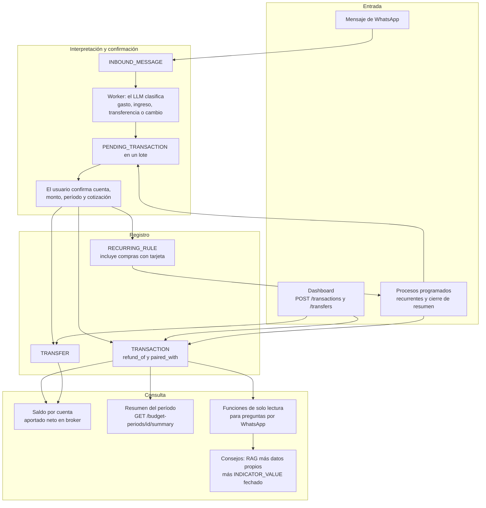
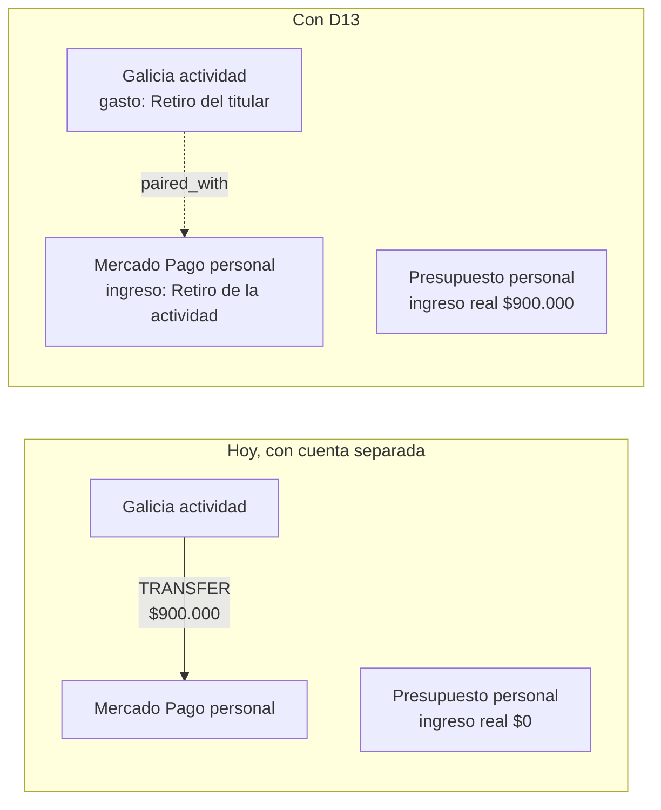

# Platita — Validación de diseño por casos de uso

- **Fecha de la corrida:** 2026-09-27
- **Rama analizada:** `feature/entrega-1-VNZ`, commit `ab2156e`
- **Corrida anterior:** 2026-09-25, commit `4775459` (15 commits antes)

> **Esto no es especificación.** Es un registro: el diagnóstico de la especificación tal como
> estaba en la fecha de la corrida. Sus recomendaciones y sus decisiones D13 a D26 son propuestas,
> no reglas. Ninguna se implementa hasta que la autora la decide y la regla se escribe en el
> documento que corresponde —[reglas de dominio](reglas-de-dominio.md), el
> [modelo de datos](03-modelo-de-datos.md) o un ADR—, que es lo que manda. Criterio en
> [`AGENTS.md`](../AGENTS.md) §10.
>
> **Cómo se actualiza.** No se edita a mano: se vuelve a correr el mismo ejercicio, que lee esta
> corrida, la compara y sobrescribe el archivo. Las decisiones siguen la numeración de la corrida
> anterior (D1 a D12 quedaron cerradas) para que una referencia vieja no apunte a otra decisión.

**Documentos analizados**

- `AGENTS.md` (y `CLAUDE.md`, que es un enlace simbólico a él)
- `README.md`
- `llms.txt`
- `prompts.md` (como contexto, no como especificación)
- `docs/01-producto.md`
- `docs/02-arquitectura.md`
- `docs/03-modelo-de-datos.md`
- `docs/04-api.md`
- `docs/05-historias-de-usuario.md`
- `docs/06-tickets.md`
- `docs/07-pull-requests.md`
- `docs/08-convenciones-de-documentacion.md`
- `docs/reglas-de-dominio.md`
- `docs/recorrido-completo.md`
- `docs/convenciones-de-desarrollo.md`
- `docs/hoja-de-ruta.md`
- `docs/terminos-y-privacidad.md`
- `docs/operacion.md`
- `docs/documentacion-viva.md`
- `docs/flujo-de-trabajo-con-ia.md`
- `docs/conversacion-reestructuracion-docs.md` (registro, no especificación)
- `docs/features/TEMPLATE/` (`spec.md`, `ui_contract.md`, `qa_plan.md`, `pr.md`)
- `docs/adr/0001` a `docs/adr/0017`
- `.claude/skills/domain-rules/SKILL.md` y `.claude/commands/` (contexto de trabajo)

No hay diagramas en imagen: todos están en Mermaid, dentro de los Markdown. `site/` se generó
desde `docs/` y no es fuente. La corrida anterior de este archivo se leyó solo para la sección 5.

---

## 1. Mapa del diseño (Fase 0)

### 1.1. Documentos existentes

| Documento | Qué cubre | Nivel de detalle |
|---|---|---|
| `01-producto.md` | Objetivo, catálogo must/should/could, fuera de alcance y la secuencia del registro por WhatsApp | Especificación funcional |
| `reglas-de-dominio.md` | Dueño de las reglas de negocio, en 18 grupos: registro, saldo, presupuestos, categorías, pendientes, multimoneda, duplicados, recurrentes, origen, grupos y actividades, alta, límites, tarjetas y transferencias, privacidad, correcciones, reintegros y "Me deben", consultas y alcance de los consejos | Especificación funcional detallada, con reglas de borde |
| `03-modelo-de-datos.md` | Diagramas ER por área y 25 entidades con columnas, `CHECK`, claves compuestas y triggers | Diseño técnico |
| `04-api.md` | Webhook, presupuestos y períodos, resumen del período, `POST /transactions`, `POST /transfers`, login, exportaciones y borrado de cuenta | Diseño técnico, parcial ("endpoints principales") |
| `05-historias-de-usuario.md` | HU1 a HU6 con criterios de aceptación | Especificación funcional |
| `06-tickets.md` | Webhook e interpretación, vista de presupuesto y esquema inicial con su seed de categorías | Diseño técnico |
| `02-arquitectura.md` y `recorrido-completo.md` | C4, despliegue, seguridad, y el recorrido de punta a punta con procesos y tablas | Diseño técnico |
| `hoja-de-ruta.md` | Pendientes de la entrega 2 y decisiones abiertas | Idea general y registro de decisiones |
| `terminos-y-privacidad.md` | Índice de lo que tienen que cubrir los términos | Idea general |
| `adr/0001` a `0017` | Decisiones de arquitectura. Tocan el dominio la 0002 (canales), 0011 (cotizaciones e indicadores), 0012 (tarjetas y transferencias), 0013 (datos al LLM), 0014 y 0015 (edición y borrado) | Diseño técnico, con alternativas |
| El resto de `docs/` | Operación, método de trabajo, convenciones y plantillas | No describen comportamiento financiero |

### 1.2. Diseño reconstruido

**Funcionalidades** (`01-producto.md` §1.2):

- **Must-have:** registro por WhatsApp con defaults acotados; cuentas con saldo calculado;
  transferencias; presupuestos individuales o de grupo (familia o actividad); categorías
  semi-guiadas; dashboard, que también carga gastos, ingresos y transferencias; alta por WhatsApp;
  login por código; trazabilidad de origen; configuración regional.
- **Should-have:** tarjetas de crédito; recurrentes fijos y variables; consejos con RAG;
  preguntas sobre los propios datos; multimoneda.
- **Could-have:** carga desde email, duplicados manual contra automático, presupuesto ajustado
  por inflación, comparación contra inflación y exportación general.

**Entidades centrales** (`03-modelo-de-datos.md` §3.2):

| Entidad | Qué es |
|---|---|
| `ACCOUNT` | Una moneda por cuenta, saldo calculado. Tipos: banco, billetera, `broker`, efectivo, tarjeta y `receivable` ("Me deben") |
| `TRANSACTION` | Gasto o ingreso completo, con cuenta, período confirmado y categoría obligatorios. `refund_of` vincula un reintegro y `paired_with`, las dos mitades de un retiro del titular |
| `TRANSFER` | Entre dos cuentas propias. Sin categoría ni período |
| `BUDGET_PERIOD` y `BUDGET` | Período individual o de grupo, sin solapes, `draft` o `confirmed`. Tope por categoría |
| `FAMILY_GROUP` y `USER_GROUP` | Familia o actividad, sin campo que las distinga |
| `RECURRING_RULE` y `CARD_STATEMENT` | Reglas fijas o variables, compras con tarjeta y resúmenes conciliados |
| `PENDING_TRANSACTION` y `PENDING_BATCH` | Lo que espera una decisión del usuario, en lotes numerados |
| `ADVICE_DOCUMENT`, `INDICATOR_VALUE` y `EXCHANGE_RATE` | Base de conocimiento curada, tasa de plazo fijo e inflación, y cotizaciones |

**Flujo central: cómo entra, cómo se guarda y cómo se consulta un dato**

```mermaid
flowchart TB
    subgraph ENTRADA["Entrada"]
        WA["Mensaje de WhatsApp"]
        DASH["Dashboard<br/>POST /transactions y /transfers"]
        CRON["Procesos programados<br/>recurrentes y cierre de resumen"]
    end
    subgraph PROCESO["Interpretación y confirmación"]
        INB["INBOUND_MESSAGE"]
        WK["Worker: el LLM clasifica<br/>gasto, ingreso, transferencia o cambio"]
        PEND["PENDING_TRANSACTION en un lote"]
        CONF["El usuario confirma cuenta,<br/>monto, período y cotización"]
    end
    subgraph DATOS["Registro"]
        TX["TRANSACTION<br/>refund_of y paired_with"]
        TR["TRANSFER"]
        RR["RECURRING_RULE<br/>incluye compras con tarjeta"]
    end
    subgraph LECTURA["Consulta"]
        SALDO["Saldo por cuenta<br/>aportado neto en broker"]
        SUM["Resumen del período<br/>GET /budget-periods/id/summary"]
        FN["Funciones de solo lectura<br/>para preguntas por WhatsApp"]
        ADV["Consejos: RAG más datos propios<br/>más INDICATOR_VALUE fechado"]
    end
    WA --> INB --> WK --> PEND --> CONF
    CONF --> TX
    CONF --> TR
    CONF --> RR
    DASH --> TX
    DASH --> TR
    RR --> CRON
    CRON --> TX
    CRON --> PEND
    TX --> SALDO
    TR --> SALDO
    TX --> SUM
    TX --> FN
    FN --> ADV
```

- **Entrada.** El webhook guarda el mensaje y el worker lo interpreta (ADR 0010, Ticket 1). Fecha,
  moneda y categoría se completan solas y se muestran; monto, cuenta y período se confirman
  siempre (`reglas-de-dominio.md` §1). Mientras falte algo, el movimiento es un pendiente en un
  lote (§5).
- **Registro.** Se guarda con su moneda y una sola cotización (§6). Las compras con tarjeta son
  reglas que se generan al cierre del resumen (§13). El retiro del titular son dos movimientos
  enlazados sobre la misma cuenta (§10).
- **Consulta.** Saldo con fecha hasta hoy (§2), resumen del período con y sin tope (§17,
  `04-api.md`), preguntas por WhatsApp resueltas por funciones que no dejan al modelo calcular
  (§17), y consejos que usan la base curada, los datos propios y los indicadores fechados (§18).

### 1.3. Decisiones confirmadas en la documentación

El detalle está en la sección 2. En resumen: las tres están documentadas en
`reglas-de-dominio.md` (§10, §2 y §18). La 1 y la 3 tienen contradicciones o bordes sin cubrir; la
2 está bien reflejada, con huecos en monedas y totales.

### 1.4. Áreas sin cobertura

Ningún documento trata estos temas:

1. **Crear un grupo o una actividad e invitar miembros.** §10 describe cómo se administra un
   grupo que ya existe, pero ni la API ni el alta ni ninguna regla dicen cómo nace.
2. **Aportes del titular a la actividad**, el sentido inverso del retiro.
3. **Un gasto que se reparte entre dos presupuestos**, como el celular o el monotributo de quien
   usa ambos para la actividad y lo personal.
4. **Comisiones en transferencias de la misma moneda.** `TRANSFER` exige montos iguales.
5. **Plazo fijo** y cualquier inversión de renta conocida que no sea un broker.
6. **Qué entra en un total:** "total disponible", totales por moneda o patrimonio, fuera de la
   exclusión de "Me deben" (§16).
7. **Retirar de inversiones para cubrir gastos** y cómo se ve en el presupuesto.
8. **Preguntas de información de mercado** ("¿a cuánto está el MEP?") y qué cuota consumen.
9. **Preguntas de decisión que no son de inversión** (un préstamo, una compra en cuotas) y qué
   hacer cuando el usuario insiste en que le digan qué hacer.
10. **Cuándo un dato de mercado es "demasiado viejo"** (§6 y §18 lo nombran sin valor).
11. **El catálogo base completo de categorías.** El seed del Ticket 3 nombra solo las especiales.
12. **Alta y edición de cuentas desde el dashboard**, que pide la HU1 y no tiene endpoint
    (`recorrido-completo.md` §13).

### 1.5. Contradicciones visibles entre documentos

| # | Contradicción | Documentos |
|---|---|---|
| X1 | La promesa de producto incluye decir si una decisión financiera "es buena o no" y responder "¿cómo me conviene…?", pero la decisión confirmada 3 prohíbe decidir por el usuario, y §18 solo pone ese límite para inversiones | `01-producto.md` §1.1 y §1.2 (consejos con RAG), contra `reglas-de-dominio.md` §18 y la decisión 3 |
| X2 | El modelo de datos llama "asesoramiento" a la base de conocimiento, que es el término que la CNV regula y que §18 dice que Platita no hace | `03-modelo-de-datos.md` §3.1 ("Usuarios, acceso y asesoramiento") y §3.2 ADVICE_DOCUMENT, contra `reglas-de-dominio.md` §18 y `terminos-y-privacidad.md` |
| X3 | La decisión 1 habla de autotransferencias "entre" la actividad y lo personal, pero la base solo admite el par en un sentido: gasto en el grupo, ingreso en lo individual | `03-modelo-de-datos.md` TRANSACTION (`paired_with`), `reglas-de-dominio.md` §10, contra la decisión 1 |
| X4 | Ya registradas en la hoja de ruta: cuotas en YAML contra "sin desplegar", rama de despliegue y quién genera las alertas con RAG | `hoja-de-ruta.md`, Decisiones abiertas |
| X5 | *No es especificación, se reporta igual:* el `README.md` sigue describiendo la lectura de emails como un módulo que existe, y dice "42 casos" de esta validación | `README.md` contra `01-producto.md` §1.2 (could-have) |

### 1.6. Preguntas bloqueantes

Ninguna. El flujo central se reconstruye de punta a punta.

---

## 2. Decisiones confirmadas

| Decisión | ¿Documentada? | Dónde | Contradicciones | Casos límite sin resolver |
|---|---|---|---|---|
| **1. Actividades** con presupuesto propio y autotransferencias para pagarse un sueldo | Sí, en parte | `reglas-de-dominio.md` §10 ("Un grupo puede ser una familia o una actividad" y "El retiro del titular"); `03-modelo-de-datos.md` FAMILY_GROUP y TRANSACTION `paired_with`; `01-producto.md` §1.2; HU4; Ticket 3 (categorías "Retiro del titular" y "Retiro de la actividad") | X3: el sentido inverso (aportar a la actividad) está prohibido por la base. §18 excluye los presupuestos de grupo de los consejos, también los de una actividad de un solo miembro | Cómo se crea la actividad (A3.1). Retiro entre cuentas separadas, que queda como transferencia y deja el ingreso personal en cero (A3.6). Gasto mixto (A3.8). Uso del efectivo de la actividad para gastos personales sin retiro (A3.3). Consejos sobre la actividad (A3.10) |
| **2. Cuentas de inversión opacas** | Sí | `reglas-de-dominio.md` §2 ("Una cuenta de inversión solo recibe aportes y retiros" y "Una stablecoin…"); `03-modelo-de-datos.md` ACCOUNT (trigger que rechaza movimientos sobre `broker`); HU1; §17 función Saldos; `04-api.md` `POST /transfers` | Ninguna | Aportar en pesos y retirar en dólares (A4.4). Si el aportado neto, que puede ser negativo, suma en algún total (A4.5). Cómo se ve en el presupuesto vivir de lo retirado (A4.2). Plazo fijo (A4.7) |
| **3. Educación, no recomendación** | Sí, para inversiones | `reglas-de-dominio.md` §18; `01-producto.md` §1.2; `terminos-y-privacidad.md`; `hoja-de-ruta.md` (validación legal pendiente) | X1 y X2 | Preguntas de decisión sobre deuda (A1.6). Insistencia (A2.6). Aplicar datos propios sin dar veredicto (A6.7). Información con nombre de entidad (A4.9). Cotización del día (A5.6) |

---

## 3. Supuestos asumidos

Los campos que el prompt dejó vacíos se completaron desde `docs/`:

- **Público objetivo:** personas y hogares de Argentina, adultos, bancarizados y usuarios de
  WhatsApp, con varias cuentas, billeteras y monedas (`01-producto.md` §1.1). Por la decisión 1
  se suman monotributistas con una actividad. La documentación no fija rango de edad: se asumió
  de 18 a 75 años. El lanzamiento es solo en Argentina (ADR 0011).
- **Canales:** WhatsApp como canal principal y dashboard web para ver, configurar y cargar
  gastos, ingresos y transferencias (ADR 0002). La app móvil no tiene fecha (`hoja-de-ruta.md`).
- **Fuera de alcance:** modo offline, lectura de capturas y conexión con bancos
  (`01-producto.md` §1.2, `AGENTS.md` §1). Email y duplicados automáticos son could-have.

Otros supuestos:

- Se evalúa el diseño completo documentado, incluidas las should-have.
- La cotización de referencia del usuario es MEP, una de las dos que ofrece el alta (§11).
- Los montos y normas son de septiembre de 2026 (sección 14). Son orientativos.
- **[INFERIDO]** marca lo que se deduce del diseño sin estar escrito. Las frecuencias sin fuente
  llevan **[ESTIMADO]**.

---

## 4. Resumen ejecutivo

**Madurez general: alta en el núcleo, con bordes nuevos en lo que se agregó último.** De los 33
casos con problemas de la corrida anterior, 29 quedaron resueltos por reglas nuevas: primer
período en el alta, recurrentes variables, dólar tarjeta con residuo, reintegros vinculados,
"Me deben", corrección por cita o búsqueda, preguntas sobre los datos, cuentas de inversión que
solo reciben aportes y retiros, y el alcance de los consejos. El registro cotidiano está sólido.
Lo nuevo —actividades, cuentas opacas y educación— está bien planteado en su caso central y
falla en los bordes.

De los 44 casos recorridos:

| Veredicto | Casos |
|---|---|
| INCORRECTO | 2 |
| CONTRADICTORIO | 2 |
| NO ESPECIFICADO | 10 |
| NO SOPORTADO | 2 |
| PARCIAL | 6 |
| SOPORTADO | 22 |

**Los 5 problemas más graves**

1. **Pagarse un sueldo desde una cuenta separada deja el presupuesto personal sin ingresos**
   (INCORRECTO, A3.6). Con la misma cuenta, el retiro es un par gasto–ingreso que mueve la plata
   entre presupuestos. Con una cuenta propia de la actividad es "una transferencia común", que
   no entra en ningún presupuesto. Carla se paga $900.000 y su presupuesto personal muestra
   ingreso real $0, mientras el de la actividad muestra ese dinero como resultado. El mismo hecho
   da números opuestos según cuántas cuentas tenga.
2. **Una devolución con tarjeta infla el ingreso y deja el gasto en su rubro** (INCORRECTO,
   A1.4). La conciliación registra lo que el banco acredita como un ingreso en "Devoluciones y
   reintegros" que, por regla, no se vincula a ninguna compra. Un ingreso sin vincular suma como
   ingreso del período. Las cuotas que no se borren siguen generándose.
3. **Educación solo para inversiones** (CONTRADICTORIO, A1.6; NO ESPECIFICADO, A2.6). `01-producto`
   promete decir si una decisión "es buena o no" y responder "¿cómo me conviene…?", y §18 solo
   prohíbe elegir instrumentos de inversión. Ante "¿me conviene un préstamo al 99% de TNA?" nada
   impide un veredicto, y no hay regla para cuando el usuario insiste.
4. **Aportar plata propia a la actividad no se puede registrar** (CONTRADICTORIO, A3.7). La
   decisión 1 habla de autotransferencias "entre" las dos partes, pero la base rechaza el par en
   sentido inverso.
5. **El aportado neto no tiene lugar definido en los totales** (NO ESPECIFICADO, A4.5 y A4.4). Puede
   ser negativo y está en la moneda de la cuenta. Si se suma al total por moneda de la HU1, un
   retiro con ganancia reduce el total disponible.

**Decisiones pendientes más urgentes:** D13 (retiro entre cuentas separadas), D14 (aporte a la
actividad), D23 (preguntas de decisión e insistencia) y D16 (cómo se crea una actividad, sin lo
cual la decisión 1 no tiene punto de entrada).

---

## 5. Comparación con la corrida anterior

La corrida del 2026-09-25 recorrió 42 casos con 33 no soportados o problemáticos. Los
identificadores cambiaron: los arquetipos se rearmaron para incluir los dos obligatorios.

### 5.1. Casos que cambiaron de veredicto

| Caso anterior | Antes | Hoy | Qué lo cerró |
|---|---|---|---|
| A5.6 · Primer gasto después del alta | CONTRADICTORIO | SOPORTADO | §3 "El primer período nace en el alta"; HU6 |
| A6.4 · Cargar desde el dashboard | CONTRADICTORIO | SOPORTADO | ADR 0002 actualizado; `POST /transfers`; HU3 |
| A4.6 · Alertas al 80% y al 100% | CONTRADICTORIO | SOPORTADO | §3 "Alertas de presupuesto"; HU5 |
| K3 · "¿CEDEARs o plazo fijo en USD?" | CONTRADICTORIO | SOPORTADO en la regla (§18), abierto en la insistencia (ver A2.6) | §18; perfil sin tolerancia al riesgo (§11) |
| A3.2, A3.3, A4.2, A6.2 · Recurrentes que cambian de monto | INCORRECTO | SOPORTADO | §8 "El monto de una regla es fijo o variable" |
| A1.3 · Saldo en USD de la tarjeta pagado en pesos | INCORRECTO | SOPORTADO | §13 "Una tarjeta en otra moneda" y "El residuo al pagar" |
| A1.5 · Compra con tarjeta olvidada | INCORRECTO | SOPORTADO | §13, la conciliación pregunta antes del ajuste |
| A5.4 · QR con tarjeta vinculada | INCORRECTO | SOPORTADO | §13 "Pagar con una billetera usando una tarjeta vinculada" |
| A2.4 · Baja de CEDEARs en el contraste | INCORRECTO | SOPORTADO | §2, las cuentas de inversión no entran en el contraste |
| A5.2, A6.3 · Cena compartida y reintegro | INCORRECTO | SOPORTADO | §16 (`refund_of` y "Me deben") |
| A1.6, A5.5, A6.5, A6.6 · Corregir, borrar, restaurar, fecha de otro período | NO ESPECIFICADO | SOPORTADO | §15 |
| A3.6 · Categoría del consultorio corregida | PARCIAL | SOPORTADO | §15, corrección por cita o búsqueda |
| A2.6 · "Le pasé 300 lucas a MP" | NO ESPECIFICADO | SOPORTADO | §1, el modelo clasifica y la confirmación muestra el efecto |
| A5.1, A1.2 · Consultas y "¿en qué se me fue la plata?" | NO ESPECIFICADO | SOPORTADO | §17; `GET /budget-periods/{id}/summary` |
| A3.4 · Período del 10 al 9 | NO ESPECIFICADO | SOPORTADO | §3 "Un período mensual puede empezar cualquier día" |
| K5 · Fondo de emergencia de la pareja | NO ESPECIFICADO | Cerrado: no se ofrece | §18 "Los consejos son individuales" |
| A2.3 · Cobro en USDT | NO SOPORTADO | SOPORTADO | §2 "Una stablecoin es una cuenta en dólares" |
| A5.3 · Préstamo a un compañero | NO SOPORTADO | SOPORTADO | §16 "La plata que te deben es una cuenta" |
| A4.4 · Quién puso cuánto en la pareja | NO SOPORTADO | PARCIAL | §10 y §17: se ve cuánto imputó cada miembro, no quién le debe a quién |
| A3.5 · Separar el consultorio | PARCIAL | SOPORTADO en lo central (ver A3) | §10, actividades |
| A4.5 · Mismo super cargado por los dos | PARCIAL | SOPORTADO | §7 "Entre miembros de un grupo" |
| A2.5 · Suscripción en USD con presupuesto en ARS | PARCIAL | SOPORTADO | §13, una cotización por resumen |
| K1, K2, K6 · Excedente, FCI, plazo fijo | PARCIAL | PARCIAL / SOPORTADO | §18 e `INDICATOR_VALUE`; queda abierto aplicar datos propios sin veredicto |

### 5.2. Decisiones pendientes que se cerraron

Las 12 decisiones de la corrida anterior están cerradas en la especificación:

| Decisión | Cómo se cerró |
|---|---|
| D1 · Período al alta | Opción 1, y el período mensual empieza cualquier día (§3) |
| D2 · Recurrentes variables | Variante de la opción 1: el monto se confirma al armar el presupuesto o al vencer (§8) |
| D3 · Dólar tarjeta | Otra opción: cotización del resumen según cómo se paga, más el residuo en "Diferencia de cambio" (§13) |
| D4 · Reintegros | Opciones 1 y 2: `refund_of` y cuentas "Me deben" (§16) |
| D5 · Identificar un movimiento | Otra opción, sin ventana de tiempo: cita o búsqueda, nunca "el último" (§15) |
| D6 · Inversiones en el contraste | Opción 1 reforzada: el broker solo recibe aportes y retiros; categoría "Rendimientos" (§2) |
| D7 · Conciliación y compras que faltan | Opción 1, más la pregunta de la tarjeta vinculada (§13) |
| D8 · Consultas y reportes | Opción 1, con una cuota propia de consultas (§12, §17) |
| D9 · Alcance de los consejos | Opción 1 (§18) |
| D10 · Carga desde el dashboard | Opción 1, con transferencias (ADR 0002, `04-api.md`) |
| D11 · Umbrales | Opción 1 (§3, HU5) |
| D12 · ¿Transferencia o gasto? | El modelo clasifica y la confirmación muestra el efecto (§1) |

También se cerró el hueco que había dejado `recorrido-completo.md`: ya hay endpoints para armar y
confirmar períodos (`04-api.md`).

### 5.3. Problemas nuevos

Todos vienen de las tres decisiones confirmadas y de reglas agregadas después de la corrida
anterior: A3.1, A3.6, A3.7, A3.8, A3.10 (actividades); A4.2, A4.4, A4.5, A4.7 (inversiones);
A1.6, A2.6, A4.9, A5.6, A6.7 (educación); A1.4 (devolución con tarjeta, que la corrida anterior no
recorrió); A2.3 (comisión en una transferencia). También X1, X2 y X3.

### 5.4. Problemas que siguen abiertos

- El catálogo base de categorías sigue sin definirse (pregunta 4 de la corrida anterior).
- El `README.md` sigue describiendo la lectura de emails como si existiera (X5).
- El aguinaldo sigue sin regla propia; ahora con un efecto concreto en el borrador (A1.2).
- Las contradicciones operativas de la hoja de ruta (X4).

---

## 6. Arquetipos

| Arquetipo | Situación | Qué necesita de Platita |
|---|---|---|
| **A1 · Lucía, asalariada** | 34 años, CABA. Sueldo neto de $1.450.000 con paritarias. Galicia en pesos y en dólares, Mercado Pago, Visa con saldo en pesos y en dólares. Paga ChatGPT en dólares | Saber en qué se le va la plata, llegar al vencimiento sin sorpresas y entender qué cuesta un préstamo |
| **A2 · Martín, freelancer que cobra del exterior** | 29 años, desarrollador, monotributista. Factura unos USD 2.500 por mes con factura E y cobra por Payoneer; a veces en USDT. Vende dólares al MEP | Llevar ingresos en dólares y gastos en pesos sin mezclar monedas, y aprender qué hacer con lo que ahorra |
| **A3 · Carla, microemprendedora** (obligatorio) | 38 años, Morón. Vende viandas y tortas; monotributo categoría A ($49.527). Cobra por el mismo Mercado Pago que usa para lo personal y en efectivo en ferias. Factura unos $2.400.000 por mes y se paga $900.000 | Separar la actividad de lo personal, pagarse un sueldo y saber si el emprendimiento se sostiene |
| **A4 · Diego, inversor** (obligatorio) | 46 años, Rosario. Empleado con $2.100.000 netos. Tiene CEDEARs y FCI en Balanz, saldo remunerado en Mercado Pago y un plazo fijo. Completa los gastos del mes retirando del broker | Saber cuánto puso y sacó de cada inversión, sin que Platita pretenda saber cuánto vale, y ver su situación completa |
| **A5 · Sofía y Nico, pareja** | Convivientes, cada uno con sus cuentas. Presupuesto de grupo "Casa". Alquiler de $850.356 con ajuste por IPC. Cuotas de una heladera | Ver cuánto llevan gastado entre los dos y cuánto puso cada uno |
| **A6 · Norma, jubilada** | 70 años, Lanús. Cobra $505.748,51 (mínima más bono, octubre de 2026) en Cuenta DNI. Usa efectivo y reintegros. Su hija la ayuda con la computadora | Registrar simple, controlar el efectivo y entender qué es cada cosa antes de que le ofrezcan algo |

---

## 7. Matriz de casos

Frecuencias: salvo cita, **[ESTIMADO]**. Orden: veredicto y, dentro de cada uno, de más a menos
frecuente. A3 y A4 tienen más de seis casos porque incluyen los casos límite obligatorios.

| # | Arquetipo | Caso | Tipo | Frecuencia | Veredicto | Evidencia (doc/sección) | Cambio mínimo | Parte afectada |
|---|---|---|---|---|---|---|---|---|
| A3.6 | A3 | Abre una cuenta Galicia solo para la actividad y se transfiere $900.000 de sueldo a su Mercado Pago | Incómodo (actividad) | Mensual | INCORRECTO | `reglas-de-dominio.md` §10 ("Con una cuenta real separada… el retiro es una transferencia común") y §13 (una transferencia no entra en ningún presupuesto) | El retiro entre dos cuentas es el mismo par gasto–ingreso, cada mitad en su cuenta (D13) | Actividades, modelo de datos |
| A1.4 | A1 | Devuelve unas zapatillas de $180.000 compradas en 3 cuotas, después de pagar la primera | Incómodo (devolución) | Ocasional | INCORRECTO | `reglas-de-dominio.md` §13 (la devolución va al ajuste de la conciliación) y §16 (ese ajuste "no se vincula a ninguna compra"; un ingreso no vinculado es un ingreso común) | Vincular una devolución a la compra con tarjeta y cortar sus cuotas (D18) | Flujo de ingesta, reportes |
| A3.7 | A3 | Pone $250.000 de sus ahorros personales para comprar un horno para la actividad | Incómodo (actividad) | Ocasional | CONTRADICTORIO | Decisión 1 ("autotransferencias entre la actividad y sus finanzas personales") contra `03-modelo-de-datos.md` TRANSACTION `paired_with` (solo gasto en grupo e ingreso individual) y §10 | Par simétrico "Aporte a la actividad" (D14) | Actividades, modelo de datos |
| A1.6 | A1 | "Me ofrecen un préstamo de $3.000.000 al 99% de TNA (CFTEA 207,94%) para cambiar el auto, ¿me conviene?" | Educación (decisión) | Ocasional | CONTRADICTORIO | `01-producto.md` §1.1 ("guía sobre si esas decisiones financieras son buenas o no") y §1.2 ("¿cómo me conviene pagar mi tarjeta?"), contra la decisión 3; §18 solo limita inversiones | Extender §18 a toda pregunta de decisión (D23) | Educación |
| A3.8 | A3 | El celular ($60.000 por mes) y el monotributo los usa para la actividad y para lo personal | Incómodo (gasto mixto) | Mensual | NO ESPECIFICADO | `reglas-de-dominio.md` §1 (un movimiento, un período), §8 (una regla, un dueño de presupuesto) | Dividir un gasto en dos movimientos en el mismo lote (D15) | Flujo de ingesta, actividades |
| A4.2 | A4 | Retira $400.000 por mes de Balanz para completar los gastos | Incómodo (inversión) | Mensual | NO ESPECIFICADO | `reglas-de-dominio.md` §2 (retiro = transferencia) y §17 (ingreso real del período) | Mostrar aparte, en el resumen, lo retirado de inversiones (D21) | Reportes, cuentas de inversión |
| A2.3 | A2 | Pasa USD 2.450 de Payoneer a Galicia USD y llegan USD 2.401 | Incómodo (comisión) | Mensual | NO ESPECIFICADO | `03-modelo-de-datos.md` TRANSFER ("Si las monedas coinciden, los montos son iguales") | Transferencia por lo que llegó más un gasto por la comisión (D19) | Flujo de ingesta |
| A3.1 | A3 | Quiere crear la actividad "Cocina de Carla" | Cotidiano (configuración) | Ocasional (una vez; habilita toda la decisión 1) | NO ESPECIFICADO | `reglas-de-dominio.md` §10 y §11; `04-api.md` (sin endpoint de grupos) | Regla y endpoint para crear un grupo o actividad (D16) | Actividades |
| A4.4 | A4 | Aporta pesos a Balanz, compra MEP adentro y retira USD 1.000 a Galicia USD | Incómodo (inversión, monedas) | Ocasional | NO ESPECIFICADO | `reglas-de-dominio.md` §2 (una cuenta, una moneda; lo de adentro no se registra) y §13 (transferencia con dos monedas) | Una cuenta de inversión por moneda (D20) | Cuentas de inversión |
| A4.5 | A4 | Mira el dashboard: ¿cuánto tiene en total? | Cotidiano (revisar) | Semanal | NO ESPECIFICADO | HU1 ("agrupadas por moneda"); §16 (solo "Me deben" queda fuera del total disponible); §17 Saldos | El aportado neto nunca suma en un total (D20) | Reportes, cuentas de inversión |
| A4.7 | A4 | Arma un plazo fijo de $3.000.000 a 30 días al 20% de TNA | Incómodo (inversión) | Mensual | NO ESPECIFICADO | §2 ("rendimiento… de un plazo fijo" en el contraste) sin tipo de cuenta ni flujo | Regla de plazo fijo (D22) | Cuentas de inversión |
| A2.6 | A2 | Insiste: "no me expliques, decime vos: ¿CEDEARs o plazo fijo en dólares?" | Educación (decisión) | Ocasional | NO ESPECIFICADO | §18 (qué no hace), sin regla de insistencia | Respuesta fija ante la insistencia (D23) | Educación |
| A4.9 | A4 | "¿Qué banco paga más por un plazo fijo?" | Educación (información) | Ocasional | NO ESPECIFICADO | §18 ("No recomienda una entidad… Puede citar una tasa promedio"); `INDICATOR_VALUE` solo tiene el promedio | Definir qué información con nombre se muestra (D24) | Educación |
| A5.6 | A5 | "¿A cuánto está el MEP hoy?" antes de comprar dólares | Educación (información) | Semanal | NO ESPECIFICADO | §17 (ninguna función devuelve cotizaciones); §18 (solo plazo fijo e inflación) | Función de lectura de indicadores y cotizaciones (D24) | Educación |
| A5.2 | A5 | Sofía le transfiere $300.000 a Nico para gastos de la casa | Incómodo (entre personas) | Mensual | NO SOPORTADO | §10 ("saldar cuentas entre miembros… queda para cuando exista la cuenta compartida"); TRANSFER solo entre cuentas propias | Documentar el camino transitorio (pregunta 3) | Actividades y grupos |
| A3.10 | A3 | "¿Cuánto me puedo pagar de sueldo sin fundir el emprendimiento?" | Educación (aplicación de datos) | Mensual | NO SOPORTADO | §18 ("No usan un presupuesto de grupo") y §10 ("Todo… vale igual para los dos") | Los consejos leen los grupos de un solo miembro (D17) | Educación, actividades |
| A3.3 | A3 | Hace 22 ventas en efectivo en la feria del sábado, y con esa plata paga la verdulería | Incómodo (efectivo) | Semanal | PARCIAL | §5 (lotes de 10), §12 (50 mensajes de registro por día), §10 (retiro manual) | El cierre del período de la actividad recuerda registrar como retiro lo usado para gastos personales | Actividades |
| A2.2 | A2 | "Me pagaron 2400 en Payoneer", sin decir la moneda | Error (moneda) | Mensual | PARCIAL | §1 (moneda = primaria salvo indicación) y §2 (conversión con confirmación) | Si se nombra una cuenta, la moneda por defecto es la suya (D25) | Flujo de ingesta |
| A1.2 | A1 | Cobra aguinaldo de $725.000 en junio; el borrador de julio copia el ingreso estimado de junio | Incómodo (aguinaldo) | Semestral (30/06 y 18/12, iProfesional 2026) | PARCIAL | §3 ("El borrador copia el período anterior"; el ingreso solo se cambia en el dashboard) | Corregir el ingreso estimado en la respuesta al recordatorio (D26) | Reportes |
| A3.5 | A3 | "¿Cuánto gasté este mes en total?" y el consolidado de actividad más personal | Cotidiano (revisar) | Mensual | PARCIAL | §10 (los retiros no cuentan en un total de varios presupuestos); §17 (las funciones no dicen qué presupuestos incluyen); `04-api.md` (resumen por período) | Decir en §17 si las funciones suman todos los presupuestos o uno | Reportes, actividades |
| A2.5 | A2 | "Me sobraron USD 3.000 este mes, ¿qué hago?" | Educación (excedente) | Mensual | PARCIAL | §18 ("Ordena prioridades generales", "fondo de emergencia" con varios meses) | Formato de respuesta sin veredicto (D23) | Educación |
| A6.7 | A6 | "Si saco $1.000.000 en 12 cuotas de $140.000, ¿qué parte de mi jubilación es?" | Educación (aplicación de datos) | Ocasional | PARCIAL | §18 ("Usa los datos del usuario"), sin regla que impida concluir | Presentar el cálculo y el criterio, sin concluir (D23) | Educación |
| A1.1 | A1 | "Gasté 58.400 en el super con la Galicia" | Cotidiano | Diaria | SOPORTADO | `01-producto.md` §1.3; §1 y §3 | — | — |
| A3.2 | A3 | Cobra una vianda de $18.000 por el Mercado Pago que usa también para lo personal | Cotidiano (actividad) | Diaria | SOPORTADO | §10 (cuenta y presupuesto independientes), §1 | — | — |
| A6.3 | A6 | Saca $150.000 del cajero y paga en efectivo | Cotidiano (efectivo) | Semanal (1,7 extracciones por adulto por mes, BCRA 30/04/2026) | SOPORTADO | §13 (sacar efectivo es transferencia) | — | — |
| A5.1 | A5 | Nico paga el super de $92.000 con su Mercado Pago y lo imputa a "Casa" | Cotidiano | Semanal | SOPORTADO | §1, §5 y §10 | — | — |
| A5.4 | A5 | Los dos cargan el mismo super de $92.000 a "Casa" | Error (duplicado) | Mensual | SOPORTADO | §7 "Entre miembros de un grupo" | — | — |
| A6.2 | A6 | Reintegro de $3.200 de Cuenta DNI por una compra de $16.000 | Incómodo (reintegro) | Semanal | SOPORTADO | §16 (`refund_of`) | — | — |
| A1.3 | A1 | ChatGPT (USD 20) en la Visa USD, pagado en pesos al dólar tarjeta ($2.002) | Incómodo (moneda extranjera) | Mensual | SOPORTADO | §13 "Una tarjeta en otra moneda" y "El residuo al pagar" | — | — |
| A1.5 | A1 | Responde "eran 3.800" citando el "Listo…" | Error (monto) | Semanal | SOPORTADO | §15 | — | — |
| A2.1 | A2 | Cobra USD 2.450 en Payoneer; su presupuesto es en pesos | Cotidiano (ingreso en USD) | Mensual | SOPORTADO | §6 | — | — |
| A2.4 | A2 | Un cliente le paga USD 600 en USDT a Binance | Incómodo (moneda) | Mensual | SOPORTADO | §2 "Una stablecoin es una cuenta en dólares" | — | — |
| A3.4 | A3 | Se paga $900.000 de sueldo; todo pasa por el mismo Mercado Pago | Incómodo (actividad) | Mensual | SOPORTADO | §10 "El retiro del titular"; TRANSACTION `paired_with` | — | — |
| A4.1 | A4 | Aporta $500.000 de Galicia a Balanz | Cotidiano (inversión) | Mensual | SOPORTADO | §2 y §13; `POST /transfers` | — | — |
| A4.6 | A4 | Mercado Pago le rinde $11.400 en el mes (18,62% TNA) | Cotidiano (rendimiento) | Mensual | SOPORTADO | §2 (contraste mensual, categoría "Rendimientos") | — | — |
| A5.5 | A5 | El alquiler sube por IPC en el ajuste | Cotidiano (recurrente variable) | Mensual | SOPORTADO | §8 (regla variable, se confirma al armar el presupuesto) | — | — |
| A6.1 | A6 | Cobra la jubilación con aumento mensual y el bono de $70.000 | Cotidiano (ingreso) | Mensual | SOPORTADO | §8 (regla variable para la jubilación, fija para el bono) | — | — |
| A3.9 | A3 | Imputó la harina ($35.000) al presupuesto personal en vez de a la actividad | Error (actividad equivocada) | Mensual | SOPORTADO [INFERIDO] | §15 (corrección; si cambia de período se reconfirma) | Nombrar el presupuesto entre los campos corregibles | Flujo de ingesta |
| A4.3 | A4 | Aportó $2.000.000 en total y retira $2.600.000 | Incómodo (inversión) | Ocasional | SOPORTADO | §2 ("Puede quedar negativo… lo muestra como aportado neto") | — | — |
| A4.8 | A4 | Registró el aporte desde Mercado Pago cuando salió de Galicia | Error (cuenta) | Ocasional | SOPORTADO | §15 | — | — |
| A5.3 | A5 | Heladera de $1.200.000 en 12 cuotas sin interés con la tarjeta de Sofía | Incómodo (cuotas) | Ocasional | SOPORTADO | §8 (comprometido) y §13 | — | — |
| A6.4 | A6 | Borra por error la farmacia de $27.300 y la recupera | Error (borrado) | Ocasional | SOPORTADO | §15 "Borrar y restaurar" | — | — |
| A6.5 | A6 | "¿Qué es un fondo común de inversión?" | Educación (concepto) | Ocasional | SOPORTADO | §18 ("Explica instrumentos, riesgos y costos") | — | — |
| A6.6 | A6 | "¿Cuánto paga hoy un plazo fijo?" | Educación (información) | Ocasional | SOPORTADO | §18 ("Los datos de mercado tienen fecha"); `INDICATOR_VALUE` | — | — |

---

## 8. Detalle de los casos INCORRECTO y CONTRADICTORIO

### A3.6 · Sueldo desde una cuenta separada de la actividad (INCORRECTO)

**Qué hace la usuaria.** Carla abre una cuenta en Galicia para la actividad, donde cobra las
viandas y paga los insumos. El día 5 se transfiere $900.000 a su Mercado Pago personal.

**Recorrido en el diseño.**

1. Las ventas son ingresos en Galicia imputados al período de "Cocina de Carla" (§10).
2. El retiro: "Con una cuenta real separada para la actividad, el retiro es una transferencia
   común (§ 13)".
3. Una transferencia "no entra en ningún presupuesto ni en ninguna alerta" (§13;
   `03-modelo-de-datos.md` TRANSFER).
4. Carla paga sus gastos personales desde Mercado Pago, imputados a su período individual.

**Dónde falla.**

| Presupuesto | Misma cuenta (§10, par enlazado) | Cuenta separada (transferencia) |
|---|---|---|
| Actividad: gastos | Insumos + $900.000 "Retiro del titular" | Solo insumos |
| Personal: ingreso real | $900.000 "Retiro de la actividad" | $0 |
| Personal: resultado | Gastos contra $900.000 | Gastos contra $0 |

El mismo hecho económico da dos resultados según cuántas cuentas tenga. Con la cuenta separada, el
presupuesto personal muestra que Carla vive sin ingresos, y la actividad parece $900.000 más
rentable de lo que es. Es justamente la práctica que se recomienda a un emprendedor: separar las
cuentas.

```mermaid
flowchart LR
    subgraph HOY["Hoy, con cuenta separada"]
        G1["Galicia actividad"] -->|"TRANSFER<br/>$900.000"| M1["Mercado Pago personal"]
        P1["Presupuesto personal<br/>ingreso real $0"]
    end
    subgraph PROPUESTA["Con D13"]
        G2["Galicia actividad<br/>gasto: Retiro del titular"] -.->|"paired_with"| M2["Mercado Pago personal<br/>ingreso: Retiro de la actividad"]
        P2["Presupuesto personal<br/>ingreso real $900.000"]
    end
```

### A1.4 · Devolución de una compra en cuotas (INCORRECTO)

**Qué hace la usuaria.** Lucía compra zapatillas por $180.000 en 3 cuotas con la Visa pesos. Paga
la primera cuota y las devuelve. El banco acredita $180.000 en el resumen siguiente.

**Recorrido en el diseño.**

1. La compra es una regla de 3 ocurrencias de $60.000 (§13). La primera se generó y pesa en
   "Ropa".
2. La acreditación del banco no sale de ninguna compra registrada. En la conciliación, el total
   del banco es menor que lo que Platita espera, y la diferencia se registra como un ingreso en
   "Devoluciones y reintegros" (§13).
3. "El ajuste de una conciliación… es un solo número por resumen y no se vincula a ninguna compra"
   (§16). Un ingreso que no se vincula "queda como un ingreso común" (§16), así que suma al ingreso
   real del período.
4. Si Lucía no borra la regla, la segunda y la tercera cuota se siguen generando (§13), y el banco
   no las cobra: cada conciliación vuelve a compensarlas con otro ingreso.

Si en cambio Lucía avisa por WhatsApp "devolví las zapatillas", §16 le ofrece vincular un ingreso
a un gasto, pero el gasto es una cuota de $60.000 y el reintegro es de $180.000: el asistente avisa
que supera el monto (§16, "Topes"), y no hay regla para una compra con tarjeta.

**Dónde falla.** "Ropa" queda con $60.000 gastados que no se gastaron, el ingreso del período sube
$180.000 que no son ingreso, y las alertas de "Ropa" siguen contando. Lo mismo pasa con un consumo
desconocido que el banco revierte: §13 lo registra "aparte, como cualquier gasto", y la reversión
llega como ajuste sin vincular.

### A3.7 · Aporte personal a la actividad (CONTRADICTORIO)

**Qué hace la usuaria.** Carla usa $250.000 de su caja de ahorro personal para comprar un horno
para el emprendimiento. Quiere que la actividad refleje ese aporte y que su presupuesto personal
no lo cuente como consumo.

**Qué dice cada fuente.**

- **Decisión 1:** autotransferencias "entre la actividad y sus finanzas personales, por ejemplo
  para pagarse un sueldo".
- **`reglas-de-dominio.md` §10:** solo define el retiro, de la actividad hacia lo personal.
- **`03-modelo-de-datos.md` TRANSACTION:** `paired_with` es "un gasto en un período de grupo y un
  ingreso en el período individual", y el trigger "rechaza un par que no cumpla esas condiciones".

**Dónde falla.** El sentido inverso no se puede registrar. Si Carla carga el horno como gasto de la
actividad pagado con su cuenta personal, la actividad muestra un gasto que no financió, y el
presupuesto personal no muestra que salió plata. Si lo carga como gasto personal, la actividad
pierde el activo. Los meses flojos, en los que la actividad no cubre sus insumos, pasan lo mismo.

### A1.6 · "¿Me conviene este préstamo?" (CONTRADICTORIO)

**Qué hace la usuaria.** A Lucía le ofrecen un préstamo de $3.000.000 al 99% de TNA, con CFTEA de
207,94% (tasas de septiembre de 2026, ADNSUR), para cambiar el auto. Pregunta si le conviene.

**Qué dice cada fuente.**

- **`01-producto.md` §1.1:** el usuario hoy no tiene "ningún tipo de guía sobre si esas decisiones
  financieras son buenas o no". §1.2 da como ejemplos "¿cómo me conviene pagar mi tarjeta?" y la
  respuesta "cruzada con los datos reales del usuario".
- **`reglas-de-dominio.md` §18:** limita el alcance "en inversiones": no elige instrumentos ni
  entidades. La aclaración final solo se exige en "toda respuesta que habla de inversiones". Un
  préstamo es deuda, no inversión.
- **Decisión 3:** ante preguntas de decisión, "ej. ¿me conviene sacar un préstamo personal a esta
  tasa?", Platita enseña conceptos (deuda buena y mala, CFT) y nunca decide.

**Dónde falla.** Nada en la especificación impide responder "no te conviene". El producto lo
promete y §18 no lo prohíbe fuera de las inversiones. Tampoco hay una base de conocimiento
declarada sobre CFT o deuda: los temas de ejemplo de `ADVICE_DOCUMENT` son tarjeta, fondo de
emergencia e inversión básica.

---

## 9. Educación financiera

| Caso | Tipo (información/educación/decisión) | Respuesta prevista | ¿Enseña a razonar sin dar veredicto? | Fuente y actualización de datos |
|---|---|---|---|---|
| **A6.5** · "¿Qué es un FCI?" | Educación | Explica qué es, riesgos y costos, con la aclaración final (§18) | Sí | Base curada (`ADVICE_DOCUMENT`), revisión manual con `last_reviewed_at` y `status`. No lleva datos de mercado |
| **A6.6** · "¿Cuánto paga hoy un plazo fijo?" | Información | Cita la tasa promedio del BCRA con su fecha; si es vieja, lo dice (§18) | No aplica: es un dato | `INDICATOR_VALUE` (`BCRA_TIME_DEPOSIT_30D`), cargado por el adaptador del ADR 0011. Frecuencia de carga y umbral de "viejo": sin definir |
| **A4.9** · "¿Qué banco paga más?" | Información | No especificada. §18 permite "una tasa promedio" y prohíbe recomendar "el plazo fijo del banco X" | No definido | No hay fuente de tasas por entidad. En septiembre de 2026 iban de 16% a 24% de TNA (Ámbito) |
| **A5.6** · "¿A cuánto está el MEP?" | Información | No especificada. `EXCHANGE_RATE` tiene el dato, pero ninguna función de §17 lo devuelve y §18 solo nombra plazo fijo e inflación | No aplica | `EXCHANGE_RATE` por fuente y fecha (ADR 0011). Sin regla de cuándo se refresca |
| **A1.6** · "¿Me conviene un préstamo al 99%?" | Decisión | No especificada: §18 no la cubre y §1.2 promete "cómo me conviene" | No definido; contradice la decisión 3 | Sin fuente de tasas de préstamos; el usuario trae la suya. El CFT tiene que informarse destacado (BCRA, texto ordenado de protección de usuarios) |
| **A2.5** · "Me sobraron USD 3.000" | Decisión | Ordena prioridades generales —deudas caras, fondo de emergencia— y explica instrumentos sin elegir (§18) | Parcial: la prioridad general aplicada a sus datos puede leerse como "hacé esto primero" | Datos propios por las funciones de §17; perfil con `updated_at` |
| **A2.6** · Insiste "decime vos" | Decisión | No especificada | No definido | — |
| **A6.7** · "¿Qué parte de mi jubilación es la cuota?" | Educación aplicada | Puede calcular con sus datos (§18, "Usa los datos del usuario") | Parcial: no hay regla que diga que el cálculo se presenta sin conclusión | Ingresos del historial real (§17). Jubilación de octubre de 2026: $505.748,51 (El Economista) |
| **A3.10** · "¿Cuánto me puedo pagar de sueldo?" | Educación aplicada | No se puede: los consejos no usan presupuestos de grupo (§18) | — | El presupuesto de la actividad existe, pero el consejo no lo lee |

**Huecos del diseño en esta área**

1. **Las tres categorías no están nombradas.** §18 distingue "explica" de "no elige", y "datos de
   mercado" aparte, pero no fija información, educación y recomendación como categorías con una
   regla para cada una, que es como está escrita la decisión 3.
2. **La regla de no decidir cubre solo inversiones.** Deuda, compras en cuotas o gastos quedan
   fuera, y la aclaración final también (A1.6).
3. **No hay regla para la insistencia** (A2.6).
4. **Aplicar los datos propios está permitido sin límite.** §18 lo autoriza para presupuesto,
   deuda y ahorro, pero no dice que el resultado se presenta como un cálculo y un criterio, sin
   concluir qué hacer (A6.7, A2.5).
5. **La información con nombre propio no está resuelta.** La decisión 3 dice que mostrar costos de
   un producto financiero es información; §18 solo habla de tasas promedio (A4.9).
6. **Faltan datos de información que ya existen.** Las cotizaciones están guardadas y no se
   pueden consultar (A5.6). Tampoco se define el umbral de antigüedad de un indicador.
7. **La terminología choca** (X2): "asesoramiento" en el modelo de datos y "consejos" en todo el
   producto. La norma de la CNV que crea el AAGI (RG 710/2017) excluye del asesoramiento las
   opiniones genéricas y la explicación de características y riesgos de un instrumento; el
   nombre del módulo importa para ese encuadre, que la hoja de ruta ya marca como pendiente de
   validación legal.
8. **Las alertas llevan "un consejo relacionado"** (HU5), proactivo y no pedido. No se dice si
   sigue las mismas reglas de §18.

---

## 10. Decisiones pendientes (Fase 3)

### D13 · Retiro del titular entre cuentas separadas

- **Contexto:** con la misma cuenta, el retiro mueve plata entre presupuestos; con cuentas
  separadas es una transferencia que no toca ninguno.
- **Casos que la originan:** A3.6.
- **Opciones:**
  1. El retiro es siempre el par gasto–ingreso enlazado, y cada mitad puede ir en una cuenta
     distinta: el gasto en la cuenta de la actividad, el ingreso en la personal. `paired_with`
     exige mismo monto, moneda y fecha, pero no la misma cuenta.
  2. Registrar la transferencia y, además, el par sobre una sola cuenta.
  3. Mantener la transferencia y documentar que el ingreso personal no incluye el sueldo.
- **Consecuencias:**
  1. Los saldos quedan igual que con una transferencia, y los dos presupuestos, igual que con una
     sola cuenta. Cambia una condición del trigger. Con monedas distintas en las dos cuentas hace
     falta decidir qué pasa (la regla de dos monedas de §6).
  2. Tres filas para un hecho, y el par sobre una cuenta que no se movió.
  3. Deja el presupuesto personal en cero para quien separa bien las cuentas.
- **Recomendación:** opción 1, en la misma moneda. Con monedas distintas, el asistente pide el
  monto en la moneda de cada cuenta, como una transferencia.
- **Dónde registrarla:** `reglas-de-dominio.md` §10; `03-modelo-de-datos.md` TRANSACTION.

### D14 · Aporte del titular a la actividad

- **Contexto:** la decisión 1 dice "entre"; la base solo admite un sentido.
- **Casos que la originan:** A3.7.
- **Opciones:**
  1. Un par simétrico: gasto "Aporte a la actividad" en el período individual e ingreso "Aporte
     del titular" en el del grupo, con dos categorías base nuevas y el trigger que acepta los dos
     sentidos.
  2. Confirmar con la autora que la decisión 1 solo cubre el sueldo, y documentarlo como fuera de
     alcance.
  3. Registrar el aporte como un ingreso de la actividad sin contraparte personal.
- **Consecuencias:**
  1. Cubre los meses flojos y la inversión inicial sin romper los totales consolidados, donde el
     par se excluye igual que el retiro.
  2. Mantiene el modelo, pero el horno sigue sin forma de registrarse bien.
  3. El consolidado cuenta el aporte como ingreso nuevo.
- **Recomendación:** opción 1.
- **Dónde registrarla:** `reglas-de-dominio.md` §10; `03-modelo-de-datos.md` TRANSACTION; seed del
  Ticket 3.

### D15 · Gastos mixtos

- **Contexto:** un movimiento tiene un solo período, y una regla, un solo dueño de presupuesto.
- **Casos que la originan:** A3.8.
- **Opciones:**
  1. Un gasto se puede dividir: el asistente registra dos movimientos en el mismo lote, cada uno
     con su monto y su período, y la confirmación muestra las dos partes. Un recurrente mixto son
     dos reglas.
  2. Todo al presupuesto que el usuario elija, y un retiro o aporte para compensar.
  3. No soportarlo.
- **Consecuencias:**
  1. Usa lotes y confirmación que ya existen. Dos reglas para el celular son dos filas, pero cada
     una se entiende sola.
  2. Mezcla dos conceptos y exige una cuenta que el usuario no hace.
  3. La actividad o lo personal quedan mal todos los meses.
- **Recomendación:** opción 1. La proporción la dice el usuario, nunca el sistema.
- **Dónde registrarla:** `reglas-de-dominio.md` §1 y §8.

### D16 · Crear una actividad o un grupo

- **Contexto:** nada dice cómo nace un grupo ni cómo entra un miembro.
- **Casos que la originan:** A3.1 (y el alta de cualquier familia).
- **Opciones:**
  1. Desde el dashboard: crear el grupo con un nombre, e invitar por teléfono; el invitado acepta
     por WhatsApp.
  2. Por WhatsApp, conversando.
  3. Las dos.
- **Consecuencias:**
  1. Un endpoint y una pantalla; la aceptación por WhatsApp verifica al invitado.
  2. Más natural para una actividad de un miembro, pero la invitación a terceros es más frágil.
  3. Más superficie.
- **Recomendación:** opción 1, con un atajo por WhatsApp solo para crear una actividad de un
  miembro, que no invita a nadie.
- **Dónde registrarla:** `reglas-de-dominio.md` §10; `04-api.md`; una historia de usuario.

### D17 · Consejos sobre la actividad

- **Contexto:** §18 excluye los presupuestos de grupo para no usar datos de otro miembro. En una
  actividad de un solo miembro esa razón no aplica.
- **Casos que la originan:** A3.10.
- **Opciones:**
  1. Un consejo puede leer los períodos de un grupo en el que el usuario es el único miembro
     vigente.
  2. Agregar a `FAMILY_GROUP` un tipo, familia o actividad.
  3. Mantener la exclusión.
- **Consecuencias:**
  1. Determinista y sin columna nueva. Si entra un socio, deja de leerlo.
  2. Más explícito, pero reabre la decisión de no tener tipo.
  3. La educación de quien tiene un emprendimiento ignora el emprendimiento.
- **Recomendación:** opción 1.
- **Dónde registrarla:** `reglas-de-dominio.md` §18.

### D18 · Devoluciones y reversiones con tarjeta

- **Contexto:** la acreditación del banco llega como ajuste sin vincular, y las cuotas siguen.
- **Casos que la originan:** A1.4, y los consumos desconocidos que el banco revierte (§13).
- **Opciones:**
  1. Antes de registrar un ajuste a favor, la conciliación pregunta si es la devolución de una
     compra, la busca como en §15 y la vincula con `refund_of` a la cuota generada o a la regla.
     Si el banco canceló las cuotas restantes, ofrece borrar la regla en la misma confirmación.
  2. Que el usuario lo cargue al devolver: "devolví las zapatillas" crea un ingreso sobre la
     tarjeta vinculado a la compra.
  3. Aceptarlo como limitación.
- **Consecuencias:**
  1. Reutiliza la pregunta que la conciliación ya hace por compras faltantes. Exige que
     `refund_of` pueda apuntar a una compra con tarjeta, que hoy es una regla.
  2. Depende de que el usuario se acuerde, y la conciliación igual lo tiene que reconocer.
  3. Categorías e ingresos inflados cada vez que hay una devolución.
- **Recomendación:** opción 1, con el vínculo a la regla y no a una cuota.
- **Dónde registrarla:** `reglas-de-dominio.md` §13 y §16; `03-modelo-de-datos.md` TRANSACTION.

### D19 · Transferencias con comisión

- **Contexto:** en la misma moneda, los dos montos de una transferencia son iguales.
- **Casos que la originan:** A2.3.
- **Opciones:**
  1. Si el usuario dice lo que salió y lo que llegó, el asistente registra la transferencia por lo
     que llegó y un gasto por la diferencia en una categoría base "Comisiones", en una sola
     confirmación.
  2. Admitir montos distintos en la misma moneda, con la diferencia como comisión implícita.
  3. Dejar que la diferencia aparezca en el contraste mensual.
- **Consecuencias:**
  1. La comisión pesa en el presupuesto, que es lo correcto, y el modelo no cambia. Pide el
     período, como todo gasto.
  2. Una comisión que no pesa en ningún presupuesto.
  3. Termina en "Faltantes sin identificar".
- **Recomendación:** opción 1.
- **Dónde registrarla:** `reglas-de-dominio.md` §13; seed del Ticket 3.

### D20 · Cuentas de inversión: monedas y totales

- **Contexto:** una cuenta de inversión tiene una moneda y lo de adentro no se registra. El
  aportado neto puede ser negativo, y no se dice si suma en algún total.
- **Casos que la originan:** A4.4, A4.5 y A4.3.
- **Opciones:**
  1. Una cuenta de inversión por moneda, como en el banco ("Balanz ARS", "Balanz USD"). Comprar
     MEP adentro es una transferencia entre las dos. El aportado neto no suma en el total
     disponible, ni por moneda ni en un patrimonio: se muestra aparte, con la leyenda "lo aportado
     menos lo retirado, no lo que vale".
  2. Una sola cuenta y retiros en otra moneda con la cotización de referencia.
  3. Sumar el aportado neto al total por moneda.
- **Consecuencias:**
  1. Coherente con "una cuenta, una moneda" y con la opacidad; registrar el MEP interno es una
     excepción acotada a "lo de adentro no se registra".
  2. El aportado neto en pesos mezcla pesos de fechas distintas con una conversión que nadie
     hizo.
  3. Un retiro con ganancia baja el total disponible.
- **Recomendación:** opción 1.
- **Dónde registrarla:** `reglas-de-dominio.md` §2 y §17 (función Saldos); HU1.

### D21 · Gastos financiados con retiros de inversiones

- **Contexto:** retirar del broker es una transferencia. El presupuesto muestra el gasto y no lo
  que lo financió.
- **Casos que la originan:** A4.2.
- **Opciones:**
  1. El resumen del período muestra aparte "retirado de inversiones" en el período, sin sumarlo
     al ingreso real.
  2. Permitir contar el retiro como ingreso del período.
  3. Documentar que el presupuesto muestra déficit.
- **Consecuencias:**
  1. Muestra la verdad —se gastó ahorro— sin llamarlo ingreso. Se calcula de transferencias desde
     cuentas `broker`, sin preguntar nada.
  2. Mezcla desahorro con ingreso y se cuenta dos veces si el usuario después vuelve a aportar.
  3. Correcto, pero sin contexto.
- **Recomendación:** opción 1.
- **Dónde registrarla:** `reglas-de-dominio.md` §17; `04-api.md` resumen del período.

### D22 · Plazo fijo

- **Contexto:** §2 nombra el rendimiento de un plazo fijo en el contraste mensual, pero no dice
  qué tipo de cuenta es ni cómo se registra el vencimiento.
- **Casos que la originan:** A4.7.
- **Opciones:**
  1. Una cuenta bancaria "Plazo fijo X". Constituirlo es una transferencia. Al vencer, el
     asistente registra el interés como ingreso en "Rendimientos" y la transferencia del capital
     más el interés a la cuenta de origen, en una sola confirmación.
  2. Una cuenta de inversión: el interés no se ve nunca.
  3. No registrarlo.
- **Consecuencias:**
  1. El interés de un plazo fijo es un dato conocido y no una valuación, así que no roza la
     decisión 2.
  2. Pierde un ingreso real y objetivo.
  3. El saldo de la cuenta de origen queda mal.
- **Recomendación:** opción 1.
- **Dónde registrarla:** `reglas-de-dominio.md` §2.

### D23 · Preguntas de decisión, insistencia y datos propios

- **Contexto:** §18 solo regula inversiones; `01-producto.md` promete decir si una decisión es
  buena.
- **Casos que la originan:** A1.6, A2.6, A2.5, A6.7.
- **Opciones:**
  1. Extender §18 a toda pregunta de decisión con una estructura fija: conceptos, criterios, los
     datos del usuario aplicados como cálculo ("la cuota sería el 28% de tu ingreso promedio de
     los últimos 6 meses") sin conclusión, y "la decisión es tuya". Ante la insistencia, repetir
     el límite una vez y ofrecer los criterios de nuevo. La aclaración va en toda respuesta a una
     pregunta de decisión. Corregir `01-producto.md` §1.1 y §1.2 y el término "asesoramiento".
  2. Prohibir usar los datos propios en respuestas a preguntas de decisión.
  3. Mantener §18 como está.
- **Consecuencias:**
  1. Refleja la decisión 3 y conserva el valor de usar datos reales. Hay que probar que el modelo
     no concluya; el formato fijo lo hace verificable.
  2. Más seguro, pero pierde "educación aplicada a la situación real" (§1.1).
  3. Deja el veredicto posible en deuda y consumo.
- **Recomendación:** opción 1.
- **Dónde registrarla:** `reglas-de-dominio.md` §18; `01-producto.md` §1.1 y §1.2;
  `03-modelo-de-datos.md` §3.1; `terminos-y-privacidad.md`.

### D24 · Información de mercado

- **Contexto:** hay cotizaciones guardadas que no se pueden consultar, no se dice si la
  información con nombre de entidad está permitida, ni cuándo un dato está viejo.
- **Casos que la originan:** A5.6, A4.9, A6.6.
- **Opciones:**
  1. Una función de lectura "Indicadores" en §17 que devuelve cotizaciones e indicadores con su
     fecha y fuente, y cuenta como consulta. Datos con nombre de entidad solo si una fuente
     configurada los publica, listados con fecha y sin orden de preferencia. Umbral de antigüedad
     por fuente, en la configuración.
  2. La información de mercado solo dentro de un consejo.
  3. Solo el promedio, nunca entidades.
- **Consecuencias:**
  1. Cubre la decisión 3 ("mostrar información objetiva está permitido") con datos trazables.
  2. Una pregunta de dato consume la cuota de consejos.
  3. Deja fuera información que la decisión 3 permite.
- **Recomendación:** opción 1, empezando por cotizaciones, que ya se guardan.
- **Dónde registrarla:** `reglas-de-dominio.md` §17 y §18; ADR 0011.

### D25 · Moneda por defecto cuando se nombra la cuenta

- **Contexto:** la moneda por defecto es siempre la primaria.
- **Casos que la originan:** A2.2.
- **Opciones:**
  1. Si el mensaje nombra una cuenta y no una moneda, la moneda es la de esa cuenta; si no nombra
     cuenta, la primaria. Sigue a la vista en la confirmación.
  2. Mantener la primaria: la confirmación ya muestra "Serían USD 1,55".
- **Consecuencias:**
  1. Menos correcciones; sigue siendo uno de los tres defaults permitidos y visible.
  2. Seguro, pero cada cobro en dólares pide una corrección.
- **Recomendación:** opción 1.
- **Dónde registrarla:** `reglas-de-dominio.md` §1.

### D26 · Ingreso estimado en el borrador

- **Contexto:** el borrador copia el ingreso estimado del período anterior, y por WhatsApp no se
  puede cambiar.
- **Casos que la originan:** A1.2 (aguinaldo), y los ingresos irregulares de A2 y A3.
- **Opciones:**
  1. La respuesta al recordatorio acepta corregir el ingreso estimado, como ya acepta corregir los
     montos de las reglas variables.
  2. El borrador copia el ingreso estimado sin cambios, y el usuario va al dashboard.
- **Consecuencias:**
  1. Un turno de conversación; los topes siguen solo en el dashboard.
  2. Julio arranca con el aguinaldo de junio como ingreso esperado.
- **Recomendación:** opción 1.
- **Dónde registrarla:** `reglas-de-dominio.md` §3.

---

## 11. Patrones

1. **La actividad hereda reglas pensadas para una familia.**
   - *Casos:* A3.1, A3.6, A3.7, A3.10.
   - *Causa en el diseño:* se reutilizó `FAMILY_GROUP` sin tipo, y "todo lo de esta sección vale
     igual para los dos" (§10). Las reglas que protegen a terceros —consejos individuales,
     dirección única del par— se aplican también a un grupo de un solo miembro, donde no hay
     terceros. Nadie especificó el nacimiento del grupo porque en una familia parecía obvio.
2. **Plata que cambia de presupuesto y de cuenta a la vez no tiene forma.**
   - *Casos:* A3.6, A3.7, A2.3, A4.4.
   - *Causa en el diseño:* hay dos mecanismos rígidos. `TRANSFER` cambia de cuenta sin tocar
     presupuestos y exige montos iguales en igual moneda. `paired_with` cambia de presupuesto sin
     tocar cuentas. Todo lo que es una mezcla de los dos cae afuera.
3. **Lo que no es saldo ni presupuesto no tiene lugar en los reportes.**
   - *Casos:* A4.2, A4.5, A4.7, A4.3.
   - *Causa en el diseño:* los reportes son dos —saldo por cuenta y resumen del período—. No hay
     noción de patrimonio, ni de cómo se financió un período, ni de activos con renta conocida.
     La opacidad de la decisión 2 es correcta, pero dejó sin definir qué se muestra en su lugar.
4. **La educación se especificó contra el riesgo regulatorio de inversiones, no como un sistema.**
   - *Casos:* A1.6, A2.6, A2.5, A6.7, A4.9, A5.6.
   - *Causa en el diseño:* §18 nació para cubrir la CNV. La decisión 3 es más amplia: tres
     categorías y ninguna decisión por el usuario. La promesa de `01-producto.md` se escribió
     antes y no se reescribió.
5. **Un ajuste sigue siendo un solo número sin vínculo.**
   - *Casos:* A1.4.
   - *Causa en el diseño:* la conciliación resuelve el total contra el banco, y §16 excluye
     explícitamente el vínculo. Funciona para cargos; falla para devoluciones.
6. **Un movimiento, un presupuesto.**
   - *Casos:* A3.8, A3.3, A3.5.
   - *Causa en el diseño:* con un solo presupuesto por persona era suficiente. Con actividades,
     la misma plata cruza de presupuesto sin que ningún mensaje lo diga.

---

## 12. Cambios a la documentación priorizados

Prioridad = frecuencia × impacto sobre la exactitud de los números.

| # | Cambio | Documento | Decisión |
|---|---|---|---|
| 1 | El retiro del titular puede ir en dos cuentas, y el aporte a la actividad es el par inverso | `reglas-de-dominio.md` §10; `03-modelo-de-datos.md` TRANSACTION; seed del Ticket 3 | D13, D14 |
| 2 | §18 cubre toda pregunta de decisión, con estructura fija, insistencia y aclaración; alinear §1.1, §1.2 y "asesoramiento" | `reglas-de-dominio.md` §18; `01-producto.md`; `03-modelo-de-datos.md` §3.1; `terminos-y-privacidad.md` | D23 |
| 3 | Cómo se crea una actividad o un grupo e ingresan miembros | `reglas-de-dominio.md` §10; `04-api.md`; historia de usuario nueva | D16 |
| 4 | Dividir un gasto entre dos presupuestos | `reglas-de-dominio.md` §1 y §8 | D15 |
| 5 | Vincular devoluciones y reversiones de tarjeta a su compra | `reglas-de-dominio.md` §13 y §16; `03-modelo-de-datos.md` TRANSACTION | D18 |
| 6 | Una cuenta de inversión por moneda y el aportado neto fuera de los totales | `reglas-de-dominio.md` §2 y §17; HU1 | D20 |
| 7 | Transferencias con comisión | `reglas-de-dominio.md` §13; seed del Ticket 3 | D19 |
| 8 | Función de indicadores y cotizaciones, información con nombre y umbral de antigüedad | `reglas-de-dominio.md` §17 y §18; ADR 0011 | D24 |
| 9 | Los consejos leen la actividad de un solo miembro; §17 dice qué presupuestos suma cada función | `reglas-de-dominio.md` §17 y §18 | D17, A3.5 |
| 10 | Moneda por defecto de la cuenta nombrada, e ingreso estimado corregible por WhatsApp | `reglas-de-dominio.md` §1 y §3 | D25, D26 |

D21 (retiros de inversiones en el resumen) y D22 (plazo fijo) quedan después: afectan la lectura,
no el registro.

---

## 13. Preguntas de producto (no bloqueantes)

1. ¿La decisión 1 cubre aportes a la actividad o solo el sueldo? Define si D14 se implementa o se
   documenta como fuera de alcance.
2. ¿La percepción del 30% se muestra aparte como recuperable? §13 lo deja como mejora futura; con
   la devolución por ARCA vigente, un consejo podría recordarlo sin decidir por el usuario.
3. ¿Cuál es el camino, hasta que exista la cuenta compartida, para la plata que un miembro le pasa
   a otro para gastos del grupo (A5.2)? Si cada uno la registra como gasto y el otro como ingreso,
   el grupo puede contarla dos veces.
4. ¿Cuál es el catálogo base completo de categorías? Sin él no se sabe cuántas veces se pregunta
   por una categoría nueva, en particular las de una actividad ("Ventas", "Insumos").
5. Una feriante con 20 o 30 ventas por día, ¿registra cada venta o un total diario? Con 50
   mensajes de registro por día (§12), el detalle puede chocar con la cuota.
6. ¿Una actividad con socio es un grupo de dos? Si sí, D17 deja de aplicarle y los consejos no
   leen la actividad.
7. ¿La alerta con "consejo relacionado" (HU5) sigue las reglas de §18? Es un mensaje que el
   usuario no pidió.
8. ¿Platita va a mostrar alguna vez un total de patrimonio? Si no, conviene decirlo en §17 para
   que nadie lo arme sumando saldos y aportados netos.

---

## 14. Fuentes consultadas

Consultadas entre el 25/09/2026 y el 27/09/2026. Las cifras son orientativas y dependen de
normativa que cambia.

**Tipos de cambio e impuestos**

- Diario Río Negro, cotizaciones del 24/09/2026: oficial BNA $1.540 venta, MEP $1.544,35, CCL
  $1.610,19, tarjeta $2.002. <https://www.rionegro.com.ar/economia/dolar-hoy-las-pizarras-de-banco-nacion-fijan-el-rumbo-del-dolar-oficial-mep-y-ccl-este-jueves-24-de-septiembre-2026-4734628/>
- El Destape, pagar la tarjeta en dólares y percepción del 30% (RG 5617/2024), 03/09/2026. <https://www.eldestapeweb.com/economia/pagar-dolares-tarjeta-septiembre-2026-ahorrar-evitar-recargos-20269316554>
- Blog del Contador, la percepción no se eliminó, 2026. <https://blogdelcontador.com.ar/news-45422-arca-percepcion-ganancias-operaciones-en-moneda-extranjera>
- Chequeado, bandas cambiarias desde 2026. <https://chequeado.com/el-explicador/bandas-de-flotacion-del-dolar-que-cambia-desde-2026-y-como-funcionaron-hasta-ahora/>
- Infobae, banda cambiaria de octubre, 15/09/2026. <https://www.infobae.com/economia/2026/09/15/a-cuanto-puede-llegar-el-dolar-en-octubre-sin-que-intervenga-el-gobierno-segun-la-nueva-banda-cambiaria/>
- Infobae, fin del cepo para personas humanas, 11/04/2025. <https://www.infobae.com/economia/2025/04/11/fin-del-cepo-que-va-a-pasar-con-el-dolar-ahorro-el-dolar-turista-y-las-compras-con-tarjeta/>

**Tasas y préstamos**

- Ámbito, plazo fijo en pesos, septiembre de 2026: TNA de 16% a 24%. <https://www.ambito.com/economia/plazo-fijo-pesos-cuanto-se-gana-1-millon-y-que-tasas-ofrecen-los-bancos-septiembre-2026-n6324096>
- El Cronista, tasas de billeteras, septiembre de 2026 (Mercado Pago 18,62%). <https://www.cronista.com/infotechnology/finanzas-digitales/billeteras-virtuales-en-septiembre-cuales-pagan-mejores-tasas-en-pesos/>
- ADNSUR, préstamos personales, septiembre de 2026: TNA de 53% a 130%, BBVA 99% con CFTEA 207,94%. <https://www.adnsur.com.ar/economia/prestamos-personales-de--30-millones--que-bancos-los-dan--cuanto-cuestan-y-quienes-pueden-pedirlos_a6aa877983fae730a59107d40>
- BCRA, texto ordenado "Protección de los usuarios de servicios financieros" (CFT destacado). <https://www.bcra.gob.ar/archivos/Pdfs/texord/t-pusf.pdf>

**Cuotas y medios de pago**

- Tiendanube, fin de Cuota Simple (30/06/2025). <https://www.tiendanube.com/blog/que-es-cuota-simple/>
- Infobae, 20 cuotas sin interés del BNA hasta el 31/01/2027, 30/03/2026. <https://www.infobae.com/economia/2026/03/30/vuelven-las-20-cuotas-sin-interes-que-se-puede-comprar-con-la-promocion-por-tiempo-limitado-que-anuncio-un-banco/>
- BCRA, Informe de Inclusión Financiera del segundo semestre de 2025, 30/04/2026: 1,7 extracciones de efectivo por adulto por mes. <https://www.bcra.gob.ar/en/publicaciones/financial-inclusion-report-second-half-of-2025/>
- Payment Media sobre el informe de pagos minoristas del BCRA, febrero de 2026: el QR es el 98,9% de los pagos con transferencia. <https://www.paymentmedia.com/news-7863-el-bcra-confirma-la-consolidacin-del-qr-y-las-transferencias-inmediatas-como-ejes-del-sistema-de-pagos-minoristas-en-argentina.html>

**Ingresos y monotributo**

- iProfesional, escalas del monotributo desde el 01/08/2026 (categoría A: $49.527). <https://www.iprofesional.com/impuestos/461293-monotributo-asi-quedan-las-escalas-topes-e-importes-a-pagar-desde-agosto-2026>
- iProfesional, RG 5804/2025 sobre lo que bancos y billeteras informan a ARCA, 2026. <https://www.iprofesional.com/impuestos/464797-arca-fijo-los-montos-que-bancos-y-billeteras-informan-por-las-transferencias>
- iProfesional, aguinaldo 2026. <https://www.iprofesional.com/management/457174-aguinaldo-2026-cuando-se-paga-como-se-calcula-y-que-revisar-tras-la-reforma-laboral>
- Conta Online, cobrar del exterior, 2026. <https://www.contaonline.com.ar/blog/deel-payoneer-wise-cobrar-exterior-argentina-2026/>
- El Economista, jubilación de octubre de 2026: mínima $435.748,51 más bono de $70.000. <https://eleconomista.com.ar/economia/anses-oficializo-aumento-octubre-cuanto-cobraran-jubilados-pasara-bono-70000-n98402>

**Inflación**

- El Cronista, IPC de agosto de 2026: 1,7% mensual y 33,5% interanual. <https://www.cronista.com/economia-politica/inflacion-de-agosto-2026-de-cuanto-fue-el-ipc-del-mes-pasado-segun-el-indec/>

**Regulación de inversiones**

- abogados.com.ar, RG CNV 710/2017 y el AAGI, con lo que no se considera asesoramiento. <https://abogados.com.ar/la-cnv-crea-el-agente-asesor-global-de-inversiones-aagi-y-modifica-las-figuras-del-alyc-an-y-ap/20474>
- Boletín Oficial, RG CNV 1089/2025, 31/10/2025. <https://www.boletinoficial.gob.ar/detalleAviso/primera/333774/20251031>

**Datos que no se encontraron** y quedaron como [ESTIMADO] o sin cifra: facturación típica de un
microemprendedor, cómo figura cada cuota en el resumen, y la página exacta donde el BCRA publica la
tasa promedio de plazo fijo.

---

## Anexo A. Uso de los casos en las pruebas

Los casos tienen montos, cuentas y fechas concretos, así que sirven como escenarios de prueba.
Los niveles son los de [2.6](02-arquitectura.md#26-tests).

| Veredicto | Qué se hace con el caso |
|---|---|
| SOPORTADO | Una prueba que tiene que pasar desde la primera implementación |
| PARCIAL | Una prueba del comportamiento actual; la fricción se anota como deuda |
| INCORRECTO y CONTRADICTORIO | Ninguna prueba hasta que se decida. Después, una prueba de regresión con sus mismos números |
| NO ESPECIFICADO y NO SOPORTADO | Ninguna prueba: la prueba nace con la regla |

### Pruebas de los casos SOPORTADO de las decisiones confirmadas

| Caso | Escenario | Resultado esperado | Nivel |
|---|---|---|---|
| A3.4 | Retiro de $900.000 sobre el Mercado Pago, con los dos períodos confirmados | Dos `TRANSACTION` enlazadas por `paired_with`: gasto en "Retiro del titular" en el grupo, ingreso en "Retiro de la actividad" en lo individual. El saldo de Mercado Pago no cambia. Borrar una borra las dos | Integración |
| A3.2 | Vianda de $18.000 imputada a la actividad | El gastado individual no cambia; el ingreso real de la actividad sube $18.000 | Integración |
| A4.1 | Transferencia de $500.000 de Galicia a Balanz | El aportado neto de Balanz sube $500.000; ningún presupuesto cambia. Un `TRANSACTION` sobre Balanz es rechazado por la base | Integración |
| A4.3 | Aportes por $2.000.000 y retiros por $2.600.000 | La función Saldos devuelve aportado neto −$600.000, rotulado como tal. Balanz no aparece en el mensaje de saldos del mes | Integración |
| A1.3 | USD 20 en la Visa USD, pagados con $40.040 | La ocurrencia pesa con la cotización del resumen; sin residuo si el pago coincide | Integración |
| A6.2 | Reintegro de $3.200 vinculado a una compra de $16.000 | El gastado de la categoría baja a $12.800 en el período del reintegro; el ingreso real no cambia | Integración |
| A6.6 | "¿Cuánto paga hoy un plazo fijo?" con el LLM reemplazado por un doble | La respuesta lleva la fecha del `INDICATOR_VALUE`. Con un valor viejo, lo dice en vez de usarlo | Unitario |

### Pruebas de regresión que esperan una decisión

| Caso | Propiedad a verificar | Decisión |
|---|---|---|
| A3.6 | Con cuentas separadas, el ingreso real individual incluye los $900.000 y el gasto de la actividad también | D13 |
| A3.7 | El aporte de $250.000 no cuenta en un total consolidado, y la actividad lo muestra como ingreso | D14 |
| A1.4 | Después de la devolución, "Ropa" queda en $0 y el ingreso real no sube | D18 |
| A2.3 | Galicia USD sube USD 2.401, Payoneer baja USD 2.450 y USD 49 pesan como comisión | D19 |
| A4.5 | Ningún total disponible incluye el aportado neto | D20 |
| A1.6, A2.6 | La respuesta a una pregunta de decisión no contiene un veredicto y termina con la aclaración | D23 |
