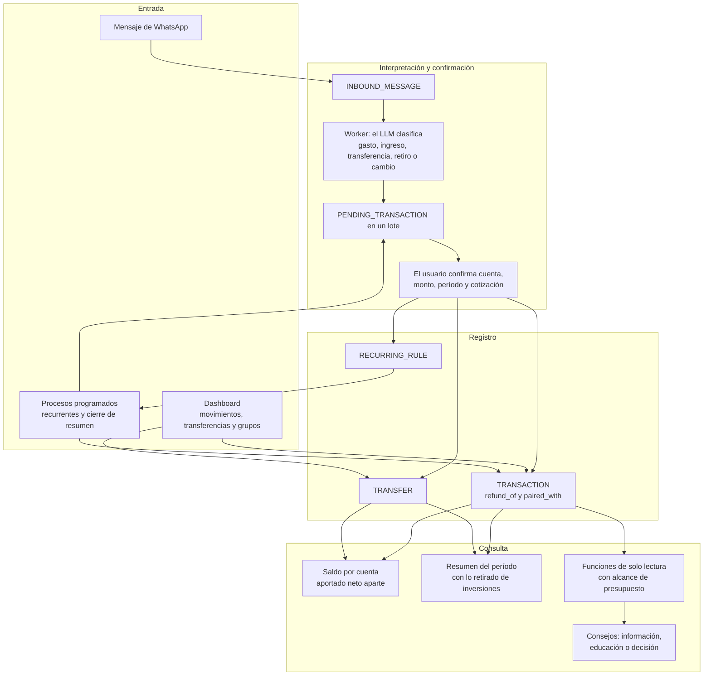

# Platita — Validación de diseño por casos de uso

- **Fecha de la corrida:** 2026-09-27 (cuarta corrida)
- **Rama analizada:** `feature/entrega-1-VNZ`, commit `62199c9`
- **Corrida anterior:** 2026-09-27, commit `bdeb19a` (3 commits antes)

> **Esto no es especificación.** Es un registro: el diagnóstico de la especificación tal como
> estaba en la fecha de la corrida. Sus recomendaciones y su decisión D29 son propuestas, no
> reglas. Ninguna se implementa hasta que la autora la decide y la regla se escribe en el
> documento que corresponde —[reglas de dominio](reglas-de-dominio.md), el
> [modelo de datos](03-modelo-de-datos.md) o un ADR—, que es lo que manda. Criterio en
> [`AGENTS.md`](../AGENTS.md) §10.
>
> **Cómo se actualiza.** No se edita a mano: se vuelve a correr el mismo ejercicio, que lee esta
> corrida, la compara y sobrescribe el archivo. Las decisiones siguen una sola numeración entre
> corridas: D1 a D28 están cerradas, y una referencia vieja nunca apunta a otra decisión.

**Decisiones de la autora que esta corrida respeta.** Tomadas después de la corrida anterior y
registradas en ella, se tratan como cerradas y no se vuelven a proponer:

- **Un movimiento pertenece a un solo presupuesto** (A3.8, `reglas-de-dominio.md` §1).
- **Las devoluciones con tarjeta son una limitación conocida, no bloqueante** (A1.4,
  `hoja-de-ruta.md`).
- **El efectivo de la actividad usado para gastos personales** se registra como un retiro del
  titular; recordarlo es del usuario (A3.3).
- **La plata que un miembro le pasa a otro para gastos del grupo** va como gasto individual de
  quien la da e ingreso individual de quien la recibe, sin escribirlo en la especificación, con el
  riesgo aceptado de contarla dos veces si también se carga en el grupo (A5.2).

**Documentos analizados**

- `AGENTS.md` (y `CLAUDE.md`, que es un enlace simbólico a él)
- `README.md`
- `llms.txt`
- `prompts.md` (como contexto, no como especificación)
- `docs/01-producto.md`
- `docs/02-arquitectura.md`
- `docs/03-modelo-de-datos.md`
- `docs/04-api.md`
- `docs/05-historias-de-usuario.md`
- `docs/06-tickets.md`
- `docs/07-pull-requests.md`
- `docs/08-convenciones-de-documentacion.md`
- `docs/reglas-de-dominio.md`
- `docs/recorrido-completo.md`
- `docs/convenciones-de-desarrollo.md`
- `docs/hoja-de-ruta.md`
- `docs/terminos-y-privacidad.md`
- `docs/operacion.md`
- `docs/documentacion-viva.md`
- `docs/flujo-de-trabajo-con-ia.md`
- `docs/conversacion-reestructuracion-docs.md` (registro, no especificación)
- `docs/features/TEMPLATE/` (`spec.md`, `ui_contract.md`, `qa_plan.md`, `pr.md`)
- `docs/adr/0001` a `docs/adr/0017`
- `.claude/skills/domain-rules/SKILL.md` y `.claude/commands/` (contexto de trabajo)

No hay diagramas en imagen: todos están en Mermaid, dentro de los Markdown. `site/` se genera
desde `docs/` y no es fuente. La corrida anterior de este archivo se leyó solo para la sección 5.
Los datos de mercado son los de las corridas anteriores, del mismo día.

---

## 1. Mapa del diseño (Fase 0)

### 1.1. Documentos existentes

| Documento | Qué cubre | Nivel de detalle |
|---|---|---|
| `01-producto.md` | Objetivo, catálogo must/should/could, fuera de alcance y la secuencia del registro por WhatsApp | Especificación funcional |
| `reglas-de-dominio.md` | Dueño de las reglas de negocio, en 18 grupos. Desde la corrida anterior suma el catálogo base de categorías (§4), el cambio de presupuesto de un movimiento (§15), la cuota de los mensajes de grupos (§12), lo retirado de inversiones sin transferencias internas (§17) y el conflicto de nombre al aceptar una invitación (§10) | Especificación funcional detallada, con reglas de borde |
| `03-modelo-de-datos.md` | Diagramas ER por área y 26 entidades | Diseño técnico |
| `04-api.md` | Webhook, presupuestos y períodos, resumen del período, movimientos, transferencias, grupos e invitaciones, login, exportaciones y borrado de cuenta | Diseño técnico, parcial ("endpoints principales") |
| `05-historias-de-usuario.md` | HU1 a HU7 | Especificación funcional |
| `06-tickets.md` | Webhook e interpretación, vista de presupuesto y esquema inicial; el seed apunta al catálogo de §4 | Diseño técnico |
| `02-arquitectura.md` y `recorrido-completo.md` | C4, despliegue, seguridad y el recorrido de punta a punta | Diseño técnico |
| `hoja-de-ruta.md` | Pendientes de la entrega 2 y decisiones abiertas | Idea general y registro de decisiones |
| `terminos-y-privacidad.md` | Índice de lo que tienen que cubrir los términos | Idea general |
| `adr/0001` a `0017` | Decisiones de arquitectura | Diseño técnico, con alternativas |
| El resto de `docs/` | Operación, método de trabajo, convenciones y plantillas | No describen comportamiento financiero |

### 1.2. Diseño reconstruido

**Funcionalidades** (`01-producto.md` §1.2): sin cambios de alcance.

**Entidades centrales** (`03-modelo-de-datos.md` §3.2):

| Entidad | Qué es |
|---|---|
| `ACCOUNT` | Una moneda por cuenta, saldo calculado. Una cuenta de inversión por moneda; un plazo fijo es una cuenta bancaria |
| `TRANSACTION` | Gasto o ingreso completo, en un solo período. `paired_with` enlaza retiros y aportes del titular |
| `TRANSFER` | Entre dos cuentas propias. En la misma moneda, montos iguales; la comisión es un gasto aparte |
| `CATEGORY` | Catálogo base fijo (15 de gasto, 6 de ingreso y 12 especiales) más categorías propias |
| `BUDGET_PERIOD` y `BUDGET` | Período individual o de grupo, sin solapes, `draft` o `confirmed` |
| `FAMILY_GROUP`, `USER_GROUP` y `GROUP_INVITATION` | Familia o actividad; se crea con su primer período y se entra con un código que comparte el dueño |
| `RECURRING_RULE` y `CARD_STATEMENT` | Reglas fijas o variables, compras con tarjeta y resúmenes conciliados |
| `PENDING_TRANSACTION` y `PENDING_BATCH` | Lo que espera una decisión del usuario, en lotes numerados |
| `ADVICE_DOCUMENT`, `INDICATOR_VALUE` y `EXCHANGE_RATE` | Base de educación financiera, indicadores y cotizaciones, con antigüedad máxima por fuente |

**Flujo central: cómo entra, cómo se guarda y cómo se consulta un dato**

```mermaid
flowchart TB
    subgraph ENTRADA["Entrada"]
        WA["Mensaje de WhatsApp"]
        DASH["Dashboard<br/>movimientos, transferencias y grupos"]
        CRON["Procesos programados<br/>recurrentes y cierre de resumen"]
    end
    subgraph PROCESO["Interpretación y confirmación"]
        INB["INBOUND_MESSAGE"]
        WK["Worker: el LLM clasifica<br/>gasto, ingreso, transferencia, retiro o cambio"]
        PEND["PENDING_TRANSACTION en un lote"]
        CONF["El usuario confirma cuenta,<br/>monto, período y cotización"]
    end
    subgraph DATOS["Registro"]
        TX["TRANSACTION<br/>refund_of y paired_with"]
        TR["TRANSFER"]
        RR["RECURRING_RULE"]
    end
    subgraph LECTURA["Consulta"]
        SALDO["Saldo por cuenta<br/>aportado neto aparte"]
        SUM["Resumen del período<br/>con lo retirado de inversiones"]
        FN["Funciones de solo lectura<br/>con alcance de presupuesto"]
        ADV["Consejos: información,<br/>educación o decisión"]
    end
    WA --> INB --> WK --> PEND --> CONF
    CONF --> TX
    CONF --> TR
    CONF --> RR
    DASH --> TX
    DASH --> TR
    RR --> CRON
    CRON --> TX
    CRON --> PEND
    TX --> SALDO
    TR --> SALDO
    TX --> SUM
    TR --> SUM
    TX --> FN
    FN --> ADV
```

- **Entrada.** Fecha, moneda (la de la cuenta nombrada, o la primaria) y categoría del catálogo
  se completan solas y se muestran; monto, cuenta y período se confirman siempre
  (`reglas-de-dominio.md` §1 y §4).
- **Registro.** Un movimiento pertenece a un solo presupuesto (§1), y se puede pasar a otro
  nombrándolo (§15). El retiro y el aporte del titular son pares enlazados (§10).
- **Consulta.** Las funciones de §17 suman el presupuesto individual por defecto, un grupo si se
  lo nombra, o todo si se pide el total. Lo retirado de inversiones cuenta solo lo que sale hacia
  cuentas que no son de inversión. Los consejos responden en tres clases (§18).

### 1.3. Decisiones confirmadas en la documentación

Las tres están documentadas, sin contradicciones con otros documentos. El detalle está en la
sección 2.

### 1.4. Áreas sin cobertura

1. **Alta y edición de cuentas desde el dashboard**, que pide la HU1 y no tiene endpoint
   (`recorrido-completo.md` §13). Sigue abierta desde la primera corrida.
2. **Crear una categoría propia por pedido explícito** ("creá la categoría Prepaga"). §4 solo
   describe la creación que propone el asistente cuando ninguna encaja. **[INFERIDO]** sigue la
   misma confirmación.

### 1.5. Contradicciones visibles entre documentos

| # | Contradicción | Documentos |
|---|---|---|
| X4 | Siguen registradas en la hoja de ruta: cuotas en YAML contra "sin desplegar", rama de despliegue y quién genera las alertas con RAG | `hoja-de-ruta.md`, Decisiones abiertas |
| X8 | La regla dice que un usuario no tiene dos categorías con el mismo nombre, pero los dos índices que la imponen no cruzan las propias con las del catálogo base: una categoría propia puede llamarse igual que una base | `03-modelo-de-datos.md` CATEGORY (restricciones), contra `reglas-de-dominio.md` §4 |
| X9 | *No es especificación, se reporta igual:* el `README.md` dice "46 casos" de esta validación; ahora son 47 | `README.md` |

X5, X6 y X7 de la corrida anterior quedaron resueltas (sección 5).

### 1.6. Preguntas bloqueantes

Ninguna.

---

## 2. Decisiones confirmadas

| Decisión | ¿Documentada? | Dónde | Contradicciones | Casos límite sin resolver |
|---|---|---|---|---|
| **1. Actividades** con presupuesto propio y autotransferencias para pagarse un sueldo | Sí | `reglas-de-dominio.md` §10 (crear, invitar, aceptar, conflicto de nombre, retiro con una o dos cuentas, aporte, totales consolidados); §15 (cambiar el presupuesto de un movimiento); §18 (consejos sobre un grupo de un solo miembro); `03-modelo-de-datos.md` TRANSACTION y GROUP_INVITATION; `04-api.md`; HU7; §4 (categorías especiales del retiro y el aporte) | Ninguna | Ninguno. Los gastos mixtos van enteros a un presupuesto por decisión (A3.8) |
| **2. Cuentas de inversión opacas** | Sí | `reglas-de-dominio.md` §2 (aportes y retiros, una cuenta por moneda, aportado neto fuera de los totales, plazo fijo como cuenta bancaria); §17 (Saldos y lo retirado de inversiones hacia cuentas que no lo son); HU1; `04-api.md` | Ninguna | Ninguno |
| **3. Educación, no recomendación** | Sí | `reglas-de-dominio.md` §18; §17 (Indicadores); §12 (un dato de mercado es una consulta); `01-producto.md` §1.1 y §1.2; `terminos-y-privacidad.md` | Ninguna | Detectar que una insistencia es "sobre la misma pregunta" queda en manos del modelo. No hay fuente de datos con nombre de entidad en el MVP |

---

## 3. Supuestos asumidos

- **Público objetivo:** personas y hogares de Argentina, adultos de 18 a 75 años [supuesto],
  bancarizados y usuarios de WhatsApp, con varias cuentas, billeteras y monedas, y
  monotributistas con una actividad (`01-producto.md` §1.1; decisión 1). Lanzamiento solo en
  Argentina (ADR 0011).
- **Canales:** WhatsApp como canal principal y dashboard web para ver, configurar y cargar
  gastos, ingresos y transferencias (ADR 0002).
- **Fuera de alcance:** modo offline, lectura de capturas y conexión con bancos
  (`01-producto.md` §1.2, `AGENTS.md` §1). Email y duplicados automáticos son could-have.
- Se evalúa el diseño completo documentado, incluidas las should-have.
- La cotización de referencia del usuario es MEP.
- Los montos y normas son de septiembre de 2026 (sección 14). Son orientativos.
- **[INFERIDO]** marca lo que se deduce sin estar escrito. Las frecuencias sin fuente llevan
  **[ESTIMADO]**.

---

## 4. Resumen ejecutivo

**Madurez general: alta, lista para implementar.** Las 28 decisiones de las corridas anteriores
están cerradas. Las tres decisiones confirmadas quedaron reflejadas sin contradicciones ni casos
límite abiertos. Queda un solo problema nuevo, chico y con arreglo de una línea.

De los 47 casos recorridos (los 46 anteriores y 1 nuevo):

| Veredicto | Casos |
|---|---|
| INCORRECTO | 1 |
| CONTRADICTORIO | 1 |
| NO ESPECIFICADO | 0 |
| NO SOPORTADO | 1 |
| PARCIAL | 0 |
| SOPORTADO | 44 |

**Lo que queda**

1. **Una categoría propia puede llamarse igual que una del catálogo base** (CONTRADICTORIO, A6.8,
   nuevo). El modelo dice que un usuario no tiene dos categorías con el mismo nombre, pero los
   índices no lo impiden cuando una es base. Si la hija de Norma crea "Salud" para la prepaga, el
   asistente ve dos "Salud" y no puede resolver "gasté en salud" sin adivinar.
2. **Las devoluciones con tarjeta** siguen inflando el ingreso del período (INCORRECTO, A1.4),
   aceptado como limitación conocida.
3. **Un gasto mixto va entero a un presupuesto** (NO SOPORTADO, A3.8), por decisión.

**Decisión pendiente:** D29, que el nombre de una categoría propia no coincida con uno del
catálogo base.

---

## 5. Comparación con la corrida anterior

La corrida anterior recorrió 46 casos: 2 INCORRECTO, 0 CONTRADICTORIO, 0 NO ESPECIFICADO, 2 NO
SOPORTADO, 2 PARCIAL y 40 SOPORTADO.

### 5.1. Casos que cambiaron de veredicto

| Caso | Antes | Ahora | Qué lo cerró |
|---|---|---|---|
| A4.10 · La compra de MEP contaba como retiro | INCORRECTO | SOPORTADO | §17: solo cuentan las transferencias hacia una cuenta que no es de inversión (D27) |
| A5.7 · Conflicto de nombre al aceptar una invitación | PARCIAL | SOPORTADO | §10 "Si el nombre del grupo choca, el código espera"; §11 "Miembro nuevo" (D28) |
| A3.3 · Efectivo de la actividad para gastos personales | PARCIAL | SOPORTADO | Decisión de la autora: se registra como retiro del titular (§10) |
| A5.2 · Plata entre miembros para gastos del grupo | NO SOPORTADO | SOPORTADO [INFERIDO] | Decisión de la autora: gasto e ingreso individuales, con el riesgo de doble conteo aceptado |
| A3.9 · Harina imputada al presupuesto equivocado | SOPORTADO [INFERIDO] | SOPORTADO | §15 "Cambiar el presupuesto" |

### 5.2. Decisiones pendientes que se cerraron

| Decisión | Cómo se cerró |
|---|---|
| D27 · Qué cuenta como retirado de inversiones | Opción 1 |
| D28 · Conflicto de nombre al aceptar una invitación | Opción 1 |

Se cerraron también los ajustes que no eran decisiones: la definición de consulta de §12 (X6), la
hoja de ruta sin numerar las decisiones del informe (X7), la lectura de emails en el `README.md`
(X5), la cuota de los mensajes de grupos y el catálogo base de categorías.

### 5.3. Problemas nuevos

- **A6.8** (CONTRADICTORIO): el catálogo base volvió concreto un hueco que ya estaba en las
  restricciones de `CATEGORY`. Mientras no había nombres base fijos, nadie lo iba a notar.
- **X9**: el conteo del `README.md` quedó atrás una vez más.

### 5.4. Problemas que siguen abiertos

- A1.4, como limitación aceptada.
- X4, en la hoja de ruta.
- El alta de cuentas desde el dashboard sin endpoint.

---

## 6. Arquetipos

| Arquetipo | Situación | Qué necesita de Platita |
|---|---|---|
| **A1 · Lucía, asalariada** | 34 años, CABA. Sueldo neto de $1.450.000 con paritarias. Galicia en pesos y en dólares, Mercado Pago, Visa con saldo en pesos y en dólares. Paga ChatGPT en dólares | Saber en qué se le va la plata, llegar al vencimiento sin sorpresas y entender qué cuesta un préstamo |
| **A2 · Martín, freelancer que cobra del exterior** | 29 años, desarrollador, monotributista. Factura unos USD 2.500 por mes con factura E y cobra por Payoneer; a veces en USDT. Vende dólares al MEP | Llevar ingresos en dólares y gastos en pesos sin mezclar monedas, y aprender qué hacer con lo que ahorra |
| **A3 · Carla, microemprendedora** (obligatorio) | 38 años, Morón. Vende viandas y tortas; monotributo categoría A ($49.527). Cobra por el mismo Mercado Pago que usa para lo personal y en efectivo en ferias. Factura unos $2.400.000 por mes y se paga $900.000 | Separar la actividad de lo personal, pagarse un sueldo y saber si el emprendimiento se sostiene |
| **A4 · Diego, inversor** (obligatorio) | 46 años, Rosario. Empleado con $2.100.000 netos. Tiene CEDEARs y FCI en Balanz, en pesos y en dólares, saldo remunerado en Mercado Pago y un plazo fijo. Completa los gastos del mes retirando del broker | Saber cuánto puso y sacó de cada inversión, sin que Platita pretenda saber cuánto vale |
| **A5 · Sofía y Nico, pareja** | Convivientes, cada uno con sus cuentas. Presupuesto de grupo "Casa". Alquiler de $850.356 con ajuste por IPC. Sofía también está en el grupo "Familia" de sus padres | Ver cuánto llevan gastado entre los dos y cuánto puso cada uno |
| **A6 · Norma, jubilada** | 70 años, Lanús. Cobra $505.748,51 (mínima más bono, octubre de 2026) en Cuenta DNI. Usa efectivo y reintegros. Su hija la ayuda con la computadora | Registrar simple, controlar el efectivo y entender qué es cada cosa antes de que le ofrezcan algo |

---

## 7. Matriz de casos

Frecuencias: salvo cita, **[ESTIMADO]**. Orden: veredicto y, dentro de cada uno, de más a menos
frecuente. A3 y A4 tienen más de seis casos porque incluyen los casos límite obligatorios.

| # | Arquetipo | Caso | Tipo | Frecuencia | Veredicto | Evidencia (doc/sección) | Cambio mínimo | Parte afectada |
|---|---|---|---|---|---|---|---|---|
| A1.4 | A1 | Devuelve unas zapatillas de $180.000 compradas en 3 cuotas, después de pagar la primera | Incómodo (devolución) | Ocasional | INCORRECTO (limitación aceptada) | `reglas-de-dominio.md` §13 y §16; `hoja-de-ruta.md` ("Devoluciones con tarjeta: limitación conocida") | Ninguno: decidido como no bloqueante | Flujo de ingesta, reportes |
| A6.8 | A6 | La hija de Norma le pide al asistente crear la categoría "Salud" para separar la prepaga; "Salud" ya está en el catálogo base | Error (categoría duplicada) | Ocasional | CONTRADICTORIO | `reglas-de-dominio.md` §4 (catálogo base); `03-modelo-de-datos.md` CATEGORY ("un usuario no tiene dos categorías con el mismo nombre", impuesto por dos índices que no cruzan base y propias) | Rechazar una categoría propia con el nombre de una base (D29) | Modelo de datos |
| A3.8 | A3 | El celular ($60.000 por mes) lo usa para la actividad y para lo personal | Incómodo (gasto mixto) | Mensual | NO SOPORTADO (por decisión) | §1 "Un movimiento, un presupuesto" | — | — |
| A1.1 | A1 | "Gasté 58.400 en el super con la Galicia" | Cotidiano | Diaria | SOPORTADO | `01-producto.md` §1.3; §1, §3 y §4 (Supermercado) | — | — |
| A3.2 | A3 | Cobra una vianda de $18.000 por el Mercado Pago que usa también para lo personal | Cotidiano (actividad) | Diaria | SOPORTADO | §10 (cuenta y presupuesto independientes), §4 (Ventas) | — | — |
| A3.3 | A3 | Hace 22 ventas en efectivo en la feria del sábado, y con esa plata paga la verdulería | Incómodo (efectivo) | Semanal | SOPORTADO | §10 "El retiro del titular", sobre la cuenta de efectivo; decisión de la autora | — | — |
| A6.3 | A6 | Saca $150.000 del cajero y paga en efectivo | Cotidiano (efectivo) | Semanal (1,7 extracciones por adulto por mes, BCRA 30/04/2026) | SOPORTADO | §13 (sacar efectivo es transferencia) | — | — |
| A5.1 | A5 | Nico paga el super de $92.000 con su Mercado Pago y lo imputa a "Casa" | Cotidiano | Semanal | SOPORTADO | §1, §5 y §10 | — | — |
| A5.6 | A5 | "¿A cuánto está el MEP hoy?" antes de comprar dólares | Educación (información) | Semanal | SOPORTADO | §17 Indicadores; §18; §12 (cuenta como consulta) | — | — |
| A6.2 | A6 | Reintegro de $3.200 de Cuenta DNI por una compra de $16.000 | Incómodo (reintegro) | Semanal | SOPORTADO | §16 (`refund_of`) | — | — |
| A1.5 | A1 | Responde "eran 3.800" citando el "Listo…" | Error (monto) | Semanal | SOPORTADO | §15 | — | — |
| A4.5 | A4 | Mira el dashboard: ¿cuánto tiene en total? | Cotidiano (revisar) | Semanal | SOPORTADO | §2 "El aportado neto no suma en ningún total"; HU1 | — | — |
| A5.2 | A5 | Sofía le transfiere $300.000 a Nico para gastos de la casa | Incómodo (entre personas) | Mensual | SOPORTADO [INFERIDO] | Decisión de la autora: gasto individual de Sofía e ingreso individual de Nico (§1, §4 "Otros ingresos"); los gastos de la casa los carga quien paga (§10) | — | — |
| A5.4 | A5 | Los dos cargan el mismo super de $92.000 a "Casa" | Error (duplicado) | Mensual | SOPORTADO | §7 "Entre miembros de un grupo" | — | — |
| A1.3 | A1 | ChatGPT (USD 20) en la Visa USD, pagado en pesos al dólar tarjeta ($2.002) | Incómodo (moneda extranjera) | Mensual | SOPORTADO | §13 "Una tarjeta en otra moneda" y "El residuo al pagar" | — | — |
| A2.1 | A2 | Cobra USD 2.450 en Payoneer; su presupuesto es en pesos | Cotidiano (ingreso en USD) | Mensual | SOPORTADO | §6 | — | — |
| A2.2 | A2 | "Me pagaron 2400 en Payoneer", sin decir la moneda | Error (moneda) | Mensual | SOPORTADO | §1 "La moneda sale de la cuenta nombrada" | — | — |
| A2.3 | A2 | Pasa USD 2.450 de Payoneer a Galicia USD y llegan USD 2.401 | Incómodo (comisión) | Mensual | SOPORTADO | §13 "Una comisión en una transferencia es un gasto aparte"; §4 ("Comisiones") | — | — |
| A2.4 | A2 | Un cliente le paga USD 600 en USDT a Binance | Incómodo (moneda) | Mensual | SOPORTADO | §2 "Una stablecoin es una cuenta en dólares" | — | — |
| A2.5 | A2 | "Me sobraron USD 3.000 este mes, ¿qué hago?" | Educación (decisión) | Mensual | SOPORTADO | §18 "Cómo se responde una pregunta de decisión" | — | — |
| A3.4 | A3 | Se paga $900.000 de sueldo; todo pasa por el mismo Mercado Pago | Incómodo (actividad) | Mensual | SOPORTADO | §10 "El retiro del titular"; TRANSACTION `paired_with` | — | — |
| A3.5 | A3 | "¿Cuánto gasté este mes?" y "¿cuánto gasté contando todo?" | Cotidiano (revisar) | Mensual | SOPORTADO | §17 "A qué presupuesto se refiere una pregunta"; §10 | — | — |
| A3.6 | A3 | Con una cuenta Galicia propia de la actividad, se transfiere $900.000 de sueldo a su Mercado Pago | Incómodo (actividad) | Mensual | SOPORTADO | §10 "El retiro es igual con una cuenta o con dos" | — | — |
| A3.9 | A3 | Imputó la harina ($35.000) al presupuesto personal en vez de a la actividad | Error (actividad equivocada) | Mensual | SOPORTADO | §15 "Cambiar el presupuesto" | — | — |
| A3.10 | A3 | "¿Cuánto me puedo pagar de sueldo sin fundir el emprendimiento?" | Educación (decisión con datos) | Mensual | SOPORTADO | §18 "La excepción es un grupo de un solo miembro" y "Cómo se responde una pregunta de decisión" | — | — |
| A4.1 | A4 | Aporta $500.000 de Galicia a Balanz ARS | Cotidiano (inversión) | Mensual | SOPORTADO | §2 y §13; `POST /transfers` | — | — |
| A4.2 | A4 | Retira $400.000 por mes de Balanz para completar los gastos | Incómodo (inversión) | Mensual | SOPORTADO | §17 "Lo retirado de inversiones se muestra aparte" | — | — |
| A4.6 | A4 | Mercado Pago le rinde $11.400 en el mes (18,62% TNA) | Cotidiano (rendimiento) | Mensual | SOPORTADO | §2 (contraste mensual, "Rendimientos") | — | — |
| A4.7 | A4 | Arma un plazo fijo de $3.000.000 a 30 días al 20% de TNA | Incómodo (inversión) | Mensual | SOPORTADO | §2 "Un plazo fijo es una cuenta bancaria" | — | — |
| A4.10 | A4 | Compra USD 1.000 al MEP ($1.544.350) dentro de Balanz, de "Balanz ARS" a "Balanz USD" | Incómodo (inversión) | Mensual | SOPORTADO | §2 "Una cuenta de inversión por moneda"; §17 (no cuenta como retirado) | — | — |
| A5.5 | A5 | El alquiler sube por IPC en el ajuste | Cotidiano (recurrente variable) | Mensual | SOPORTADO | §8 | — | — |
| A6.1 | A6 | Cobra la jubilación con aumento mensual y el bono de $70.000 | Cotidiano (ingreso) | Mensual | SOPORTADO | §8; §4 ("Jubilación y pensión") | — | — |
| A1.2 | A1 | Cobra aguinaldo de $725.000 en junio; el borrador de julio copia ese ingreso | Incómodo (aguinaldo) | Semestral (30/06 y 18/12, iProfesional 2026) | SOPORTADO | §3 "Confirmar tal cual, por WhatsApp"; §4 ("Aguinaldo") | — | — |
| A1.6 | A1 | "Me ofrecen un préstamo de $3.000.000 al 99% de TNA (CFTEA 207,94%), ¿me conviene?" | Educación (decisión) | Ocasional | SOPORTADO | §18 "Tres clases de respuesta" y "Cómo se responde una pregunta de decisión" | — | — |
| A2.6 | A2 | Insiste: "no me expliques, decime vos: ¿CEDEARs o plazo fijo en dólares?" | Educación (decisión) | Ocasional | SOPORTADO | §18 "Si el usuario insiste" | — | — |
| A3.1 | A3 | Crea la actividad "Cocina de Carla" | Cotidiano (configuración) | Ocasional | SOPORTADO | §10 "Crear un grupo" y "El primer período nace con el grupo"; §12; HU7 | — | — |
| A3.7 | A3 | Pone $250.000 de sus ahorros para comprar un horno para la actividad | Incómodo (actividad) | Ocasional | SOPORTADO | §10 "El aporte del titular es el camino inverso"; §4 | — | — |
| A4.3 | A4 | Aportó $2.000.000 en total y retira $2.600.000 | Incómodo (inversión) | Ocasional | SOPORTADO | §2 (aportado neto negativo, fuera de los totales) | — | — |
| A4.4 | A4 | Aporta pesos a Balanz, compra MEP adentro y retira USD 1.000 a Galicia USD | Incómodo (inversión, monedas) | Ocasional | SOPORTADO | §2 "Una cuenta de inversión por moneda" | — | — |
| A4.8 | A4 | Registró el aporte desde Mercado Pago cuando salió de Galicia | Error (cuenta) | Ocasional | SOPORTADO | §15 | — | — |
| A4.9 | A4 | "¿Qué banco paga más por un plazo fijo?" | Educación (información) | Ocasional | SOPORTADO | §18 "Información con nombre de entidad, solo si una fuente la publica" | — | — |
| A5.3 | A5 | Heladera de $1.200.000 en 12 cuotas sin interés con la tarjeta de Sofía | Incómodo (cuotas) | Ocasional | SOPORTADO | §8 y §13 | — | — |
| A5.7 | A5 | Nico invita a Sofía a su grupo "Familia"; Sofía ya está en el grupo "Familia" de sus padres | Incómodo (grupos) | Ocasional | SOPORTADO | §10 "Si el nombre del grupo choca, el código espera"; §11 | — | — |
| A6.4 | A6 | Borra por error la farmacia de $27.300 y la recupera | Error (borrado) | Ocasional | SOPORTADO | §15 "Borrar y restaurar" | — | — |
| A6.5 | A6 | "¿Qué es un fondo común de inversión?" | Educación (concepto) | Ocasional | SOPORTADO | §18, clase educación | — | — |
| A6.6 | A6 | "¿Cuánto paga hoy un plazo fijo?" | Educación (información) | Ocasional | SOPORTADO | §17 Indicadores; §18 | — | — |
| A6.7 | A6 | "Si saco $1.000.000 en 12 cuotas de $140.000, ¿qué parte de mi jubilación es?" | Educación (decisión con datos) | Ocasional | SOPORTADO | §18, paso 3: los datos del usuario como cálculo, sin adjetivo | — | — |

---

## 8. Detalle de los casos INCORRECTO y CONTRADICTORIO

### A6.8 · Una categoría propia con el nombre de una base (CONTRADICTORIO)

**Qué hace la usuaria.** La hija de Norma quiere separar la prepaga del resto de los gastos de
salud y le escribe al asistente "creá la categoría Salud para la prepaga". "Salud" ya existe en
el catálogo base.

**Qué dice cada fuente.**

- **`03-modelo-de-datos.md` CATEGORY, restricciones:** "un usuario no tiene dos categorías con el
  mismo nombre, sin distinguir mayúsculas: índice único sobre `(user_id, lower(name))`, más un
  índice único parcial sobre `lower(name)` donde `user_id` es nulo para el catálogo base".
- **Lo que esos índices imponen:** el primero compara solo categorías del mismo usuario; el
  segundo, solo las del catálogo base entre sí. Una categoría propia "Salud", con `user_id` de
  Norma, no choca con la base "Salud", con `user_id` nulo.
- **`reglas-de-dominio.md` §4:** la categoría se resuelve contra el catálogo del usuario, que es
  el base más las propias. §2 da el motivo de la unicidad para las cuentas: el asistente reconoce
  por el nombre, y dos iguales harían imposible saber a cuál se refiere.

**Dónde falla.** La regla promete algo que el mecanismo no cumple. Norma queda con dos "Salud",
y "gasté 12.000 en salud" no tiene una sola categoría candidata: el asistente tiene que elegir
una, que es justo lo que la unicidad existe para evitar. Lo mismo pasa si la categoría se crea
desde el dashboard.

### A1.4 · Devolución de una compra en cuotas (INCORRECTO, limitación aceptada)

Sin cambios desde la corrida anterior. La acreditación del banco llega como un ajuste sin
vincular (§13 y §16), así que suma como ingreso del período y "Ropa" conserva lo gastado. La
autora lo aceptó como limitación conocida, con la conciliación cuadrando el total
(`hoja-de-ruta.md`). No se propone cambio.

---

## 9. Educación financiera

| Caso | Tipo (información/educación/decisión) | Respuesta prevista | ¿Enseña a razonar sin dar veredicto? | Fuente y actualización de datos |
|---|---|---|---|---|
| **A6.5** · "¿Qué es un FCI?" | Educación | Conceptos, riesgos y costos (§18) | Sí | Base curada (`ADVICE_DOCUMENT`), revisión manual con `last_reviewed_at` |
| **A6.6** · "¿Cuánto paga hoy un plazo fijo?" | Información | Tasa promedio del BCRA con su fecha, por la función Indicadores; cuenta como consulta (§12, §17, §18) | No aplica: es un dato | `INDICATOR_VALUE`, con antigüedad máxima por fuente; pasado el plazo, dice la fecha en vez de usarlo |
| **A5.6** · "¿A cuánto está el MEP?" | Información | Última cotización de la fuente, con su fecha (§17 Indicadores) | No aplica | `EXCHANGE_RATE` (ADR 0011), con antigüedad máxima por fuente |
| **A4.9** · "¿Qué banco paga más?" | Información | Sin fuente con nombre de entidad en el MVP: ofrece el promedio. Con fuente, lista ordenada por nombre | No aplica; evita el orden de preferencia | Ninguna fuente por entidad en el MVP |
| **A1.6** · "¿Me conviene un préstamo al 99%?" | Decisión | Conceptos, criterios, sus datos como cálculo y el cierre fijo (§18) | Sí | El usuario trae la tasa; el CFT tiene que informarse destacado (BCRA) |
| **A2.5** · "Me sobraron USD 3.000" | Decisión | La misma estructura; ordenar prioridades es un criterio, no una indicación (§18) | Sí | Datos propios por las funciones de §17 |
| **A2.6** · Insiste "decime vos" | Decisión | Explica una vez el límite; a la segunda, texto fijo (§18) | Sí | — |
| **A6.7** · "¿Qué parte de mi jubilación es la cuota?" | Decisión con datos | El cálculo, sin adjetivo (§18) | Sí | Ingresos del historial real (§17) |
| **A3.10** · "¿Cuánto me puedo pagar de sueldo?" | Decisión con datos | La misma estructura, leyendo la actividad de un solo miembro (§18) | Sí | Presupuesto de la actividad y el individual |

**Huecos del diseño en esta área**

1. **La insistencia la detecta el modelo.** La forma de la respuesta es verificable; la detección
   de "la misma pregunta", no. Es el mismo criterio que la clasificación del tipo de un
   movimiento, y se acepta igual.
2. **No hay fuente de datos con nombre de entidad.** Hasta que se configure una, "¿qué banco paga
   más?" siempre responde con el promedio.
3. **Los umbrales de antigüedad son ejemplos** en §18. Conviene fijarlos en la configuración de
   cada fuente al crearla.

---

## 10. Decisiones pendientes (Fase 3)

### D29 · Nombre de una categoría propia contra el catálogo base

- **Contexto:** la unicidad de nombres de `CATEGORY` no cruza las categorías propias con las
  base.
- **Casos que la originan:** A6.8.
- **Opciones:**
  1. Al crear o renombrar una categoría propia, la aplicación rechaza un nombre igual, sin
     distinguir mayúsculas, a uno del catálogo base, dentro de la misma transacción. El asistente
     le dice al usuario que esa categoría ya existe y le ofrece usarla o elegir otro nombre, como
     "Prepaga".
  2. Un trigger en `CATEGORY` que haga el mismo rechazo en la base.
  3. Permitirlo y que el asistente pregunte entre las dos cada vez.
- **Consecuencias:**
  1. Es el mismo criterio que el nombre único entre grupos (§10), que también valida la
     aplicación porque un índice no puede expresarlo. No toca el esquema.
  2. Lo impone la base aunque la aplicación falle, a costo de un trigger más, y el catálogo base
     es fijo, así que el trigger no cambia nunca.
  3. Una pregunta de más en cada gasto de esa categoría, para siempre.
- **Recomendación:** opción 2. El catálogo base es fijo y chico, y `AGENTS.md` §8 pide los
  `CHECK` en la base cuando se puede. Si se prefiere no sumar triggers, la opción 1.
- **Dónde registrarla:** `03-modelo-de-datos.md` CATEGORY; `reglas-de-dominio.md` §4; criterio de
  aceptación del Ticket 3.

---

## 11. Patrones

1. **Una restricción que se enuncia más fuerte que su mecanismo.**
   - *Casos:* A6.8.
   - *Causa en el diseño:* la frase de la restricción describe la intención ("un usuario no tiene
     dos categorías con el mismo nombre") y los índices describen otra cosa, más débil. Pasó
     desapercibido hasta que hubo nombres base reales. Conviene que cada restricción del modelo
     se pueda leer como un criterio de aceptación del Ticket 3 que la base rechace; esta no
     figura en ese criterio.
2. **Los límites aceptados quedan documentados donde el usuario no los ve.**
   - *Casos:* A1.4, A3.8, A5.2.
   - *Causa en el diseño:* las tres son decisiones de alcance razonables y están registradas —en
     la hoja de ruta, en §1 y en este informe—. Ninguna llega al usuario: nada le dice que una
     devolución va a verse como ingreso, ni cómo registrar la plata que le pasa a su pareja. Si
     aparecen quejas, el lugar natural para decirlo son los mensajes del asistente o una ayuda en
     el dashboard, no la especificación.

---

## 12. Cambios a la documentación priorizados

Prioridad = frecuencia × impacto sobre la exactitud de los números.

| # | Cambio | Documento | Decisión o caso |
|---|---|---|---|
| 1 | Rechazar una categoría propia con el nombre de una base, y sumarlo al criterio de aceptación | `03-modelo-de-datos.md` CATEGORY; `reglas-de-dominio.md` §4; `06-tickets.md` Ticket 3 | D29 |
| 2 | Actualizar el conteo de casos | `README.md` | X9 |
| 3 | Endpoint para dar de alta y editar cuentas desde el dashboard | `04-api.md` | 1.4 |
| 4 | Decir que una categoría propia también se crea por pedido explícito, con la misma confirmación | `reglas-de-dominio.md` §4 | 1.4 |

---

## 13. Preguntas de producto (no bloqueantes)

1. ¿La percepción del 30% se muestra aparte como recuperable? §13 lo deja como mejora futura.
2. Una feriante con 20 o 30 ventas por día, ¿registra cada venta o un total diario? Con 50
   mensajes de registro por día (§12), el detalle puede chocar con la cuota.
3. Con una socia en la actividad, el grupo pasa a tener dos miembros y los consejos dejan de
   leerlo (§18). ¿Es lo esperado para una sociedad?
4. ¿Las limitaciones aceptadas (devoluciones con tarjeta, gastos mixtos, plata entre miembros) se
   le explican al usuario en algún lado, como una ayuda del dashboard?

---

## 14. Fuentes consultadas

Las mismas de las corridas anteriores, consultadas entre el 25/09/2026 y el 27/09/2026. No hubo
búsquedas nuevas: el caso nuevo no depende de normativa ni de datos de mercado.

**Tipos de cambio e impuestos**

- Diario Río Negro, cotizaciones del 24/09/2026: oficial BNA $1.540 venta, MEP $1.544,35, CCL
  $1.610,19, tarjeta $2.002. <https://www.rionegro.com.ar/economia/dolar-hoy-las-pizarras-de-banco-nacion-fijan-el-rumbo-del-dolar-oficial-mep-y-ccl-este-jueves-24-de-septiembre-2026-4734628/>
- El Destape, percepción del 30% (RG 5617/2024), 03/09/2026. <https://www.eldestapeweb.com/economia/pagar-dolares-tarjeta-septiembre-2026-ahorrar-evitar-recargos-20269316554>
- Blog del Contador, la percepción no se eliminó, 2026. <https://blogdelcontador.com.ar/news-45422-arca-percepcion-ganancias-operaciones-en-moneda-extranjera>
- Infobae, banda cambiaria de octubre, 15/09/2026. <https://www.infobae.com/economia/2026/09/15/a-cuanto-puede-llegar-el-dolar-en-octubre-sin-que-intervenga-el-gobierno-segun-la-nueva-banda-cambiaria/>

**Tasas y préstamos**

- Ámbito, plazo fijo en pesos, septiembre de 2026: TNA de 16% a 24%. <https://www.ambito.com/economia/plazo-fijo-pesos-cuanto-se-gana-1-millon-y-que-tasas-ofrecen-los-bancos-septiembre-2026-n6324096>
- El Cronista, tasas de billeteras, septiembre de 2026 (Mercado Pago 18,62%). <https://www.cronista.com/infotechnology/finanzas-digitales/billeteras-virtuales-en-septiembre-cuales-pagan-mejores-tasas-en-pesos/>
- ADNSUR, préstamos personales, septiembre de 2026: BBVA 99% de TNA con CFTEA 207,94%. <https://www.adnsur.com.ar/economia/prestamos-personales-de--30-millones--que-bancos-los-dan--cuanto-cuestan-y-quienes-pueden-pedirlos_a6aa877983fae730a59107d40>
- BCRA, texto ordenado "Protección de los usuarios de servicios financieros". <https://www.bcra.gob.ar/archivos/Pdfs/texord/t-pusf.pdf>

**Medios de pago, ingresos e inflación**

- BCRA, Informe de Inclusión Financiera del segundo semestre de 2025, 30/04/2026. <https://www.bcra.gob.ar/en/publicaciones/financial-inclusion-report-second-half-of-2025/>
- iProfesional, escalas del monotributo desde el 01/08/2026. <https://www.iprofesional.com/impuestos/461293-monotributo-asi-quedan-las-escalas-topes-e-importes-a-pagar-desde-agosto-2026>
- iProfesional, aguinaldo 2026. <https://www.iprofesional.com/management/457174-aguinaldo-2026-cuando-se-paga-como-se-calcula-y-que-revisar-tras-la-reforma-laboral>
- Conta Online, cobrar del exterior, 2026. <https://www.contaonline.com.ar/blog/deel-payoneer-wise-cobrar-exterior-argentina-2026/>
- El Economista, jubilación de octubre de 2026. <https://eleconomista.com.ar/economia/anses-oficializo-aumento-octubre-cuanto-cobraran-jubilados-pasara-bono-70000-n98402>
- El Cronista, IPC de agosto de 2026: 1,7% mensual. <https://www.cronista.com/economia-politica/inflacion-de-agosto-2026-de-cuanto-fue-el-ipc-del-mes-pasado-segun-el-indec/>

**Regulación de inversiones**

- abogados.com.ar, RG CNV 710/2017 y el AAGI. <https://abogados.com.ar/la-cnv-crea-el-agente-asesor-global-de-inversiones-aagi-y-modifica-las-figuras-del-alyc-an-y-ap/20474>

---

## Anexo A. Uso de los casos en las pruebas

Los casos tienen montos, cuentas y fechas concretos, así que sirven como escenarios de prueba.
Los niveles son los de [2.6](02-arquitectura.md#26-tests).

| Veredicto | Qué se hace con el caso |
|---|---|
| SOPORTADO | Una prueba que tiene que pasar desde la primera implementación |
| PARCIAL | Una prueba del comportamiento actual; la fricción se anota como deuda |
| INCORRECTO y CONTRADICTORIO | Ninguna prueba hasta que se decida. Después, una prueba de regresión con sus mismos números. Una limitación aceptada lleva una prueba que documenta el comportamiento actual |
| NO ESPECIFICADO y NO SOPORTADO | Ninguna prueba: la prueba nace con la regla |

### Pruebas de los casos cerrados en esta serie

| Caso | Escenario | Resultado esperado | Nivel |
|---|---|---|---|
| A3.4 | Retiro de $900.000 sobre el Mercado Pago | Dos `TRANSACTION` enlazadas: gasto en "Retiro del titular" en el grupo, ingreso en "Retiro de la actividad" en lo individual. El saldo de Mercado Pago no cambia. Borrar una borra las dos | Integración |
| A3.6 | Retiro de $900.000 de Galicia (actividad) a Mercado Pago (personal) | El gasto va sobre Galicia y el ingreso sobre Mercado Pago. Galicia baja $900.000, Mercado Pago sube $900.000, y el ingreso real individual incluye los $900.000. No se crea ninguna `TRANSFER` | Integración |
| A3.7 | Aporte de $250.000 de la caja personal a la actividad | Gasto en "Aporte a la actividad" en lo individual e ingreso en "Aporte del titular" en el grupo. Un total que suma los dos presupuestos no los cuenta | Integración |
| A3.1 | "Creá una actividad que se llame Cocina de Carla" | Un `FAMILY_GROUP` con Carla como dueña y un período confirmado desde hoy hasta fin de mes. Un segundo grupo con el mismo nombre responde `409` | Integración |
| A3.9 | "La harina de ayer era de Cocina de Carla", citando la confirmación | El gasto pasa al período de la actividad que cubre su fecha; el gastado individual baja $35.000 | Integración |
| A5.7 | Sofía escribe el código de "Familia" de Nico estando ya en "Familia" de sus padres | No se crea membresía, el código sigue sin usar y Nico recibe el aviso con el motivo | Integración |
| A2.3 | USD 2.450 salen de Payoneer y llegan USD 2.401 | `TRANSFER` de USD 2.401 y un gasto de USD 49 en "Comisiones" sobre Payoneer. Payoneer baja USD 2.450 | Integración |
| A2.2 | "Me pagaron 2400 en Payoneer", con la cuenta en USD | La confirmación propone USD 2.400, sin conversión | Unitario |
| A4.4 | Compra de USD 1.000 a $1.544,35 dentro de Balanz | `TRANSFER` de Balanz ARS a Balanz USD con `exchange_rate` 1.544,35. Ningún `TRANSACTION` sobre una cuenta de inversión | Integración |
| A4.10 | Compra de MEP de $1.544.350 dentro de Balanz y retiro de $400.000 a Galicia | Lo retirado de inversiones del período es $400.000 | Integración |
| A4.5 | Aportado neto de −$600.000 en Balanz ARS y $1.000.000 en Galicia | El total disponible en pesos es $1.000.000; Balanz aparece aparte | Integración |
| A4.7 | Vence un plazo fijo de $3.000.000 al 20% de TNA a 30 días | Un ingreso de $49.315,07 en "Rendimientos" sobre la cuenta del plazo fijo y una `TRANSFER` de $3.049.315,07 a la caja. La cuenta del plazo fijo queda en cero | Integración |
| A1.6, A2.6 | "¿Me conviene un préstamo al 99%?", con el LLM reemplazado por un doble | La respuesta tiene los cuatro pasos y termina con el cierre fijo. A la segunda insistencia, el texto fijo | Unitario |
| A5.6 | "¿A cuánto está el MEP?" con la última cotización más vieja que la antigüedad máxima de su fuente | La respuesta dice la fecha del último dato y que puede estar desactualizado. Cuenta en la cuota de consultas | Unitario |
| A3.5 | "¿Cuánto gasté este mes?" con gastos en lo individual y en "Casa" | Suma solo lo individual y la respuesta lo nombra | Integración |

### Pruebas de regresión que esperan una decisión

| Caso | Propiedad a verificar | Decisión |
|---|---|---|
| A6.8 | Crear una categoría propia "salud" con "Salud" en el catálogo base se rechaza, y el asistente ofrece usar la existente | D29 |
| A1.4 | Limitación aceptada: la prueba documenta que la devolución llega como un ingreso sin vincular | D18 |
