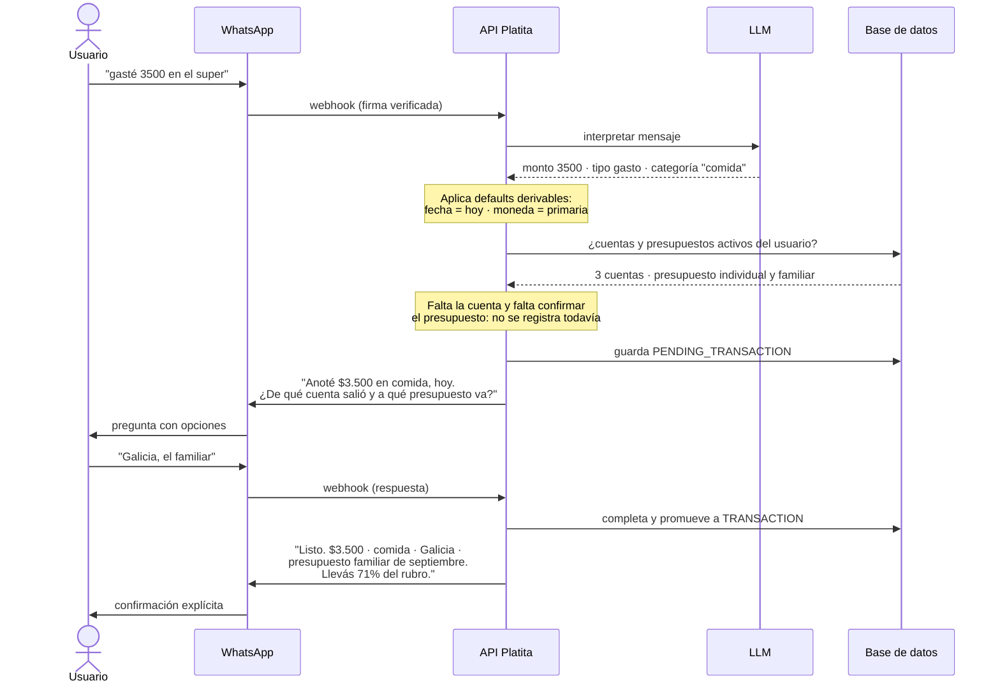
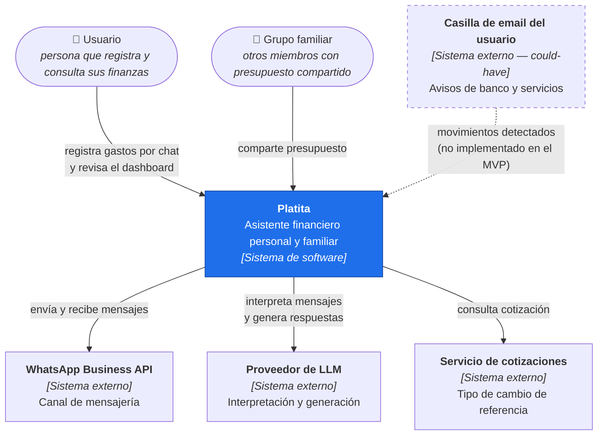
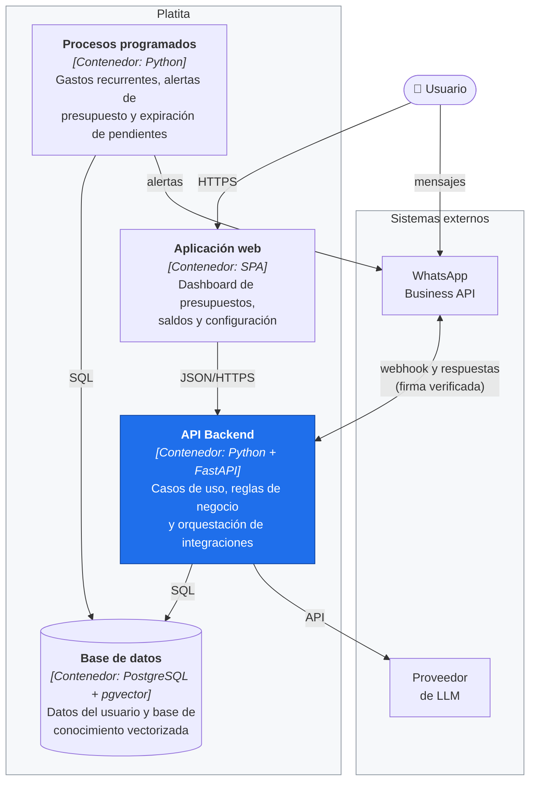
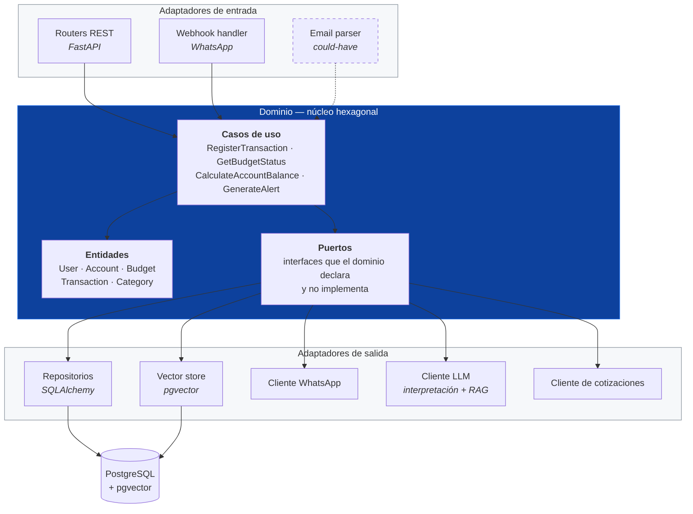
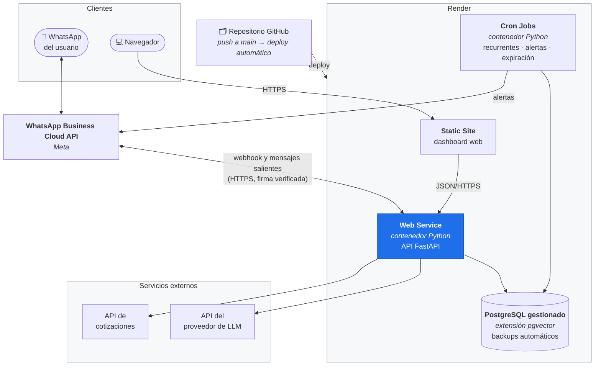

## Índice

0. [Ficha del proyecto](#0-ficha-del-proyecto)
1. [Descripción general del producto](#1-descripción-general-del-producto)
2. [Arquitectura del sistema](#2-arquitectura-del-sistema)
3. [Modelo de datos](#3-modelo-de-datos)
4. [Especificación de la API](#4-especificación-de-la-api)
5. [Historias de usuario](#5-historias-de-usuario)
6. [Tickets de trabajo](#6-tickets-de-trabajo)
7. [Pull requests](#7-pull-requests)

---

## 0. Ficha del proyecto

### **0.1. Tu nombre completo:**

`[completar — tu nombre completo]`

### **0.2. Nombre del proyecto:**

**Platita** — asistente financiero personal y familiar por WhatsApp

> *(Nombre de producto en español porque el público objetivo es hispanohablante; el código, el modelo de datos y la API van en inglés — ver nota de idioma en la sección 2. Cambiá el nombre si preferís otro.)*

### **0.3. Descripción breve del proyecto:**

Platita es un asistente financiero personal y familiar que funciona por WhatsApp: el usuario registra gastos, ingresos y presupuestos conversando en lenguaje natural, y una capa de IA interpreta, categoriza y guarda cada movimiento en la cuenta correspondiente. Un módulo complementario lee automáticamente los emails de notificación bancaria y de servicios para reducir la carga manual. Toda la información —incluyendo cuentas y su saldo, presupuestos multimoneda, comparación contra inflación y consejos financieros generados con RAG— se visualiza en detalle desde una aplicación web con dashboards.

### **0.4. URL del proyecto:**

`[completar — URL del fork del repositorio una vez creado]`

### 0.5. URL o archivo comprimido del repositorio

`[completar — mismo repositorio; si es privado, compartir accesos de forma segura]`

---

## 1. Descripción general del producto

### **1.1. Objetivo:**

Reducir la fricción de llevar un control financiero personal y familiar real, y al mismo tiempo darle a la persona un solo lugar donde entender y mejorar su situación financiera, no solo registrarla. El usuario típico (yo mismo, y el caso de uso que originó la idea) maneja varias cuentas y monedas (banco, billetera virtual, broker de inversión), comparte presupuesto con su familia, y hoy resuelve todo esto manualmente en planillas, sin ningún tipo de guía sobre si esas decisiones financieras son buenas o no. Platita elimina el paso de "sentarse a cargar todo" trasladando el registro a un canal que la persona ya usa todos los días —WhatsApp— automatizando la carga de lo que ya llega por email, y sabiendo en todo momento cuánto hay en cada cuenta sin tener que entrar a cada banco o billetera por separado. Además convierte esos datos en educación financiera aplicada: consejos concretos sobre la situación real del usuario, no contenido genérico.

### **1.2. Características y funcionalidades principales:**

Las funcionalidades están clasificadas por prioridad de entrega. El MVP comprometido son las **must-have**: son las que estarán completas, testeadas y desplegadas. Las **should-have** entran si el tiempo lo permite. Las **could-have** están diseñadas en este documento (modelo de datos y arquitectura las contemplan) pero **no se implementan en esta primera versión** — se documentan acá para dejar explícito que la decisión fue de alcance, no un olvido.

#### Must-have — el flujo end-to-end comprometido

- **Registro conversacional por WhatsApp**: cargar gastos e ingresos hablándole al asistente en tono coloquial, sin formularios.
- **Qué se asume y qué se confirma**: para que cargar un gasto sea un solo mensaje, el asistente completa solo lo que puede resolver sin adivinar — la **fecha** es la de hoy salvo que el mensaje diga otra cosa, la **moneda** es la primaria del usuario salvo que se indique otra, y la **categoría** se ubica entre las existentes, sugiriendo crear una nueva solo si no encaja en ninguna. Todo eso aparece explícito en el mensaje de confirmación, donde el usuario corrige cualquiera de esos valores con una respuesta corta. En cambio hay datos que **requieren confirmación del usuario**: el **monto**, si es **gasto o ingreso** cuando el mensaje no lo deja claro, la **cuenta** (imputarla mal rompe el saldo calculado) y **a qué presupuesto se imputa el gasto** — la fecha acota los períodos posibles, pero elegir si el gasto pesa sobre el presupuesto individual o el familiar es una decisión del usuario, no algo que el sistema pueda deducir. El asistente propone lo más probable y el usuario confirma. Lo ya interpretado queda guardado mientras tanto, así se responde solo lo que falta y no se repite el mensaje entero.
- **Cuentas configurables con saldo calculado**: el usuario da de alta sus cuentas (ej. "Galicia en dólares", "Banco Nación", "Mercado Pago", un broker como Balanz) con su tipo y moneda, y el sistema calcula cuánto hay en cada una a partir del saldo inicial más los movimientos registrados — no es un dato que el usuario tenga que actualizar a mano.
- **Presupuestos individuales y familiares, con período configurable**: un presupuesto puede pertenecer a una persona o a un grupo familiar, con cadencia mensual o quincenal y una moneda primaria de referencia. El período tiene que quedar confirmado antes de que arranque (ver 3.2), con ingreso estimado y topes por categoría.
- **Categorización semi-guiada**: categorías base predefinidas más categorías propias del usuario; la IA elige entre las existentes y solo sugiere una nueva (con confirmación) cuando ningún gasto encaja.
- **Dashboard web**: visualización de gráficos, tendencias, estado del presupuesto y saldo por cuenta — algo que WhatsApp no resuelve bien; WhatsApp queda como canal de carga rápida, no de visualización.
- **Login y autenticación del dashboard web**: acceso protegido mediante código de un solo uso por WhatsApp — ver decisión de diseño en 2.2 y 2.5.
- **Trazabilidad de origen**: cada movimiento guarda si se cargó manual (WhatsApp) o automático (gasto recurrente, o email cuando se implemente), lo que habilita auditoría y una métrica de cuánto está resolviendo cada vía automática.
- **Configuración regional**: país, moneda primaria, fuente de inflación y cotización de referencia son configurables por usuario, para no atar el sistema al caso argentino.

#### Should-have — entran si el tiempo lo permite

- **Gastos recurrentes**: el usuario configura un gasto que se repite (alquiler, suscripciones, servicios fijos) indicando periodicidad, categoría, cuenta de la que sale y presupuesto al que se imputa. Con eso definido una sola vez, el sistema genera el movimiento completo en cada ciclo, sin volver a cargarlo ni volver a preguntar nada.
- **Consejos financieros con RAG**: una base de conocimiento financiero curada por el equipo del producto (no cargada por cada usuario) se vectoriza y queda disponible para todos los usuarios; el asistente responde preguntas y también dispara alertas proactivas (ej. "vas al 80% del presupuesto de comida a mitad de mes") cruzando ese contenido con los datos reales del usuario que pregunta. Cubre, entre otras, preguntas del tipo: *"¿cómo me conviene pagar mi tarjeta?"*, *"¿cómo puedo reducir gastos en base a mi historial?"*, sugerencia de armar un fondo de emergencia acorde a los propios ingresos/gastos, y educación financiera básica sobre inversión (ej. *"¿qué es un FCI?"*) — siempre devolviendo la respuesta cruzada con los datos reales del usuario, no un consejo genérico.
- **Soporte multimoneda**: un presupuesto recibe movimientos en distintas monedas (ej. ARS y USD) y los convierte a la moneda primaria usando una cotización de referencia. En esta etapa la cotización se configura a mano; la integración con un servicio que la actualice sola es could-have.

#### Could-have — diseñado, no implementado en esta versión

- **Registro automático desde email**: detección y carga de movimientos financieros notificados por mail (tarjetas, servicios, transferencias). Es la funcionalidad de mayor riesgo del producto: el formato de esos mails lo define cada banco, cambia sin aviso y no se controla desde acá, así que el esfuerzo real es difícil de acotar. El modelo de datos ya lo contempla (`source = 'automatic'`, `PENDING_TRANSACTION`), de modo que sumarlo después no requiere rediseño.
- **Detección de duplicados entre carga manual y automática**: el caso típico es pagar con tarjeta, avisarle a Platita por WhatsApp en el momento, y que más tarde llegue el mail de aviso del banco por el mismo gasto. Antes de crear un movimiento nuevo el sistema busca si ya existe uno reciente del mismo usuario por la vía contraria, con monto/moneda iguales y fecha cercana, y lo enlaza (`duplicate_of`) en vez de duplicar el monto. Depende de la anterior: sin carga por email no hay duplicados que detectar.
- **Presupuesto asistido por IA y ajustado por inflación**: sugerencia automática del borrador del próximo período a partir del historial, ajustada por una proyección de inflación (REM del BCRA para Argentina) en lugar del dato oficial, que llega con un mes de atraso. Sin esto, el usuario arma el período a mano — que es el flujo must-have.
- **Backup y exportación**: exportar el historial de movimientos y el estado de los presupuestos en CSV/PDF. El respaldo estándar de la base de datos gestionada cubre la parte crítica mientras tanto.

**Fuera de alcance, con su razón:**

- **Modo offline.** Se evaluó y se descarta para esta primera versión: el canal principal (WhatsApp) ya requiere conectividad para funcionar, así que un modo offline solo tendría sentido para el dashboard web — y ahí el problema real no es mostrar datos cacheados (eso es simple), sino permitir *editar* presupuestos o gastos sin conexión y resolver los conflictos de sincronización cuando vuelve la conexión. Queda como mejora futura si en algún momento se justifica.
- **Lectura de capturas de pantalla** (ej. una captura de Mercado Pago o de la app de Galicia con el detalle de un gasto). Es un problema distinto al de leer emails: cada banco/billetera tiene su propio layout de pantalla, que además cambia con cada actualización de su app, así que no alcanza con reglas — necesitaría un pipeline de visión (OCR + LLM) específico por entidad, mucho más trabajo que el resto de las vías de carga juntas. Queda identificado como candidato fuerte para un segundo MVP una vez validado el flujo core, no descartado para siempre.

### **1.3. Diseño y experiencia de usuario:**

`Las capturas y el video del flujo se incorporan en la Entrega 2, cuando exista un frontend navegable.` Mientras tanto, el flujo conversacional —que es la experiencia principal del producto y no se entiende bien con capturas sueltas— se documenta como diagrama de secuencia. Este es el caso más representativo: el usuario carga un gasto y le falta un dato obligatorio.



Tres decisiones de experiencia quedan visibles en este flujo: **el asistente no inventa lo que no puede deducir** (pregunta cuenta y presupuesto), **no descarta lo que ya entendió** (guarda el pendiente en vez de pedir el mensaje entero de nuevo), y **la confirmación final lista todo lo que asumió**, que es el punto donde el usuario corrige una fecha o una categoría con una respuesta corta.

### **1.4. Instrucciones de instalación:**

`Pendiente — se completa en la Entrega 2 con el proyecto ya scaffoldeado (backend FastAPI, frontend, base de datos y migraciones). El esquema previsto: entorno virtual + pip/uv para el backend, variables de entorno para credenciales (API de WhatsApp, LLM, base de datos), migraciones con Alembic, y un script de seed con datos de ejemplo.`

---

## 2. Arquitectura del Sistema

> **Nota de idioma:** todo el desarrollo (código, nombres de tablas y campos, endpoints, payloads) va en **inglés**, de acá en adelante en todo el documento. El texto explicativo de esta entrega queda en español porque es el idioma de la documentación del curso; lo que el usuario final lee o le dice al asistente por WhatsApp también sigue en español, porque el público objetivo del producto es hispanohablante.

### **2.1. Diagrama de arquitectura:**

La arquitectura se documenta siguiendo el **modelo C4 de Simon Brown**, en tres niveles de zoom: contexto (quién usa el sistema y con qué se integra), contenedores (las piezas desplegables) y componentes (el interior del backend). Los diagramas están escritos en **Mermaid** con sintaxis `flowchart` y no con la extensión `C4Context`/`C4Container`: el renderizador Mermaid de GitHub no soporta esa extensión, así que los diagramas no se verían en el repositorio. Usar `flowchart` con subgrafos es la práctica habitual para representar C4 en Markdown de GitHub y mantiene el diagrama versionado junto al código, sin depender de imágenes exportadas que quedan desactualizadas.

#### Nivel 1 — Contexto

Quién usa Platita y de qué sistemas externos depende.



#### Nivel 2 — Contenedores

Las piezas desplegables del sistema y cómo se comunican entre sí.



#### Nivel 3 — Componentes del backend

El interior del contenedor API, donde se ve el patrón arquitectónico elegido.



**Patrón elegido:** **arquitectura hexagonal (ports & adapters)**, con el dominio (entidades + casos de uso) aislado de los detalles de infraestructura detrás de puertos, y **backend y frontend desacoplados**, comunicados únicamente por API REST. Justificación:

- **Por qué este patrón y no otro:** con varias integraciones externas (WhatsApp, email, LLM, base vectorial, cotizaciones, REM) que van a cambiar con el tiempo —y donde ya se identificó al menos un reemplazo probable, el motor de vectores—, conviene que el dominio no conozca esos detalles. Cada integración es un adaptador detrás de un puerto; cambiarla es reemplazar el adaptador, no tocar la lógica de negocio. Separar front de back, además, deja la puerta abierta a una futura app móvil que consuma la misma API sin tocar lógica de negocio.
- **Beneficios:** los casos de uso (registrar un movimiento, evaluar un presupuesto, generar un consejo) se pueden testear sin levantar WhatsApp, un LLM real ni una base de datos — se testean contra los puertos, con dobles de prueba. Es además el mismo patrón que ya se usa en otros proyectos propios en Go, así que la disciplina de diseño ya es conocida, solo cambia el lenguaje.
- **Sacrificios:** más carpetas e indirección que un CRUD directo controlador-a-base de datos; para un proyecto de este tamaño el volumen de casos de uso reales (los tickets de la sección 6 y los que sigan) justifica el costo. Se mitiga manteniendo los puertos chicos y con una sola responsabilidad cada uno, en vez de una interfaz gigante.

### **2.2. Descripción de componentes principales:**

| Componente | Tecnología | Responsabilidad |
|---|---|---|
| Backend API | Python + FastAPI | Adaptador de entrada: expone la API REST y traduce requests HTTP a casos de uso del dominio |
| Dominio | Python puro (sin dependencias de framework) | Entidades, casos de uso y puertos — la lógica de negocio en sí |
| Auth | JWT + código de un solo uso enviado por WhatsApp | Login del dashboard web sin contraseñas, reutilizando el teléfono ya verificado como identidad (ver 2.5) |
| Integración WhatsApp | API oficial de WhatsApp Business (Meta Cloud API / Twilio) | Adaptador de entrada/salida: recibe y envía mensajes vía webhook |
| Parser de emails *(could-have)* | Python (reglas + LLM para casos ambiguos) | Adaptador de entrada: detecta movimientos financieros en la casilla de correo del usuario (con consentimiento explícito). Diseñado, no implementado en el MVP — ver 1.2 |
| Motor RAG | LLM + embeddings sobre pgvector, detrás de un puerto propio | Responde consultas financieras y genera alertas proactivas a partir de la base de conocimiento curada por el producto |
| Base de datos relacional | PostgreSQL | Adaptador de salida: usuarios, cuentas, grupos familiares, presupuestos, movimientos, categorías |
| Base de datos vectorial | pgvector (extensión de PostgreSQL) | Adaptador de salida: embeddings del contenido de consejos financieros |
| Frontend | Aplicación web responsiva | Dashboard de visualización y configuración de usuario |

*(pgvector sobre PostgreSQL en vez de una base vectorial dedicada, como decisión de arranque — no definitiva. El acceso a la base vectorial se aísla detrás de un puerto propio, de forma que el motor real sea un detalle de infraestructura reemplazable: si en el futuro el volumen de consultas o el tamaño de la base de conocimiento lo justifica, se cambia el adaptador por Pinecone/Qdrant/Weaviate sin tocar el servicio de RAG. Mientras tanto, pgvector con índice HNSW sostiene sin problema volúmenes bastante mayores al de este proyecto — la ventaja de arrancar así no es solo "es más simple ahora", es no pagar el costo operativo de un segundo motor de base de datos hasta que haya una razón real para necesitarlo.)*

### **2.3. Descripción de alto nivel del proyecto y estructura de ficheros**

`Se completa en la Entrega 2 junto con el scaffold real. Estructura prevista (arquitectura hexagonal dentro del backend, nombres de carpetas y ficheros en inglés):`

```
/backend
  /app
    /domain
      /entities         # User, Account, Budget, Transaction, Category, RecurringExpense, AdviceDocument
      /use_cases         # RegisterTransaction, GetBudgetStatus, CalculateAccountBalance, GenerateProactiveAlert...
      /ports             # interfaces the domain depends on but does not implement
        - transaction_repository_port.py
        - account_repository_port.py
        - vector_store_port.py
        - whatsapp_gateway_port.py
        - exchange_rate_port.py
        - llm_port.py
    /adapters
      /inbound
        /api               # FastAPI routers — translate HTTP into use case calls
        /whatsapp_webhook   # translate WhatsApp payloads into use case calls
      /outbound
        /postgres           # SQLAlchemy repositories implementing the *_repository ports
        /pgvector            # VectorStorePort implementation
        /whatsapp_client      # sends outbound WhatsApp messages
        /email_reader          # IMAP/Gmail integration (could-have, not in the MVP)
        /exchange_rate_client   # currency quote provider
        /llm_client              # LLM client (interpretation + RAG)
  /tests
  /migrations          # Alembic
/frontend
  ...
/docs
readme.md
prompts.md
```

### **2.4. Infraestructura y despliegue**

`Propuesto, a confirmar en la Entrega 2 contra el despliegue real:` Render para backend + PostgreSQL, por simplicidad de despliegue para un proyecto individual y porque pgvector está soportado como extensión estándar de su Postgres gestionado, sin depender de elegir la plantilla correcta como sí pasa en otras plataformas. El frontend se sirve como sitio estático.



**Proceso de despliegue previsto:** push a `main` dispara el build y deploy automático del servicio web y del sitio estático. Las migraciones de Alembic corren como paso previo al arranque del contenedor. Los secretos (credenciales de WhatsApp, LLM y base de datos) se configuran como variables de entorno en la plataforma, nunca versionados. Los procesos programados corren como cron jobs separados del servicio web, de modo que un fallo en el motor de recurrentes o de alertas no afecte la disponibilidad del webhook — es la mitigación concreta del riesgo de acoplamiento señalado en 2.1.

### **2.5. Seguridad**

- **Login sin contraseñas**: el usuario pide acceder al dashboard, recibe un código de un solo uso por WhatsApp (mismo canal ya verificado) y lo intercambia por un JWT de corta duración. Se evita así almacenar y gestionar contraseñas, y se reutiliza la identidad que el sistema ya valida por otro lado. Rate limiting sobre el endpoint de login para evitar fuerza bruta sobre el código.
- **Consentimiento explícito y revocable** para el acceso a la casilla de email (configuración de usuario, no un permiso obligatorio del sistema).
- **Verificación de firma del webhook de WhatsApp** en cada request entrante, para descartar mensajes falsificados.
- **Nunca loggear en crudo** número de teléfono, montos ni texto de usuario sin enmascarar.
- **Secretos fuera del código**: credenciales de WhatsApp, LLM y base de datos vía variables de entorno, nunca hardcodeadas ni versionadas.
- **HTTPS** en toda comunicación externa.
- Validación de entrada tanto en el webhook de WhatsApp como en los endpoints propios del frontend (cliente y servidor).

### **2.6. Tests**

`Se define con detalle en la Entrega final. Estrategia prevista: tests unitarios sobre los casos de uso del dominio (conversión de moneda, cálculo de saldo por cuenta, categorización, presupuesto ajustado por inflación) usando dobles de prueba en lugar de los adaptadores reales — la ventaja directa de tener puertos —, tests de integración sobre los adaptadores (Postgres, pgvector) y los endpoints principales, y al menos un test end-to-end del flujo principal (registrar un gasto por WhatsApp → verlo reflejado en el saldo de la cuenta y en el presupuesto del dashboard).`

---

## 3. Modelo de Datos

### **3.1. Diagrama del modelo de datos:**

```mermaid
erDiagram
    USER ||--o{ TRANSACTION : records
    USER ||--o{ USER_GROUP : "belongs to"
    FAMILY_GROUP ||--o{ USER_GROUP : includes
    USER ||--o{ BUDGET_PERIOD : "owns (individual)"
    FAMILY_GROUP ||--o{ BUDGET_PERIOD : "owns (family)"
    BUDGET_PERIOD ||--o{ BUDGET : groups
    BUDGET_PERIOD ||--o{ TRANSACTION : "is charged to"
    CATEGORY ||--o{ TRANSACTION : classifies
    CATEGORY ||--o{ BUDGET : defines
    USER ||--o{ CATEGORY : "creates (custom)"
    USER ||--o{ RECURRING_EXPENSE : configures
    RECURRING_EXPENSE ||--o{ TRANSACTION : "generates (automatic)"
    USER ||--o{ ACCOUNT : owns
    ACCOUNT ||--o{ TRANSACTION : affects
    USER ||--o{ PENDING_TRANSACTION : "must complete"
    PENDING_TRANSACTION ||--o| TRANSACTION : "becomes, once complete"

    USER {
        uuid id PK
        string name "NOT NULL"
        string whatsapp_phone "UNIQUE, NOT NULL"
        string email "NULLABLE"
        boolean email_connected "DEFAULT FALSE"
        string country "NOT NULL"
        string primary_currency "NOT NULL, ISO 4217"
        string inflation_source "NULLABLE, e.g. REM_BCRA"
        string exchange_rate_reference "NULLABLE, e.g. DOLAR_MEP"
        timestamp created_at "DEFAULT now()"
    }

    FAMILY_GROUP {
        uuid id PK
        string name "NOT NULL"
        timestamp created_at "DEFAULT now()"
    }

    USER_GROUP {
        uuid user_id FK
        uuid family_group_id FK
        string role "DEFAULT 'member'"
    }

    ACCOUNT {
        uuid id PK
        uuid user_id FK "NOT NULL"
        string name "NOT NULL, e.g. 'Galicia USD', 'Mercado Pago'"
        string institution "NULLABLE, e.g. 'Banco Galicia', 'Balanz'"
        string type "NOT NULL, CHECK IN ('bank_account','digital_wallet','broker','cash')"
        string currency "NOT NULL, ISO 4217"
        decimal initial_balance "NOT NULL, DEFAULT 0"
        timestamp created_at "DEFAULT now()"
    }

    BUDGET_PERIOD {
        uuid id PK
        uuid user_id FK "NULLABLE"
        uuid family_group_id FK "NULLABLE"
        string period_type "NOT NULL, CHECK IN ('monthly','biweekly')"
        date period_start "NOT NULL"
        date period_end "NOT NULL"
        string primary_currency "NOT NULL"
        decimal estimated_income "NOT NULL, DEFAULT 0"
        string status "NOT NULL, CHECK IN ('draft','confirmed'), DEFAULT 'draft'"
        timestamp created_at "DEFAULT now()"
    }

    BUDGET {
        uuid id PK
        uuid budget_period_id FK "NOT NULL"
        uuid category_id FK
        decimal limit_amount "NOT NULL, > 0"
        timestamp created_at "DEFAULT now()"
    }

    CATEGORY {
        uuid id PK
        string name "NOT NULL"
        uuid user_id FK "NULLABLE, NULL = system base category"
        boolean is_base "DEFAULT FALSE"
    }

    TRANSACTION {
        uuid id PK
        uuid user_id FK "NOT NULL"
        uuid account_id FK "NOT NULL — never inferred, always asked"
        uuid budget_period_id FK "NOT NULL — never inferred, always asked"
        uuid category_id FK "NOT NULL"
        uuid recurring_expense_id FK "NULLABLE, set when generated by a recurring rule"
        uuid duplicate_of FK "NULLABLE, self-reference — set when this row matched an existing transaction from the other source"
        decimal amount "NOT NULL"
        string currency "NOT NULL, ISO 4217"
        decimal converted_amount "NOT NULL, in the budget period's primary_currency"
        string type "NOT NULL, CHECK IN ('expense','income')"
        string source "NOT NULL, CHECK IN ('manual','automatic')"
        string description "NULLABLE"
        date transaction_date "NOT NULL"
        timestamp created_at "DEFAULT now()"
    }

    PENDING_TRANSACTION {
        uuid id PK
        uuid user_id FK "NOT NULL"
        jsonb parsed_data "NOT NULL — whatever was successfully extracted so far"
        string missing_fields "NOT NULL — array of required fields still unanswered"
        string source "NOT NULL, CHECK IN ('manual','automatic')"
        string raw_input "NULLABLE — original message or email body, for audit"
        uuid resulting_transaction_id FK "NULLABLE — set once completed and promoted"
        timestamp expires_at "NOT NULL — discarded if never completed"
        timestamp created_at "DEFAULT now()"
    }

    RECURRING_EXPENSE {
        uuid id PK
        uuid user_id FK "NOT NULL"
        uuid category_id FK "NOT NULL"
        uuid account_id FK "NOT NULL — defined once, at setup"
        uuid budget_user_id FK "NULLABLE — budget owner: individual"
        uuid budget_family_group_id FK "NULLABLE — budget owner: family"
        decimal amount "NOT NULL"
        string currency "NOT NULL, ISO 4217"
        string frequency "NOT NULL, CHECK IN ('weekly','monthly','yearly')"
        int execution_day "NOT NULL, day of month/week"
        date next_execution "NOT NULL"
        boolean active "DEFAULT TRUE"
        timestamp created_at "DEFAULT now()"
    }

    ADVICE_DOCUMENT {
        uuid id PK
        text content "NOT NULL"
        vector embedding "pgvector, NOT NULL"
        string topic "NOT NULL, e.g. credit_card, emergency_fund, basic_investing"
        string source "NULLABLE, source URL or reference"
        date publication_date "NULLABLE"
        date last_reviewed_at "NOT NULL, DEFAULT now()"
        string status "NOT NULL, CHECK IN ('current','needs_review','outdated'), DEFAULT 'current'"
        timestamp created_at "DEFAULT now()"
    }
```



**Restricciones de integridad relevantes:**
- En `BUDGET_PERIOD`, exactamente uno de `user_id` / `family_group_id` debe ser no nulo (`CHECK` a nivel de base de datos) — un período de presupuesto es individual o familiar, nunca ambos ni ninguno.
- **Campos obligatorios de un movimiento.** Una fila en `TRANSACTION` solo existe con todos estos datos presentes: `amount`, `currency`, `type`, `transaction_date`, `category_id`, `account_id` y `budget_period_id` — todos `NOT NULL` en la base de datos, así que ninguna vía de carga puede insertar un movimiento a medias. Lo que cambia entre ellos es **de dónde sale el valor**, no si es obligatorio:
  - **Resueltos por el sistema, sin preguntar:** `transaction_date` (hoy, salvo que el mensaje indique otra fecha), `currency` (la primaria del usuario, salvo indicación contraria) y `category_id` (resuelto contra las categorías existentes; si ninguna encaja, se sugiere crear una). Quedan visibles en el mensaje de confirmación, que es donde el usuario los corrige.
  - **Pedidos o confirmados por el usuario:** `amount`, `type` si el mensaje no lo deja claro, `account_id` siempre que no se mencione una cuenta, y `budget_period_id` **siempre**. Con el presupuesto el sistema no decide solo: `transaction_date` acota los períodos candidatos (y si el usuario pertenece a un grupo familiar, esa fecha cae dentro de su período individual y del familiar a la vez), pero cuál de ellos absorbe el gasto es una decisión del usuario, no algo derivable. El asistente propone el candidato más probable y el usuario confirma o elige otro; ninguna transacción se imputa a un presupuesto sin ese visto bueno.
  - **Excepción: movimientos generados por una regla recurrente.** Un `RECURRING_EXPENSE` define una sola vez, al configurarse, su cuenta y su dueño de presupuesto (`budget_user_id` o `budget_family_group_id`, exactamente uno). En cada ciclo, el motor resuelve el `BUDGET_PERIOD` concreto de ese dueño que cubre la fecha de ejecución e inserta la `TRANSACTION` ya completa — la confirmación ocurrió al dar de alta la regla, no se vuelve a pedir mes a mes.
- Si falta o queda sin confirmar alguno de los campos que dependen del usuario, el movimiento no se registra: queda como `PENDING_TRANSACTION` hasta que responda. La misma regla aplicará a los movimientos detectados por el parser de emails cuando se implemente (could-have): traen monto, fecha y normalmente cuenta, pero nunca el presupuesto, así que quedarán pendientes de confirmación igual que los manuales incompletos.
- En `RECURRING_EXPENSE`, exactamente uno de `budget_user_id` / `budget_family_group_id` debe ser no nulo (`CHECK`), por el mismo criterio que en `BUDGET_PERIOD`.
- `TRANSACTION.duplicate_of` referencia otra `TRANSACTION` del mismo usuario cuando el sistema detecta que probablemente describen el mismo gasto real (mismo monto y moneda, fecha cercana, un origen manual y el otro automático). La columna se crea desde la migración inicial, pero la lógica que la puebla depende de la carga por email, que es could-have (ver 1.2).

### **3.2. Descripción de entidades principales:**

- **USER**: persona que usa el asistente. Guarda su configuración regional (país, moneda primaria, fuente de inflación, cotización de referencia) para que el sistema no esté atado al caso argentino. `whatsapp_phone` es único porque es la clave de entrada del canal conversacional.
- **FAMILY_GROUP** / **USER_GROUP**: relación muchos-a-muchos entre usuarios y grupos familiares (una persona puede pertenecer a más de un grupo; un grupo tiene varios miembros), con un rol por membresía.
- **ACCOUNT**: cuenta bancaria, billetera virtual, broker de inversión o efectivo que el usuario da de alta (ej. "Galicia en dólares", "Mercado Pago", "Balanz"). El **saldo no se guarda como columna**: se calcula como `initial_balance` más la suma de ingresos menos egresos de sus `TRANSACTION` — así nunca queda desincronizado de los movimientos reales. Si el volumen de cuentas/movimientos creciera al punto de que ese cálculo en cada consulta sea un problema de performance, se puede materializar/cachear más adelante sin cambiar el modelo, es una optimización, no un rediseño.
- **BUDGET_PERIOD**: el "presupuesto del mes" (o de la quincena) como concepto completo — puede pertenecer a un usuario individual o a un grupo familiar (nunca ambos, ver restricción arriba). `period_type` define la cadencia (mensual o quincenal) y determina cómo se calculan `period_start`/`period_end` del siguiente período al generarlo. `estimated_income` guarda el ingreso proyectado para el período completo, para que armar el presupuesto sea contrastar gastos planeados contra ingreso esperado, no solo poner topes por categoría sueltos. `status` distingue un período todavía en armado (`draft`, generado por la sugerencia de IA o creado a mano) de uno ya confirmado por el usuario — la regla de negocio es que, para un período mensual, tiene que estar en `confirmed` antes de que arranque el mes (`period_start`); el mismo criterio aplica a quincenal con su propio `period_start`. El sistema genera el borrador del próximo período con anticipación y manda un recordatorio proactivo por WhatsApp si sigue en `draft` cerca de la fecha límite — mismo mecanismo que ya dispara las alertas de HU3, aplicado a un caso distinto.
- **BUDGET**: el límite de gasto de **una** categoría dentro de un `BUDGET_PERIOD` (ej. "comida: $300.000 en septiembre"). Un mismo período agrupa varios `BUDGET`, uno por categoría con tope definido — así `period_start`, `period_end` y `primary_currency` viven una sola vez en el período en vez de repetirse por cada categoría.
- **CATEGORY**: catálogo mixto — categorías base del sistema (`user_id` nulo, `is_base = true`) más categorías propias por usuario, para evitar que la IA invente una categoría nueva en cada gasto.
- **TRANSACTION**: gasto o ingreso ya completo y válido — si está en esta tabla, tiene cuenta, categoría y período de presupuesto asignados, sin excepción (ver restricción arriba). Guarda tanto el monto original (`amount`, `currency`) como el convertido a la moneda primaria del período (`converted_amount`), y el `source` (manual o automático) para auditoría y para medir cuánto resuelve cada vía. `recurring_expense_id` distingue, dentro de los automáticos, cuáles vinieron del motor de recurrencia. `duplicate_of` es el mecanismo previsto de detección de duplicados entre carga manual y automática: antes de crear una `TRANSACTION` nueva se busca, para el mismo usuario, otra transacción reciente de la vía contraria con monto y moneda iguales y `transaction_date` dentro de una ventana de un par de días — si aparece una candidata, no se crea una segunda fila: se enlaza vía `duplicate_of` y el registro nuevo aporta lo que le falte al original. La columna existe desde el esquema inicial; la lógica llega junto con la carga por email (could-have).
- **PENDING_TRANSACTION**: movimiento a medio completar, todavía no registrado. Se usa cuando falta algo que **depende de una decisión del usuario** — la cuenta, el monto, el tipo si es ambiguo, o la confirmación del presupuesto; no se crea un pendiente por una fecha o una moneda ausente, porque esas se resuelven solas. Será también el estado natural de lo que detecte el parser de emails cuando se implemente: un mail de aviso trae monto, fecha y normalmente la cuenta, pero nunca a qué presupuesto imputarlo, así que esperará acá la confirmación. Guarda lo interpretado (`parsed_data`), la lista de `missing_fields`, y el asistente pregunta por WhatsApp. Cuando el usuario responde, se completa y se promueve a `TRANSACTION` (quedando enlazada por `resulting_transaction_id`). `expires_at` evita que se acumulen pendientes eternos de mensajes que nunca se contestaron. Tener una tabla aparte, en vez de un `status` dentro de `TRANSACTION` con columnas nullables, es lo que permite que `TRANSACTION` mantenga sus `NOT NULL` reales: los datos incompletos no contaminan la tabla de la que salen saldos y presupuestos.
- **RECURRING_EXPENSE**: regla que el usuario configura una vez (ej. alquiler, una suscripción) y que el sistema ejecuta sola en cada ciclo según `frequency`, generando la `TRANSACTION` correspondiente sin intervención manual. Para que eso sea posible sin preguntar nada mes a mes, la regla define desde el alta **todo lo que un movimiento necesita**: categoría, cuenta (`account_id`) y dueño del presupuesto (`budget_user_id` o `budget_family_group_id`). Guarda el dueño y no un `budget_period_id` concreto porque la regla vive a lo largo de muchos períodos: en cada ejecución se resuelve el período de ese dueño que cubre la fecha. `next_execution` es lo que consulta el proceso periódico para saber qué reglas ejecutar hoy; `active` permite pausarla sin borrar el historial de lo ya generado.
- **ADVICE_DOCUMENT**: base de conocimiento financiero curada por el equipo del producto (no por cada usuario final) — es contenido compartido que cualquier usuario puede consultar vía RAG, no datos personales. `topic` clasifica el fragmento (tarjeta de crédito, fondo de emergencia, inversión básica, etc.) para poder acotar la búsqueda además de la similitud semántica. `status` y `last_reviewed_at` existen para poder listar qué contenido lleva mucho sin revisarse y decidir si actualizarlo — no hay actualización automática en el MVP, es un chequeo periódico manual apoyado en esa marca.

---

## 4. Especificación de la API

> Los tres endpoints principales del flujo descrito en esta entrega. El contrato completo (OpenAPI autogenerado por FastAPI en `/docs`) se agrega en la Entrega 2.

### `POST /webhook/whatsapp`

Recibe los mensajes entrantes desde el proveedor de WhatsApp Business y dispara la interpretación por IA. El contenido del mensaje viaja en el idioma real del usuario (español).

```yaml
requestBody:
  content:
    application/json:
      example:
        from: "+5491100000000"
        message: "gasté 3500 pesos en el super con la Galicia"
        timestamp: "2026-09-15T14:32:00Z"
responses:
  200:
    description: Message processed; the assistant replies over the same channel
    content:
      application/json:
        example:
          status: "processed"
          transaction_created: true
```

### `GET /budgets/{budget_id}`

Devuelve el estado actual del límite de **una categoría** dentro de un período de presupuesto: límite, gastado hasta el momento (convertido a la moneda primaria del período) y movimientos asociados. El dashboard arma la vista completa del período (HU2) iterando los `BUDGET` de un mismo `budget_period_id` — agregar un endpoint de rollup a nivel de período es candidato para la Entrega 2, no se fuerza acá para no superar los 3 endpoints de esta entrega.

```yaml
responses:
  200:
    content:
      application/json:
        example:
          id: "c1a2..."
          budget_period_id: "bp1..."
          category: "food"
          primary_currency: "ARS"
          limit_amount: 300000
          spent_amount: 214500
          used_percentage: 71.5
```

### `POST /transactions`

Registra un movimiento manualmente (usado por el dashboard, y también internamente por el flujo de WhatsApp una vez confirmado, y por el motor de recurrentes). `amount`, `type`, `category_id`, `account_id` y `budget_period_id` son obligatorios: si falta alguno se rechaza con `422`. Los dos últimos no se derivan acá porque dependen de una decisión del usuario, que se resuelve antes de llegar a este endpoint. `transaction_date` y `currency` son opcionales y se resuelven por defecto (hoy y moneda primaria del usuario, respectivamente). Antes de insertar, el caso de uso corre el chequeo de duplicados contra la vía automática (ver 3.2 y HU1).

```yaml
requestBody:
  content:
    application/json:
      example:
        user_id: "u1..."
        account_id: "a1..."
        budget_period_id: "bp1..."
        amount: 3500
        type: "expense"
        category_id: "cat-food"
        source: "manual"
        currency: "ARS"              # opcional — default: user's primary_currency
        transaction_date: "2026-09-15" # opcional — default: today
responses:
  201:
    content:
      application/json:
        example:
          id: "t1..."
          budget_period_id: "bp1..."
          converted_amount: 3500
          duplicate_of: null
          status: "created"
  422:
    description: Missing fields that require a user decision or have no safe default
    content:
      application/json:
        example:
          detail: "missing required fields"
          missing_fields: ["account_id", "budget_period_id"]
```

---

## 5. Historias de Usuario

> Cinco historias de usuario: cuatro **must-have**, que componen el flujo end-to-end comprometido para el MVP, y una **should-have**. El orden sigue la secuencia real de uso: primero configuro mis cuentas, después armo el presupuesto del período, ahí empiezo a registrar movimientos, los reviso en el dashboard, y el sistema me avisa si me estoy pasando.

**Historia de Usuario 1** · *must-have*

**Como** usuario que maneja varias cuentas y billeteras
**Quiero** dar de alta mis cuentas y ver cuánto tengo en cada una
**Para** saber mi situación real sin entrar a cada banco o billetera por separado

*Criterios de aceptación:*
- Puedo crear una cuenta indicando nombre, institución, tipo (banco, billetera, broker, efectivo), moneda y saldo inicial.
- El saldo de cada cuenta se muestra calculado a partir del saldo inicial más los movimientos imputados a ella, no como un valor que yo tenga que actualizar.
- El dashboard lista mis cuentas con su saldo actual, agrupadas por moneda.
- Puedo editar los datos de una cuenta sin perder el historial de movimientos asociados.

*Prioridad:* Alta
*Estimación:* 5 puntos

---

**Historia de Usuario 2** · *must-have*

**Como** usuario que planifica sus gastos
**Quiero** armar y confirmar el presupuesto del próximo período antes de que arranque
**Para** empezar el mes sabiendo con cuánto cuento y cuánto puedo gastar en cada rubro

*Criterios de aceptación:*
- Puedo crear un período de presupuesto individual o familiar, eligiendo cadencia mensual o quincenal.
- Cargo el ingreso estimado del período y un tope por cada categoría que quiera controlar.
- Mientras está en armado, el período figura como borrador y no se usa para calcular nada.
- Al confirmarlo queda activo y los movimientos pueden imputarse a él.
- Si el período no está confirmado y su fecha de inicio se acerca, recibo un recordatorio por WhatsApp.

*Prioridad:* Alta
*Estimación:* 8 puntos

---

**Historia de Usuario 3** · *must-have*

**Como** usuario del asistente
**Quiero** poder registrar un gasto o ingreso escribiéndole a Platita por WhatsApp en lenguaje natural
**Para** no tener que abrir una app ni completar un formulario cada vez que gasto algo

*Criterios de aceptación:*
- El mensaje se interpreta y se ubica la categoría entre las existentes del usuario; si ninguna encaja, el asistente sugiere crear una nueva en vez de forzar una que no corresponde.
- Si el mensaje no indica fecha, se toma la del día; si no indica moneda, se toma la primaria del usuario.
- El asistente propone a qué presupuesto imputar el gasto (según la fecha y los períodos activos del usuario) y **el usuario lo confirma siempre** — ninguna transacción manual se imputa a un presupuesto sin visto bueno explícito.
- **El movimiento no se registra si falta el monto, la cuenta, la confirmación del presupuesto, o el tipo cuando el mensaje no deja claro si es gasto o ingreso.** Esos no se dan por supuestos.
- Cuando falta más de uno, se piden todos juntos en un solo mensaje, ofreciendo las opciones disponibles del usuario (sus cuentas dadas de alta, sus presupuestos activos) para que responder sea elegir, no escribir. Lo ya interpretado se conserva: el usuario no repite el mensaje entero.
- Si queda sin responder, el movimiento no se registra a medias ni se descarta en silencio: queda pendiente y el asistente lo recuerda una vez antes de expirarlo.
- El asistente confirma el registro por el mismo canal, listando de forma explícita todo lo que quedó guardado —incluidos los valores que resolvió solo (fecha, moneda, categoría)—, y acepta correcciones sobre cualquiera de ellos en la respuesta.
- El movimiento queda marcado con `source = manual`.

*Prioridad:* Alta
*Estimación:* 13 puntos

---

**Historia de Usuario 4** · *must-have*

**Como** usuario con presupuesto familiar
**Quiero** ver cuánto llevamos gastado del presupuesto del período
**Para** saber si estamos dentro de lo planeado sin tener que sumar manualmente

*Criterios de aceptación:*
- El dashboard muestra, para el período seleccionado, el ingreso estimado y el tope, lo gastado y el porcentaje usado de cada categoría.
- Se distingue visualmente entre presupuestos individuales y familiares.
- Puedo ver el detalle de movimientos de una categoría, con la cuenta afectada y el origen (manual / automático) de cada uno.
- *(Should-have)* Los movimientos en moneda distinta a la primaria se muestran convertidos, con la cotización usada visible.

*Prioridad:* Alta
*Estimación:* 5 puntos

---

**Historia de Usuario 5** · *should-have*

**Como** usuario
**Quiero** recibir una alerta por WhatsApp cuando mi gasto en una categoría se acerca al límite del presupuesto
**Para** poder corregir antes de pasarme, sin tener que estar revisando el dashboard

*Criterios de aceptación:*
- El sistema revisa periódicamente los presupuestos activos contra lo gastado hasta el momento.
- Al superar un umbral configurado (ej. 80%) se envía una alerta proactiva por WhatsApp.
- La alerta incluye un consejo relacionado, generado por el sistema de RAG a partir de la base de conocimiento curada por el producto.
- No se envía más de una alerta por presupuesto y período para evitar spam.

*Prioridad:* Media
*Estimación:* 8 puntos

---

## 6. Tickets de Trabajo

**Ticket 1 — Backend**

**Título:** Implementar webhook de recepción de mensajes de WhatsApp e interpretación por IA
**HU relacionada:** HU3
**Descripción:** Endpoint `POST /webhook/whatsapp` (adaptador de entrada) que recibe el mensaje y lo pasa al caso de uso `RegisterTransaction`, el cual extrae los datos, exige los que dependen del usuario, y responde por el mismo canal.
**Alcance técnico:**
- Verificación de la firma del webhook antes de procesar.
- Extracción estructurada del mensaje vía LLM (puerto `LLMPort`) con salida validada (monto, moneda, tipo, fecha, categoría candidata, cuenta si se menciona).
- Aplicación de defaults derivables antes de decidir si falta algo: `transaction_date` = hoy si no viene, `currency` = primaria del usuario si no viene.
- Resolución de `budget_period_id`: a partir de `transaction_date` se arman los períodos candidatos del usuario (individual y de sus grupos familiares) y se propone el más probable — **nunca se asigna sin confirmación explícita del usuario**.
- Resolución de categoría contra el catálogo existente del usuario; si ninguna encaja, proponer crear una nueva, sin crearla sin confirmación.
- Resolución de cuenta por nombre si se menciona — **sin fallback ni cuenta por defecto**: si no se menciona, se pregunta.
- Si falta algún campo que depende del usuario (`amount`, `type` ambiguo, `account_id`, o el `budget_period_id` sin confirmar): crear una `PENDING_TRANSACTION` con lo interpretado y la lista de faltantes, y responder preguntando solo por esos, ofreciendo las opciones disponibles del usuario. Manejar el mensaje de respuesta como continuación de ese pendiente, no como un movimiento nuevo.
- Mensaje de confirmación que lista también los valores resueltos por defecto (fecha, moneda, categoría) y acepta una corrección posterior sobre cualquiera de ellos.
- Promoción de `PENDING_TRANSACTION` a `TRANSACTION` cuando se completan todos los campos, en una transacción de base de datos.
- Job de expiración de `PENDING_TRANSACTION` vencidas, con un recordatorio previo.
- *Fuera del alcance de este ticket (could-have):* el chequeo de duplicados contra movimientos de origen automático, que depende de la carga por email. El punto de inserción queda identificado dentro del caso de uso para poder sumarlo después sin reescribirlo.
**Criterios de aceptación:** cubren lo definido en HU3; además, un mensaje que el LLM no logra interpretar responde pidiendo una aclaración en vez de fallar en silencio.
**Riesgos:** fricción excesiva si el asistente pregunta de más (mitigación: aplicar default a todo lo derivable —fecha, moneda, categoría— y preguntar solo lo que no lo tiene, todo junto en un mensaje con opciones elegibles); un default silencioso que el usuario no note (mitigación: el mensaje de confirmación lista siempre los valores asumidos y acepta corregirlos); interpretación errónea del LLM sobre montos o tipo de movimiento (mitigación: salida estructurada validada y confirmación explícita antes de registrar).

---

**Ticket 2 — Frontend**

**Título:** Vista de detalle de presupuesto por categoría
**HU relacionada:** HU4
**Descripción:** Pantalla del dashboard que consume `GET /budgets/{id}` y muestra límite, gastado y porcentaje usado, con el detalle de movimientos de esa categoría en el período.
**Alcance técnico:**
- Componente de barra de progreso con estado (normal / cerca del límite / excedido).
- Tabla de movimientos del período, con badge de `source` (manual / automático) y de la cuenta afectada.
- Manejo de estado de carga y error de la petición.
- *Should-have:* desglose por moneda original con la cotización usada visible, cuando el soporte multimoneda esté implementado.
**Criterios de aceptación:** cubren lo definido en HU4.
**Riesgos:** ninguno de infraestructura; depende de que el endpoint de 6.1 esté disponible primero.

---

**Ticket 3 — Base de datos**

**Título:** Esquema inicial y migraciones (users, accounts, budget_periods, budgets, transactions, categories)
**Descripción:** Migraciones de Alembic para las entidades del modelo de datos (sección 3), incluida la restricción de integridad de `BUDGET_PERIOD` (individual XOR familiar), el índice de soporte para el chequeo de duplicados, y los `CHECK` de `TRANSACTION.type`, `TRANSACTION.source`, `BUDGET_PERIOD.period_type` y `BUDGET_PERIOD.status`.
**Alcance técnico:**
- Migración inicial con las tablas `user`, `family_group`, `user_group`, `account`, `budget_period`, `budget`, `category`, `transaction` (con `account_id`, `budget_period_id` y `category_id` `NOT NULL`; `duplicate_of` nullable autoreferenciado), `pending_transaction`, `recurring_expense`, `advice_document`.
- Índice sobre `transaction (user_id, source, amount, transaction_date)` para que el chequeo de duplicados del Ticket 1 sea una consulta rápida, no un escaneo completo.
- Extensión `pgvector` habilitada para `advice_document.embedding`.
- Seed con las categorías base del sistema.
**Criterios de aceptación:** las migraciones corren limpias sobre una base vacía; los `CHECK` de `budget_period` y de `recurring_expense` rechazan un insert con ambos campos de dueño nulos o ambos no nulos; un insert en `transaction` sin `account_id` o sin `budget_period_id` es rechazado por la base de datos, no solo por la aplicación.
**Riesgos:** cambios futuros al modelo de datos requieren migraciones adicionales, no reescritura (mitigación: mantener las migraciones versionadas desde el día uno, no editar la inicial).

---

## 7. Pull Requests

`No aplica a esta entrega — es documentación previa al código. Se completa en la Entrega final con 3 PRs reales enlazados.`
